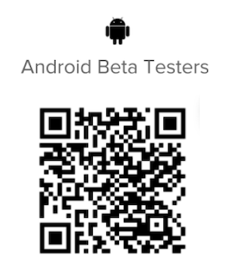

# [!DNL Android] 베타 테스터여야 함

## Beta 앱 다운로드

[!DNL Adobe Workfront] 앱의 베타 테스터가 되는 방법에는 두 가지가 있습니다.

### [!DNL Google Play] 저장소

[!DNL Google Play Store]을(를) 사용하여 앱을 찾아 다운로드할 수 있습니다.

1. 장치에서 [!DNL Play Store] 앱에 액세스합니다.
1. [!DNL Workfront]을(를) 검색한 다음 목록에 나타나면 탭합니다.
Beta에 참여하기 전에 [!DNL Workfront] 앱을 설치해야 합니다.
1. 아직 설치하지 않았다면 [!DNL Workfront] 앱을 설치하고 엽니다.
1. 페이지 가운데로 스크롤한 다음 **[!UICONTROL Beta 테스터가 되기]** 섹션에서 **[!UICONTROL 지금 참가]**&#x200B;를 탭합니다.

1. **[!UICONTROL 가입]**&#x200B;을 눌러 Beta 테스터가 될 것인지 확인합니다.\
   Beta 사용자로 확인되기까지 몇 분 정도 소요됩니다. 변경 내용을 보려면 [!DNL Play Store]을(를) 다시 열어야 할 수 있습니다.

1. 진행이 완료되면 이제 Beta 사용자라는 확인을 받게 됩니다.\
   앱의 베타 버전을 사용 중임을 나타내는 &quot;[!UICONTROL Beta]&quot;이라는 단어가 [!DNL Play Store]에서 앱 이름 뒤에 나타납니다.\
   

### QR 코드

아래의 QR 코드를 스캔하여 Beta에 등록하고 앱을 다운로드할 수도 있습니다.

## 현재 진행 상황을 알려주십시오.

Beta 앱에 대한 피드백을 제공하거나 문제를 보고하려면 다음 작업을 수행하십시오.

1. 아래쪽 탐색 모음에서 **[!UICONTROL 자세히]**&#x200B;를 탭합니다.
1. 이름을 탭한 다음 **[!UICONTROL 피드백 제출]**&#x200B;을 탭합니다.
1. 앱에 대한 일반적인 피드백을 제공하려면 **[!UICONTROL 설문 조사 시작]**&#x200B;을 선택하세요.\
   또는\
   **[!UICONTROL 문제 보고]**&#x200B;를 선택하여 [!DNL Workfront] 고객 지원 팀에 티켓을 제출합니다.

## Beta 테스트 옵트아웃

[!DNL Workfront] 앱의 Beta 테스트를 중지하려면 다음을 수행하십시오.

1. 장치에서 [!DNL Play Store] 앱에 액세스합니다.
1. [!DNL Workfront]을(를) 검색한 다음 목록에 나타나면 탭합니다.
1. **[!UICONTROL Beta 테스터입니다]** 섹션까지 아래로 스크롤한 다음 **[!UICONTROL 나가기]**&#x200B;를 탭합니다.\
   베타 테스터로 제거되는 데 몇 분이 걸립니다. 변경 내용을 보려면 [!DNL Play Store]을(를) 다시 열어야 할 수 있습니다.
