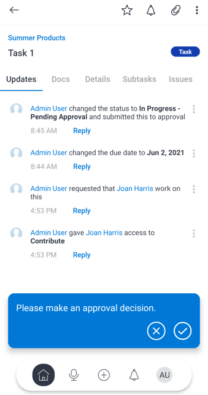

# [!DNL Adobe Workfront] 모바일 앱의 승인

[!DNL Adobe Workfront] 모바일 앱의 [!UICONTROL 승인] 영역에서 할당되거나 위임된 승인을 관리할 수 있습니다. [!UICONTROL 승인] 영역에서 다음을 승인할 수 있습니다.

<table style="table-layout:auto"> 
 <col> 
 <col> 
 <tbody> 
  <tr> 
   <td> 
    <ul> 
     <li>작업(작업 및 문제)</li> 
     <li>문서</li> 
     <li>증명 </li> 
    </ul> </td> 
   <td> 
    <ul> 
     <li>타임시트</li> 
     <li>액세스 권한 요청</li> 
    </ul> </td> 
  </tr> 
 </tbody> 
</table>

증명은 별도의 승인 프로세스를 따릅니다. 작업 항목이나 문서 승인에서 증명을 승인할 수 없습니다. 증명 검토 및 승인에 대한 자세한 내용은 [모바일 앱에서 증명 검토 및 결정](../../../workfront-basics/mobile-apps/using-the-workfront-mobile-app/work-with-proofs-in-mobile-app.md)을 참조하세요. [!DNL Adobe Workfront] 

## 승인 검토

1. [!UICONTROL 내 작업]의 [!UICONTROL 승인] 영역에서 **[!UICONTROL 모든 승인 표시]**&#x200B;를 선택합니다.

   모바일 앱의 [!UICONTROL 내 작업]에 대한 자세한 내용은 모바일 앱의 [[!UICONTROL 내 작업] 섹션](../../../workfront-basics/mobile-apps/using-the-workfront-mobile-app/my-work-section-mobile.md)을 참조하세요.

1. 목록에서 승인을 선택합니다.

   

1. 업데이트, 문서 및 세부 정보 등 승인과 관련된 정보를 검토합니다.

   이 예에서는 작업 승인을 보여 줍니다. 다른 승인 유형에는 다른 정보가 포함될 수 있습니다.

   

## 승인에 대한 결정

1. 승인을 엽니다.
1. 결정을 선택합니다. 결정 옵션 목록은 보고 있는 승인 유형에 따라 다릅니다.

   | 아이콘 | 결정 |
   |---|---|
   |  | [!UICONTROL 승인] |
   |  | [!UICONTROL 변경 사항과 함께 승인] (문서에만 사용 가능) |
   |  | [!UICONTROL 거부] |

   {style="table-layout:auto"}

1. (선택 사항) 화면 하단의 확인 메시지에서 **[!UICONTROL 댓글 추가]**&#x200B;를 선택하여 결정에 주석을 추가합니다. 이러한 주석은 승인을 위한 업데이트에 나타납니다.\
   \
   또는\
   승인 왼쪽 위의 화살표를 선택하여 [!UICONTROL 승인] 페이지로 돌아갑니다.
