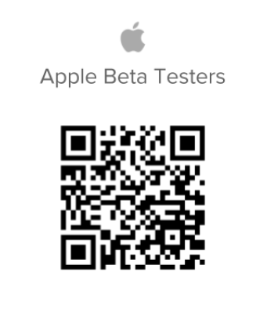

# [!UICONTROL iOS] 베타 테스터여야 함

## Beta 앱 다운로드

[!DNL Adobe Workfront] 앱의 베타 테스터가 되는 방법에는 두 가지가 있습니다.

### [!DNL App Store]

[!DNL Apple App Store]을(를) 사용하여 앱을 찾아 다운로드할 수 있습니다.

>[!IMPORTANT]
>
>[!DNL TestFlight] 앱을 설치하고 [!DNL iOS] 장치에서 베타 테스터가 되면 [!DNL Apple Store] 대신 [!DNL TestFlight] 앱을 사용하여 업데이트된 [!DNL Workfront] 버전을 다운로드해야 합니다. [!DNL iOS]의 Beta 테스터가 아닌 경우 [!DNL Apple Store]에서 모바일 앱을 계속 업데이트할 수 있습니다.

#### 1. [!DNL TestFlight] 앱 설치

[!DNL Workfront] 앱의 Beta 버전을 설치하려면 장치에 [!DNL TestFlight] 앱을 설치해야 합니다. [!DNL TestFlight]을(를) 설치한 후에는 [!DNL Workfront] 앱을 설치해야 합니다.

1. 아직 설치하지 않았다면 [!DNL Workfront] 앱을 설치하십시오.
1. [!DNL Workfront] 모바일 앱을 엽니다.
1. 아래쪽 탐색 모음에서 **[!UICONTROL 자세히]**&#x200B;를 탭합니다.
1. 이름을 탭한 다음 **[!UICONTROL Beta 테스터가 되기]**&#x200B;를 탭합니다.
1. [!DNL TestFlight] 앱을 보려면 [!DNL App Store]&#x200B;**에서**&#x200B;보기 를 탭하세요.
1. **[!UICONTROL Get]**&#x200B;을 눌러 장치에 [!DNL TestFlight]을(를) 설치한 다음 **[!UICONTROL Install]**&#x200B;을 누릅니다.
1. [!DNL TestFlight] 앱에서 **[!UICONTROL 열기]**&#x200B;를 탭한 다음 **[!UICONTROL 계속]**&#x200B;을 탭합니다.
1. [!DNL TestFlight] 앱의 사용 약관에 동의하려면 **[!UICONTROL 동의]**&#x200B;를 탭하세요.\
   [!DNL TestFlight] 앱이 장치에 설치되어 있습니다. 다음 섹션으로 이동합니다.

#### 2. [!DNL TestFlight]에 [!DNL Workfront] Beta 앱 설치

iOS 장치에서 Beta 테스터가 되려면 먼저 iOS 장치에 [!DNL Workfront] 앱과 [!DNL TestFlight] 앱이 설치되어 있어야 합니다.

1. [!DNL Workfront] 모바일 앱을 엽니다.
1. 아래쪽 탐색 모음에서 **[!UICONTROL 자세히]**&#x200B;를 탭합니다.
1. 이름을 탭한 다음 **[!UICONTROL Beta 테스터가 되기]**&#x200B;를 탭합니다.\
   [!DNL TestFlight] 앱이 열리고 [!DNL Workfront]이(가) 다운로드할 수 있는 앱으로 나열됩니다.

1. **[!UICONTROL 승인]**&#x200B;을 누릅니다.
1. 앱 업데이트가 끝나면 **[!UICONTROL 열기]**&#x200B;를 탭합니다.\
   [!DNL Workfront] 앱으로 리디렉션되었으며 이제 [!DNL Workfront]의 Beta 테스터입니다. 홈 화면의 Workfront 모바일 앱 옆에 주황색 점이 표시되어 Beta 버전 앱이 디바이스에 설치되어 있음을 나타냅니다.

### QR 코드

아래의 QR 코드를 스캔하여 Beta에 등록하고 앱을 다운로드할 수도 있습니다.

## 현재 진행 상황을 알려주십시오.

Beta 앱에 대한 피드백을 제공하거나 문제를 보고하려면 다음 작업을 수행하십시오.

1. 아래쪽 탐색 모음에서 **[!UICONTROL 자세히]**&#x200B;를 탭합니다.
1. 이름을 탭한 다음 **[!UICONTROL 피드백 제출]**&#x200B;을 탭합니다.
1. 앱에 대한 일반적인 피드백을 제공하려면 **[!UICONTROL 설문 조사 시작]**&#x200B;을 선택하세요.\
   또는\
   **[!UICONTROL 문제 보고]**&#x200B;를 선택하여 [!DNL Workfront] 고객 지원 팀에 티켓을 제출합니다.

## [!DNL Workfront] Beta 앱 업데이트

Beta 테스터로 등록한 경우 Beta에서 사용할 수 있는 새로운 기능에 액세스하려면 [!DNL TestFlight]에서 [!DNL Workfront] 앱을 업데이트해야 합니다.

1. [!DNL TestFlight] 앱을 엽니다.
1. **[!UICONTROL 업데이트]**&#x200B;를 탭합니다.

## Beta 테스트 옵트아웃

1. [!DNL TestFlight] 앱을 엽니다.
1. [!DNL Workfront] 아이콘을 탭합니다.
1. 페이지 하단에서 **[!UICONTROL 테스트 중지]**&#x200B;를 탭합니다.
