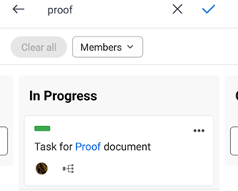

# [!DNL Adobe Workfront] [!UICONTROL 보드] 모바일용

[!DNL Adobe Workfront] [!UICONTROL 보드] 열과 카드가 포함된 공유 보드에 대한 액세스를 제공하여 팀 공동 작업이 가능한 유연한 도구입니다. 보드에 대한 자세한 내용은 [보드 개요](/help/quicksilver/agile/boards-overview.md).

에서 [!DNL Workfront] 모바일 앱에서는 데스크탑 버전에서 만들었거나 추가한 모든 보드를 볼 수 있습니다 [!DNL Workfront]. 모바일 앱에서 새 보드를 만들 수 없습니다.

앱에서 보드 열 및 카드에 대한 변경 사항도 보드의 데스크탑 버전에 반영됩니다.

모바일 보드에 대한 피드백을 제공하려면 **[!UICONTROL 보내기]**  아이콘을 클릭하여 나타나는 메시지를 따릅니다.

## 보드 목록 보기 및 필터링

1. 선택 [!UICONTROL **보드**] 홈 페이지에서 사용자가 만들었거나 데스크탑 버전에서 추가한 모든 보드의 목록을 볼 수 있습니다 [!DNL Workfront].

   

1. 보드 목록을 정렬하거나 필터링하려면 [!UICONTROL **추가 필터**].
1. 다음 옵션 중에서 선택합니다.

   * 필터 섹션에서 [!UICONTROL **보관됨**] 를 클릭하여 목록에서 보관된 보드를 표시합니다. 기본적으로 활성 보드만 표시됩니다.
   * 정렬 섹션에서 [!UICONTROL **수정한 날짜**] 또는 [!UICONTROL **이름**].
   * Order 섹션에서 [!UICONTROL **오름차순**] 또는 [!UICONTROL **내림차순**] 정렬 순서를 정의하려면

1. 선택 [!UICONTROL **적용**] 또는  필터를 적용하고 보드 목록으로 돌아갑니다.

   언제든지 이러한 옵션에 액세스하여 변경하거나 기본 설정으로 돌아갈 수 있습니다.

1. 보드를 열려면 목록에서 보드를 선택합니다.

>[!NOTE]
>
>이때 데스크탑 버전의 보드만 보관하거나 삭제할 수 있습니다 [!DNL Workfront] [!UICONTROL 보드]: 모바일 앱이 아닙니다.

## 보드 내용 보기

보드를 열면 해당 열과 카드가 나타납니다. 가로로 스크롤하여 모든 열을 확인하고 세로로 스크롤하여 열에 있는 모든 카드를 볼 수 있습니다.

카드를 선택하고 길게 눌러 다른 열로 이동합니다.

보드에 취침 열이 있으면 맨 왼쪽 열로 표시됩니다. 가져오기 열의 카드는 다른 보드 열로 이동할 때까지 편집할 수 없습니다. 카드를 선택하여 작업이나 문제를 열 수 있습니다. 가져오기 열 필터는 보드의 데스크탑 버전에서 제어됩니다. 자세한 내용은 [보드에 흡기 열 추가](/help/quicksilver/agile/use-boards-agile-planning-tools/add-intake-column-to-board.md).

## 연결된 카드 작업

연결된 카드가 기존 작업 또는 [!DNL Workfront]. 모바일 앱에서 연결된 카드가  아이콘. 아래 이미지에서 두 번째 카드는 연결된 카드입니다.

한 위치에서 카드에 대해 다음 세부 정보 중 하나가 업데이트되면 다른 위치에서 자동으로 업데이트됩니다.

* [!UICONTROL 이름]
* [!UICONTROL 설명]
* [!UICONTROL 할당자]
* [!UICONTROL 상태]

예를 들어 모바일 앱의 보드에서 연결된 카드의 이름을 업데이트하는 경우 작업이나 문제에서도 업데이트됩니다.

1. 카드를 선택하여 이름, 설명, 열, 담당자, 연결, 상태, 기한, 추정, 태그 및 체크리스트 항목을 확인합니다. 이러한 세부 사항을 편집하면 자동으로 저장됩니다. X 를 선택하여 카드를 닫고 보드에 돌아갑니다.

   >[!NOTE]
   >
   >카드에서 다른 태그를 선택할 수 있지만 모바일 앱에서 새 태그를 만들 수 없습니다.

1. (선택 사항) 카드를 삭제하려면 [!UICONTROL **자세히**] 메뉴  카드에서 [!UICONTROL **삭제**]. 그런 다음 [!UICONTROL **삭제**] 확인 메시지에 저장됩니다.

## 임시 카드를 사용한 작업

Ad Hoc 카드가 Workfront 작업 또는 문제에 연결되어 있지 않습니다. 아래 이미지에서 첫 번째 카드는 임시 카드입니다.

1. 카드를 선택하여 이름, 설명, 열, 담당자, 상태, 기한, 추정, 태그 및 체크리스트 항목을 확인합니다. 이러한 세부 사항을 편집하면 자동으로 저장됩니다. X 를 선택하여 카드를 닫고 보드에 돌아갑니다.

   >[!NOTE]
   >
   >카드에서 다른 태그를 선택할 수 있지만 모바일 앱에서 새 태그를 만들 수 없습니다.

1. (선택 사항) 새 임시 카드를 추가하려면 을 선택합니다. [!UICONTROL **새 카드**] 카드를 추가할 열에 카드 이름을 입력합니다. 세부 사항을 추가하려면 새로 추가한 카드를 선택합니다.

1. (선택 사항) 카드를 복사하려면 [!UICONTROL **자세히**] 메뉴  카드에서 [!UICONTROL **복사**].

1. (선택 사항) 카드를 삭제하려면 [!UICONTROL **자세히**] 메뉴  카드에서 [!UICONTROL **삭제**]. 그런 다음 [!UICONTROL **삭제**] 확인 메시지에 저장됩니다.

## 카드의 검사 목록 항목 관리

검사 목록 항목은 Ad Hoc 카드와 연결된 카드 모두에서 사용할 수 있습니다.

1. 체크리스트 항목을 추가하려면 카드를 열고 을 선택합니다 [!UICONTROL **새 검사 목록 항목**]. 검사 목록 품목 이름을 입력합니다. 카드 카운터가 업데이트되었습니다.
1. (선택 사항) 체크리스트 항목을 복사하려면 카드를 열고 [!UICONTROL **자세히**] 메뉴  항목을 선택하고 [!UICONTROL **복사**]. 항목의 사본이 목록 맨 아래에 추가됩니다.
1. (선택 사항) 체크리스트 항목을 삭제하려면 카드를 열고 [!UICONTROL **자세히**] 메뉴  항목을 선택하고 [!UICONTROL **삭제**].
1. 검사 목록 항목을 완료하려면 카드를 열고 항목 이름 옆에 있는 확인란을 선택하십시오.
항목이 완료로 표시되고 카드의 카운터는 완료된 체크리스트 항목의 수를 표시합니다.

## 보드에서 필터링 및 검색

보드를 필터링하여 특정 사용자에게 지정된 카드를 표시하거나 보드에서 특정 카드를 찾을 수 있습니다.

필터를 적용하면 보드에 표시기가 표시됩니다 . 필터 아이콘을 선택하고 을(를) 선택합니다 [!UICONTROL **모두 지우기**] 보드에서 모든 필터를 제거하려면 다음을 수행하십시오.

### 할당자별로 보드 필터링

1. 필터 및 검색 아이콘을 선택합니다 .
1. 선택 [!UICONTROL **멤버**] 그리고 당신이 보고 싶은 카드가 있는 사람이나 사람을 선택합니다. 지정되지 않은 카드를 표시할 수도 있습니다.
1. 선택 [!UICONTROL **완료**] 또는 .

### 태그로 보드 필터링([!DNL iOS] 전용)

1. 필터 및 검색 아이콘을 선택합니다 .
1. 선택 [!UICONTROL **태그**] 표시할 태그를 선택합니다.
1. 선택 [!UICONTROL **완료**].

### 보드에서 검색

1. 필터 및 검색 아이콘을 선택합니다 .
1. 상자에 검색어를 입력하고 을 선택합니다 [!UICONTROL **완료**] 또는 .

   제목에 검색어가 들어 있는 모든 카드가 표시됩니다.
X를 선택하여 검색을 지웁니다.

   
