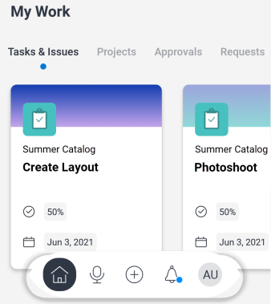

# [!UICONTROL 내 작업] 모바일 앱의 섹션

다음 [!UICONTROL 내 작업] 의 섹션 [!UICONTROL 홈] 영역에는 작업, 문제, 프로젝트, 승인, 요청 및 타임시트가 표시됩니다.

>[!NOTE]
>
>[!UICONTROL 내 작업] 모바일 앱에서 은 와(과) 별개입니다. [!UICONTROL 내 작업] 의 데스크탑 버전에서 [!UICONTROL Adobe Workfront].

## 사용자 지정 [!UICONTROL 내 작업] 섹션

표시할 메뉴 항목을 선택할 수 있습니다 [!UICONTROL 내 작업] 품목 주문을 변경합니다.

1. 부동 메뉴에서 사진이나 이니셜을 탭하여 프로필에 액세스합니다.
1. 다음으로 스크롤 **[!UICONTROL 구성]** 섹션 및 탭 **[!UICONTROL 설정]**.
1. 다음에서 **[!UICONTROL 설정]** 페이지를 선택한 다음 메뉴 항목을 올바른 순서로 끌어서 [!UICONTROL 홈] 영역입니다.
1. 표시하지 않을 메뉴 항목을 숨기려면 파란색 토글 아이콘을 누릅니다. 회색 토글 아이콘을 탭하여 항목을 다시 표시합니다.

   >[!NOTE]
   >
   >다음 [!UICONTROL 작업 및 문제] 메뉴 항목은 항상 표시되며 숨길 수 없습니다.

   
