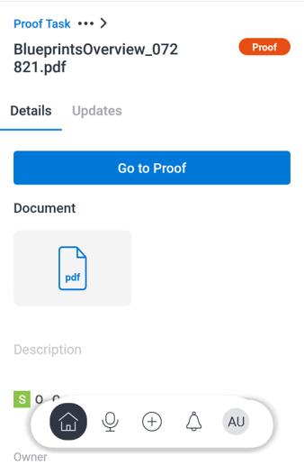

# [!DNL Adobe Workfront] 모바일 앱에서 증명을 검토하고 결정합니다.

승인이 필요한 증명이 할당되면 모바일 앱의 승인 목록에 표시됩니다. 앱에서 직접 증명을 검토하고 이에 대한 결정을 내릴 수 있습니다. [!DNL Adobe Workfront]에서 증명을 검토하고 승인하는 방법에 대한 자세한 내용은 [다음 범위 내에서 증명 검토 [!DNL Adobe Workfront]](../../../review-and-approve-work/proofing/reviewing-proofs-within-workfront/review-proofs-in-wf.md)를 참조하십시오.

증명에 주석을 추가하고 최종 결정을 내리기 전에 수정 프로세스를 거칠 수 있습니다. 댓글에 대한 자세한 내용은 [증명에 대한 댓글 [!DNL iOS]](../../../workfront-basics/mobile-apps/using-the-workfront-mobile-app/comment-on-proofs-ios.md) 또는 [증명에 대한 댓글 [!DNL Android]](../../../workfront-basics/mobile-apps/using-the-workfront-mobile-app/comment-on-proofs-android.md)을 참조하세요.

증명을 검토하고 승인하기 위한 액세스 권한이 [!DNL Adobe Workfront]과(와) 동일합니다. 증명 기능에 대한 자세한 내용은 [증명 권한 프로필 [!DNL Workfront Proof]](../../../workfront-proof/wp-acct-admin/account-settings/proof-perm-profiles-in-wp.md)을 참조하세요.

## 증명 열기 및 검토

1. 증명 승인 작업을 엽니다.

   * [!UICONTROL 내 작업]의 [!UICONTROL 승인] 영역에서 증명 승인 작업을 선택하십시오.

     \
      또는

   * [!UICONTROL 내 작업]의 [!UICONTROL 승인] 영역에서 **[!UICONTROL 모든 승인 표시]**&#x200B;를 선택합니다. 그런 다음 모든 승인 목록에서 증명 승인 작업을 선택합니다.

     모바일 앱의 [!UICONTROL 내 작업]에 대한 자세한 내용은 모바일 앱의 [[!UICONTROL 내 작업] 섹션](../../../workfront-basics/mobile-apps/using-the-workfront-mobile-app/my-work-section-mobile.md)을 참조하세요.

1. 세부 정보 페이지에서 **[!UICONTROL 증명으로 이동]**&#x200B;을 선택합니다.

   

   >[!NOTE]
   >
   >비디오 증명은 iOS 모바일 앱에서만 열 수 있습니다. 이 기능은 Android에서 아직 사용할 수 없습니다.

1. 문서 증명을 검토합니다.
1. (선택 사항) 문서의 오른쪽 상단에서 ![[!UICONTROL 단일 페이지 아이콘]](assets/mobile-proofpagingicon1-25x36.png)을 선택하여 단일 페이지 보기에서 연속 보기로 변경합니다. 단일 페이지 보기로 다시 변경하려면 ![[!UICONTROL 연속 페이지 아이콘]](assets/mobile-proofpagingicon2-25x25.png)을 선택하세요.

   단일 페이지 보기에서 오른쪽과 왼쪽으로 스크롤하여 문서 페이지를 이동합니다. 연속 보기에서 위아래로 스크롤하여 페이지를 이동합니다.

1. (선택 사항) 오른쪽의 스크롤 표시기를 사용하여 특정 페이지로 이동합니다.

   1. 스크롤 표시기를 누릅니다.
   1. [!UICONTROL 페이지로 이동] 상자에 페이지 번호를 입력하고 **[!UICONTROL 확인]**&#x200B;을 선택합니다.
   1. 

1. [!UICONTROL 세부 정보] 페이지로 돌아가려면 문서 왼쪽 위의 화살표를 선택하십시오.
1. (선택 사항) [!UICONTROL 세부 정보] 페이지에서 **[!UICONTROL 업데이트]**&#x200B;를 선택하여 증명 생성 시기 및 승인을 위해 전송된 시기와 같은 증명의 모든 업데이트를 확인합니다.

## 증명 잠금 및 잠금 해제

증명 소유자, 작성자 또는 중재자로 할당된 모든 사용자는 다른 사람이 댓글을 달거나 결정을 내리는 것을 방지하기 위해 증명을 잠글 수 있습니다.

### 증명 잠금

1. 문서 증명을 열고 문서의 오른쪽 상단에 있는 **[!UICONTROL 추가]** 메뉴 를 선택합니다. 그런 다음 **[!UICONTROL 자세히]**&#x200B;를 선택합니다.
1. **[!UICONTROL 문서 잠금]**&#x200B;을 선택합니다.\
   문서 맨 위에 &quot;[!UICONTROL 잠김]&quot; 표시기가 나타납니다.

### 증명 잠금 해제

1. 문서 증명을 열고 문서의 오른쪽 상단에 있는 **[!UICONTROL 추가]** 메뉴 를 선택합니다. 그런 다음 **[!UICONTROL 자세히]**&#x200B;를 선택합니다.
1. **[!UICONTROL 문서 잠금 해제]**&#x200B;를 선택합니다.
1. 확인 메시지에서 **[!UICONTROL 잠금 해제]**&#x200B;을(를) 선택합니다.

## 증명 결정

문서 증명을 검토한 후 증명 자체에서 결정을 내릴 수 있습니다. 증명 소유자가 증명을 잠근 경우 결정을 내릴 수 없습니다.

### 증명에서 결정

1. 문서 증명을 엽니다.
1. 문서의 오른쪽 상단에서 결정 아이콘 ![[!UICONTROL 결정] 아이콘](assets/mobile-proofcheckmarkdecisionicon-30x30.png)을 선택합니다.
1. [!UICONTROL 결정] 상자에서 결정을 선택합니다.

   몇 가지 일반적인 결정 옵션이 아래에 표시되어 있습니다. [!DNL Adobe Workfront] 관리자 또는 [!UICONTROL Workfront Proof] 관리자가 결정 옵션 목록을 구성할 수 있습니다. 관리자가 결정을 구성하는 방법에 대한 자세한 내용은 [Workfront Proof에서 승인 결정 옵션 구성](../../../workfront-proof/wp-acct-admin/account-settings/configure-approval-decision-in-wp.md)을 참조하십시오.

   <table style="table-layout:auto"> 
    <col> 
    <col> 
    <tbody> 
     <tr> 
      <td role="rowheader"><strong>[!UICONTROL Approved]</strong></td> 
      <td>증명이 워크플로우의 다음 단계로 이동할 준비가 되었습니다.</td> 
     </tr> 
     <tr> 
      <td role="rowheader"><strong>[!UICONTROL 변경 사항과 함께 승인됨]</strong></td> 
      <td> 
증명을 사용하려면 몇 가지 변경이 필요하지만 워크플로우의 다음 단계로 이동하기 전에 개정을 볼 필요는 없습니다.
 </td> 
     </tr> 
     <tr> 
      <td role="rowheader"><strong>[!UICONTROL 거부됨]</strong></td> 
      <td>증명이 거부되어 워크플로에서 앞으로 이동하지 않습니다.</td> 
     </tr> 
    </tbody> 
   </table>

1. (조건부) [!DNL Adobe Workfront] 관리자 또는 [!DNL Workfront Proof] 관리자가 [!UICONTROL 이유] 목록을 추가한 경우 결정에 적용할 수 있는 이유를 선택하십시오.

   일부 이유에서는 이유를 설명하는 댓글이 필요할 수도 있습니다.

   관리자가 이유를 구성하는 방법에 대한 자세한 내용은 [승인 결정 옵션 구성 [!DNL Workfront Proof]](../../../workfront-proof/wp-acct-admin/account-settings/configure-approval-decision-in-wp.md)을 참조하십시오.

1. **[!UICONTROL 제출]**&#x200B;을 선택합니다.

### 증명에서 결정 변경

1. 문서 증명을 엽니다.
1. 문서의 오른쪽 상단에서 결정 아이콘 ![[!UICONTROL 결정] 아이콘](assets/mobile-proofcheckmarkdecisionicon-30x30.png)을 선택합니다.

   [!UICONTROL 결정] 상자에 현재 결정이 표시됩니다.

1. 다른 결정을 선택하거나 **[!UICONTROL 선택 지우기]**&#x200B;를 선택하여 결정을 제거합니다.

   이유가 있는 결정의 경우 다른 사유를 선택하거나 사유를 제거할 수 있습니다.

1. **[!UICONTROL 제출]**&#x200B;을 선택합니다.
