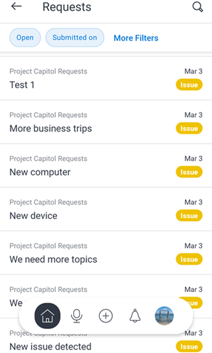
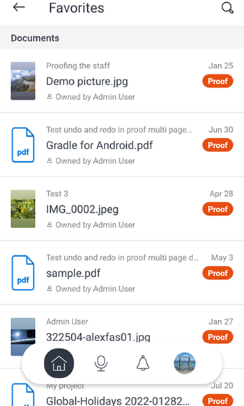

# [!DNL iOS]에 대한 [!DNL Adobe Workfront]

다음 [!DNL Adobe Workfront] 앱을 사용하면 다음 항목에 대한 작업에 액세스할 수 있습니다. [!DNL iOS] 디바이스. 다음을 설치하고 사용할 수 있습니다. [!DNL Workfront] iOS 10 이상을 실행하는 휴대폰 및 태블릿의 모바일 앱. 전용 [!DNL Workfront] 모바일 앱은 다음 두 경우에 모두 사용할 수 있습니다. [!DNL iPhone] 및 [!DNL iPad].

모바일 앱에 로그인하는 방법에 대한 자세한 내용은 섹션 을 참조하십시오 [에 로그인합니다 [!UICONTROL Workfront] 모바일 앱](../../../workfront-basics/manage-your-account-and-profile/managing-your-workfront-account/log-in-to-workfront.md#log) 이 문서에서 [에 로그인 [!DNL Adobe Workfront]](../../../workfront-basics/manage-your-account-and-profile/managing-your-workfront-account/log-in-to-workfront.md).

## [!UICONTROL 홈]

다음 [!UICONTROL 홈] 영역을 사용하면 자신에게 할당된 작업, 문제 및 승인을 직접 작업할 수 있습니다. 다음에서 [!UICONTROL 홈] 앱의 영역에서 다음을 수행할 수 있습니다.

<table style="table-layout:auto"> 
 <col> 
 <col> 
 <tbody> 
  <tr> 
   <td> 
    <ul> 
     <li>작업 및 문제 작업 시작</li> 
     <li>작업 및 문제를 [!UICONTROL 완료]로 표시</li> 
     <li>작업 및 문제 재할당</li> 
     <li>[!UICONTROL 커밋 일자] 변경</li> 
    </ul> </td> 
   <td> 
    <ul> 
     <li>작업 및 문제 상태 업데이트</li> 
     <li>업데이트 영역의 Post</li> 
     <li>문서 보기</li> 
     <li>사진 첨부</li> 
     <li> 
요청 또는 빠른 작업 만들기
 
참고: 프로젝트를 할당하도록 선택하지 않은 경우 홈에서 생성된 빠른 작업은 개인 작업입니다.
 </li> 
    </ul> </td> 
  </tr> 
 </tbody> 
</table>

자세한 내용은 [[!UICONTROL 홈] 영역 위젯](../../../workfront-basics/mobile-apps/using-the-workfront-mobile-app/home-area-widgets-mobile.md) 및 [[!UICONTROL 내 작업] 모바일 앱의 섹션](../../../workfront-basics/mobile-apps/using-the-workfront-mobile-app/my-work-section-mobile.md).

## [!UICONTROL 보드]

다음 [!UICONTROL 게시판] 영역을 통해 다음에 액세스할 수 있습니다. [!DNL Workfront] 게시판.

자세한 내용은 [[!DNL Adobe Workfront] [!UICONTROL 게시판] 모바일용](/help/quicksilver/workfront-basics/mobile-apps/using-the-workfront-mobile-app/mobile-boards.md).

## [!UICONTROL 프로젝트]

다음 [!UICONTROL 프로젝트] 영역을 사용하면 와 상호 작용하고 관리할 수 있습니다. [!UICONTROL 프로젝트] 소유한 및 진행 중인 프로젝트 앱의 프로젝트 영역에서 다음을 수행할 수 있습니다.

<table style="table-layout:auto"> 
 <col> 
 <col> 
 <tbody> 
  <tr> 
   <td> 
    <ul> 
     <li>프로젝트 상태 업데이트</li> 
     <li>중요한 프로젝트 세부 정보 보기</li> 
     <li>[!UICONTROL Updates] 영역의 Post</li> 
     <li>작업, 문제 및 요청을 프로젝트로 전환</li> 
    </ul> </td> 
   <td> 
    <ul> 
     <li>프로젝트 작업 및 문제와 상호 작용</li> 
     <li>문서 보기</li> 
     <li>사진 첨부</li> 
     <li> 
빠른 작업 만들기
 
참고: 프로젝트에서 생성된 작업은 현재 진행 중인 프로젝트에 자동으로 할당됩니다. 
 </li> 
    </ul> </td> 
  </tr> 
 </tbody> 
</table>

## 승인

다음 [!UICONTROL 승인] 영역을 보고 승인할 수 있습니다. [!UICONTROL 승인] 이(가) 귀하에게 할당되거나 위임되었습니다. 승인 영역에서 다음을 승인할 수 있습니다.

<table style="table-layout:auto">
 <col>
 <col>
 <tbody>
  <tr>
   <td>
    <ul>
     <li>작업(작업 및 문제)</li>
     <li>문서</li>
     <li>증명 </li>
    </ul> </td>
   <td>
    <ul>
     <li>타임시트</li>
     <li>액세스 권한 요청</li>
    </ul> </td>
  </tr>
 </tbody>
</table>

승인에 대한 자세한 내용은 [에서 승인 [!DNL Adobe Workfront] 모바일 앱](../../../workfront-basics/mobile-apps/using-the-workfront-mobile-app/approvals-in-mobile-app.md).

증명 검토 및 승인에 대한 자세한 내용은 [에서 증명을 검토하고 결정합니다. [!DNL Adobe Workfront] 모바일 앱](../../../workfront-basics/mobile-apps/using-the-workfront-mobile-app/work-with-proofs-in-mobile-app.md).

## [!UICONTROL 알림]

다음 [!UICONTROL 알림] 영역을 사용하면 작업에 대한 인앱 알림을 보고 응답할 수 있습니다.

>[!NOTE]
>메모의 전체 내용이 표시 텍스트가 없는 하이퍼링크인 경우가 아니면 업데이트 알림에서 하이퍼링크를 사용할 수 없습니다.

## [!UICONTROL 요청]

다음 [!UICONTROL 요청] 영역을 사용하면 요청에 대한 세부 사항을 볼 수 있습니다. 다음에서 [!UICONTROL 요청] 앱의 영역에서 다음을 수행할 수 있습니다.

<table style="table-layout:auto">
 <col>
 <col>
 <tbody>
  <tr>
   <td>
    <ul>
     <li>요청 재할당</li>
     <li>상태 업데이트</li>
     <li>우선 순위 조정</li>
    </ul> </td>
   <td>
    <ul>
     <li>[!UICONTROL Updates] 영역의 Post</li>
     <li>문서 보기</li>
     <li>사진 첨부</li>
     <li>초안으로 요청 저장</li>
    </ul> </td>
  </tr>
 </tbody>
</table>

## 타임시트

다음 [!UICONTROL 타임시트] 영역을 사용하면 타임시트에 대한 세부 정보를 볼 수 있습니다. 다음에서 [!UICONTROL 타임시트] 앱의 영역에서 다음을 수행할 수 있습니다.

* 의 Post [!UICONTROL 업데이트] 영역
* 시간 유형 조정
* 기록한 시간 변경
* 타임시트에 댓글 입력
* 타임시트 닫기

## [!UICONTROL 즐겨찾기]

즐겨찾기 메뉴에서 기존 항목에 액세스하고 새 항목을 [!UICONTROL 즐겨찾기] 메뉴 아래의 제품에서 사용할 수 있습니다.

## [!UICONTROL 연락처]

다음 [!UICONTROL 연락처] 영역에서는 회사의 모든 사용자에 대한 연락처 정보를 볼 수 있습니다.

## [!UICONTROL 구성]

다음 [!UICONTROL 구성] 영역을 사용하면 다음 작업을 수행할 수 있습니다.

* 설정 관리
* 할당된 팀 보기
* 보안 환경 설정 설정
* 피드백 제출
* 도움말 콘텐츠 액세스
* 로그아웃

