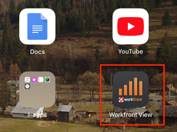

# 시작하기 [!DNL Adobe Workfront View]

를 사용하여 이동 중일 때 프로젝트의 진행 상황을 추적할 수 있습니다 [!DNL Adobe Workfront View] 모바일 앱.

[!DNL Workfront View] 는 보고 도구입니다. 를 사용하여 변경하거나 작업을 완료할 수 없습니다 [!DNL Workfront View] 앱. 프로젝트의 상태만 볼 수 있습니다. 프로젝트 또는 Portfolio 관리자 및 기타 프로젝트 이해 관계자가 프로젝트를 모니터링하기 위해 높은 수준의 인터페이스에 연결하기 위한 것입니다.

작업을 완료해야 하는 경우 [!DNL Workfront] 사용 가능한 모바일 앱 [!DNL iOS] 및 [!DNL Android] 전화.

## 지원되는 장치 및 액세스 수준

다음 [!DNL Workfront View] 앱은 다음에만 지원됩니다. [!DNL iPads].

에 다음 액세스 권한이 있어야 합니다. [!DNL Workfront] 에 있는 정보에 액세스하려면에서 [!DNL Workfront View] 및 이 문서의 절차를 수행하십시오.

<table style="table-layout:auto"> 
 <col> 
 </col> 
 <col> 
 </col> 
 <tbody> 
  <tr> 
   <td role="rowheader"><strong>[!DNL Adobe Workfront] 플랜*</strong></td> 
   <td> 
모든
 </td> 
  </tr> 
  <tr> 
   <td role="rowheader"><strong>[!DNL Adobe Workfront] 라이센스*</strong></td> 
   <td> 
[!UICONTROL Review] 이상
 </td> 
  </tr> 
 </tbody> 
</table>

사용 중인 사용자 [!UICONTROL 요청자] 및 [!UICONTROL 외부] 라이선스에 액세스할 수 없음 [!DNL Workfront] 사용 [!DNL Workfront View] 모바일 앱.

&#42;어떤 계획, 라이센스 유형 또는 액세스 권한을 보유하고 있는지 확인하려면 [!DNL Workfront] 관리자

## 다운로드 [!DNL Workfront View] 앱

다음을 수행해야 합니다. [!DNL Apple Cloud] 응용 프로그램을 [!DNL iPad].

1. 의 App Store으로 이동합니다 [!DNL iPad].
1. 검색 대상 **[!UICONTROL Workfront 보기]**&#x200B;를 클릭한 다음 목록에 나타나면 탭합니다.
1. 탭하기 [!UICONTROL 클라우드에서 다운로드] 아이콘을 사용하여 앱을 설치한 다음 단계에 따라 설치를 완료합니다.
1. 탭 **[!UICONTROL 열기]** 앱을 엽니다.

## 에 로그인합니다. [!DNL Workfront View]

1. 로 이동합니다. **[!DNL Workfront View]** 앱 [!DNL iPad].\
   

1. (선택 사항) 탭 **[!UICONTROL 데모 시도]** 를 클릭하여 앱을 간단한 데모를 수행합니다.\
   데모에는 사용자의 프로젝트가 아닌 샘플 프로젝트가 표시됩니다 [!DNL Workfront] 시스템.\
   ![[!DNL workfront_view_demo].jpg](assets/workfront-view-demo-350x256.jpg)

1. 을(를) 지정합니다 **[!UICONTROL [!DNL Workfront]사용자 이름]**.
1. 을(를) 지정합니다 **[!UICONTROL [!DNL Workfront]암호]**.
1. 을(를) 지정합니다. **[!UICONTROL [!DNL Workfront]URL]** 귀사 회사의

   URL은 다음 형식이어야 합니다. `yourCompanyDomain.my.workfront.com`

1. 탭 **[!UICONTROL 로그인]**.
