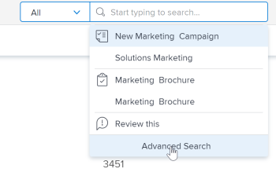

# [!DNL Adobe Workfront] 검색

<!-- Audited: 5/2025 -->

[!DNL Adobe Workfront]의 정확한 위치를 기억하지 못할 때 해당 항목을 검색하여 쉽게 찾을 수 있습니다.

[!UICONTROL  내 페이지의 오른쪽 위 모서리에 ]검색[!DNL Workfront] 상자가 표시됩니다.

탐색 막대의 

검색에서 개체를 찾으려면 먼저 개체를 볼 수 있는 권한이 있어야 합니다. 이러한 이유로 검색 결과는 사용자마다 다릅니다.

## 액세스 요구 사항

+++ 이 섹션을 확장하여 이 문서의 단계를 수행하는 데 필요한 액세스 권한을 봅니다.

<table style="table-layout:auto"> 
 <col> 
 <col> 
 <tbody> 
  <tr> 
   <td role="rowheader">Adobe Workfront 패키지</td> 
   <td> 
임의
 </td> 
  </tr> 
  <tr> 
   <td role="rowheader">Adobe Workfront 라이선스</td> 
   <td> 
기여자 이상

   
요청 이상 

   </td> 
  </tr> 
  <tr> 
   <td role="rowheader">액세스 수준 구성</td> 
   <td> 
개체 유형에 대한 [!UICONTROL 보기] 액세스 
 
참고: 여전히 액세스 권한이 없는 경우 [!DNL Workfront] 관리자에게 액세스 수준에 추가 제한을 설정했는지 문의하십시오. [!DNL Workfront] 관리자가 액세스 수준을 수정하는 방법에 대한 자세한 내용은 <a href="../../../administration-and-setup/add-users/configure-and-grant-access/create-modify-access-levels.md" class="MCXref xref">사용자 지정 액세스 수준 만들기 또는 수정</a>을 참조하십시오.
</td> 
  </tr> 
  <tr> 
   <td role="rowheader">개체 권한</td> 
   <td> 
검색에서 개체를 찾으려면 먼저 개체를 볼 수 있는 권한이 있어야 합니다.
 
추가 액세스 요청에 대한 자세한 내용은 <a href="../../../workfront-basics/grant-and-request-access-to-objects/request-access.md" class="MCXref xref">개체 </a>에 대한 액세스 요청 을 참조하십시오.
 </td> 
  </tr> 
 </tbody> 
</table>

이 표의 정보에 대한 자세한 내용은 [Workfront 설명서의 액세스 요구 사항](/help/quicksilver/administration-and-setup/add-users/access-levels-and-object-permissions/access-level-requirements-in-documentation.md)을 참조하십시오.

+++

## 검색 이해

### 검색할 수 있는 오브젝트

Workfront에서 다음 개체를 검색할 수 있습니다.

* 프로젝트
* 작업
* 문제
* 보고서
* 사용자
* 템플릿
* 문서
* 포트폴리오
* 프로그램
* 대시보드
* 회사
* 참고

### 검색할 수 있는 필드

검색에 사용할 수 있는 필드는 검색 유형을 기반으로 합니다. 기본 또는 [!UICONTROL 고급 검색].

* **기본 검색**: 기본 검색에서 개체를 검색할 때 [!DNL Workfront]은(는) 다음 필드에서 키워드가 포함될 수 있는 텍스트를 찾습니다.

   * 개체 이름
   * 설명
   * 사용자 정의 데이터 필드
   * 업데이트
   * 문서 이름(특정 문서 검색 및 기본 검색)

  [!DNL Workfront]의 기본 검색에 대한 자세한 내용은 이 문서에서 다음 섹션을 참조하십시오. [기본 검색](#basic-search).

* **[!UICONTROL 고급 검색]**: [!UICONTROL 고급 검색]에서 기본 검색에서 사용할 수 없는 검색 필드에 필터를 설정할 수 있습니다. 따라서 [!UICONTROL 고급 검색]을 통해 개체의 모든 필드를 검색할 수 있습니다.

  [!UICONTROL 고급 검색]에 대한 자세한 내용은 이 문서의 다음 섹션을 참조하십시오. [고급 검색](#advanced-search).

>[!NOTE]
>
>[!UICONTROL 고급 검색]을 수행하려면 검색을 시작할 때 [!UICONTROL 고급 검색] 옵션을 선택해야 합니다. 기본 검색을 [!UICONTROL 고급 검색]&#x200B;(으)로 세분화할 수 없습니다.

## [!DNL Workfront] 검색 제한 사항 이해

[!UICONTROL 에서 ]Search[!DNL Workfront]을(를) 사용할 때 다음 제한을 고려하십시오.

* 검색은 대/소문자를 구분하지 않습니다.
* [!DNL Workfront]이(가) 오타를 수정하거나 이해하지 못합니다.
* [!DNL Workfront]에서 검색하면 와일드카드가 지원되지 않습니다.
* [!DNL Workfront]에서 검색하는 경우 부분 단어 검색은 지원하지만 하위 문자열 검색은 지원하지 않습니다.\
   예를 들어 검색 키워드 &quot;stand&quot;는 &quot;standard&quot;라는 단어를 포함하는 결과를 반환하지만 &quot;understand&quot;라는 단어를 포함하는 결과는 반환하지 않습니다.

## 여러 단어 검색

검색에 여러 단어를 포함하고 검색 상자의 모든 단어와 일치하는 객체만 찾으려는 경우 순서에 관계없이 단어를 입력할 수 있습니다.

예를 들어 &quot;마케팅 데모&quot;(따옴표 제외)를 검색하면 다음 이름의 객체가 검색됩니다.

* 마케팅 데모
* 데모 마케팅
* 1월 시장 분석 데모

또한 이름에 &quot;Marketing&quot;이 있고 설명에 &quot;Demo&quot;가 있을 수 있는 개체를 찾습니다.

그러나 [!UICONTROL 검색] 상자에서 다음 작업을 수행하여 표시되는 검색 결과를 조정할 수 있습니다.

<table style="table-layout:auto"> 
 <col> 
 <col> 
 <tbody> 
  <tr> 
   <td>따옴표 포함</td> 
   <td> 
큰따옴표 안에 올바른 순서로 단어를 입력하면 정확히 일치하는 개체만 찾을 수 있습니다. 예를 들어 "마케팅 데모"(따옴표 포함)를 검색하면 다음 이름의 개체가 검색됩니다.
 
    <ul> 
     <li> 마케팅 데모</li> 
     <li> 1월 마케팅 데모</li> 
     <li>마케팅 데모 계획</li> 
    </ul> 
그러나 이 검색에서는 이름이 "데모 마케팅"인 오브젝트를 찾지 못합니다.
 </td> 
  </tr> 
  <tr> 
   <td>OR 포함</td> 
   <td> 
"OR"(따옴표 제외)로 단어를 연결하면 [!UICONTROL 검색] 상자에 있는 단어 중 하나 이상과 일치하는 개체만 찾을 수 있습니다. 이 단어는 어떤 순서로든 입력할 수 있습니다. 예를 들어 "Marketing OR Demo"(따옴표 제외)를 검색하면 다음 이름의 개체가 검색됩니다.
 
    <ul> 
     <li> Market Analysis 데모</li> 
     <li>1월 시장 분석 데모</li> 
     <li>데모</li> 
     <li>시장 분석</li> 
    </ul> 
참고: "OR"는 모두 대문자로 입력해야 합니다. 그렇지 않으면 찾고 있는 구문에 있는 다른 단어로 해석됩니다.
 </td> 
  </tr> 
  <tr> 
   <td>및 포함</td> 
   <td> 
"AND"(따옴표 제외)로 단어를 연결하면 [!UICONTROL 검색] 상자에 있는 모든 단어와 일치하는 개체만 찾을 수 있습니다. 이 단어는 어떤 순서로든 입력할 수 있습니다. 예를 들어 "Marketing AND Demo"(따옴표 제외)를 검색하면 다음 이름의 개체가 검색됩니다.
 
    <ul> 
     <li>마케팅 데모</li> 
     <li>데모 마케팅</li> 
     <li>1월 시장 분석 데모</li> 
    </ul> 
참고: "AND"는 모두 대문자로 입력해야 합니다. 그렇지 않으면 찾고 있는 구문에 있는 다른 단어로 해석됩니다. 마찬가지로, "&amp;"(따옴표 없음)를 포함하면 앰퍼샌드 문자가 포함된 객체만 검색합니다.
 </td> 
  </tr> 
 </tbody> 
</table>

## [!DNL Workfront]에서 검색 사용

[!DNL Workfront]은(는) 기본 검색과 고급 검색의 두 가지 유형을 제공합니다. 이름이나 설명과 같은 일반적인 오브젝트 필드에서 키워드를 찾으려면 기본 검색을 사용합니다. 필터를 사용하여 다른 개체 필드를 검색하려면 [!UICONTROL 고급 검색]을 사용하십시오.

* [기본 검색](#basic-search)
* [고급 검색](#advanced-search)

### 기본 검색

기본 검색을 사용하면 시스템의 모든 개체 또는 한 번에 하나의 개체(예: 프로젝트)에서만 키워드를 검색할 수 있습니다. 그런 다음 [!DNL Workfront]은(는) 몇 개의 특정 필드에서 해당 키워드를 검색합니다. [!DNL Workfront]에서 선택한 다른 개체별 필드를 기반으로 검색 결과를 구체화할 수 있습니다.

기본 검색에서 검색한 특정 필드 목록을 보려면 이 문서의 다음 섹션을 참조하십시오. [검색할 수 있는 필드](#fields-available-for-search).

>[!NOTE]
>
>[!UICONTROL 고급 검색]을 수행하려면 검색을 시작할 때 [!UICONTROL 고급 검색] 옵션을 선택해야 합니다. 기본 검색을 [!UICONTROL 고급 검색]&#x200B;(으)로 세분화할 수 없습니다.

* [기본 검색 수행](#perform-a-basic-search)
* [기본 검색 세분화](#refine-a-basic-search)

#### 기본 검색 수행

다음 방법 중 하나로 기본 검색을 수행할 수 있습니다.

* 시스템의 모든 오브젝트에서 검색(일반 검색).
* 한 번에 하나의 객체에만 적용됩니다(객체별 검색).

기본 검색을 수행하려면 다음을 수행합니다.

1. 페이지의 오른쪽 상단에 있는 돋보기 을 클릭합니다.

1. (선택 사항) 특정 개체를 검색하려면 **[!UICONTROL 모두]** 드롭다운 메뉴를 클릭하고 검색할 개체를 선택합니다.

   

1. **[!UICONTROL 검색]** 상자에서 검색 중인 정보를 입력하세요.
[!DNL Workfront]에서 검색한 필드에 대한 자세한 내용은 이 문서의 다음 섹션을 참조하십시오. [검색 이해](#understand-search).
   

   검색 창에서 입력을 시작하면 [!DNL Workfront]이(가) 사용자의 보기 기록을 기반으로 추천 항목을 만들어 검색 중인 키워드를 파란색으로 강조 표시합니다.

1. 찾고 있는 항목이 [!UICONTROL 자동 완성] 메뉴에 표시되면 해당 항목을 클릭합니다.

   또는

   전체 검색을 수행하려면 키보드에서 Return(Mac) 또는 [!UICONTROL Enter]&#x200B;(Windows)를 누르십시오. 이 검색은 최근에 본 항목 대신 전체 데이터베이스를 쿼리하고 **검색** 페이지를 엽니다.

   일반 검색을 수행한 경우 [!DNL Workfront]은(는) [검색 이해](#understand-search)에 설명된 대로 검색된 필드에서 검색어와 일치하는 개체에 대한 결과를 반환합니다. 검색과 일치하는 객체가 목록에 표시됩니다.

   >[!NOTE]
   >
   >경우에 따라 단어의 변형이 검색된 항목 목록에 표시됩니다.\
   >예를 들어 &quot;marketing&quot;을 검색하면 이름에 &quot;marketing&quot; 또는 &quot;market&quot;이 포함된 객체가 표시됩니다.

1. (선택 사항) 검색 결과가 너무 많으면 [기본 검색 세분화](#refine-a-basic-search)에 설명된 대로 검색을 세분화합니다.

#### 기본 검색 세분화

기본 검색을 수행한 후 검색을 구체화할 수 있습니다.

검색 결과 왼쪽에 있는 도구 모음을 사용하여 원하는 정보의 범위를 좁힐 수 있습니다.

검색을 구체화하려면 다음 작업을 수행하십시오.

1. (조건부) 일반 검색을 수행한 경우 결과 왼쪽 상단의 객체 목록에서 검색 중인 객체를 선택합니다.
1. 결과 왼쪽에 있는 도구 모음에서 검색에 표시된 객체에 사용할 수 있는 필드를 찾습니다. 각 필드의 값은 개수별로 정렬되어 각 필드에 대해 최대 10개의 값을 표시합니다.
1. 결과 목록을 줄이는 데 사용할 수 있는 필드 내부를 클릭합니다. 선택한 항목은 파란색으로 강조 표시되고 선택하지 않은 필드 값은 숨겨집니다.
각 새 값을 선택하면 올바른 결과에 동적으로 업데이트됩니다.

   

1. (선택 사항) 선택한 값을 클릭하여 선택을 취소하고 각 필드의 모든 값을 다시 표시합니다.

### [!UICONTROL 고급 검색]

[!UICONTROL 고급 검색]에서는 기본 검색에 사용할 수 없는 필드 및 필터를 사용하여 검색할 수 있습니다. 예를 들어 특정 우선 순위 또는 문서 소유자 이름으로 프로젝트를 검색할 수 있습니다.

>[!NOTE]
>
>[!UICONTROL 고급 검색]을 수행하려면 검색을 시작할 때 [!UICONTROL 고급 검색] 옵션을 선택해야 합니다. 기본 검색을 [!UICONTROL 고급 검색]&#x200B;(으)로 세분화할 수 없습니다.

* [[!UICONTROL 고급 검색] 사용](#use-advanced-search)

#### [!UICONTROL 고급 검색] 사용

[!UICONTROL 고급 검색]을 사용하여 특정 조건을 기준으로 검색을 필터링할 수 있습니다.\
이 유형의 검색은 개체와 연결된 키워드를 기억할 수 없지만 해당 개체에 대한 특정 정보(예: 프로젝트 우선 순위, 문서 소유자 이름 등)를 알고 있는 경우에 유용합니다.

고급 검색을 수행하려면 다음을 수행합니다.

1. [!DNL Workfront]에 있는 페이지의 오른쪽 상단 모서리에서 **[!UICONTROL 검색]** 아이콘 을 클릭합니다. **검색** 메뉴가 표시됩니다.

1. **검색** 메뉴 아래쪽에서 **[!UICONTROL 고급 검색]**&#x200B;을 클릭합니다. 기본적으로 **고급 검색** 탭이 선택된 상태로 **검색** 페이지가 열립니다.
   

1. 검색 중인 객체 유형을 선택합니다. 기본적으로 **[!UICONTROL 작업]**&#x200B;이(가) 선택됩니다.

   

1. (선택 사항) 목록 맨 위의 필드에 키워드를 입력합니다.
1. (선택 사항) 검색을 구체화하기 위한 필터를 빌드하려면 **[!UICONTROL 결과 필터링]**&#x200B;에서 **켜기**(으)로 전환합니다. 완료되면 **적용**&#x200B;을 클릭하세요.

1. **[!UICONTROL 검색]**&#x200B;을 클릭합니다. 검색과 일치하는 항목 목록이 **[!UICONTROL 고급 검색]** 도구 모음 오른쪽에 표시됩니다.
