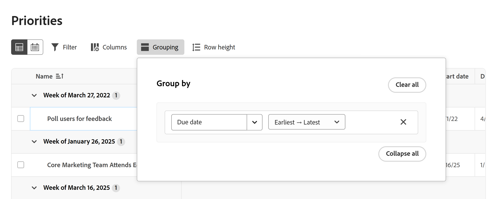

# 향상된 목록 사용

고급 목록은 Adobe Workfront의 일부 영역에서 사용할 수 있습니다. 이러한 목록은 목록 항목을 표시하기 위해 표 형식을 사용하며 표준 목록과는 다른 모양과 느낌을 가집니다. 필터링, 그룹화, 열 관리 및 검색을 포함한 보기 관리도 향상되었습니다.

표준 목록에 대한 자세한 내용은 [Adobe Workfront 목록 시작](/help/quicksilver/workfront-basics/navigate-workfront/use-lists/view-items-in-a-list.md)을 참조하세요.

>[!NOTE]
>
>필요한 데이터를 표시하는 데 도움이 되도록 각 고급 목록을 다르게 구성할 수 있습니다. 모든 목록에는 이 문서에 설명된 모든 기능이 사용되지 않으며 일부 목록에는 해당 목록에만 적용되는 특수 기능이 있을 수 있습니다.

## 액세스 요구 사항

+++ 이 문서의 기능에 대한 액세스 요구 사항을 보려면 확장하십시오.

<table style="table-layout:auto">
 <col> 
 <col>
 <tbody> 
  <tr> 
   <td>Adobe Workfront 패키지</td> 
   <td>
Any
</td> 
  </tr> 
  <tr> 
   <td>Adobe Workfront 라이선스</td> 
   <td>
   
기여자 이상

   
요청 이상
</td>
  </tr>
 </tbody> 
</table>

자세한 내용은 [Workfront 설명서의 액세스 요구 사항](/help/quicksilver/administration-and-setup/add-users/access-levels-and-object-permissions/access-level-requirements-in-documentation.md)을 참조하십시오.

+++

## 고급 목록을 사용하는 개체

다음은 향상된 목록 형식을 사용하는 일부 유형의 Workfront 개체 목록과 개체를 볼 수 있는 권한이 있을 때 기본적으로 표시되는 일부 영역입니다.

>[!NOTE]
>
>이 목록은 포괄적이지 않습니다. 이러한 각 객체 목록은 보고서나 대시보드에도 표시될 수 있습니다. 예를 들어, 요청 보고서나 요청 보고서를 포함하는 대시보드에는 요청 목록도 표시됩니다.

| Workfront 목록 | 개체 목록의 위치 |
| --- | --- |
| 우선순위 | <ul><li>홈 > 왼쪽 메뉴에서 우선 순위 아이콘 선택</li><li>메인 메뉴 > 우선 순위</li></ul> |
| 요청 목록 | <ul><li>요청(새 경험만 해당)</li><li>홈의 내 요청 위젯</li></ul> |
| Lists of statuses, priorities, severities, and exchange rates in Setup | <ul><li>Setup > Project Preferences > Statuses</li><li>Setup > Project Preferences > Priorities</li><li>Setup > Project Preferences > Severities</li><li>Setup > Project Preferences > Exchange Rates</li></ul> |
| 보고서 목록 | Reports (**Use shareable folders** must be turned on) |
| List of job roles and rates on a rate card | Setup > Rate Cards > select a rate card > Job Roles and Rates |
| List of translations | Setup > Localization |
| List of snapshots | Project > Snapshots |
| List of resources for billing | Project > Resource for Billing |
| New Advanced Assignments on a task | Task > Assignments > Advanced |
| Documents on Adobe enterprise storage | Project, task, issue, portfolio, program template > Documents |

## Add items to an enhanced list

Depending on which enhanced list you are viewing, do one of the following:

1. Click the blue button on the upper right of the list. This option opens a dialog where you can enter information. The data is saved as a new row in the table.

   또는

1. Click **New row** at the bottom of the list. This option adds a new row to the table. 셀을 두 번 클릭하여 정보를 입력합니다. 각 셀은 목록 항목에 대한 필드를 나타냅니다. 필드가 있어야 목록에 표시됩니다.

   고급 목록은 다음 필드 유형을 지원합니다.

   * 텍스트
   * 숫자
   * 통화
   * 일자
   * 일자 및 시간
   * 단일/다중 선택 드롭다운
   * 타이프 어헤드
   * 단락
   * 할당자(한 명 또는 여러 명)
   * 색상 피커

   >[!NOTE]
   >
   >각 필드 유형에는 자체 편집 옵션이 있습니다. 일부 필드는 읽기 전용일 수 있습니다.

## 작업 표시줄을 사용하여 항목 편집

향상된 목록의 작업 표시줄을 사용하여 목록의 항목을 편집할 수 있습니다. 모든 작업 표시줄에 동일한 옵션이 포함되는 것은 아닙니다. 또한 일부 목록에서는 항목을 선택할 수 없으며 작업 표시줄을 사용할 수 없습니다.

1. 고급 목록의 항목 옆에 있는 확인란을 선택합니다.

   화면 하단에 작업 표시줄이 나타납니다.

   >[!NOTE]
   >
   >편집하는 목록에 따라 작업 표시줄을 사용할 항목을 하나 또는 여러 개 선택할 수 있습니다.

1. 항목을 편집하려면 바에서 작업을 클릭하십시오. 선택할 수 있는 작업의 예는 다음과 같습니다.

   * 보기
   * 편집
   * 삭제
   * 복사
   * 폴더로 이동
   * 공유

   선택한 항목에 사용할 수 있는 작업이 없으면 작업 표시줄에 &quot;사용할 수 있는 작업이 없습니다.&quot;라는 메시지가 표시됩니다.

   

1. 목록 항목의 기본 필드 위로 마우스를 가져간 다음 **추가** 메뉴 을 클릭하여 추가 작업을 확인합니다. 일부 작업은 해당 목록에만 해당될 수 있습니다.

   >[!TIP]
   >
   >기본 필드는 목록의 첫 번째 열에 표시됩니다.

   

## 열 사용자 지정

향상된 목록에서 보고 있는 개체에 따라 목록에서 열을 숨기거나 표시하거나 순서를 변경할 수 있습니다.

1. 목록 위에 있는 **열**&#x200B;을 클릭합니다.

   

1. 토글을 사용하여 목록에 열을 표시하거나 숨깁니다.
1. 열 순서를 바꾸려면 **끌기** 아이콘 을 클릭하고 열을 원하는 위치로 이동합니다. 열을 이동하면 목록이 자동으로 변경됩니다.

   >[!NOTE]
   >
   >기본 필드는 목록의 첫 번째 열입니다. 첫 번째 위치에서 고정되어 있으며 열을 변경할 수 없습니다. 열의 수가 많으면 기본 필드가 왼쪽으로 동결되고 가로로 스크롤하면 항상 표시됩니다.
   >
   >필드 이름 옆의 아이콘에는 텍스트 또는 날짜 필드와 같은 필드 유형이 표시됩니다.

   열을 숨길 때 **열** 단추에 표시기가 나타납니다. 열 순서를 변경할 때 표시기가 나타나지 않습니다.

   

### 열 이름 바꾸기

일부 열에서는 열 제목에 대해 사용자 정의된 이름을 저장할 수 있습니다.

1. 열 위로 마우스를 가져간 다음 아래쪽 화살표를 클릭하고 **이름 바꾸기**&#x200B;를 선택합니다.

   

1. **이름 바꾸기** 대화 상자에서 **사용자 지정 레이블** 필드에 열 이름을 입력하고 **저장**&#x200B;을 클릭합니다.

   새 열 이름이 목록에 나타납니다.

### 열 관리자를 사용하여 열 추가 및 제거

일부 향상된 목록에서 **열 관리자**&#x200B;를 사용하면 목록에서 열을 쉽게 추가하거나 제거할 수 있습니다. Workfront에 열로 이미 존재하는 시스템 및 사용자 정의 필드를 향상된 목록에 추가하거나 제거할 수 있습니다.

열을 추가 및 제거하려면 다음 작업을 수행하십시오.

1. 표의 오른쪽 위 모서리에 있는 + 아이콘을 클릭하여 **열 관리자** 상자를 엽니다.
1. **사용 가능** 열에서 기존 개체 필드를 검색한 다음 필드 이름의 오른쪽에 있는 +를 클릭하여 **선택됨** 열에 추가합니다.
1. 목록에서 제거하려면 **선택됨** 열의 필드 오른쪽에 있는 - 을 클릭합니다.

   >[!NOTE]
   >
   >일부 필드는 수정될 수 있으며 제거할 수 없습니다.

   <!-- Add info about Properties and KPIs when something gets released with those options -->

1. **저장**&#x200B;을 클릭합니다.

   

   이 목록은 선택한 항목에 따라 열을 업데이트합니다.

### 보기에서 행 높이 변경

>[!NOTE]
>
>모든 고급 목록에 이 섹션에 설명된 모든 요소가 있는 것은 아닙니다.

1. 향상된 목록에서 **행 높이** 아이콘 을 클릭합니다.

   행의 세로 길이가 업데이트됩니다. 다음 선택 사항 중 하나를 선택합니다.
   * 짧음
   * 표준. 이것이 기본 선택입니다.
   * 보통
   * 높음

## 향상된 목록 요소 업데이트

다음 요소는 향상된 목록의 구성 요소입니다.

* **보기**: 사전 설정 설정으로 목록의 열, 필터 및 그룹화를 정의합니다.
* **필터**: 목록에 표시되는 정보의 양을 제한합니다.
* **그룹화**: 공통 필드에 따라 목록 항목을 구성합니다.
* **정렬**: 특정 필드에 대해 식별한 순서에 따라 항목을 목록에 정렬합니다.
* **검색**: 검색 키워드를 사용하여 항목을 빠르게 찾습니다.

### 보기 적용 및 만들기

>[!NOTE]
>
>모든 고급 목록에 이 섹션에 설명된 모든 요소가 있는 것은 아닙니다.

뷰를 적용하거나 생성하려면 다음을 수행합니다.

1. **보기** 드롭다운을 클릭하고 목록에 적용할 기존 보기를 선택하십시오.

   또는

   새 보기를 만들려면 **새 보기**&#x200B;를 클릭합니다.

1. (조건부) 새 보기를 추가하려면 보기 이름을 입력한 다음 **만들기**&#x200B;를 클릭합니다.
1. (선택 사항) 열을 숨기거나 표시하거나 다시 정렬합니다. 자세한 내용은 [향상된 목록의 열 사용자 지정](#customize-columns-in-an-enhanced-list)을 참조하십시오.
1. (선택 사항) 목록을 필터링합니다. 자세한 내용은 [향상된 목록의 항목 필터링](#filter-items-in-an-enhanced-list)을 참조하십시오.
1. (선택 사항) 목록의 항목을 그룹화합니다. 자세한 내용은 [향상된 목록의 항목 그룹화](#group-items-in-an-enhanced-list)를 참조하세요.

   보기에 대한 변경 사항은 자동으로 저장됩니다. 다음에 이 보기를 적용하면 열 및 필터 설정이 설정된 방식으로 유지됩니다.

### 보기 공유

>[!NOTE]
>
>모든 고급 목록에 이 섹션에 설명된 모든 요소가 있는 것은 아닙니다.

**보기** 드롭다운에서 다음 세 가지 범주의 보기를 볼 수 있습니다.

* **시스템 보기**: 시스템 관리자가 사용자에게 할당한 보기. 시스템 보기는 공유할 수 없습니다.
* **공유 보기**: 다른 사용자가 귀하와 공유한 보기입니다.
* **내 보기**: 사용자가 만들어 다른 사람과 공유할 수 있는 보기입니다. 다른 사용자, 팀 또는 그룹과 보기를 공유할 수 있습니다.

보기를 공유할 때는 모든 보기 요소(열, 필터 및 그룹화)가 포함됩니다.

보기를 공유하려면:

1. **보기** 드롭다운에서 공유할 **내 보기**&#x200B;의 보기 위로 마우스를 가져간 후 **자세히** 메뉴 를 클릭하고 **공유**&#x200B;를 클릭합니다.
1. 공유 대화 상자에서 보기를 공유할 사용자, 팀, 그룹, 회사 또는 작업 역할의 이름을 입력한 다음 표시될 때 목록에서 선택합니다.

   수신자에게 다음 권한을 부여할 수 있습니다.

   * **보기**: 사용자는 목록에 보기를 적용할 수 있지만 공유할 수는 없습니다.

     보기 액세스 사용자가 보기를 업데이트하면 해당 변경 사항이 사용자의 개인 환경 설정에 저장됩니다. 사용자의 **공유 보기**&#x200B;에서 보기 이름에 파란색 점이 있으면 개인 업데이트가 보기에 적용되었음을 알 수 있습니다.

   * **관리**: 사용자는 보기의 이름을 바꾸거나, 공유하거나, 삭제하고, 보기의 요소를 편집할 수 있습니다.

     액세스 관리 사용자가 보기를 변경하면 보기가 공유된 모든 사용자는 보기가 목록에 적용되면 해당 업데이트를 보게 됩니다.

1. **저장**&#x200B;을 클릭합니다.

   사용자와 보기를 공유한 다음 해당 액세스 권한을 제거하면 사용자의 **공유 보기**&#x200B;에서 보기가 제거됩니다. If the user had the shared view applied to the list when their access is removed, then the system default view is applied.

### Copy a view

>[!NOTE]
>
>모든 고급 목록에 이 섹션에 설명된 모든 요소가 있는 것은 아닙니다.

When a view is shared with you to which you do not have permission to edit, you can copy the view and save it with a new name. You must first make changes to the view before you can copy it.

1. In the Views dropdown, hover over the view in **Shared Views** that you modified the settings of and which want to copy, click the **More** menu , and click **Copy with preferences**.

   A new view is created automatically. The name of the copied view follows the following pattern: `Original view name (copy)`and it displays in the **My Views** section of views.

   You are the owner of this view, and you can rename, edit, share, or delete it. If the owner of the original view removes your shared access to that view, you still have access to the view that you created by copying the shared original.

   >[!NOTE]
   >
   >The **Copy with preferences** option is only available when you have made changes to a view that was shared with you.

### Reset a view

>[!NOTE]
>
>모든 고급 목록에 이 섹션에 설명된 모든 요소가 있는 것은 아닙니다.

When a view is shared with you that you do not have permission to edit, and you update that view, you can reset it back to the original view.

1. In the **Views** dropdown, hover over the view in **Shared Views** that you want to reset, click the **More** menu , and click **Reset to default**.

   The view elements (columns, filters, and groupings) are reset to their original settings that were shared with you.

   >[!NOTE]
   >
   >The **Reset to default** option is only available when you have made changes to a view that was shared with you.

   

### Apply conditional formatting in a view

>[!NOTE]
>
>모든 고급 목록에 이 섹션에 설명된 모든 요소가 있는 것은 아닙니다.

Conditional formatting helps you highlight important information in the view based on common criteria.

1. Click the **Format cells** icon . The **Format** box opens.

1. Click **Add condition**.
1. In the **If** line, select  a field and choose a field value and add a modifier. Modifiers change, depending on the field type you choose.

   >[!TIP]
   >
   >Only fields visible in the enhanced list are available for conditional formatting.

1. (Optional) Instead of adding a field value, click the **Compare to another field** icon  and choose a field whose value you want to compare to the value of your selected field. For example, you can compare the Subject and Description fields on request items.

   >[!TIP]
   >
   >Only fields visible in the list view are available for conditional formatting. The fields you compare must be of the same type.

1. (Optional) Click **Add condition** in the **If** line to add more conditions to the same rule.

   >[!TIP]
   >
   >You can add up to 10 conditions in a conditioning rule and you can have up to 20 rules for a field.

1. Click the **Or** connector between conditions to change to **And** and to indicate that multiple conditions must be met at the same time. **Or** is the default connector.
1. In the **Format** line, select a field to indicate which column will be formatted.
1. (Optional) Click the **color circle** icon  next to the field selected, to expand it and choose another color in the **Cell fill** area to change the color of the background in a cell or pick a color from the **Text color** area to change the color of text in a cell.
1. Click the **Text format** icon  and select from the following options to format the text in a cell:
   * 굵게
   * 이탤릭체

1. Turn on the **Apply to row** setting to apply the formatting to the entire row of the field that meets the conditions.

1. (Optional) Click **Add condition** in the **Format** box to add another rule for another field and the repeat the steps above.
1. (Optional) Click **Clear all** to remove all formatting.
1. Click outside the **Format** box to close it.

   This returns you to the list view.
The formatting is applied immediately to the list view.
There is a blue dot next to the **Format cells** icon to indicate that the view has special formatting applied.

### Filter items in an enhanced list

>[!NOTE]
>
>모든 고급 목록에 이 섹션에 설명된 모든 요소가 있는 것은 아닙니다.

Filters help you reduce the amount of information you display in the list.

1. Click **Filter** above the list.
1. In the Filter box, click **Add condition**.
1. 필터링 기준으로 사용할 필드를 선택합니다.
1. &quot;다음 중 하나 이상의 항목 있음&quot;, &quot;다음 중 하나 이상의 항목 없음&quot;, &quot;다음 이전&quot; 또는 &quot;다음 이후&quot;와 같은 필터 수정자를 선택합니다. 수정자 옵션은 필터링 기준으로 사용하는 필드 유형에 따라 다릅니다.
1. 필드 값 또는 값을 선택합니다. 필터링 기준으로 사용하는 필드 유형에 따라 목록에서 항목을 선택하거나 검색하거나 달력을 사용하여 날짜 범위를 선택하라는 메시지가 표시될 수 있습니다.

   

   필터가 목록에 자동으로 적용됩니다.

   >[!TIP]
   >
   >개인화된 필터를 적용하려면 필드 값에 대해 다음 옵션 중 하나를 선택합니다.
   >
   >* **내(로그인한 사용자)**&#x200B;가 사용자를 참조하는 필드에 로그인한 사용자를 참조합니다.
   >
   >* **내 팀** 또는 **내 홈 팀**&#x200B;에서 팀을 참조하는 필드에 있는 팀을 참조합니다.
   >
   >* **내 그룹** 또는 **내 홈 그룹**&#x200B;에서 그룹을 참조하는 필드에 있는 그룹을 참조합니다.
   >
   >* **내 회사**&#x200B;에서 회사를 참조하는 필드에 회사를 참조합니다.
   > 
   >* **내 역할** 또는 **내 기본 역할**&#x200B;을(를) 참조하여 필드에서 작업 역할을 참조합니다.

1. 필터에 다른 조건을 추가하려면 **조건 추가**&#x200B;를 클릭하십시오.

   AND 또는 OR 커넥터로 여러 필터를 연결할 수 있습니다.

1. 필터가 적용되면 **필터** 옵션을 다시 열어 필터 옵션을 변경하거나 모든 필터를 지울 수 있습니다.

   목록에 필터를 적용하면 **필터** 단추에 표시기가 나타납니다.

   

### 향상된 목록의 항목 그룹화

>[!NOTE]
>
>모든 고급 목록에 이 섹션에 설명된 모든 요소가 있는 것은 아닙니다.

그룹화는 특정 기준에 따라 목록의 객체를 영역으로 구분합니다.

Workfront은 사전 정의된 그룹화를 제한적으로 제공하며 사용자는 이를 수정할 수 없습니다.

1. 목록 위에 있는 **그룹화**&#x200B;을 클릭합니다.
1. 목록을 구성할 그룹화를 선택하십시오.

   

1. Click **Collapse all** to display the list with all the groupings collapsed. The default option is to display the list with all groupings expanded.
1. When the grouping is applied, you can open the Group options again to collapse or expand all of the groupings at once, change the grouping to group by a different field, or clear all of the groupings.

   

   An indicator appears on the **Grouping** button when a grouping is applied to the list.

   

### Sort in an enhanced list

>[!NOTE]
>
>모든 고급 목록에 이 섹션에 설명된 모든 요소가 있는 것은 아닙니다.

To sort individual columns:

1. Hover over the column, then click the down arrow and select **Sort**.

   An icon next to a column name indicates that the list is sorted by the values in that column, and the direction of the sort.

   >[!NOTE]
   >
   >Some columns might not be sortable, depending on the list.

   

1. (Optional) To sort your work within a grouping, click **Grouping**, go to the line of the applied grouping, click on the sorter dropdown, and select an ascending or descending order.

   

   >[!TIP]
   >
   >The sorting order differs based on the field type you sort by.

### Search in an enhanced list

>[!NOTE]
>
>모든 고급 목록에 이 섹션에 설명된 모든 요소가 있는 것은 아닙니다.

1. Type a keyword you want search by in the Search box in the upper-right corner of the list. The results are highlighted in the list as you type.

   

   >[!NOTE]
   >
   >The search looks at all columns in all list items. If the list is long, the search includes items that you may need to scroll to see. When the list is filtered, the search only looks at what is currently displayed.

