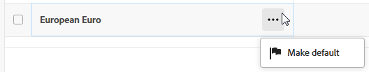
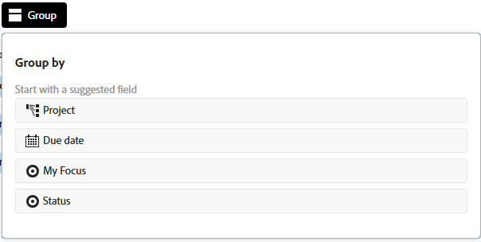
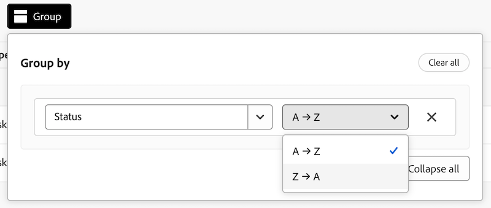

# 향상된 목록 사용

{{preview-fast-release-general}}

고급 목록은 Adobe Workfront의 일부 영역에서 사용할 수 있습니다. 이러한 목록은 목록 항목을 표시하기 위해 표 형식을 사용하며 표준 목록과는 다른 모양과 느낌을 가집니다.

표준 목록에 대한 자세한 내용은 [Adobe Workfront 목록 시작](/help/quicksilver/workfront-basics/navigate-workfront/use-lists/view-items-in-a-list.md)을 참조하세요.

>[!NOTE]
>
>필요한 데이터를 표시하는 데 도움이 되도록 각 고급 목록을 다르게 구성할 수 있습니다. 모든 목록에는 이 문서에 설명된 모든 기능이 사용되지 않으며 일부 목록에는 해당 목록에만 적용되는 특수 기능이 있을 수 있습니다.

## 액세스 요구 사항

+++ 을 확장하여 이 문서의 기능에 대한 액세스 요구 사항을 봅니다.

<table style="table-layout:auto">
 <col> 
 <col>
 <tbody> 
  <tr> 
   <td>Adobe Workfront 패키지</td> 
   <td>
임의
</td> 
  </tr> 
  <tr> 
   <td>Adobe Workfront 라이선스</td> 
   <td>
   
기여자 이상

   
요청 이상
</td>
  </tr>
 </tbody> 
</table>

자세한 내용은 [Workfront 설명서의 액세스 요구 사항](/help/quicksilver/administration-and-setup/add-users/access-levels-and-object-permissions/access-level-requirements-in-documentation.md)을 참조하십시오.

+++

## 고급 목록을 사용하는 개체

다음은 향상된 목록 형식을 사용하는 일부 유형의 Workfront 개체 목록과 개체를 볼 수 있는 권한이 있을 때 기본적으로 표시되는 일부 영역입니다.

>[!NOTE]
>
>이 목록은 포괄적이지 않습니다. 이러한 각 객체 목록은 보고서나 대시보드에도 표시될 수 있습니다. 예를 들어 프로젝트 보고서나 프로젝트 보고서가 포함된 대시보드에는 프로젝트 목록도 표시됩니다.

| Workfront 목록 | 개체 목록의 위치 |
|--- |--- |
| 우선순위 | <ul><li>홈 > 왼쪽 메뉴에서 우선 순위 아이콘 선택</li><li>메인 메뉴 > 우선 순위</li></ul> |
| 요청 목록 | <ul><li>요청(새 경험만 해당)</li><li>홈의 내 요청 위젯</li></ul> |
| 환율 목록 | <ul><li>설정 > 프로젝트 환경 설정 > 환율</li></ul> |

## 향상된 목록에서 항목 추가 및 편집

향상된 목록의 구성에 따라 두 가지 방법으로 목록에 항목을 추가할 수 있습니다.

* 목록 위에 있는 버튼을 클릭합니다. 이 옵션을 선택하면 정보를 입력하고 저장하는 대화 상자가 열립니다.
* 목록 맨 아래에 있는 **새 행**&#x200B;을 클릭합니다. 이 옵션은 테이블에 새 행을 추가하고 각 셀에 정보를 입력합니다. 셀이 특정 데이터 세트(예: 통화 이름)로 제한된 경우 목록에서 선택하거나 이름을 검색하라는 메시지가 표시될 수 있습니다.

목록에서 항목을 편집하려면 편집할 셀을 두 번 클릭하고 정보를 입력합니다. 일부 셀은 읽기 전용일 수 있습니다.

## 향상된 목록에서 작업 표시줄 및 기타 메뉴 사용

고급 목록의 항목 옆에 있는 확인란을 선택하면 화면 하단에 작업 표시줄이 나타나고 항목에 대해 수행할 수 있는 작업이 표시됩니다. 일부 작업은 해당 목록에만 해당되며 다른 목록에는 나타나지 않을 수 있습니다.

작업 표시줄의 버튼을 클릭하여 목록 항목 보기, 항목 삭제 또는 기본 항목 지정과 같은 작업을 수행합니다.

선택한 항목에 사용할 수 있는 작업이 없으면 작업 표시줄에 &quot;사용할 수 있는 작업이 없습니다.&quot;라고 표시됩니다.

**자세히** 메뉴는 목록 항목 위로 마우스를 가져가면 목록 항목 옆에 표시되는 세 점 메뉴입니다. 메뉴를 클릭하여 항목에 대한 추가 작업을 확인합니다. 일부 작업은 해당 목록에만 해당되며 다른 목록에는 나타나지 않을 수 있습니다.

## 향상된 목록에서 열 사용자 지정

일부 향상된 목록을 사용하면 열을 숨기거나 표시하고 열 순서를 변경할 수 있습니다.

1. 목록 위에 있는 **열**&#x200B;을 클릭합니다.

   

1. 토글을 사용하여 목록에 열을 표시하거나 숨깁니다.
1. 열 순서를 바꾸려면 **끌기** 아이콘을 클릭하고 열을 원하는 위치로 이동합니다. 열을 이동하면 목록이 자동으로 변경됩니다.

   >[!NOTE]
   >
   >필드는 항상 첫 번째 위치에 표시되거나 고정될 수 있으며 열을 변경할 수 없습니다.

   열을 숨길 때 **열** 단추에 표시기가 나타납니다. 열 순서를 변경할 때 표시기가 나타나지 않습니다.

   

## 향상된 목록에서 항목 필터링 및 그룹화

필터는 목록에 표시되는 정보의 양을 줄이는 데 도움이 됩니다. 그룹화는 특정 기준에 따라 영역의 목록에 있는 객체를 구분합니다.

### 필터 사용

1. 목록 위에 있는 **필터**&#x200B;를 클릭합니다.
1. 필터 상자에서 **조건 추가**&#x200B;를 클릭합니다.
1. 필터링 기준으로 사용할 필드를 선택합니다.
1. &quot;다음 중 하나 이상의 항목 있음&quot;, &quot;다음 중 하나 이상의 항목 없음&quot;, &quot;다음 이전&quot; 또는 &quot;다음 이후&quot;와 같은 필터 수정자를 선택합니다. 수정자 옵션은 필터링 기준으로 사용하는 필드 유형에 따라 다릅니다.
1. 필드 값 또는 값을 선택합니다. 필터링 기준으로 사용하는 필드 유형에 따라 목록에서 항목을 선택하거나 검색하거나 달력을 사용하여 날짜 범위를 선택하라는 메시지가 표시될 수 있습니다.

   

   필터가 목록에 자동으로 적용됩니다.

1. 필터에 다른 조건을 OR 문으로 추가하려면 **조건 추가**&#x200B;를 클릭하십시오.
1. 필터가 적용되면 **필터** 옵션을 다시 열어 필터 옵션을 변경하거나 모든 필터를 지울 수 있습니다.

   목록에 필터를 적용하면 **필터** 단추에 표시기가 나타납니다.

   

### 그룹화 사용

1. 목록 위에 있는 **그룹**&#x200B;을 클릭합니다.
1. 목록을 구성할 그룹화를 선택하십시오.

   

1. 그룹화가 적용되면 [그룹] 옵션을 다시 열어 모든 그룹화를 한 번에 축소 또는 확장하거나, 다른 필드로 그룹화를 변경하거나, 모든 그룹화를 지울 수 있습니다.

   

   그룹화가 목록에 적용되면 **그룹** 단추에 표시기가 나타납니다.

   

## 향상된 목록에서 정렬 및 검색

개별 열을 정렬하려면 열로 이동하여 아래쪽 화살표를 클릭합니다. 열 이름 옆에 있는 아이콘은 해당 열의 값과 정렬 방향을 기준으로 목록이 정렬되었음을 나타냅니다.

>[!NOTE]
>
>목록에 기본 항목이 있으면 목록 정렬 방법에 관계없이 해당 항목이 항상 목록에서 첫 번째가 됩니다.

그룹화 내에서 작업을 정렬하려면 **그룹**&#x200B;을 열고 오름차순 또는 내림차순으로 정렬할지 선택하세요.

검색하려면 목록 위의 검색 필드에 검색어를 입력하십시오. 입력할 때 목록에 결과가 강조 표시됩니다.

