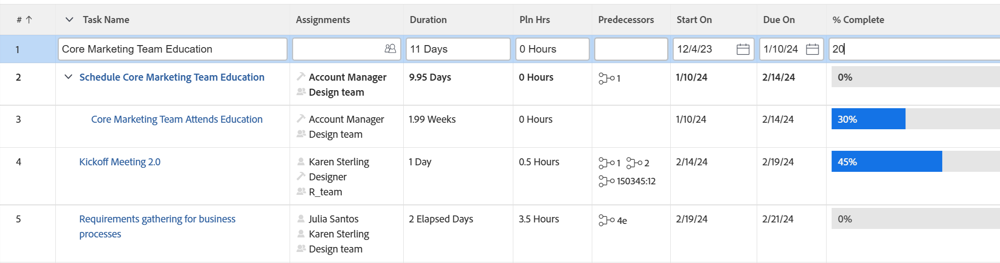

# [!DNL Adobe Workfront]의 목록에 있는 인라인 편집 항목

<!--Audited: 11/2024-->

개체가 목록이나 보고서에 표시될 때 개체를 인라인 형태로 편집할 수 있습니다. 목록이나 보고서에 표시되는 객체에 대한 정보를 편집하면 객체가 즉시 업데이트됩니다.

개체에 첨부되지 않은 사용자 정의 양식에 포함된 필드를 인라인 편집하면 사용자 정의 양식이 자동으로 개체에 추가됩니다. 필드가 여러 사용자 정의 양식에 있는 경우 가장 최근에 업데이트된 사용자 정의 양식이 개체에 첨부됩니다.

목록에 대한 자세한 내용은 [목록 시작 [!DNL Adobe Workfront]](../../../workfront-basics/navigate-workfront/use-lists/view-items-in-a-list.md)을 참조하세요.

목록이나 보고서에 표시되는 대부분의 개체는 [!DNL Adobe Workfront]에서 인라인 편집 가능하지만, 다음과 같은 몇 가지 제한 사항이 있습니다.

* 계산된 필드 또는 계산인 [!DNL Workfront]개의 기본 제공 필드는 편집할 수 없습니다.
* 목록의 개체에 직접 연결된 필드만 편집할 수 있습니다. 목록에 있는 개체와 연결된 개체에 속한 필드는 편집할 수 없습니다.

  예를 들어, 작업 보고서에서 작업 상태를 편집할 수 있지만 동일한 보고서에서 작업이 연결된 프로젝트의 이름은 편집할 수 없습니다. 프로젝트 이름은 프로젝트 보고서에서만 편집할 수 있습니다.
* 목록 보기에 기본 통화가 표시되지 않으면 인라인 편집 필드를 사용할 수 없습니다.

  기본 통화 표시에 대한 자세한 내용은 [고유한 환율로 재무 데이터 보고서 만들기](../../../reports-and-dashboards/reports/creating-and-managing-reports/create-financial-data-reports-unique-exchange-rates.md#editing-reports-with-unique-currencies) 문서의 [고유한 통화로 보고서 편집](../../../reports-and-dashboards/reports/creating-and-managing-reports/create-financial-data-reports-unique-exchange-rates.md) 섹션을 참조하십시오.
* 목록에 표시된 플래그와 아이콘은 편집할 수 없습니다.
* 다른 보고서에서 가져온 보고서 필드는 인라인 편집이 불가능합니다.

## 액세스 요구 사항

+++ 이 문서의 기능에 대한 액세스 요구 사항을 보려면 확장하십시오. 

<table style="table-layout:auto"> 
 <col> 
 <col> 
 <tbody> 
  <tr> 
   <td role="rowheader">Adobe Workfront 패키지</td> 
   <td> 
Any
 </td> 
  </tr> 
  <tr> 
   <td role="rowheader">Adobe Workfront 라이선스</td> 
   <td> 
   
콘텐츠 작가 이상 

   
요청 이상

   </td> 
  </tr> 
  <tr> 
   <td role="rowheader">액세스 레벨 구성</td> 
   <td> 
목록이 있는 영역에 대한 [!UICONTROL 편집] 액세스 권한
 
예를 들어 프로젝트의 인라인 편집 작업을 수행하려면 프로젝트에 대한 [!UICONTROL Edit] 액세스 권한이 필요합니다.
</td> 
  </tr> 
  <tr> 
   <td role="rowheader">개체 권한</td> 
   <td> 
[!UICONTROL Manage]
 
사용자 정의 필드, 상태 등의 특정 필드를 편집할 수 있는 권한도 있어야 합니다.
  </td> 
  </tr> 
 </tbody> 
</table>

자세한 내용은 [Workfront 설명서의 액세스 요구 사항](/help/quicksilver/administration-and-setup/add-users/access-levels-and-object-permissions/access-level-requirements-in-documentation.md)을 참조하세요.

+++

## 인라인 개체 편집

1. 인라인 편집을 수행할 개체 목록으로 이동합니다.

   목록에는 객체에 속한 필드나 목록에 있는 객체와 연관된 객체에 속한 필드가 표시되어야 합니다.

1. 편집할 개체를 찾은 다음 목록에서 필드 내부를 클릭합니다.

   >[!TIP]
   >
   >페이지가 여러 개인 경우 다음을 사용하여 개체를 찾을 수 있습니다.
   >
   >   * **페이지 매김**: 뒤로 및 앞으로 화살표를 클릭하여 페이지 사이를 탐색합니다.
   >     목록의 오른쪽 아래 모서리에 있는 [!UICONTROL 페이지 매김] 영역은 목록을 스크롤할 때 고정됩니다.
   >   * **빠른 필터**: 필터 아이콘을 클릭하거나 Alt+F를 입력하여 빠른 필터를 연 다음 텍스트를 입력하여 입력한 텍스트가 포함된 항목만 표시합니다.
   >     빠른 필터는 목록 도구 모음에 있습니다. 자세한 내용은 [목록에 빠른 필터 적용](../../../workfront-basics/navigate-workfront/use-lists/apply-quick-filter-list.md)을 참조하세요.

   필드를 편집할 수 있는 경우 그러면 해당 필드와 목록에 표시된 다른 모든 필드가 편집 가능한 셀로 바뀝니다.

   

1. 이 셀 내부의 정보를 편집한 다음 [!UICONTROL Enter]을 누릅니다.

   >[!NOTE]
   >
   >사용자 정의 필드가 서식을 허용하도록 구성된 경우, 업데이트된 목록에서 필드를 인라인 편집할 때 텍스트를 굵게, 기울임체 또는 밑줄을 적용할 수 있습니다.
   >사용자 지정 필드의 서식 구성에 대한 자세한 내용은 [사용자 지정 양식 만들기](/help/quicksilver/administration-and-setup/customize-workfront/create-manage-custom-forms/form-designer/design-a-form/design-a-form.md)를 참조하세요.
   >업데이트된 목록에 대한 자세한 내용은 [목록 시작하기 [!DNL Adobe Workfront]](../../../workfront-basics/navigate-workfront/use-lists/view-items-in-a-list.md)의 &quot;업데이트된 목록과 기존 목록의 차이&quot; 섹션을 참조하십시오.

1. [!UICONTROL Tab]을 눌러 편집 가능한 다음 셀로 이동합니다.
1. (조건부) 편집 내용을 저장할 수 없고 셀의 윤곽이 빨간색으로 표시되면 필드 내부를 클릭하여 셀 옆에 표시되는 유효성 검사 메시지를 검토하고 적절한 업데이트를 수행합니다.

   일반적으로 이 문제는 잘못된 형식을 사용하거나 필수 필드를 비워 둔 경우 발생합니다.

1. 모든 셀을 수정한 후 [!UICONTROL Enter]을 눌러 변경 내용을 저장합니다.
