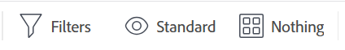

# [!DNL Adobe Workfront]의 목록 시작

<!--Audited: 11/2024-->

[!DNL Adobe Workfront]의 개체 목록을 보고 해당 개체의 시작 날짜와 기한, 해당 개체에 할당된 사용자, 해당 개체와 연결된 다른 개체 등 해당 개체에 대한 정보를 얻을 수 있습니다.

다음은 [!DNL Workfront]에 있는 목록의 몇 가지 특성입니다.

* 시스템의 다른 사용자가 다른 위치에서 업데이트하는 정보를 업데이트하기 위해 5분마다 자동으로 새로 고침을 나열합니다.
* [!DNL Workfront]의 일부 영역에는 기본 개체 목록이 미리 구성되어 있습니다.

  이렇게 미리 구성된 대부분의 목록을 사용자 지정할 수 있습니다.

* [!DNL Workfront] 관리자는 [!DNL Workfront]의 다양한 영역에 적용할 사용자 지정 목록을 만들 수 있습니다.

  시스템 수준 목록 만들기에 대한 자세한 내용은 문서 [기본 필터, 보기, 그룹화 만들기, 편집 및 공유](../../../administration-and-setup/set-up-workfront/configure-system-defaults/create-and-share-default-fvgs.md)를 참조하십시오.

## 액세스 요구 사항

+++ 을 확장하여 이 문서의 기능에 대한 액세스 요구 사항을 봅니다. 

<table style="table-layout:auto"> 
 <col> 
 <col> 
 <tbody> 
  <tr> 
   <td role="rowheader">Adobe Workfront 패키지</td> 
   <td> 
임의
 </td> 
  </tr> 
  <tr> 
   <td role="rowheader">Adobe Workfront 라이선스</td> 
   <td> 
   
기여자 이상

   
요청 이상

   </td> 
  </tr> 
  <tr> 
   <td role="rowheader">액세스 수준 구성</td> 
   <td> 
필터, 보기, 그룹화에 대한 액세스 편집 
 </td> 
  </tr> 
  <tr> 
   <td role="rowheader">개체 권한</td> 
   <td> 
공유할 수 있는 액세스 권한이 있는 필터, 보기 또는 그룹화에 대한 이상의 권한 보기 
  </td> 
  </tr> 
 </tbody> 
</table>

자세한 내용은 [Workfront 설명서의 액세스 요구 사항](/help/quicksilver/administration-and-setup/add-users/access-levels-and-object-permissions/access-level-requirements-in-documentation.md)을 참조하십시오.

+++

<!--Old access: 

You must have the following access to perform the steps in this article:

<table style="table-layout:auto"> 
 <col> 
 <col> 
 <tbody> 
  <tr> 
   <td role="rowheader"><strong>[!DNL Adobe Workfront] plan*</strong></td> 
   <td> 
Any
 </td> 
  </tr> 
  <tr> 
   <td role="rowheader"><strong>[!DNL Adobe Workfront] license*</strong></td> 
   <td> 
[!UICONTROL Request] or higher
 </td> 
  </tr> 
  <tr> 
   <td role="rowheader"><strong>Access level configurations*</strong></td> 
   <td> 
[!UICONTROL View] or higher access to filters, views, groupings
 
For items in the [!UICONTROL Setup] area, you need administrative access for the item or the [!UICONTROL System Administrator] access level.
 
Note: If you still don't have access, ask your [!DNL Workfront] administrator if they set additional restrictions in your access level. For information on how a [!DNL Workfront] administrator can change your access level, see <a href="../../../administration-and-setup/add-users/configure-and-grant-access/create-modify-access-levels.md" class="MCXref xref">Create or modify custom access levels</a>.
 </td> 
  </tr> 
  <tr> 
   <td role="rowheader"><strong>Object permissions</strong></td> 
   <td> 
[!UICONTROL View] or higher permissions with access to share
 
For information on requesting additional access, see <a href="../../../workfront-basics/grant-and-request-access-to-objects/request-access.md" class="MCXref xref">Request access to objects </a>.
 </td>
  </tr> 
 </tbody> 
</table>

To find out what plan, license type, or access you have, contact your [!DNL Workfront] administrator.
-->

## 오브젝트 목록

다음은 [!DNL Workfront]에서 찾을 수 있는 일부 형식의 개체 목록과 개체를 볼 수 있는 권한이 있을 때 기본적으로 표시되는 일부 영역입니다.

>[!NOTE]
>
>* 이 목록은 포괄적이지 않습니다. 이러한 각 객체 목록은 보고서나 대시보드에도 표시될 수 있습니다. 예를 들어 프로젝트 보고서나 프로젝트 보고서가 포함된 대시보드에는 프로젝트 목록도 표시됩니다.
>* 이 목록에서 &quot;선택&quot;은 이름의 왼쪽에 있는 확인란이 아니라 항목의 이름을 클릭해야 함을 의미합니다.

<table style="table-layout:auto"> 
 <col> 
 <col> 
 <thead> 
  <tr> 
   <th><strong>[!DNL Workfront] list</strong></th> 
   <th><strong>개체 목록의 위치</strong></th> 
  </tr> 
 </thead> 
 <tbody> 
  <tr> 
   <td>포트폴리오 목록</td> 
   <td> 
    <ul> 
     <li> 
[!UICONTROL Portfolios]
 </li> 
    </ul> </td> 
  </tr> 
  <tr> 
   <td>프로그램 목록</td> 
   <td> 
    <ul> 
     <li> 
[!UICONTROL Portfolios] &gt;[!UICONTROL 포트폴리오 선택] &gt;[!UICONTROL 프로그램]
 </li> 
     <li data-mc-conditions="QuicksilverOrClassic.Quicksilver"> 
[!UICONTROL 프로그램]
 </li> 
    </ul> </td> 
  </tr> 
  <tr> 
   <td>프로젝트 목록</td> 
   <td> 
    <ul> 
     <li> 
[!UICONTROL 프로젝트]
 </li> 
     <li> 
[!UICONTROL Portfolios] &gt;[!UICONTROL 포트폴리오 선택] &gt;[!UICONTROL 프로젝트]
 </li> 
     <li> 
[!UICONTROL Portfolios] &gt;[!UICONTROL 포트폴리오 선택] &gt;[!UICONTROL 프로그램] &gt;[!UICONTROL 프로그램 선택] &gt;[!UICONTROL 프로젝트]
 </li> 
    </ul> </td> 
  </tr> 
  <tr> 
   <td>작업 목록</td> 
   <td> 
    <ul> 
     <li> 
[!UICONTROL 프로젝트] &gt;[!UICONTROL 프로젝트 선택] &gt; [!UICONTROL 작업]
 </li> 
     <li> 
[!UICONTROL 프로젝트] &gt;[!UICONTROL 프로젝트 선택] &gt;[!UICONTROL 작업] &gt;[!UICONTROL 작업 선택] &gt;[!UICONTROL 하위 작업]
 </li> 
     <li> 
[!UICONTROL 프로젝트] &gt;[!UICONTROL 프로젝트 선택] &gt;[!UICONTROL 작업] &gt;[!UICONTROL 작업 선택] &gt; [!UICONTROL 전임 작업*]
 </li> 
    </ul> </td> 
  </tr> 
  <tr> 
   <td>문제 목록</td> 
   <td> 
    <ul> 
     <li> 
[!UICONTROL 프로젝트] &gt; [!UICONTROL 프로젝트 선택] &gt;[!UICONTROL 문제]
 </li> 
     <li> 
[!UICONTROL 프로젝트] &gt;[!UICONTROL 프로젝트 선택] &gt;[!UICONTROL 작업] &gt;[!UICONTROL 작업 선택] &gt; [!UICONTROL 문제]
 </li> 
     <li> 
[!UICONTROL 프로젝트] &gt;[!UICONTROL 프로젝트 선택] &gt;[!UICONTROL 작업] &gt;[!UICONTROL 작업 선택] &gt;[!UICONTROL 하위 작업] &gt;[!UICONTROL 작업 선택] &gt; [!UICONTROL 문제]
 </li> 
    </ul> </td> 
  </tr> 
  <tr> 
   <td>보고서 목록</td> 
   <td> 
    <ul> 
     <li> 
  [!UICONTROL 보고서]  
 </li> 
    </ul> </td> 
  </tr> 
  <tr> 
   <td>대시보드 목록</td> 
   <td> 
    <ul> 
     <li> 
[!UICONTROL 대시보드]
 </li> 
    </ul> </td> 
  </tr> 
  <tr> 
   <td>반복 목록</td> 
   <td> 
    <ul> 
     <li> 
[!UICONTROL Teams] &gt; [!UICONTROL Iterations]
 </li> 
    </ul> </td> 
  </tr> 
  <tr> 
   <td>사용자 목록</td> 
   <td> 
    <ul> 
     <li> 
[!UICONTROL 사용자]
 </li> 
    </ul> </td> 
  </tr> 
  <tr> 
   <td>문서 목록</td> 
   <td> 
    <ul> 
     <li> 
[!UICONTROL 문서]
 </li> 
     <li> 
[!UICONTROL Portfolios] &gt;[!UICONTROL 포트폴리오 선택] &gt; [!UICONTROL 문서]
 </li> 
     <li> 
[!UICONTROL Portfolios] &gt; [!UICONTROL 포트폴리오 선택] &gt;[!UICONTROL 프로그램] &gt;[!UICONTROL 프로그램 선택] &gt;[!UICONTROL 문서]
 </li> 
     <li> 
[!UICONTROL 프로젝트] &gt;[!UICONTROL 프로젝트 선택] &gt;[!UICONTROL 문서]
 </li> 
     <li> 
[!UICONTROL 프로젝트] &gt;[!UICONTROL 프로젝트 선택] &gt;[!UICONTROL 작업] &gt;[!UICONTROL 작업 선택] &gt; [!UICONTROL 문서]
 </li> 
     <li> 
[!UICONTROL 프로젝트] &gt; [!UICONTROL 선택] 프로젝트 &gt; [!UICONTROL 문제] &gt;[!UICONTROL 문제 선택] &gt; [!UICONTROL 문서]
 </li> 
    </ul> </td> 
  </tr> 
  <tr> 
   <td>타임시트 목록</td> 
   <td> 
    <ul> 
     <li> 
[!UICONTROL 타임시트] s &gt; [!UICONTROL 모든 타임시트]*
 </li> 
    </ul> </td> 
  </tr> 
  <tr> 
   <td>청구 요금 목록</td> 
   <td> 
    <ul> 
     <li> 
[!UICONTROL 프로젝트] &gt;[!UICONTROL 프로젝트 선택] &gt;[!UICONTROL 청구 요금*]
 </li> 
    </ul> </td> 
  </tr> 
  <tr> 
   <td>청구 기록 목록</td> 
   <td> 
    <ul> 
     <li> 
[!UICONTROL 프로젝트] &gt; [!UICONTROL 프로젝트 선택] &gt; [!UICONTROL 청구 기록]
 </li> 
    </ul> </td> 
  </tr> 
  <tr> 
   <td>위험 목록</td> 
   <td> 
    <ul> 
     <li> 
[!UICONTROL 프로젝트] &gt;[!UICONTROL 프로젝트 선택] &gt;[!UICONTROL 위험]
 </li> 
    </ul> </td> 
  </tr> 
  <tr> 
   <td>경비 목록</td> 
   <td> 
    <ul> 
     <li> 
[!UICONTROL 프로젝트] &gt;[!UICONTROL 프로젝트 선택] &gt;[!UICONTROL 경비]
 </li> 
     <li> 
[!UICONTROL 프로젝트] &gt; [!UICONTROL 프로젝트 선택] &gt;[!UICONTROL 작업] &gt;[!UICONTROL 작업 선택] &gt;[!UICONTROL 경비]
 </li> 
    </ul> </td> 
  </tr> 
  <tr> 
   <td>시간 항목 목록</td> 
   <td> 
    <ul> 
     <li> 
[!UICONTROL 프로젝트] &gt;[!UICONTROL 프로젝트 선택]
 </li> 
     <li> 
[!UICONTROL 프로젝트] &gt;[!UICONTROL 프로젝트 선택] &gt;[!UICONTROL 작업] &gt;[!UICONTROL 작업 선택] &gt;[!UICONTROL 시간]
 </li> 
     <li> 
[!UICONTROL 프로젝트] &gt;[!UICONTROL 선택] 프로젝트 &gt;[!UICONTROL 문제] &gt;[!UICONTROL 선택] 문제 &gt;[!UICONTROL 시간]
 </li>
    </ul> </td> 
  </tr>
  <tr> 
   <td>사용자 정의 양식 목록</td> 
   <td> 
    <ul> 
     <li>[!UICONTROL Setup] &gt;[!UICONTROL 사용자 지정 Forms] </li> 
    </ul> </td> 
  </tr> 
  <tr> 
    <td>그룹 또는 하위 그룹 목록</td> 
   <td> 
    <ul> 
     <li> 
[!UICONTROL Setup] &gt;[!UICONTROL Groups]
 </li>
     <li> 
[!UICONTROL 설정] &gt;[!UICONTROL 그룹] &gt;[!UICONTROL 상위 그룹] &gt;[!UICONTROL 하위 그룹] 선택 </li> 
    </ul> </td> 
  </tr> 
  <tr> 
   <td>팀 목록</td> 
   <td> 
    <ul> 
     <li> 
[!UICONTROL 설정] &gt;[!UICONTROL 팀]
 </li> 
    </ul> </td> 
  </tr>
  <tr> 
   <td>회사 목록</td> 
   <td> 
    <ul> 
     <li> 
[!UICONTROL 설정] &gt;[!UICONTROL 회사]
 </li> 
    </ul> </td> 
  </tr>
  <tr> 
   <td>일정 목록</td> 
   <td> 
    <ul> 
     <li> 
[!UICONTROL 설정] &gt;[!UICONTROL 일정]
 </li> 
    </ul> </td> 
  </tr>
  <tr> 
   <td>레이아웃 템플릿 목록</td> 
   <td> 
    <ul> 
     <li> 
[!UICONTROL Setup] &gt;[!UICONTROL 레이아웃 템플릿]
 </li> 
    </ul> </td> 
  </tr>
 </tbody> 
</table>

지정된 영역의 목록은 사용자 지정할 수 없습니다. [!DNL Workfront] 관리자는 시스템 수준에서 사용자 지정된 목록을 만들 수 있습니다. 또는 액세스 수준에 따라 보고서를 편집할 수 있는 액세스 권한이 있는 경우 이 개체에 대한 보고서를 만들 수 있습니다.

## 목록 요소

목록에는 해당 형식과 표시되는 정보를 정의하는 특정 요소가 포함되어 있습니다. 기본적으로 사용할 수 있는 여러 시스템 목록 요소를 찾을 수 있습니다. 필요에 따라 사용자 지정 요소를 만들 수도 있습니다.

>[!NOTE]
>
>목록에서 새 필터, 보기 또는 그룹화를 선택하면 [!DNL Workfront]에서 로그아웃하거나 브라우저를 닫아도 해당 선택 항목이 유지됩니다.

다음은 목록의 요소입니다.

<table style="table-layout:auto"> 
 <col> 
 <col> 
 <thead> 
  <tr> 
   <th><strong>요소</strong></th> 
   <th><strong>설명</strong></th> 
  </tr> 
 </thead> 
 <tbody> 
  <tr> 
   <td><strong>[!UICONTROL Filter]</strong></td> 
   <td> 
필터는 지정한 기준에 따라 불필요한 정보를 목록에서 제거합니다. 
 
자세한 내용은 <a href="../../../reports-and-dashboards/reports/reporting-elements/filters-overview.md" class="MCXref xref">필터 개요</a>를 참조하세요.
 </td> 
  </tr> 
  <tr> 
   <td><strong>[!UICONTROL 보기]</strong></td> 
   <td> 
보기는 화면에 표시할 필드(열)를 정의합니다.
 
자세한 내용은 <a href="../../../reports-and-dashboards/reports/reporting-elements/views-overview.md" class="MCXref xref">의 [!DNL Adobe Workfront]</a>보기 개요를 참조하십시오.
 </td> 
  </tr> 
  <tr> 
   <td><strong>[!UICONTROL 그룹화]</strong></td> 
   <td> 
그룹화는 사용자가 지정하는 기준에 따라 영역의 목록에 있는 객체를 구분합니다.
 
예를 들어 목록의 문제는 상태 또는 우선 순위별로 섹션에 표시될 수 있습니다.
 
표준 그룹화에는 최대 3개의 그룹화 레이어를 사용할 수 있으며, 텍스트 모드에서 그룹화를 구성하는 경우 네 번째 레이어를 추가할 수 있습니다.
 
그룹화에 대한 자세한 내용은 <a href="../../../reports-and-dashboards/reports/reporting-elements/groupings-overview.md" class="MCXref xref">의 [!DNL Adobe Workfront]</a>그룹화 개요를 참조하십시오.
 
텍스트 모드에 대한 자세한 내용은 <a href="../../../reports-and-dashboards/reports/text-mode/understand-text-mode.md" class="MCXref xref">텍스트 모드 개요</a>를 참조하십시오.
 </td> 
  </tr> 
 </tbody> 
</table>

이러한 요소는 기본적으로 모든 목록의 맨 위에 표시됩니다. 이러한 파일은 고정되어 있으며 목록을 스크롤할 때 이동하지 않습니다. 각 요소의 아이콘 위에 마우스를 놓아 해당 요소를 식별합니다.

다음 영역에서 목록 요소를 사용자 지정하고 다른 사용자와 공유할 수 있습니다.

* 이 문서의 [목록 시작 [!DNL Adobe Workfront]](#default-workfront-lists) 섹션에 있는 모든 시스템 기본 목록
* 나와 공유된 모든 보고서

목록의 빌딩 요소는 보고서의 빌딩 요소와 동일합니다.

목록 및 보고서의 빌드 요소를 만들고 사용자 지정하는 방법에 대한 자세한 내용은 [보고 요소: 필터, 보기 및 그룹화](../../../reports-and-dashboards/reports/reporting-elements/reporting-elements-filters-views-groupings.md)를 참조하십시오.

## 작업 나열

목록에서 다음 작업을 완료할 수 있습니다.

<table style="table-layout:auto"> 
 <col> 
 <col> 
 <thead> 
  <tr> 
   <th><strong>액션</strong></th> 
   <th><strong>정보</strong></th> 
  </tr> 
 </thead> 
 <tbody> 
  <tr> 
   <td><strong>인라인 편집</strong> </td> 
   <td> 
개체 및 해당 정보를 목록에서 직접 편집합니다.
 
자세한 내용은 <a href="../../../workfront-basics/navigate-workfront/use-lists/inline-edit-objects.md" class="MCXref xref">의 목록에서 [!DNL Adobe Workfront]</a>인라인 편집 항목을 참조하십시오.
 
   
<b>참고:</b>

   
그룹화에서는 인라인 편집을 할 수 없습니다.

</td> 
  </tr> 
  <tr data-mc-conditions="QuicksilverOrClassic.Quicksilver"> 
   <td><strong>[!UICONTROL Summary]로 업데이트</strong> </td> 
   <td> 
[!UICONTROL 요약] 패널을 사용하여 프로젝트 수준에서 작업 및 문제를 업데이트합니다.
 
<b>팁:</b>
 
요약 은 일부 오브젝트에 사용할 수 없으며 작업 또는 문제 보고서에서 사용할 수 없습니다.
 
자세한 내용은 <a href="../../../workfront-basics/the-new-workfront-experience/summary-overview.md" class="MCXref xref">요약 개요</a>를 참조하세요.
 </td> 
  </tr> 
  <tr> 
   <td><strong>목록 표시 사용자 지정</strong> </td> 
   <td> 
목록, 열 배열, 항목 정렬 순서 또는 표시되는 항목 수의 모양과 느낌을 사용자 지정합니다.
 
<b>참고:</b>
 
[!DNL Workfront]에서 로그아웃하거나 브라우저를 닫으면 페이지에 표시할 항목 수에 대한 변경 내용이 되돌아갑니다. 변경 사항은 8시간 후 되돌릴 수도 있습니다.
 
자세한 내용은 <a href="../../../workfront-basics/navigate-workfront/use-lists/modify-list-display.md" class="MCXref xref">목록 표시 방법 수정</a>을 참조하십시오.
 </td> 
  </tr> 
  <tr> 
   <td><strong>빠른 필터</strong> </td> 
   <td> 
빠른 필터를 적용하여 중요한 항목만 찾아 빠르게 검토, 업데이트 또는 다른 사람과 공유할 수 있습니다.
 
<b>중요 사항:</b>
 
 빠른 필터를 사용하여 검색어가 포함된 항목을 찾을 수 있습니다. 해당 항목이 화면에 표시되는지 또는 페이지 맨 아래로 스크롤한 후 표시되는지 여부입니다. 브라우저의 검색 기능을 사용하면 이미 화면에 표시된 항목만 찾을 수 있습니다. 목록에 여러 페이지가 있는 경우 빠른 필터는 현재 페이지의 항목만 찾습니다.
 
자세한 내용은 <a href="../../../workfront-basics/navigate-workfront/use-lists/apply-quick-filter-list.md" class="MCXref xref">목록에 빠른 필터 적용</a>을 참조하십시오.
 </td> 
  </tr> 
  <tr> 
   <td><strong>내보내기</strong> </td> 
   <td> 
[!DNL Workfront]에서 개체 목록을 내보냅니다. 목록에 2000개가 넘는 항목이 있는 경우 목록을 내보내는 것만이 한 페이지의 모든 항목을 검토할 수 있는 유일한 방법입니다.
 
목록 내보내기에 대한 자세한 내용은 <a href="../../../workfront-basics/navigate-workfront/use-lists/export-lists.md" class="MCXref xref">목록 내보내기</a>를 참조하십시오. 내보내기 형식 및 제한에 대한 자세한 내용은 <a href="../../../reports-and-dashboards/reports/creating-and-managing-reports/export-data.md" class="MCXref xref">데이터 내보내기</a>를 참조하십시오.
 </td> 
  </tr> 
 </tbody> 
</table>

### 목록 도구 모음

다음 표에는 도구 모음에서 사용할 수 있는 많은 아이콘이 나열되어 있으며 아이콘을 클릭할 때 발생하는 상황이 나와 있습니다.

<table style="table-layout:auto"> 
 <col> 
 <col> 
 <col> 
 <tbody> 
  <tr> 
   <td><strong>아이콘</strong></td> 
   <td><strong>설명</strong></td> 
   <td><strong>클릭 시</strong></td> 
  </tr> 
  <tr> 
   <td>  </td> 
   <td>[!UICONTROL 항목 또는 사용자 추가]</td> 
   <td>새 항목 또는 사용자 추가를 포함한 추가 옵션을 엽니다.</td> 
  </tr> 
  <tr> 
   <td>  </td> 
   <td>[!UICONTROL 위에 작업 삽입]</td> 
   <td> 
선택한 작업 위에 작업을 삽입합니다.
 
작업에만 사용할 수 있습니다. 
 </td> 
  </tr> 
  <tr> 
   <td>  </td> 
   <td>[!UICONTROL 아래에 작업 삽입]</td> 
   <td> 
선택한 작업 아래에 작업을 삽입합니다.
 
작업에만 사용할 수 있습니다. 
 </td> 
  </tr> 
  <tr> 
   <td>  </td> 
   <td>[!UICONTROL 편집]</td> 
   <td>선택한 항목을 편집합니다.</td> 
  </tr> 
  <tr> 
   <td>  </td> 
   <td>[!UICONTROL Copy]</td> 
   <td>선택한 항목을 복사합니다.</td> 
  </tr> 
  <tr> 
   <td>  </td> 
   <td>[!UICONTROL Delete]</td> 
   <td>선택한 항목을 삭제합니다.</td> 
  </tr> 
  <tr> 
   <td>  </td> 
   <td>[!UICONTROL 추가 위치]</td> 
   <td> 
대화 상자를 열어 선택한 문제를 반복에 추가합니다.
 
이 기능은 문제에만 사용할 수 있습니다.
 </td> 
  </tr> 
  <tr> 
   <td>  </td> 
   <td>[!UICONTROL 공유]</td> 
   <td>선택한 항목을 공유합니다.</td> 
  </tr> 
  <tr> 
   <td>  </td> 
   <td>[!UICONTROL 들여쓰기 및 내어쓰기 작업] </td> 
   <td> 
선택한 작업을 들여쓰거나 내어씁니다. 
 
작업에만 사용할 수 있습니다. 
 </td> 
  </tr> 
  <tr> 
   <td></a> </td> 
   <td>[!UICONTROL 자세히]</td> 
   <td>선택한 항목에 대한 추가 옵션을 엽니다.</td> 
  </tr> 
  <tr> 
   <td> 
  
 </td> 
   <td> 
[!UICONTROL 빠른 필터] 
 </td> 
   <td> 
표시된 목록에서 항목을 찾기 위한 빠른 필터 검색 상자를 엽니다.
 </td> 
  </tr> 
  <tr> 
   <td>  </td> 
   <td>[!UICONTROL 내보내기]</td> 
   <td>목록을 PDF, Excel 또는 탭으로 구분된 파일로 내보냅니다.</td> 
  </tr> 
  <tr> 
   <td>  </td> 
   <td>[!UICONTROL 애자일 보기]</td> 
   <td>애자일 보기에서 목록을 표시합니다. 작업에만 사용할 수 있습니다.</td> 
  </tr> 
  <tr> 
   <td>  </td> 
   <td>[!UICONTROL 간트 차트]</td> 
   <td> 
[!UICONTROL 간트 차트] 보기에 목록을 표시합니다.
 
프로젝트 및 작업에만 사용할 수 있습니다.
 </td> 
  </tr> 
  <tr data-mc-conditions=""> 
   <td>  
  
 </td> 
   <td>[!UICONTROL Filter] 드롭다운 메뉴</td> 
   <td> 
필터 목록 및 필터 관리를 위한 추가 옵션(만들기 포함)을 표시합니다. 
 
작은 화면에서 필터 이름은 필터 아이콘으로 바뀝니다. "[!UICONTROL All]" 이외의 필터를 적용하면 필터 아이콘에 파란색 점이 표시됩니다.
 </td> 
  </tr> 
  <tr data-mc-conditions=""> 
   <td>  
  
 </td> 
   <td>[!UICONTROL 보기] 드롭다운 메뉴</td> 
   <td> 
뷰 목록과 뷰 관리를 위한 추가 옵션(예: 뷰 생성)을 표시합니다. 
 
작은 화면에서 보기 이름이 [!UICONTROL 보기] 아이콘으로 바뀝니다. "[!UICONTROL Standard]" 이외의 다른 보기를 적용할 때 [!UICONTROL 보기] 아이콘에 파란색 점이 표시됩니다.
 </td> 
  </tr> 
  <tr data-mc-conditions=""> 
   <td>  
  
 </td> 
   <td>[!UICONTROL 그룹화] 드롭다운 메뉴</td> 
   <td> 
그룹화 목록과 그룹화 관리를 위한 추가 옵션(만들기 포함)을 표시합니다. 
 
작은 화면에서 그룹화 이름이 [!UICONTROL grouping] 아이콘으로 바뀝니다. "[!UICONTROL Nothing]" 이외의 그룹화를 적용하면 [!UICONTROL Grouping] 아이콘에 파란색 점이 표시됩니다.
 </td> 
  </tr> 
  <tr data-mc-conditions=""> 
   <td>  </td> 
   <td> 
[!UICONTROL 계획 모드]
 </td> 
   <td> 
작업 목록에서 변경한 내용을 자동으로 저장할지 수동으로 저장할지 선택합니다. 
 
목록에서 작업을 편집하는 방법에 대한 자세한 내용은 <a href="/help/quicksilver/manage-work/tasks/manage-tasks/edit-tasks-in-a-list.md" class="MCXref xref">목록에서 작업 편집</a>을 참조하십시오. 
 
작업에만 사용할 수 있습니다.
 </td> 
  </tr> 
  <tr> 
   <td>  </td> 
   <td>[!UICONTROL 요약]</td> 
   <td> 
선택한 항목에 대한 [!UICONTROL 요약] 상자를 표시하거나 숨깁니다.
 
작업 및 문제에만 사용할 수 있습니다.
 
[!UICONTROL 요약] 패널에 대한 자세한 내용은 <a href="/help/quicksilver/workfront-basics/the-new-workfront-experience/summary-overview.md" class="MCXref xref">요약 개요</a>를 참조하십시오.
 </td> 
  </tr> 
  <tr> 
   <td>  </td> 
   <td>[!UICONTROL 제거]</td> 
   <td>목록에서 항목을 제거합니다. 예를 들어 그룹 또는 하위 그룹 멤버십을 관리하는 그룹 관리자는 <a href="/help/quicksilver/administration-and-setup/manage-groups/create-and-manage-groups/view-and-manage-a-groups-memberships.md" class="MCXref xref">그룹 멤버십 보기 및 관리</a>에 설명된 대로 그룹 멤버를 제거합니다.</td> 
  </tr> 
  <tr> 
   <td>  </td> 
   <td>[!UICONTROL 설명] /[!UICONTROL 업데이트]</td> 
   <td> 
댓글 또는 업데이트를 입력합니다.
 </td> 
  </tr> 
 </tbody> 
</table>

## 목록과 보고서의 차이

목록과 보고서는 모두 개체 유형에 대한 정보가 들어 있는 그리드입니다.

다음 표는 목록과 보고서 간의 유사점과 차이점을 간략하게 설명합니다.

<table style="table-layout:auto"> 
 <col> 
 <col> 
 <col> 
 <thead> 
  <tr> 
   <th><strong>기능</strong> </th> 
   <th><strong>목록</strong> </th> 
   <th><strong>보고서</strong> </th> 
  </tr> 
 </thead> 
 <tbody> 
  <tr> 
   <td> 
누구나 만들 수 있습니다.
 </td> 
   <td>✓* </td> 
   <td> </td> 
  </tr> 
  <tr> 
   <td> 
[!DNL Workfront] 관리자와 [!UICONTROL Plan] 라이선스가 있는 사용자만 만들 수 있습니다.
 </td> 
   <td> </td> 
   <td>✓**</td> 
  </tr> 
  <tr> 
   <td> 
다음에서 기본 세트를 사용할 수 있습니다. [!DNL Workfront]
 </td> 
   <td>✓</td> 
   <td>✓</td> 
  </tr> 
  <tr> 
   <td> 
표준 모드에서 사용자 지정 가능
 </td> 
   <td>✓</td> 
   <td>✓</td> 
  </tr> 
  <tr> 
   <td> 
텍스트 모드에서 사용자 지정 가능
 </td> 
   <td>✓</td> 
   <td>✓</td> 
  </tr> 
  <tr> 
   <td> 
다른 사용자와 공유할 수 있습니다.
 </td> 
   <td>✓</td> 
   <td>✓</td> 
  </tr> 
  <tr> 
   <td> 
시스템 전체에 공유할 수 있습니다.
 </td> 
   <td>✓</td> 
   <td> ✓ </td> 
  </tr> 
  <tr> 
   <td> 
시스템 외부에서 공유할 수 있습니다
 </td> 
   <td> </td> 
   <td>✓ </td> 
  </tr> 
  <tr> 
   <td> 
.pdf, [!DNL Excel] 및 탭으로 구분된 형식으로 내보낼 수 있습니다
 </td> 
   <td>✓</td> 
   <td> ✓ </td> 
  </tr> 
  <tr> 
   <td> 
이메일에서 게재를 예약할 수 있습니다
 </td> 
   <td> </td> 
   <td>✓ </td> 
  </tr> 
  <tr> 
   <td> 
레이아웃 템플릿에 추가할 수 있습니다.
 </td> 
   <td>✓</td> 
   <td> </td> 
  </tr> 
  <tr> 
   <td> 
사용자 정의 섹션에 추가할 수 있습니다 
 </td> 
   <td> </td> 
   <td>✓</td> 
  </tr> 
  <tr> 
   <td> 
대시보드에 추가할 수 있습니다.
 </td> 
   <td> ✓*** </td> 
   <td>✓</td> 
  </tr> 
  <tr> 
   <td> 
프롬프트를 사용하여 표시되는 내용을 사용자 지정할 수 있습니다
 </td> 
   <td> </td> 
   <td>✓</td> 
  </tr> 
  <tr> 
   <td> 
차트에 표시할 수 있습니다
 </td> 
   <td> </td> 
   <td>✓</td> 
  </tr> 
  <tr> 
   <td> 
객체의 객체를 인라인 편집할 수 있습니다
 </td> 
   <td>✓</td> 
   <td>✓</td> 
  </tr> 
 </tbody> 
</table>

필터, 보기 및 그룹화를 만들 수 있으려면 액세스 권한이 있어야 합니다. 자세한 내용은 [필터, 보기 및 그룹화에 대한 액세스 권한 부여](../../../administration-and-setup/add-users/configure-and-grant-access/grant-access-fvg.md)를 참조하십시오.

필터, 보기 및 그룹뿐만 아니라 보고서, 대시보드 및 달력에 대한 액세스 권한이 있어야 만들 수 있습니다. 자세한 내용은 [보고서, 대시보드 및 일정에 대한 액세스 권한 부여](../../../administration-and-setup/add-users/configure-and-grant-access/grant-access-reports-dashboards-calendars.md)를 참조하십시오.

보고서 작성자가 대시보드에 표시되도록 목록 요소를 구성한 경우에만 대시보드에 배치된 보고서의 목록을 사용자 지정할 수 있습니다.

>[!NOTE]
>
>보고서를 만들어 대시보드에 먼저 추가하지 않으면 목록을 대시보드에 추가할 수 없습니다.

보고서 작성에 대한 자세한 내용은 [사용자 지정 보고서 만들기](../../../reports-and-dashboards/reports/creating-and-managing-reports/create-custom-report.md)를 참조하십시오. 사용자 지정 섹션 만들기에 대한 자세한 내용은 [사용자 지정 탭 또는 섹션 만들기](../../../workfront-basics/manage-your-account-and-profile/configuring-your-user-profile/create-custom-tabs.md)를 참조하십시오.

## 업데이트된 목록과 기존 목록의 차이점

[!DNL Workfront]에는 두 가지 유형의 목록이 있습니다.

* 레거시 목록

  

* 업데이트된 목록

  

다음 표는 [!DNL Workfront]의 기존 목록과 업데이트된 목록의 몇 가지 차이점을 보여 줍니다.

<!--
 [Legacy does not equal Classic. Legacy lists appear in NWE and Classic. Updated lists appear in NWE and Classic.]
-->

<table style="table-layout:auto"> 
 <col> 
 <col> 
 <tbody> 
  <tr> 
   <td><b>레거시 목록</b></td> 
   <td><b>업데이트된 목록</b></td> 
  </tr> 
  <td> 
기본적으로 <strong>100</strong>개 항목 표시
 </td> 
   <td> 
기본적으로 <strong>모두</strong> 또는 최대 <strong>2,000</strong>개 항목 표시
 </td> 
  </tr> 
  <tr> 
   <td> 
목록에서 항목을 찾으려면 CTRL+F 를 사용합니다.
 </td> 
   <td> 
빠른 필터를 사용하여 큰 목록의 정보를 빠르게 찾을 수 있습니다
 
목록에서 빠른 필터를 사용하는 방법에 대한 자세한 내용은 <a href="../../../workfront-basics/navigate-workfront/use-lists/apply-quick-filter-list.md" class="MCXref xref">목록에 빠른 필터 적용</a>을 참조하십시오.
 </td> 
  </tr> 
  <tr> 
   <td>서식 있는 텍스트 서식을 사용하여 사용자 지정 필드를 인라인 편집할 수 없습니다.</td> 
   <td> 
서식 있는 사용자 정의 필드의 텍스트를 굵게, 기울임체, 밑줄, 글머리 기호, 번호 매기기, 하이퍼링크 및 블록 따옴표를 허용하도록 구성할 수 있습니다.
 
자세한 내용은 <a href="/help/quicksilver/administration-and-setup/customize-workfront/create-manage-custom-forms/form-designer/design-a-form/design-a-form.md">사용자 정의 양식 만들기</a>를 참조하십시오.
 </td> 
  </tr> 
  <tr> 
   <td>조건부 서식은 목록에 있는 링크의 텍스트 색상을 변경할 수 있습니다</td> 
   <td>목록의 링크에 텍스트 색상 변경 내용을 적용할 수 없음</td> 
  </tr> 
 </tbody> 
</table>
