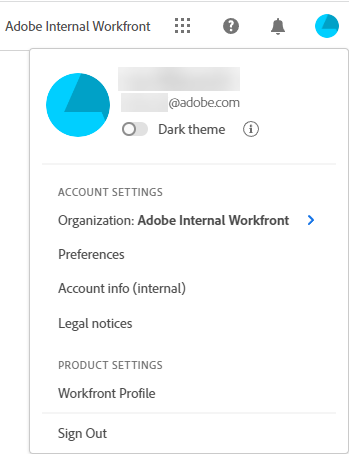

# [!DNL Workfront]에 대한 [!DNL Adobe Unified Experience]

<!--Audited: 10/2024-->

[!DNL Workfront]을(를) 통해 [!DNL Adobe Experience Cloud]에 액세스하면 모든 [!DNL Adobe] 응용 프로그램을 관리할 수 있는 원활하고 통합된 환경을 얻을 수 있습니다. 단일 ID 관리를 사용하면 여러 URL이나 로그인 ID 없이 한 곳에서 로그인할 수 있습니다.

조직이 Adobe 통합 환경에 있는 경우 Workfront에 액세스하는 데 사용하는 URL은 `experience.adobe.com`(으)로 시작합니다.

| URL | Adobe 경험 |
|------------|------------|
| (CompanyName).my.workfront.com | Workfront 경험 |
| experience.adobe.com | Adobe 통합 경험 |

## 액세스 요구 사항

+++ 을 확장하여 이 문서의 기능에 대한 액세스 요구 사항을 봅니다. 

이 문서의 단계를 수행하려면 다음 액세스 권한이 있어야 합니다.

<table style="table-layout:auto"> 
 <col> 
 <col> 
 <tbody> 
  <tr> 
   <td role="rowheader"><strong>[!DNL Adobe Workfront] 플랜*</strong></td> 
   <td> 
임의
 </td> 
  </tr> 
  <tr> 
   <td role="rowheader"><strong>[!DNL Adobe Workfront] 라이센스*</strong></td> 
   <td> 
새로운 기능: [!UICONTROL Contributor] 이상
 
   
현재: [!UICONTROL Request] 이상
 </td> 
  </tr> 
 </tbody> 
</table>

*자세한 내용은 [Workfront 설명서의 액세스 요구 사항](/help/quicksilver/administration-and-setup/add-users/access-levels-and-object-permissions/access-level-requirements-in-documentation.md)을 참조하십시오.

+++

## 전제 조건

조직의 [!DNL Workfront] 인스턴스는 [!DNL Adobe Business Platform] 또는 [!DNL Adobe Admin Console]에 온보딩되어야 합니다.

[!DNL Adobe Admin Console] 온보딩에 대한 질문이 있는 경우 [[!DNL Adobe Unified Experience] FAQ](/help/quicksilver/workfront-basics/navigate-workfront/workfront-navigation/unified-experience-faq.md/)를 참조하세요.

## Adobe Identity Management 시스템(IMS)

이제 Adobe 통합 경험으로의 이동의 일환으로 조직은 Adobe Identity Management 시스템을 사용하여 사용자를 인증합니다. 즉, Workfront에 직접 로그인하지 않고 Adobe을 통해 Workfront에 로그인합니다. 또한 Adobe IMS를 사용하려면 Workfront 관리자가 Workfront이 아닌 Adobe Admin Console에서 사용자 관리를 처리해야 합니다.

Adobe 통합 환경의 Workfront에 로그인하는 방법에 대한 자세한 내용은 이 문서의 [Adobe Experience Cloud에 로그인](#log-in-to-adobe-experience-cloud)을 참조하십시오.

Adobe Admin Console의 사용자 관리에 대한 자세한 내용은 문서 [Adobe Admin Console의 사용자 관리](/help/quicksilver/administration-and-setup/add-users/create-and-manage-users/admin-console.md)를 참조하십시오.

## [!DNL Adobe Experience Cloud]에 로그인합니다.

1. 브라우저 창을 열고 <https://experience.adobe.com>(으)로 이동합니다.
1. [!UICONTROL **로그인**] 화면에서 전자 메일 주소를 입력하고 **[!UICONTROL 계속]**&#x200B;을 클릭합니다.

   ![에 [!DNL Adobe Experience Cloud]](assets/aec-login-page.png)로그인

>[!NOTE]
>
>Workfront이 열려 있는 페이지에서 브라우저 탭 세션이 만료되고 다른 브라우저 탭에 활성 Workfront 세션이 있는 경우 만료된 탭을 다시 로드하여 Workfront 페이지를 다시 열 수 있습니다.

## [!DNL Workfront] 액세스

[!DNL Adobe Experience Cloud]에 로그인하면 상단 탐색 영역에서 조직 전환기를 클릭하여 액세스할 수 있는 [!DNL Workfront] 조직 및 환경을 모두 볼 수 있습니다. 작업할 [!DNL Workfront] 조직 또는 환경을 선택하십시오. 조직에서 사용하는 환경에는 [!UICONTROL 미리 보기] 및 [!UICONTROL 샌드박스]가 포함될 수 있습니다.

![조직 및 환경 [!DNL Workfront]개 보기](assets/aec-view-all-orgs.png)

>[!NOTE]
>
>[!DNL Adobe Experience Cloud]에 처음 로그인하면 조직의 기본값이 알파벳 목록의 첫 번째로 설정됩니다. 다음에 로그인할 때 조직은 기본적으로 사용자가 마지막으로 방문한 조직으로 설정됩니다.

액세스 권한이 있는 [!DNL Workfront] 제품 목록에 [!DNL Adobe Experience Cloud]이(가) 나타납니다. [!DNL Workfront] 홈 페이지의 빠른 액세스 메뉴에서 [!DNL Experience Cloud]을(를) 선택하거나 제품 전환기 를 사용하여 언제든지 응용 프로그램을 변경할 수 있습니다.

![응용 프로그램에 액세스하려면 [!DNL Workfront]을(를) 선택하십시오](assets/aec-product-switcher.png)

## [!DNL Workfront] 탐색

[!UICONTROL &#x200B; 탐색 모음 왼쪽의 &#x200B;]기본 메뉴기본 메뉴 아이콘[!DNL Workfront]을 사용하여 액세스 권한이 있는 페이지로 이동합니다. [!UICONTROL 주 메뉴]에서 사용할 수 있는 옵션은 다음에 따라 다릅니다.

* **레이아웃 템플릿 구성**: [!DNL Workfront] 관리자가 레이아웃 템플릿에서 [!UICONTROL 주 메뉴]를 수정하는 방법에 대해 알아보려면 [레이아웃 템플릿을 사용하여 [!UICONTROL 주 메뉴] 사용자 지정](/help/quicksilver/administration-and-setup/customize-workfront/use-layout-templates/customize-main-menu.md)을 참조하세요.
* **라이선스 유형**: 다른 라이선스 유형에 대한 기본 구성에 대해 알아보려면 [[!UICONTROL 검토] 라이선스 사용자의 탐색 이해](/help/quicksilver/workfront-basics/navigate-workfront/workfront-navigation/reviewer-global-navigation-bar.md) 또는 [[!UICONTROL 작업] 라이선스 사용자의 탐색 이해](/help/quicksilver/workfront-basics/navigate-workfront/workfront-navigation/worker-global-navigation-bar.md)를 참조하십시오.

## 프로필 및 환경 설정 액세스

상단 탐색 영역에서 Adobe 계정 메뉴(프로필 사진)를 클릭하여 프로필 및 환경 설정 옵션에 액세스할 수 있습니다.

이 메뉴를 사용하여 다음을 수행할 수 있습니다.

* **[!UICONTROL 에 대해]**&#x200B;어두운 테마[!DNL Adobe Experience Cloud] 서식을 선택하세요.
* 기본 및 보조 언어 기본 설정을 포함하여 **[!UICONTROL 에 대해]**&#x200B;기본 설정[!DNL Adobe Experience Cloud]을 설정합니다.
* **[!UICONTROL [!DNL Workfront]프로필에 액세스]**. 프로필에 등록된 후에는 **[!UICONTROL 기타]** 메뉴 를 클릭하고 **[!UICONTROL 편집]**&#x200B;을 선택합니다. 프로필에 대한 자세한 내용은 [내 설정 구성](/help/quicksilver/workfront-basics/manage-your-account-and-profile/configuring-your-user-profile/configure-my-settings.md)을 참조하십시오.
* Adobe Experience Cloud **[!UICONTROL 로그아웃]**

## 암호 관리

>[!NOTE]
>
>암호를 변경하면 모든 [!DNL Adobe Experience Cloud] 응용 프로그램에 대해 암호가 변경됩니다.

암호가 [!DNL Workfront]에서 관리되지 않습니다.

조직에서 암호를 관리하기 위해 별도의 애플리케이션을 사용하는 경우 해당 공급자를 통해 암호를 변경합니다.

[!DNL Adobe]에서 암호를 관리하는 경우 Adobe 계정에서 암호를 변경할 수 있습니다.

[Adobe 암호를 변경하려면 이 문서를 참조하십시오.](https://helpx.adobe.com/kr/manage-account/using/change-or-reset-password.html){target="_blank"}

암호 변경에 대한 자세한 내용은 관리자에게 문의하십시오.

