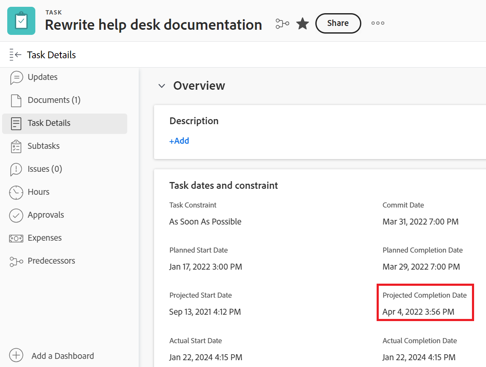

# [!DNL Workfront]의 프로젝트, 작업 및 문제 날짜 개요

<!-- Audited: 05/2024 -->

<!--consider expanding on this article with ALL dates for PTIs - Hand off dates, Approval Dates, etc-->

<!-- there are dates below that need definition - ask Product-->

이 문서에서는 [!DNL Adobe Workfront]의 프로젝트, 작업 및 문제와 관련된 가장 일반적인 날짜에 대한 정의를 제공합니다. 여기에 포함된 이미지는 Workfront에서 날짜가 표시되고 완전하지 않은 위치에 대한 예입니다. 날짜를 표시하는 다른 영역도 있습니다. 모든 날짜는 프로젝트, 작업 및 문제 보고서와 목록에도 표시됩니다.

보고서 및 목록에 대한 자세한 내용은 다음 문서를 참조하십시오.

* [ [!DNL Adobe Workfront]의 목록 시작](../../../workfront-basics/navigate-workfront/use-lists/view-items-in-a-list.md)
* [보고서 시작](../../../reports-and-dashboards/reports/reporting/get-started-reports-workfront.md)

프로젝트, 작업 및 문제 필드에 대한 자세한 내용은 [용어집 [!DNL Adobe Workfront] 용어](../../../workfront-basics/navigate-workfront/workfront-navigation/workfront-terminology-glossary.md)을 참조하세요.

## [!UICONTROL 실제 시작 일자]

[!UICONTROL 실제 시작 날짜]는 사용자가 프로젝트, 작업 또는 문제에 대해 실제로 작업을 시작하는 날짜입니다. 프로젝트, 작업 또는 문제를 만들 때 [!UICONTROL 실제 시작 일자]가 비어 있습니다.

작업 또는 문제에 대한 작업이 시작된 시기를 수동으로 나타내거나 작업 또는 문제 상태가 [!UICONTROL 신규]에서 [!UICONTROL 진행 중] 또는 [!UICONTROL 완료] (으)로 변경될 때 [!UICONTROL 실제 시작 날짜]가 자동으로 채워집니다. 프로젝트의 [!UICONTROL 실제 시작 날짜]가 프로젝트의 첫 번째 작업이 시작되는 날짜와 일치합니다.

>[!TIP]
>
>사용자가 작업을 계획된 날짜보다 늦거나 먼저 시작할 수 있으므로 [!UICONTROL 실제 시작 날짜]가 프로젝트, 작업 또는 문제의 [!UICONTROL 계획된 시작 날짜]와(과) 일치하지 않을 수 있습니다.

자세한 내용은 [프로젝트 개요 [!UICONTROL 실제 시작 날짜]](../../../manage-work/projects/planning-a-project/project-actual-start-date.md)를 참조하십시오.

>[!NOTE]
>
>[!UICONTROL Must Start On] 작업 또는 고정 날짜 제약 조건은 [!UICONTROL 실제 시작 일자]가 아닌 작업의 [!UICONTROL 계획된 시작 일자]에 영향을 줍니다. [!UICONTROL 계획된 시작 일자]를 지정한 일자로 업데이트합니다. 위에서 설명한 대로 [!UICONTROL 실제 시작 일자]는 [!UICONTROL 계획된 시작 일자]와(과) 별도로 업데이트됩니다.

## [!UICONTROL 실제 완료 일자]

[!UICONTROL 실제 완료 날짜]는 사용자가 프로젝트, 작업 또는 문제를 실제로 완료하는 날짜입니다. 프로젝트, 작업 또는 문제를 만들 때 [!UICONTROL 실제 완료 일자]가 비어 있습니다.

작업 또는 문제에 대한 작업이 완료되는 시기를 수동으로 나타내거나, 다음 중 하나가 발생하면 [!UICONTROL 실제 완료 일자]가 자동으로 채워집니다.

* 프로젝트, 작업 또는 문제 상태가 [!UICONTROL 완료], [!UICONTROL 마감됨] 또는 [!UICONTROL 해결됨] (으)로 변경됩니다.
* 작업 또는 프로젝트 완료율은 100%입니다.

프로젝트의 [!UICONTROL 실제 완료 날짜]가 프로젝트에서 마지막 작업을 완료한 날짜와 일치합니다.

>[!TIP]
>
>[!UICONTROL 실제 완료 일자]가 [!UICONTROL 계획된 완료 일자]와(과) 일치하지 않을 수 있습니다.

자세한 내용은 [프로젝트 개요 [!UICONTROL 실제 완료 날짜]](../../../manage-work/projects/planning-a-project/project-actual-completion-date.md)를 참조하십시오.

## 승인 경로 완료 일자

승인 경로 완료 일자는 프로젝트, 작업 또는 문제의 승인이 승인되고 항목의 상태가 변경된 일자입니다.

승인 경로 완료 날짜가 프로젝트, 작업, 문제 목록 및 보고서에 표시됩니다.

## 승인 경로 시작 일자

승인 경로 시작 일자는 프로젝트, 작업 또는 문제 상태가 &quot;승인 보류 중&quot;으로 변경되고 프로젝트 승인 요청이 승인자에게 전송된 날짜입니다.

승인 경로 시작 날짜가 프로젝트, 작업, 문제 목록 및 보고서에 표시됩니다.

<!--## Auto Closure Date -->

## 예산 완료 일자

프로젝트에서 더 이상 사용되지 않는 필드입니다. 이 필드에 목록이나 보고서에 표시될 수 있는 모든 정보는 Workfront에서 제거한 기능과 관련이 있습니다. 이 필드는 업데이트할 수 없습니다.

필드는 프로젝트 보고서 및 목록에 표시됩니다.

## 예산 시작 일자

프로젝트에서 더 이상 사용되지 않는 필드입니다. 이 필드에 표시될 수 있는 모든 정보는 Workfront에서 제거한 기능과 관련이 있습니다. 이 필드는 업데이트할 수 없습니다.

필드는 프로젝트 보고서 및 목록에 표시됩니다.

## [!UICONTROL 커밋 일자]

[!UICONTROL 커밋 일자]는 작업 또는 문제에 할당된 사용자가 작업 또는 문제를 완료하기로 커밋하는 일자입니다. [!UICONTROL 계획된 완료 일자]와(과) 다릅니다. 이는 작업을 담당하는 사용자만 제공한 완료 일자에 대한 보다 현실적인 추정치이기 때문입니다. 자세한 내용은 [[!UICONTROL 커밋 일자] 개요](../../../manage-work/projects/updating-work-in-a-project/overview-of-commit-dates.md)를 참조하십시오.

>[!NOTE]
>
>[!UICONTROL 커밋 일자]를 변경하면 [!UICONTROL 예상 완료 일자]에 영향을 주지만 작업 또는 문제의 [!UICONTROL 계획된 완료 일자]에는 영향을 주지 않습니다. 프로젝트 관리자는 [!UICONTROL 커밋 일자]에 피할당자가 변경한 내용을 사용하여 작업 또는 문제의 [!UICONTROL 계획된 완료 일자]를 업데이트할 수 있습니다.

<!--## Completion Pending Date-->

## 제한 일자

특정 날짜에 연결된 작업 제한을 사용하는 경우 해당 특정 날짜가 작업의 제한 날짜가 됩니다.

다음 태스크 제한은 제한조건 일자 필드를 갱신합니다.

* 일자에 시작
* 다음까지 완료
* 다음 이전에 시작
* 다음 이후에 시작

>[!TIP]
>
>고정 일자 제한이 있는 작업에는 제한 일자가 없습니다.
>

제한 일자는 작업 목록 또는 보고서에 표시됩니다.

## 전환된 문제 입력 일자

프로젝트 또는 작업으로 전환된 문제가 생성된 날짜입니다.

전환된 문제 입력 날짜가 프로젝트 및 작업 목록과 보고서에 표시됩니다.

## 기한

작업 또는 문제가 완료될 예정일. 작업 또는 문제의 기한은 계획된 완료 일자와 동일한 날짜입니다.

작업 및 문제 기한은 작업 및 문제 목록과 보고서에 표시됩니다.

자세한 내용은 이 문서의 [계획된 완료 일자](#planned-completion-date) 섹션을 참조하십시오.

## 마감 일자

프로젝트 완료 예정일. 프로젝트의 기한 일자는 프로젝트의 계획된 완료 일자와 동일한 일자입니다.

프로젝트 기한 일자는 프로젝트 목록 및 보고서에 표시됩니다.

자세한 내용은 이 문서의 [계획된 완료 일자](#planned-completion-date) 섹션을 참조하십시오.

## [!UICONTROL 시작 날짜]

[!UICONTROL 시작 날짜]은(는) [!DNL Workfront]에 프로젝트, 작업 또는 문제를 만든 날짜입니다.

[!UICONTROL 시작 날짜]은(는) 프로젝트, 작업 또는 문제의 타임라인에 영향을 주지 않지만 추적 및 보고에는 중요합니다. 개체를 만들 때 [!DNL Workfront]에서 [!UICONTROL 시작 날짜]를 자동으로 생성하므로 개체를 수동으로 편집할 수 없습니다.

## 예상 기한

작업 및 프로젝트 예상 기한 날짜는 프로젝트 또는 작업이 완료되어야 하는 보다 현실적인 날짜를 보여줍니다.

추정 날짜는 프로젝트나 작업의 실제 완료에 영향을 미치는 것을 고려하므로 프로젝트와 작업의 현실과 더 일치한다. 예상 납기 일자는 예상 완료 일자와 유사합니다.

자세한 내용은 [예상 및 예상 날짜 개요](/help/quicksilver/manage-work/tasks/task-information/differentiate-projected-estimated-dates.md)를 참조하십시오.

프로젝트 및 작업 예상 기한 일자는 프로젝트 및 작업 목록과 보고서에 표시됩니다.

## 예상 시작 일자

작업 및 프로젝트 예상 시작 일자는 프로젝트 또는 작업이 시작될 수 있는 보다 현실적인 일자를 보여줍니다.

추정 날짜는 프로젝트나 작업의 실제 시작에 영향을 미치는 사항을 고려하므로 프로젝트와 작업의 현실과 더 일치한다. 예상 시작 일자는 예상 시작 일자와 유사합니다.

자세한 내용은 [예상 및 예상 날짜 개요](/help/quicksilver/manage-work/tasks/task-information/differentiate-projected-estimated-dates.md)를 참조하십시오.

프로젝트 및 작업 예상 시작 일자는 프로젝트 및 작업 목록과 보고서에 표시됩니다.

<!--## Exchange Rate Date-->

## 고정 종료 일자

프로젝트 요청자 또는 소유자는 비즈니스 사례를 완료할 때 프로젝트의 고정 종료 날짜를 식별합니다. 프로젝트가 완료되어야 한다고 권장하는 날짜입니다.

이는 수동 추정 작업이며 프로젝트에 대한 작업의 실제 진행 상황을 고려하지 않습니다.

프로젝트의 고정 종료 날짜는 프로젝트의 비즈니스 사례 섹션과 프로젝트 목록 및 보고서에 표시됩니다.

## 고정 시작 일자

프로젝트 요청자 또는 소유자는 비즈니스 사례를 완료할 때 프로젝트의 고정 시작 일자를 식별합니다. 이 날짜는 프로젝트가 시작되어야 한다고 권장하는 날짜입니다.

이는 수동 추정 작업이며 프로젝트에 대한 작업의 실제 진행 상황을 고려하지 않습니다.

프로젝트의 고정 시작 일자는 프로젝트의 비즈니스 사례 섹션과 프로젝트 목록 및 보고서에 표시됩니다.

## 핸드오프 일자

작업을 작업에 사용할 수 있게 되는 날짜입니다. 즉, 모든 제한, 승인 및 종속성이 완료되었으며 사용자가 작업 작업을 시작할 수 있습니다.

제출 날짜는 계산이며 수동으로 설정할 수 없습니다.

전달 날짜에 대한 자세한 내용은 [작업 전달 날짜 개요](/help/quicksilver/manage-work/tasks/task-information/handoff-task-date.md)를 참조하십시오.

작업의 전달 날짜는 작업 목록 및 보고서에 표시됩니다.

## 마지막 재무 업데이트 일자

프로젝트의 재무 정보가 업데이트된 날짜. 여기에는 프로젝트의 재무 섹션 또는 비즈니스 사례 섹션의 재무 필드 업데이트가 포함됩니다.

마지막 재무 업데이트 날짜가 프로젝트 목록 및 보고서에 표시됩니다.

## 마지막 업데이트 날짜

프로젝트, 작업 또는 문제가 마지막으로 업데이트된 날짜입니다. 업데이트는 저장할 프로젝트, 작업 또는 문제를 트리거하는 모든 변경 사항으로 간주됩니다. 여기에는 상태, 상태, 타임라인, 재무 또는 기타 필드의 변경 사항이 포함됩니다.

마지막 업데이트 날짜는 프로젝트, 작업, 문제 목록 및 보고서에 표시됩니다.

## [!UICONTROL 시간 입력 날짜]

프로젝트, 작업 및 문제에 대한 시간을 로그하여 프로젝트, 작업 또는 문제에 대한 실제 작업 시간(시간)을 표시하면 로그하는 시간이 프로젝트, 작업 또는 문제의 [!UICONTROL 실제 시간]이 됩니다.

시간을 기록한 날짜는 시간 항목의 [!UICONTROL 시간 항목 날짜] 필드입니다.

시간 입력 일자는 시간 목록 및 보고서에 표시됩니다.

>[!TIP]
>
>한 시간의 [!UICONTROL 시작 날짜]은(는) 시간 로그가 만들어진 날짜가 아니라 시간을 연결할 날짜라는 점에서 다른 Workfront 개체의 [!UICONTROL 시작 날짜]과(와) 다릅니다.
>
>예를 들어, 9월 5일에 작업에 대한 시간을 기록하지만 9월 1일과 시간을 연결할 수 있습니다. 해당 시간의 입력 일자는 9월 1일입니다.

Workfront에서 시간을 기록하는 방법에 대한 자세한 내용은 [시간 기록](../../../timesheets/create-and-manage-timesheets/log-time.md)을 참조하세요.

>[!TIP]
>
>상위 작업 또는 프로젝트보다 작업 작업 및 문제에 시간을 기록하는 것이 좋습니다. 작업 작업에 기록된 시간이 상위 작업 및 프로젝트에 대해 [!UICONTROL 실제 시간] (으)로 롤업됩니다. 로그온된 시간 문제는 프로젝트에 대해 [!UICONTROL 실제 시간] (으)로 롤업됩니다.

## [!UICONTROL 계획된 완료 일자]

[!UICONTROL 계획된 완료 일자] 또는 [!UICONTROL 기한]은(는) 프로젝트, 작업 또는 문제를 완료할 계획인 날짜입니다.

[!UICONTROL 작업 제한 사항]에 따라 작업의 [!UICONTROL 계획된 완료 일자]를 편집할 수 없습니다. 프로젝트의 [!UICONTROL 일정 모드]에 따라 프로젝트의 [!UICONTROL 계획된 완료 일자]를 편집하지 못할 수 있습니다.

[!UICONTROL 계획된 완료 일자]가 [!DNL Workfront]의 일부 영역에 기한 일자로 표시됩니다.

자세한 내용은 다음 문서를 참조하십시오.

* [작업 개요 [!UICONTROL 계획된 완료 일자]](../../../manage-work/tasks/task-information/task-planned-completion-date.md)
* [프로젝트 [!UICONTROL 계획된 완료 일자] 설정](../../../manage-work/projects/planning-a-project/project-planned-completion-date.md)
* [문제 개요 [!UICONTROL 계획된 완료 일자]](../../../manage-work/issues/issue-information/issue-planned-completion-date.md)

## 계획된 일자 정렬

Workfront에서 항목이 계획된 완료 일자와 관련하여 완료될 때 표시할 프로젝트, 작업 및 문제를 지정하는 자동 표시기입니다.

다음은 계획된 일자 정렬 표시기에 가능한 값입니다.

* 계획된 완료 일자에 완료될 예정입니다.
* 계획된 완료 일자 이전에 완료될 예정입니다.
* 계획된 완료 일자 이후에 완료될 예정입니다.

계획된 일자 정렬은 프로젝트, 작업, 문제 목록 및 보고서에 표시됩니다.

## [!UICONTROL 계획된 시작 일자]

[!UICONTROL 계획된 시작 일자]는 프로젝트, 작업 또는 문제가 시작될 계획인 날짜입니다.

[!UICONTROL 작업 제한 사항]에 따라 작업의 [!UICONTROL 계획된 시작 일자]를 편집할 수 없습니다. 프로젝트의 [!UICONTROL 일정 모드]에 따라 프로젝트의 [!UICONTROL 계획된 시작 일자]를 편집하지 못할 수 있습니다.

자세한 내용은 [프로젝트 개요 [!UICONTROL 계획된 시작 일자]](../../../manage-work/projects/planning-a-project/project-planned-start-date.md)를 참조하십시오.

## [!UICONTROL 예상 완료 일자]

[!UICONTROL 예상 완료 일자]는 프로젝트, 작업 또는 문제가 완료되는 시기를 나타내는 실시간 계산된 표시기입니다. 프로젝트, 작업 또는 문제가 완료됨으로 표시되면 [!UICONTROL 예상 완료 일자]가 [!UICONTROL 실제 완료 일자]의 일자로 변경됩니다.

모든 것이 순조롭게 계획대로 진행될 경우 [!UICONTROL 예상 완료 일자]는 [!UICONTROL 계획된 완료 일자]와(과) 일치해야 합니다. 그렇지 않으면 전임 작업 지연으로 인해 [!UICONTROL 예상 완료 일자]가 [!UICONTROL 계획된 완료 일자]와(과) 다를 수 있습니다.

자세한 내용은 [프로젝트, 작업 및 문제에 대한 [!UICONTROL 예상 완료 일자]의 개요](../../../manage-work/projects/planning-a-project/project-projected-completion-date.md)를 참조하십시오.

## [!UICONTROL 예상 시작 일자]

[!UICONTROL 예상 시작 날짜]는 프로젝트, 작업 또는 문제가 시작되는 실시간 날짜이며 모든 지연을 고려합니다. [!UICONTROL 계획된 시작 일자]보다 프로젝트, 작업 또는 문제의 정확한 시작 일자입니다. [!UICONTROL 계획된 시작 일자]는 지연 또는 지난 일자를 고려하지 않습니다.

프로젝트를 처음 계획할 때 작업과 프로젝트의 [!UICONTROL 계획된 시작 일자]와(과) [!UICONTROL 예상 시작 일자]가 동일합니다. 지연이 발생하거나 작업이 더 일찍 완료될 수 있으므로 [!UICONTROL 예상 시작 일자]가 [!UICONTROL 계획된 시작 일자]와(과) 다를 수 있습니다.

작업의 경우 전임 작업 중 하나가 예정보다 늦어지고 있을 때 [!UICONTROL 예상 시작 일자]가 [!UICONTROL 계획된 시작 일자]와(과) 다를 수 있습니다.

>[!TIP]
>
>목록이나 보고서에서만 문제의 [!UICONTROL 예상 시작 일자]를 볼 수 있습니다.

자세한 내용은 [프로젝트 개요 [!UICONTROL 예상 시작 날짜]](../../../manage-work/projects/planning-a-project/project-projected-start-date.md)를 참조하십시오.

<!--## Rejection Date-->

## 여유 일자

작업이 프로젝트 완료 날짜에 영향을 주지 않고 늦게 시작되거나 완료되는 경우가 있습니다.

Slack 날짜에는 작업이 프로젝트의 완료 날짜에 영향을 줄 수 있는 정확한 날짜가 표시됩니다.

작업의 Slack 날짜에 대한 자세한 내용은 [작업 Slack 날짜 개요](/help/quicksilver/manage-work/tasks/task-information/task-slack-date.md)를 참조하십시오.

작업 Slack 날짜는 작업 목록 및 보고서에 표시됩니다.

## 시작 일자

프로젝트가 시작될 계획인 날짜입니다. 프로젝트의 시작 일자는 프로젝트의 계획된 시작 일자와 동일한 일자입니다.

이 필드는 프로젝트 목록 및 보고서에 표시됩니다.

자세한 내용은 이 문서의 [계획된 시작 일자](#planned-start-date) 섹션을 참조하십시오.

