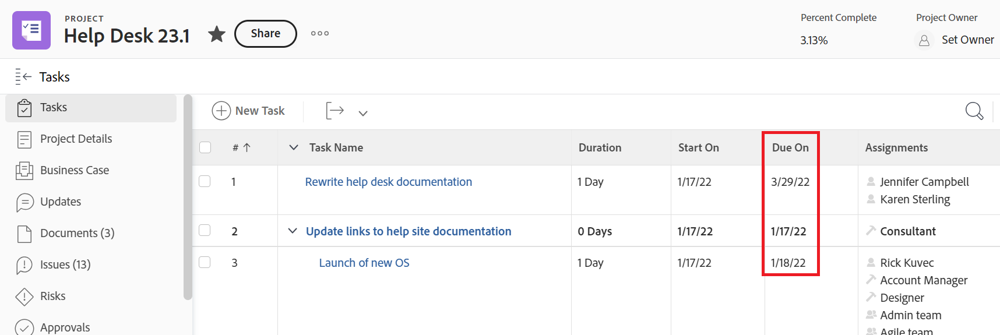
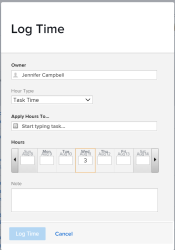

# 의 프로젝트, 작업 및 발행 날짜 개요 [!DNL Adobe Workfront]

<!--

(NOTE: consider expanding on this article with ALL dates for PTIs - Hand off dates, Approval Dates, etc) 

-->

이 문서에서는 의 프로젝트, 작업 및 문제와 관련된 가장 일반적인 날짜에 대한 정의를 제공합니다 [!DNL Adobe Workfront]. 여기에 포함된 이미지는 Workfront에서 날짜가 표시되는 곳의 예입니다. 날짜를 표시하는 다른 영역이 있습니다. 모든 날짜는 프로젝트, 작업, 문제 보고서 및 목록에도 표시됩니다.

보고서 및 목록에 대한 자세한 내용은 다음 문서를 참조하십시오.

* [에서 목록 시작 [!DNL Adobe Workfront]](../../../workfront-basics/navigate-workfront/use-lists/view-items-in-a-list.md)
* [에서 보고서 시작 [!DNL Adobe Workfront]](../../../reports-and-dashboards/reports/reporting/get-started-reports-workfront.md)

프로젝트, 작업 및 문제 필드에 대한 자세한 내용은 [용어 설명 [!DNL Adobe Workfront] 용어](../../../workfront-basics/navigate-workfront/workfront-navigation/workfront-terminology-glossary.md).

## [!UICONTROL 계획된 시작 일자]

다음 [!UICONTROL 계획 시작 날짜] 프로젝트, 작업 또는 문제가 시작되도록 계획된 날짜입니다.

에 따라 [!UICONTROL 작업 제한]를 편집하지 못할 수 있습니다 [!UICONTROL 계획 시작 날짜] 작업 에 따라 [!UICONTROL 예약 모드] 프로젝트의 [!UICONTROL 계획 시작 날짜] Analytics Mobile Apps 또는 Analytics Premium이 있어야 합니다.

자세한 내용은 [프로젝트 개요 [!UICONTROL 계획 시작 날짜]](../../../manage-work/projects/planning-a-project/project-planned-start-date.md).

## [!UICONTROL 계획된 완료 일자]

다음 [!UICONTROL 계획 완료 일자] 또는 [!UICONTROL 기한] 날짜는 프로젝트, 작업 또는 문제가 완료되도록 계획된 날짜입니다.

에 따라 [!UICONTROL 작업 제한]를 편집하지 못할 수 있습니다 [!UICONTROL 계획 완료 일자] 작업 에 따라 [!UICONTROL 예약 모드] 프로젝트의 [!UICONTROL 계획 완료 일자] Analytics Mobile Apps 또는 Analytics Premium이 있어야 합니다.

다음 [!UICONTROL 계획 완료 일자] 는 다음 중 일부 영역에서 만기 시작 일자로 표시됩니다 [!DNL Workfront].

자세한 내용은 다음 문서를 참조하십시오.

* [작업 개요 [!UICONTROL 계획 완료 일자]](../../../manage-work/tasks/task-information/task-planned-completion-date.md)
* [프로젝트 설정 [!UICONTROL 계획 완료 일자]](../../../manage-work/projects/planning-a-project/project-planned-completion-date.md)
* [문제 개요 [!UICONTROL 계획 완료 일자]](../../../manage-work/issues/issue-information/issue-planned-completion-date.md)

## [!UICONTROL 시작 날짜]

다음 [!UICONTROL 시작 날짜] Workfront에서 프로젝트, 작업 또는 문제가 만들어진 날짜입니다.

다음 [!UICONTROL 시작 날짜] 는 프로젝트, 작업 또는 문제의 타임라인에 영향을 주지 않지만 추적 및 보고 목적으로 중요합니다. [!DNL Workfront] 자동으로 생성 [!UICONTROL 시작 날짜] 개체를 만들 때 수동으로 편집할 수 없습니다.

## [!UICONTROL 실제 시작 일자]

다음 [!UICONTROL 실제 시작 날짜] 사용자가 프로젝트, 작업 또는 문제에 대해 실제로 작업을 시작하는 날짜입니다. 다음 [!UICONTROL 실제 시작 날짜] 프로젝트, 작업 또는 문제가 만들어지면 비어 있습니다.

작업, 문제 또는 작업에서 작업을 시작한 시기를 수동으로 표시할 수 있습니다 [!UICONTROL 실제 시작 날짜] 작업 또는 문제 상태가 [!UICONTROL 새로 만들기] to [!UICONTROL 진행 중] 또는 [!UICONTROL 완료]. 다음 [!UICONTROL 실제 시작 날짜] 프로젝트의 첫 번째 작업이 시작되는 날짜와 시간이 동일합니다.

>[!TIP]
>
>다음 [!UICONTROL 실제 시작 날짜] 일치하지 않을 수 있음 [!UICONTROL 계획 시작 날짜] 사용자가 계획된 날짜 이상 또는 그 이전 버전의 작업을 시작할 수 있기 때문에 프로젝트, 작업 또는 문제 중 하나입니다.

자세한 내용은 [프로젝트 개요 [!UICONTROL 실제 시작 날짜]](../../../manage-work/projects/planning-a-project/project-actual-start-date.md).

>[!NOTE]
>
>다음 [!UICONTROL 시작 시기] 작업 또는 고정 날짜 제약 조건이 [!UICONTROL 계획 시작 날짜] 작업, 즉 [!UICONTROL 실제 시작 날짜]. 이 업데이트는 [!UICONTROL 계획 시작 날짜] 지정한 날짜까지. 다음 [!UICONTROL 실제 시작 날짜] 은(는) [!UICONTROL 계획 시작 날짜]위에 설명된 대로,

## [!UICONTROL 실제 완료 일자]

다음 [!UICONTROL 실제 완료 날짜] 은 사용자가 실제로 프로젝트, 작업 또는 문제를 완료한 날짜입니다. 다음 [!UICONTROL 실제 완료 날짜] 프로젝트, 작업 또는 문제가 만들어지면 비어 있습니다.

작업 또는 문제에 대해 작업이 완료되는 시점을 수동으로 표시하거나 [!UICONTROL 실제 완료 날짜] 다음 중 하나가 발생하면 자동으로 채워집니다.

* 프로젝트, 작업 또는 문제 상태가 [!UICONTROL 완료], [!UICONTROL 닫힘], 또는 [!UICONTROL 해결됨].
* 작업 또는 프로젝트 완료율이 100%입니다.

다음 [!UICONTROL 실제 완료 날짜] 프로젝트의 첫 번째 작업이 완료된 날짜와 시간이 동일합니다.

>[!TIP]
>
>다음 [!UICONTROL 실제 완료 날짜] 일치하지 않을 수 있음 [!UICONTROL 계획 완료 일자].

자세한 내용은 [프로젝트 개요 [!UICONTROL 실제 완료 날짜]](../../../manage-work/projects/planning-a-project/project-actual-completion-date.md).

## [!UICONTROL 커밋 일자]

다음 [!UICONTROL 커밋 날짜] 작업 또는 문제에 지정된 사용자가 작업 또는 문제를 완료하기 위해 커밋하는 날짜입니다. 이는 와 다릅니다 [!UICONTROL 계획 완료 일자]를 설정하는 것이 좋습니다. 작업을 담당하는 사용자만 제공하는 완료 날짜에 대한 보다 현실적인 평가입니다. 자세한 내용은 [[!UICONTROL 커밋 날짜] 개요](../../../manage-work/projects/updating-work-in-a-project/overview-of-commit-dates.md).

>[!NOTE]
>
>변경 [!UICONTROL 커밋 날짜] 은 [!UICONTROL 예상 완료 일자] 하지만 [!UICONTROL 계획 완료 일자] 작업 또는 문제 프로젝트 관리자는 할당자가 변경한 내용을 [!UICONTROL 커밋 날짜] 를 업데이트하려면 [!UICONTROL 계획 완료 일자] 작업 또는 문제

## [!UICONTROL 예상 시작 일자]

다음 [!UICONTROL 예상 시작 날짜] 는 프로젝트, 작업 또는 문제가 발생한 실시간 날짜이며 모든 지연을 고려합니다. 프로젝트, 작업 또는 문제에 대한 시작 날짜가 [!UICONTROL 계획 시작 날짜]. 다음 [!UICONTROL 계획 시작 날짜] 지연 또는 과거 날짜는 고려하지 않습니다.

프로젝트를 처음 계획하면 [!UICONTROL 계획 시작 날짜] 그리고 [!UICONTROL 예상 시작 날짜] 작업 및 프로젝트의 작업은 동일합니다. 지연이 발생하거나 작업이 이전에 완료될 수 있으므로 [!UICONTROL 예상 시작 날짜] 과 다를 수 있음 [!UICONTROL 계획 시작 날짜].

작업의 경우 [!UICONTROL 예상 시작 날짜] 또한 다음과 다른 [!UICONTROL 계획 시작 날짜] 전임 정권들 중 한 명이 예정보다 뒤처질 때.

>[!TIP]
>
>을 볼 수 있습니다 [!UICONTROL 예상 시작 날짜] 목록이나 보고서에서만 문제가 발생합니다.

자세한 내용은 [프로젝트 개요 [!UICONTROL 예상 시작 날짜]](../../../manage-work/projects/planning-a-project/project-projected-start-date.md).

## P[!UICONTROL 반송 완료 날짜]

다음 [!UICONTROL 예상 완료 일자] 는 프로젝트, 작업 또는 문제가 완료되는 시점을 나타내는 실시간 계산된 지표입니다. 프로젝트, 작업 또는 문제가 완료됨으로 표시되면 [!UICONTROL 예상 완료 일자] 날짜로 변경 [!UICONTROL 실제 완료 날짜].

모든 것이 순조롭게 진행된다면 [!UICONTROL 예상 완료 일자] 와 일치해야 함 [!UICONTROL 계획 완료 일자]. 그렇지 않으면 이전 작업의 지연 때문에 [!UICONTROL 예상 완료 일자] 와(과) 다를 수 있습니다 [!UICONTROL 계획 완료 일자].

자세한 내용은 [개요 [!UICONTROL 예상 완료 일자] 프로젝트, 작업 및 문제](../../../manage-work/projects/planning-a-project/project-projected-completion-date.md).

## [!UICONTROL 시간 입력 날짜]

프로젝트, 작업 및 문제에 대해 로그하여 프로젝트, 작업 또는 문제 해결에 소요되는 실제 시간(시간 단위)을 나타내는 경우, 로그하는 시간은 [!UICONTROL 실제 시간] 프로젝트, 작업 또는 문제 중 하나입니다.

시간을 기록하는 날짜는 [!UICONTROL 시간 입력 날짜] 시간 항목의 필드.

>[!TIP]
>
>다음 [!UICONTROL 시간 입력 날짜] 과(와) 다릅니다 [!UICONTROL 시작 날짜] 시간 로그가 생성된 날짜가 아니라 시간을 연결할 날짜입니다.

에 로그인할 수 있습니다. [!UICONTROL 프로젝트], [!UICONTROL 작업], 또는 [!UICONTROL 문제 업데이트] 섹션 또는 [!UICONTROL 시간] 섹션에 자세히 설명되어 있습니다. 로그인 시 [!UICONTROL 시간] 섹션 을 사용하는 경우 시간 시작 날짜 및 시간이 속한 사용자를 수동으로 지정할 수 있습니다.

자세한 내용은 [로그 시간](../../../timesheets/create-and-manage-timesheets/log-time.md).

>[!TIP]
>
>상위 작업 또는 프로젝트가 아닌 작업 작업 및 문제에 대한 로깅 시간을 사용하는 것이 좋습니다. 작업 작업에 로그온한 시간은 상위 작업 및 프로젝트로 롤업됩니다. [!UICONTROL 실제 시간] 상위 작업 및 프로젝트에 대해 설명합니다. 로그온한 시간 문제는 프로젝트로 롤업됩니다. [!UICONTROL 실제 시간] 를 사용하도록 선택할 수 있습니다.

을 볼 수 있습니다 [!UICONTROL 시간 입력 날짜] 시간 보고서 및 목록

