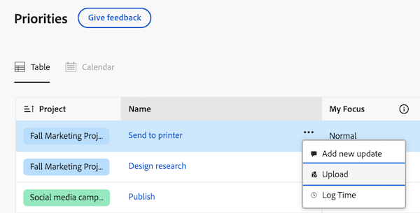

# [!DNL Priorities] 시작

우선 순위는 작업 소유자에게 맞는 능률적이고 직관적인 경험입니다. 우선 순위는 작업 목록부터 시작하여 단계적으로 롤아웃됩니다.

Priority를 사용하면 다음과 같은 이점을 누릴 수 있습니다

* 일별 작업 관리 및 우선 순위 지정: 보다 명확성을 위해 통합 탐색으로 하루 또는 주별 구성
* 생산성 향상: 클릭 수를 줄여 프로젝트 컨텍스트에 액세스하고 작업을 보다 신속하게 수행할 수 있습니다.
* 맞춤형 기능: 작업 소유자를 위해 고유하게 설계된 기능의 이점

## 작업 찾기 및 구성

우선 순위에서 작업을 필터링하고 그룹화하여 기한을 관리하고 중요한 사항에 우선 순위를 지정할 수 있습니다. 내 포커스 열을 사용하여 긴급 작업을 빠르게 식별할 수도 있습니다.

### 필터를 사용하여 작업 찾기

필터를 사용하여 가장 중요한 작업을 찾습니다. 자연어를 사용하여 스마트 필터로 작업을 찾을 수 있습니다 또는 표준 필터를 사용하여 자신에게 할당된 작업 및 문제를 찾을 수 있습니다.

<table>
  <tbody>
   <tr>
   <th>필터</th>
   <th>설명</th>
   </tr>
    <tr>
      <td>작업 중</td>
      <td>현재 작업 중인 항목을 표시합니다.</td>
    </tr>
    <tr>
      <td>시작 준비 완료</td>
      <td>항목이 있는 항목 표시 
      <ul>
      <li>완료되지 않은 전임 작업 또는 작업 제한 없음</li>
      
및

      <li>계획된 시작 일자가 과거 또는 최대 2주 미래입니다.</li>
      </ul>
      </td>
    </tr>
    <tr>
      <td>준비 안 됨</td>
      <td>다음과 같은 항목이 있는 항목 표시
       <ul>
      <li>항목이 작업되지 않도록 하는 불완전한 전임 작업 또는 작업 제한</li>
      
또는

      <li>2주 이상 후의 계획된 시작 일자</li>
      </ul>
       </td>
    </tr>
    <tr>
      <td>요청됨</td>
      <td>작업을 시작하지 않은 문제를 표시합니다.</td>
    </tr>
      <td>완료</td>
      <td>지난 2주 이내에 완료된 작업을 표시합니다. 이 필터 옵션에는 승인이 포함되지 않습니다.</td>
    </tr>
    <tr>
    <td>프로젝트</td>
    <td>할당된 작업 또는 문제가 포함된 프로젝트를 표시합니다.</td>
    </tr>
    <tr>
    <td>기한</td>
    <td>계획된 완료 일자별 작업 표시</td>
    </tr>
    <tr>
    <td>상태</td>
    <td>작업 또는 문제를 신규, 진행 중 및 완료 상태로 표시</td>
    </tr>
     <tr>
    <td>내 포커스</td>
    <td>포커스 수준이 할당된 의 작업 또는 문제를 표시합니다. 포커스 수준은 개별 사용자가 할당 및 관리합니다.</td>
    </tr>
  </tbody>
</table>

### 그룹으로 작업 구성

작업을 필터링한 후에는 다음을 기준으로 항목을 그룹화할 수 있습니다.

* 내 포커스
* 주 마감일
* 상태
* 프로젝트

자세한 내용은 [우선 순위에서 작업 필터링 및 그룹화](/help/quicksilver/workfront-basics/priorities/filter-group-work-priorities.md)를 참조하십시오.

### 내 포커스를 사용하여 중요한 작업 항목의 우선 순위 지정

내 포커스는 작업 목록의 열에서 작업의 우선 순위를 지정할 수 있습니다. 내 포커스 값은 개인적이며 프로젝트, 작업 또는 문제 데이터에 영향을 주지 않습니다. 다음 포커스 수준을 사용할 수 있습니다.

* 긴급
* 높음
* 보통(기본값)
* 낮음

작업 항목에 포커스 수준을 할당하면 열을 정렬하여 작업 목록의 맨 위에 긴급 항목을 표시할 수 있습니다.

자세한 내용은 [중요한 작업 항목 우선 순위 지정](/help/quicksilver/workfront-basics/priorities/prioritize-work-items.md)을 참조하십시오.

<!-- new screen for prod  -->

### 일정 보기 [!BADGE 준비 중] 사용{type=Informative}

달력 보기에서는 작업 및 문제를 시각적으로 표시합니다. 일, 주 또는 월 보기 중에서 선택할 수 있습니다. 또한 작업 목록과 유사한 방식으로 항목을 필터링할 수도 있습니다.

## 작업 및 문제 해결

우선 순위에서 작업 항목을 업데이트하여 작업 항목 세부 사항을 최신 상태로 유지하고, 시간을 기록하여 작업 시간을 정확하게 추적하고, 프로젝트로 이동할 필요 없이 자산을 업로드하고, 자주 사용하는 리소스에 쉽게 액세스할 수 있는 빠른 링크를 추가할 수 있습니다.

>[!NOTE]
>
>Light, Review, Contributor 및 Requestor 라이선스에서는 우선 순위에 대한 액세스가 제한됩니다. 이러한 라이선스 유형이 작업 및 문제와 상호 작용하는 방법에 대한 자세한 내용은
>
>* [새 라이선스의 개체 및 영역에 액세스](/help/quicksilver/administration-and-setup/add-users/how-access-levels-work/access-to-objects-areas-license-types.md)
>* [새 액세스 수준에 각 개체 유형에 사용할 수 있는 기능](/help/quicksilver/administration-and-setup/add-users/how-access-levels-work/functionality-available-for-objects.md)
>* [라이선스 유형별 개체 및 영역에 액세스](/help/quicksilver/administration-and-setup/add-users/access-levels-and-object-permissions/access-to-objects-and-areas-by-license-type.md)
>* [각 개체 유형에 사용할 수 있는 기능](/help/quicksilver/administration-and-setup/add-users/access-levels-and-object-permissions/functionality-available-for-each-object-type.md)

### 업데이트 추가 및 보기

작업 또는 문제에 대한 업데이트를 추가하여 진행 상황을 다른 사용자에게 전달합니다.

업데이트 섹션에는 시스템 업데이트와 지난 90일 이내에 수행한 가장 최근 업데이트 사용자 중 최대 200명이 표시됩니다.

자세한 내용은 [우선 순위에서 댓글 추가 및 보기](/help/quicksilver/workfront-basics/priorities/add-view-updates-priorities.md)를 참조하십시오.

<!--new screen for prod -->

### 로그 시간

작업 항목에 대한 시간을 기록하여 작업에 소비한 시간을 나타낼 수 있습니다. 휴가, 병가, 회의 등 업무와 관련 없는 시간도 기록할 수 있다. 기록한 시간이 타임시트에 표시됩니다.

자세한 내용은 [우선 순위에 시간 기록](/help/quicksilver/workfront-basics/priorities/log-time-priorities.md)을 참조하십시오.

<!--new screen for prod -->

### 파일 업로드

프로젝트로 이동하지 않고도 작업 또는 문제의 문서 영역에 파일을 바로 업로드할 수 있습니다. 우선 순위에서 파일을 업로드할 때 다음과 같은 작업을 수행할 수 있습니다

* 기존 폴더 선택
* 업데이트 스트림 댓글로 파일 업로드
* 추가 파일 추가
* 연결된 문서 통합에서 파일 가져오기

자세한 내용은 [우선 순위로 파일 업로드](/help/quicksilver/workfront-basics/priorities/upload-files-in-priorities.md)를 참조하십시오.

<!--new screen for prod -->

### 빠른 링크 추가

자주 사용하는 링크를 작업 항목의 세부 정보 페이지에 포함할 수 있습니다. 빠른 링크를 사용하면 링크를 빠르게 방문하거나 복사할 수 있습니다.

자세한 내용은 [우선 순위에서 빠른 링크 추가 및 관리](/help/quicksilver/workfront-basics/priorities/quick-links-priorities.md)를 참조하십시오.

### 문서 보기 [!BADGE 미리 보기에서 사용 가능]{type=Informative}

문서 탭에서는 작업 항목과 관련된 모든 파일을 볼 수 있습니다. 이름, 파일 형식 또는 사람별로 문서를 필터링하고 이름 및 업로드 날짜별로 정렬할 수 있습니다.

문서 또는 증명을 열 수도 있습니다.

### 자산 검토 및 승인 [!BADGE 미리 보기에서 사용 가능]{type=Informative}

작업 또는 문제의 문서 탭에서 다음을 수행할 수 있습니다.

* 간단한 증명 또는 고급 증명 만들기
* 증명 뷰어를 시작하여 주석 남기기 및 결정

## [!DNL Catch me up]을(를) 사용하여 놓친 항목 확인 [!BADGE 곧 출시]{type=Informative}

[!DNL Catch me up] 기능을 사용하여 놓친 내용을 확인하세요. Catch me는 업데이트, 업로드된 문서, 승인 및 프로젝트에 대한 기타 주요 변경 사항을 24시간, 3일, 7일 이내에 요약합니다.

<!--For more information, see Catch up on work in Priorities /help/quicksilver/workfront-basics/priorities/catch-me-up.md.-->

<!--need new screen for prod-->

## 세부 정보 페이지 [!BADGE 미리 보기에서 사용 가능]에서 실시간 업데이트 보기{type=Informative}

작업 또는 문제의 세부 정보 페이지에서 실시간 업데이트를 볼 수 있습니다. 실시간 상태 표시기를 사용하여 다른 사용자가 사용자와 동시에 페이지를 보고 있는지 여부도 확인할 수 있습니다.

## 고려 사항

* 현재 Workfront 관리자는 레이아웃 템플릿을 통해 우선 순위를 사용자 정의할 수 없습니다.
* 우선 순위의 작업에 액세스하는 것은 여러 탭에 걸쳐 있습니다. 향후 문서, 하위 작업, 승인 등과 같은 탭을 추가할 계획입니다. **피드백 제공** 단추를 사용하여 피드백을 제출하여 이러한 항목이 필요한지 알려 주십시오.
