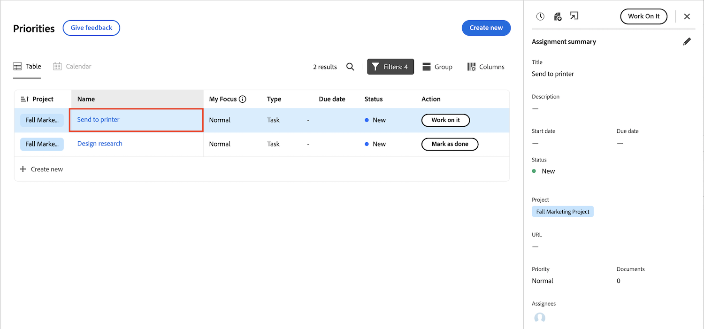

# 기존 홈에서 우선 순위로 이동

우선 순위는 2024년 10월 3일 미리 보기에서 사용할 수 있습니다

레거시 홈은 4분기 릴리스를 통해 10월 17일에 Workfront에서 제거됩니다. 이 문서에서는 우선 순위에서 사용할 수 있는 기능에 대한 정보와 사용자를 우선 순위로 이동하는 Workfront 관리자에 대한 권장 사항을 제공합니다.

기존 홈 사용 중단에 대한 자세한 내용은 [기존 홈 사용 중단 안내서](/help/quicksilver/product-announcements/announcements/legacy-home-deprecation.md)를 참조하십시오.

## 기존 홈에서 우선 순위로 변경되는 내용 이해

### 작업 목록

#### 작업 구성

우선 순위 테이블 보기에는 사용자 또는 팀에 할당된 작업 및 문제가 표시됩니다. 다음을 사용하여 작업을 필터링하고 그룹화할 수 있습니다.

| **필터** | **그룹화** |
|------------|-----------|
| -  에서 작업 중 - 시작 준비 완료   - 준비 안 됨   - 요청된   - 완료   - 프로젝트   - 기한   - 상태 | - 없음   - 기한   - 상태   - 프로젝트 |

**우선 순위에서 레거시 홈 필터 및 그룹화 옵션을 사용할 수 없음**

필터

* 완료됨 - 우선순위에서 완료 로 이름이 변경됨

그룹화

* 계획된 완료 일자 - 우선순위에서 만기 일자로 이름이 변경됨
* 계획된 시작
* 커밋 일자
* 내 우선순위

#### 작업 위임

지금은 우선 순위에서 위임된 작업을 위임하거나 볼 수 없습니다.

사용자는 여전히 다음 위젯의 새 홈에서 작업을 위임할 수 있습니다.

* 내 작업
* 내 작업
* 내 문제
* 내 승인 대기 중

사용자는 다음 위젯에서 새 홈에서 위임된 작업을 볼 수 있습니다

* 내게 위임된 필터를 사용한 내 작업 위젯
* 위임된 승인 필터를 사용하여 내 승인 대기 중

#### 달력 보기 사용

현재 달력 대체 보기를 사용할 수 없지만 우선 순위 로드맵에 있습니다.

#### 개인 작업 만들기

사용자 사용자는 우선 순위에서 개인 작업 또는 할 일 항목을 만들 수 없습니다.

#### 내 우선 순위에 항목 추가

사용자는 새로운 내 포커스 열을 사용하여 작업의 우선 순위를 지정할 수 있습니다. 내 포커스 열은 각 사용자에 대해 고유하며 작업, 문제 또는 제품 데이터에 영향을 주지 않습니다.

사용자는 다음 옵션을 사용하여 우선 순위가 높은 작업에 플래그를 지정할 수 있습니다.

* 긴급
* 기본
* 보조
* 보통(기본값)

#### 내가 제출한 승인 보기

사용자가 우선 순위에서 제출한 승인을 볼 수 없습니다. 임시 해결 방법으로, 사용자는 승인 보고서를 만들어 이 정보를 볼 수 있습니다.

### 승인 및 팀 요청 보기

사용자는 우선순위에서 승인 및 팀 요청과 상호 작용할 수 없습니다. 하지만 다음 위젯을 사용하여 새 홈에서 승인 및 팀 요청을 관리할 수 있습니다.

* 승인 대기 중
* 모든 승인
* 팀 요청

### 작업 항목 업데이트

#### 사용자 정의 양식 업데이트

사용자는 작업 이름을 클릭하고, 세부 정보 탭으로 이동한 다음 페이지 맨 아래로 스크롤하여 작업 보기 내에서 사용자 정의 양식을 업데이트할 수 있습니다.

#### 요약 패널 사용

작업 및 문제에 대한 요약 패널이 표시됩니다. 요약에서 사용자는 다음을 수행할 수 있습니다.

* 로그 시간
* 파일 업로드
* 우선 순위의 세부 정보 탭으로 이동합니다.
* 작업 및 문제 정보 업데이트

<!--Can admins customize this? It looks different from the task/issue summary in other areas. -->

#### 요약 패널 열기

**테이블** 탭에서 작업 항목의 이름 셀을 클릭합니다. 작업 항목의 이름을 클릭하면 세부 정보 페이지로 이동되고 요약 패널이 열리지 않습니다.

## 사용 중단 준비

* 최종 사용자와 [우선 순위 시작](/help/quicksilver/workfront-basics/priorities/get-started-with-priorities.md) 문서를 공유합니다.
* 우선 순위는 기본적으로 활성화됩니다. Workfront 관리자는 설정 > 시스템 > 환경 설정에서 우선순위를 비활성화할 수 있습니다.
* 현재 Workfront 관리자는 레이아웃 템플릿을 통해 우선 순위를 사용자 정의할 수 없습니다.

### 최종 사용자를 위한 도움말 문서

* [우선 순위 시작](/help/quicksilver/workfront-basics/priorities/get-started-with-priorities.md)