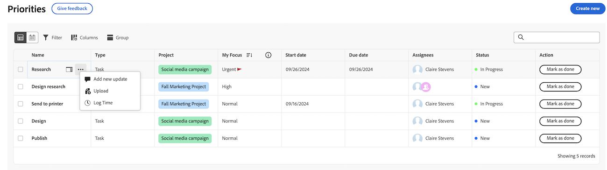
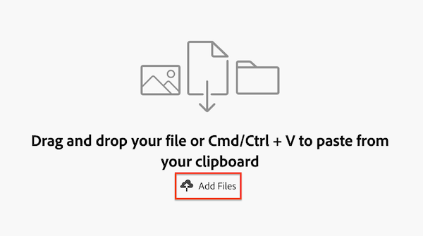

# 우선 순위로 파일 업로드

우선순위 작업 목록 또는 개별 작업 항목에서 파일을 업로드할 수 있습니다. 우선 순위에서 업로드한 파일은 작업 항목의 문서 탭에 나타납니다.

우선 순위에는 사용자에게 할당된 작업 항목이 표시됩니다. 팀에 할당된 작업 항목을 볼 수 없습니다.

## 액세스 요구 사항

+++ 을 확장하여 이 문서의 기능에 대한 액세스 요구 사항을 봅니다.

<table style="table-layout:auto"> 
 <col> 
 <col> 
 <tbody> 
  <tr> 
   <td role="rowheader">Adobe Workfront 패키지</td> 
   <td> 
임의
 </td> 
  </tr> 
  <tr> 
   <td role="rowheader">Adobe Workfront 라이센스*</td> 
   <td> 
   
기여자 이상
 
   
요청 이상
 </td> 
  </tr> 
  <tr> 
   <td role="rowheader">액세스 수준 구성*</td> 
   <td> 
문서에 대한 액세스 편집
 
참고: 여전히 액세스 권한이 없는 경우 Workfront 관리자에게 액세스 수준에서 추가 제한을 설정하는지 문의하십시오. Workfront 관리자가 액세스 수준을 수정하는 방법에 대한 자세한 내용은 <a href="../../administration-and-setup/add-users/configure-and-grant-access/create-modify-access-levels.md" class="MCXref xref">사용자 지정 액세스 수준 만들기 또는 수정</a>을 참조하십시오.
 </td> 
  </tr> 
 </tbody> 
</table>

자세한 내용은 [Workfront 설명서의 액세스 요구 사항](/help/quicksilver/administration-and-setup/add-users/access-levels-and-object-permissions/access-level-requirements-in-documentation.md)을 참조하십시오.

+++

## 작업 목록에서 파일 업로드

{{step1-to-priorities}}

1. 이름을 마우스로 가리킨 다음 **자세히**  아이콘을 클릭합니다.
1. **업로드**&#x200B;를 클릭합니다.
   
1. (선택 사항) **파일 업로드** 상자에서 폴더를 선택합니다.
1. 클립보드에서 붙여넣을 파일 또는 Cmd/Ctrl + V를 드래그 앤 드롭합니다.
또는
**파일 추가**&#x200B;를 클릭하여 파일을 찾아보거나 Document Cloud 공급자에서 파일을 가져옵니다.
   
1. (선택 사항) 댓글을 추가합니다.
1. (선택 사항) 파일을 더 추가합니다.

   >[!NOTE]
   >
   >추가 파일은 별도의 문서로 업로드됩니다.
1. **업로드**&#x200B;를 클릭합니다.

## 작업 항목에 파일 업로드

{{step1-to-priorities}}

1. 작업 항목 이름을 클릭하여 **개요** 페이지를 엽니다.
1. **빠른 작업** 섹션에서 **업로드**&#x200B;를 클릭한 다음 **문서**&#x200B;를 선택합니다.
1. (선택 사항) **파일 업로드** 상자에서 폴더를 선택합니다.
1. 파일을 드래그 앤 드롭하거나 Cmd/Ctrl + V를 눌러 클립보드에서 붙여넣기

   또는

   **파일 추가**&#x200B;를 클릭하여 파일을 찾아보거나 Document Cloud 공급자에서 파일을 가져옵니다.

   

1. (선택 사항) 댓글을 추가합니다.
1. (선택 사항) 파일을 더 추가합니다.

   >[!NOTE]
   >
   >추가 파일은 별도의 문서로 업로드됩니다.

1. **업로드**&#x200B;를 클릭합니다.
