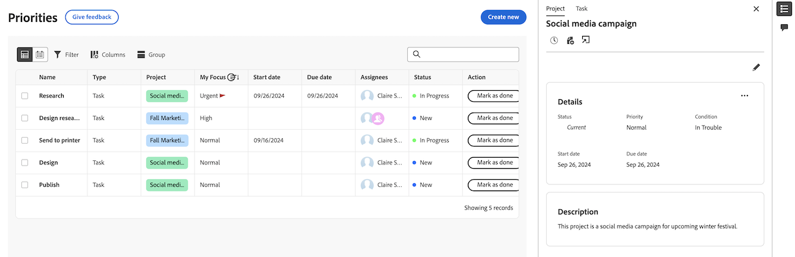

# 우선 순위에서 프로젝트 및 작업 항목 세부 정보 보기

우선 순위 작업 목록에서 프로젝트, 작업 및 문제 세부 정보를 볼 수 있습니다.

우선 순위에는 사용자에게 할당된 작업 항목이 표시됩니다. 팀에 할당된 작업 항목을 볼 수 없습니다.

>[!IMPORTANT]
>
>프로젝트뿐만 아니라 하위 작업 및 문제를 표시하려면 프로젝트가 현재 상태 또는 현재와 동일한 상태여야 합니다.

## 액세스 요구 사항

+++ 을 확장하여 이 문서의 기능에 대한 액세스 요구 사항을 봅니다.

이 문서의 단계를 수행하려면 다음 액세스 권한이 있어야 합니다.

<table style="table-layout:auto"> 
 <col> 
 </col> 
 <col> 
 </col> 
 <tbody> 
  <tr> 
   <td role="rowheader"><strong>Adobe Workfront 플랜</strong></td> 
   <td> 
임의
 </td> 
  </tr> 
  <tr> 
   <td role="rowheader"><strong>Adobe Workfront 라이센스*</strong></td> 
   <td> 
   
현재: 검토자 이상

   
새로운 기능: 밝게 또는 높음
 
   </td> 
  </tr> 
  <tr> 
   <td role="rowheader"><strong>액세스 수준 구성</strong></td> 
   <td> 
업데이트가 있는 오브젝트에 대한 보기 또는 편집 액세스 권한
</td> 
  </tr> 
  <tr> 
   <td role="rowheader"><strong>개체 권한</strong></td> 
   <td> 
오브젝트에 대한 액세스 보기
</td> 
  </tr> 
 </tbody> 
</table>

*자세한 내용은 [Workfront 설명서의 액세스 요구 사항](/help/quicksilver/administration-and-setup/add-users/access-levels-and-object-permissions/access-level-requirements-in-documentation.md)을 참조하십시오.

+++

## 작업 목록 사이드 패널에서 세부 사항 보기

### 프로젝트 세부 정보 보기

{{step1-to-priorities}}

1. 작업 목록에서 작업 항목 이름을 마우스로 가리킨 다음 **요약** 아이콘 을 클릭합니다.
1. 요약 패널 상단의 **프로젝트**&#x200B;를 클릭합니다. 여기에서 다음을 수행할 수 있습니다
   * 프로젝트 세부 정보 및 설명 보기 및 편집
   * 프로젝트에 대한 댓글 보기 및 추가
   * 로그 시간
   * 파일 추가
   * 프로젝트로 바로 이동

   

### 작업 세부 정보 보기

{{step1-to-priorities}}

1. 작업 목록에서 작업 이름을 마우스로 가리킨 다음 **요약** 아이콘 을 클릭합니다.
1. 기본적으로 작업이 선택되어 있습니다. 여기에서 다음을 수행할 수 있습니다
   * 프로젝트 및 작업 세부 정보 및 설명 보기 및 편집
   * 프로젝트에 대한 댓글 보기 및 추가
   * 문서 보기 및 추가
   * 증명 만들기
   * 로그 시간
   * 파일 추가
   * 빠른 링크 추가

   

### 문제 세부 정보 보기

{{step1-to-priorities}}

1. 작업 목록에서 작업 이름을 마우스로 가리킨 다음 **요약** 아이콘 을 클릭합니다.

1. 기본적으로 문제가 선택되어 있습니다. 여기에서 다음을 수행할 수 있습니다
   * 프로젝트 및 문제 세부 정보 및 설명 보기 및 편집
   * 프로젝트에 대한 댓글 보기 및 추가
   * 문서 보기 및 추가
   * 증명 만들기
      * 로그 시간
      * 파일 추가
      * 빠른 링크 추가

   

## 세부 정보 페이지에서 세부 정보 보기

작업 또는 문제의 세부 정보 페이지에서 실시간 업데이트를 볼 수 있습니다. 실시간 상태 표시기를 사용하여 다른 사용자가 사용자와 동시에 페이지를 보고 있는지 여부도 확인할 수 있습니다.

## 작업 항목 세부 정보 보기

{{step1-to-priorities}}

1. 작업 목록에서 작업 항목 이름을 클릭합니다. 세부 정보 페이지에서 다음을 수행할 수 있습니다

* 프로젝트 세부 정보 및 설명 보기 및 편집
* 프로젝트에 대한 댓글 보기 및 추가
* 문서 보기 및 추가
* 증명 만들기
* 로그 시간
* 파일 추가
* 빠른 링크 추가

<!-- screenshot for prod-->