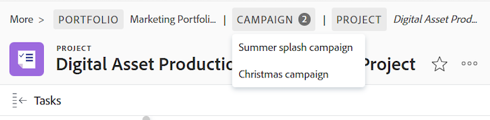

# 탐색 표시 개요

탐색 표시에는 모든 객체 유형에 대한 전체 탐색 계층 구조가 표시됩니다. 이동 경로의 각 객체에는 객체 유형을 표시하는 레이블이 있습니다. 현재 사용 중인 페이지는 페이지 헤더와 이동 경로 끝에 모두 기울임꼴로 표시됩니다. 아래 예에서는 &quot;[!UICONTROL 브랜드 팀과 공유]&quot; 작업입니다.

이동 경로 경로에 오브젝트가 너무 많거나 화면 너비로 인해 전체 탐색 계층 구조가 표시되지 않으면 이 경로는 이동 경로 중 일부를 축소하고 이동 경로 시작 부분에서 이 오브젝트를 그룹화합니다. 이동 경로 경로에 항상 프로젝트와 현재 개체 페이지가 표시됩니다.

예를 들어 위 이미지에서 &quot;3개 더&quot;는 3개의 오브젝트가 표시되지 않는다는 의미입니다. 이러한 항목은 프로젝트 수준 위나 프로젝트와 현재 페이지 사이에 위치할 수 있습니다.

&quot;[!UICONTROL 자세히]&quot;을(를) 클릭하면 전체 계층 구조를 확장할 수 있습니다. 이동 경로 경로를 다시 축소하려면 &quot;[!UICONTROL 간단히]&quot;를 클릭할 수 있습니다.

다음 키를 사용하여 탐색 표시를 탐색할 수도 있습니다.

<table style="table-layout:auto"> 
 <col> 
 <col> 
 <tbody> 
  <tr> 
   <td role="rowheader"><strong>탭</strong> </td> 
   <td> 
이동 경로의 각 항목으로 이동
 </td> 
  </tr> 
  <tr> 
   <td role="rowheader"><strong>입력</strong> </td> 
   <td> 
축소된 이동 경로 경로를 확장하고, 확장된 이동 경로 경로를 축소하고, 개체 링크를 사용하는 경우 새 페이지를 엽니다.
 </td> 
  </tr> 
 </tbody> 
</table>

+++액세스 요구 사항

이 문서의 단계를 수행하려면 다음 액세스 권한이 있어야 합니다.

<table style="table-layout:auto"> 
 <col> 
 </col> 
 <col> 
 </col> 
 <tbody> 
  <tr> 
   <td role="rowheader"><strong>[!DNL Adobe Workfront] 플랜*</strong></td> 
   <td> 
임의
 </td> 
  </tr> 
  <tr> 
   <td role="rowheader"><strong>[!DNL Adobe Workfront] 라이센스*</strong></td> 
   <td> 
[!UICONTROL Request] 이상
 </td> 
  </tr> 
 </tbody> 
</table>

*보유 중인 플랜 또는 라이선스 유형을 확인하려면 [!DNL Workfront] 관리자에게 문의하십시오.

+++

<!--drafted: this is no longer possible, since we removed Campaigns, but it might come back as part of Maestro: 

## Multi-object breadcrumbs

>[!NOTE]
>
>The information in this article is available only in the Preview environment when you participate in the [!UICONTROL Campaigns] beta program. The functionality described here might not be fully available yet. For more information about current available features and how to enroll, see [Campaigns beta].

Some objects can belong to multiple parent objects. For example, a project can belong to multiple campaigns. In this case, all the campaigns that the project belongs to display in the breadcrumb.

The multi-object listing in the breadcrumb (for example, the campaigns) displays the number of parent objects which expands into a list to display all the campaigns that the project is associated with. For more information, see [Add objects to a campaign](../../manage-work/campaigns/add-objects-to-a-campaign.md).

-->

## 이동 경로에서 상위 개체 액세스

[!DNL Workfront]의 부모 개체에 대한 자세한 내용은 [개체 이해 [!DNL Adobe Workfront]](../../workfront-basics/navigate-workfront/workfront-navigation/understand-objects.md)를 참조하십시오.

1. (조건부) 축소된 이동 경로 경로에 탐색할 개체가 없으면 **[!UICONTROL 자세히]**&#x200B;를 클릭한 다음 개체를 찾습니다.

   >[!NOTE]
   >
   >오브젝트에 대한 권한이 없으면 탐색 표시에 표시되지 않습니다.

1. 이동 경로 경로에서 개체를 클릭하여 해당 개체에 액세스합니다.

   개체 페이지가 열립니다.
