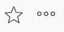

# 개체 헤더 개요

[!DNL Adobe Workfront]의 개체 머리글을 검토할 때 개체에 대한 정보를 한눈에 볼 수 있습니다.

오브젝트의 이름 외에도 헤더에는 오브젝트의 소유자, 상태 또는 완료율이 포함될 수 있습니다.

[!DNL Workfront]은(는) 개체 이름에 우선 순위를 부여하여 헤더에서 가능한 한 많은 공간을 할당합니다. 개체 이름이 너무 길면 잘립니다. 개체의 전체 이름을 표시하려면 개체 위로 마우스를 가져가면 됩니다.

## 오브젝트의 헤더 액세스

[!DNL Workfront]의 개체에 대한 헤더에 액세스하는 것은 이 개체가 있는 모든 개체에 대해 동일합니다.

예를 들어 프로젝트의 헤더에 액세스하려면 다음을 수행합니다.

1. 프로젝트로 이동합니다.\
   머리글은 페이지 맨 위에 표시되며 프로젝트 이름을 포함합니다.

   

<!--## [!UICONTROL Home] header overview 

The following headers are available in Home:

* Task: For more information on how you can use this header, see the [Task header overview](#task-header-overview) in this article.
* Issue: For more information on how you can use this header, see the [Issue header overview](#issue-header-overview) in this article.-->

## 사용자 지정 가능한 헤더

[!DNL Workfront] 또는 그룹 관리자는 레이아웃 템플릿을 사용하여 프로젝트, 작업 및 문제의 헤더를 사용자 지정할 수 있습니다.

이 문서에서는 프로젝트 및 작업과 문제를 포함한 모든 개체의 기본 헤더에 대해 설명합니다.

개체 헤더의 정보를 사용자 지정하는 방법에 대한 자세한 내용은 [레이아웃 템플릿을 사용하여 개체 헤더 사용자 지정](../../administration-and-setup/customize-workfront/use-layout-templates/customize-object-headers.md)을 참조하십시오.

## 프로젝트 헤더 개요

프로젝트 헤더에는 기본적으로 다음 정보가 표시됩니다.

<table style="table-layout:auto"> 
 <col> 
 <col> 
 <thead> 
  <tr> 
   <th>헤더 정보</th> 
   <th>메모</th> 
  </tr> 
 </thead> 
 <tbody> 
  <tr> 
   <td role="rowheader">상위 개체가 있는 탐색 표시</td> 
   <td>프로젝트가 프로그램 또는 포트폴리오와 연결된 경우 헤더의 왼쪽 상단 모서리에 있는 이동 경로에 표시됩니다. 상위 이름을 클릭하면 해당 상위 개체가 열립니다.</td> 
  </tr> 
  <tr data-mc-conditions=""> 
   <td role="rowheader">개체 아이콘 </td> 
   <td> 
프로젝트 이름 왼쪽에 자주색 [!UICONTROL Project] 아이콘 이(가) 표시됩니다.
 </td> 
  </tr> 
  <tr> 
   <td role="rowheader">프로젝트 이름</td> 
   <td>헤더에서 프로젝트 이름을 편집할 수 있습니다.</td> 
  </tr> 
  <tr> 
   <td role="rowheader">오브젝트 유형 이름</td> 
   <td> 
텍스트 "[!UICONTROL PROJECT]"가 헤더의 프로젝트 이름 위에 표시됩니다.
 </td> 
  </tr> 
  <tr> 
   <td role="rowheader">프로젝트의 작업 영역</td> 
   <td> 
프로젝트 이름 옆에 <b>공유</b> 옵션이 포함된 작업 영역이 표시됩니다.
 
  
  </td> 
  </tr> 
  <tr> 
   <td role="rowheader">[!UICONTROL 완료율]</td> 
   <td>헤더에서 프로젝트 완료율을 편집할 수 없습니다.</td> 
  </tr> 
  <tr> 
   <td role="rowheader">[!UICONTROL 프로젝트 소유자]</td> 
   <td> 
헤더에서 [!UICONTROL 프로젝트 소유자]를 편집할 수 있습니다.
 </td> 
  </tr> 
  <tr> 
   <td role="rowheader">[!UICONTROL 계획된 완료 일자] </td> 
   <td> 
프로젝트가 [!UICONTROL 완료 일자]부터 예약된 경우 헤더에서 프로젝트 [!UICONTROL 계획된 완료 일자] 및 시간을 편집할 수 있습니다. 프로젝트가 [!UICONTROL 시작 날짜]부터 예약된 경우 이 정보는 프로젝트의 작업에서 업데이트됩니다.
 </td> 
  </tr> 
  <tr> 
   <td role="rowheader">[!UICONTROL Condition] </td> 
   <td> 
프로젝트의 [!UICONTROL 조건 유형]을 수동으로 설정하면 헤더에서 프로젝트 [!UICONTROL 조건]을 업데이트할 수 있습니다.
</td> 
  </tr> 
  <tr> 
   <td role="rowheader">[!UICONTROL 상태]</td> 
   <td>헤더에서 프로젝트 [!UICONTROL 상태]를 편집할 수 있습니다.</td> 
  </tr> 
  <tr> 
   <td role="rowheader">[!UICONTROL Approvals] 영역</td> 
   <td> 
승인자 중 한 명인 경우 다음 아이콘을 사용하여 프로젝트에 대한 승인을 관리합니다.
 
  </img> [!UICONTROL 승인]
 
  </img> [!UICONTROL 거부]
 
  </img> [!UICONTROL 회수]
 
승인자가 아닌 경우 [!UICONTROL More] 아이콘 을(를) 클릭하여 현재 승인 단계에 대한 정보를 봅니다.
 
승인에 대한 자세한 내용은 <a href="../../review-and-approve-work/manage-approvals/approval-process-in-workfront.md" class="MCXref xref">승인 프로세스 개요</a>를 참조하세요.
 </td> 
  </tr> 
 </tbody> 
</table>

## 작업 헤더 개요

작업 헤더에는 기본적으로 다음 정보가 포함되어 있습니다.

<table style="table-layout:auto"> 
 <col> 
 <col> 
 <thead> 
  <tr> 
   <th>헤더 정보</th> 
   <th>메모</th> 
  </tr> 
 </thead> 
 <tbody> 
  <tr> 
   <td role="rowheader">상위 개체가 있는 탐색 표시</td> 
   <td> 
작업의 상위 개체가 이동 경로에 표시됩니다. 상위 이름을 클릭하면 해당 상위 개체가 열립니다.
 
자세한 내용은 <a href="../../workfront-basics/the-new-workfront-experience/breadcrumb-overview.md" class="MCXref xref">탐색 표시 개요</a>를 참조하십시오.
 </td> 
  </tr> 
  <tr data-mc-conditions=""> 
   <td role="rowheader">개체 아이콘 </td> 
   <td> 
작업 이름 왼쪽에 녹색 [!UICONTROL Task] 아이콘 이(가) 표시됩니다.
 </td> 
  </tr> 
  <tr> 
   <td role="rowheader">작업 이름</td> 
   <td>헤더에서 작업 이름을 편집할 수 있습니다.</td> 
  </tr> 
  <tr> 
   <td role="rowheader">오브젝트 유형 이름</td> 
   <td> 
"[!UICONTROL TASK]" 텍스트가 헤더의 작업 이름 위에 표시됩니다.
 </td> 
  </tr> 
  <tr> 
   <td role="rowheader">작업의 작업 영역</td> 
   <td> 
작업 이름 옆에 <b>공유</b> 옵션을 포함하는 작업 영역이 표시됩니다.
 
  
 
종속성 아이콘이 표시되면 아이콘을 클릭하여 작업의 전임 작업 또는 후임 작업을 볼 수 있습니다.
 </td> 
  </tr> 
  <tr> 
   <td role="rowheader">[!UICONTROL 완료율]</td> 
   <td>헤더에서 작업 완료율을 편집할 수 있습니다.</td> 
  </tr> 
  <tr> 
   <td role="rowheader">[!UICONTROL Assignments]</td> 
   <td>헤더에서 작업 피할당자를 편집할 수 있습니다.</td> 
  </tr> 
  <tr> 
   <td role="rowheader"> 
[!UICONTROL 작업 대상], [!UICONTROL 완료] 또는 [!UICONTROL 작업 시작] 단추
 </td> 
   <td> 
작업이 사용자에게 할당된 경우 [!UICONTROL 해당 작업에 대한 작업] 이나 [!UICONTROL 작업 시작] 단추를 클릭하여 현재 작업을 수행하고 있음을 나타내거나 [!UICONTROL 완료] 단추를 클릭하여 작업을 완료했음을 나타낼 수 있습니다.
 
[!UICONTROL Work On It] 단추를 [!UICONTROL Start Task] 단추로 바꾸는 방법에 대한 자세한 내용은 <a href="../../people-teams-and-groups/create-and-manage-teams/work-on-it-button-to-start-button.md" class="MCXref xref">[!UICONTROL Work On It] 단추를 [!UICONTROL Start] 단추로 바꾸기</a>를 참조하십시오.
 </td> 
  </tr> 
  <tr> 
   <td role="rowheader">[!UICONTROL 계획된 완료 일자]</td> 
   <td> 
헤더에서 [!UICONTROL 계획된 완료 일자]  및 시간 작업을 편집할 수 있습니다.
 
팁: [!UICONTROL Commit Date] 헤더가 표시되지 않습니다. [!UICONTROL 세부 정보] 페이지에서 볼 수 있습니다.
 </td> 
  </tr> 
  <tr> 
   <td role="rowheader">[!UICONTROL 상태]</td> 
   <td>헤더에서 [!UICONTROL Status] 작업을 편집할 수 있습니다.</td> 
  </tr> 
  <tr> 
   <td role="rowheader">[!UICONTROL Approvals] 영역</td> 
   <td> 
승인자 중 한 명인 경우 다음 아이콘을 사용하여 작업에 대한 승인을 관리합니다.
 
  </img> [!UICONTROL 승인]
 
  </img> [!UICONTROL 거부]
 
  </img> [!UICONTROL 회수]
 
승인자가 아닌 경우 [!UICONTROL More] 아이콘 을(를) 클릭하여 현재 승인 단계에 대한 정보를 봅니다.
 
승인에 대한 자세한 내용은 <a href="../../review-and-approve-work/manage-approvals/approval-process-in-workfront.md" class="MCXref xref">승인 프로세스 개요</a>를 참조하세요.
 </td> 
  </tr> 
 </tbody> 
</table>

## 문제 헤더 개요

문제 헤더에는 기본적으로 다음 정보가 포함되어 있습니다.

<table style="table-layout:auto"> 
 <col> 
 <col> 
 <thead> 
  <tr> 
   <th>헤더 정보</th> 
   <th>메모</th> 
  </tr> 
 </thead> 
 <tbody> 
  <tr> 
   <td role="rowheader">상위 개체가 있는 탐색 표시</td> 
   <td> 
문제의 상위 개체가 이동 경로에 표시됩니다. 상위 이름을 클릭하면 해당 상위 개체가 열립니다.
 
자세한 내용은 <a href="../../workfront-basics/the-new-workfront-experience/breadcrumb-overview.md" class="MCXref xref">탐색 표시 개요</a>를 참조하십시오.
 </td> 
  </tr> 
  <tr> 
   <td role="rowheader">개체 아이콘 </td> 
   <td> 
문제 이름 왼쪽에 분홍색 [!UICONTROL Issue] 아이콘 이(가) 표시됩니다.
 </td> 
  </tr> 
  <tr> 
   <td role="rowheader">문제 이름</td> 
   <td>헤더에서 문제 이름을 편집할 수 있습니다.</td> 
  </tr> 
  <tr> 
   <td role="rowheader">오브젝트 유형 이름</td> 
   <td> 
텍스트 "[!UICONTROL ISSUE]"가 헤더의 문제 이름 위에 표시됩니다.
 </td> 
  </tr> 
  <tr> 
   <td role="rowheader">문제의 작업 영역</td> 
   <td> 
문제 이름 옆에 <b>공유</b> 옵션이 포함된 작업 영역이 표시됩니다.
 
  
[!UICONTROL 종속성] 아이콘이 표시되면 아이콘을 클릭하여 문제에 대한 전임 작업 또는 후임 작업을 볼 수 있습니다.
  </td> 
  </tr> 
  <tr> 
   <td role="rowheader">[!UICONTROL 완료율]</td> 
   <td> 
헤더에서 문제의 완료율을 편집할 수 있습니다.
 </td> 
  </tr> 
  <tr> 
   <td role="rowheader">[!UICONTROL Assignments]</td> 
   <td>헤더에서 문제의 피할당자를 편집할 수 있습니다.</td> 
  </tr> 
  <tr> 
   <td role="rowheader">[!UICONTROL Work on It], [!UICONTROL Done],  또는 [!UICONTROL Start Issue] 단추</td> 
   <td>문제가 할당된 경우 [!UICONTROL Work on It]  또는 [!UICONTROL Start Issue] 단추를 클릭하여 현재 문제를 처리 중임을 나타내거나 [!UICONTROL Done] 단추를 클릭하여 문제를 완료했음을 나타낼 수 있습니다.[!UICONTROL Work On It] 단추를 [!UICONTROL Start Task] 단추로 바꾸는 방법에 대한 자세한 내용은 <a href="../../people-teams-and-groups/create-and-manage-teams/work-on-it-button-to-start-button.md" class="MCXref xref">[!UICONTROL Work On It] 단추를 [!UICONTROL Start] 단추로 바꾸기</a>를 참조하십시오.</td> 
  </tr> 
  <tr> 
   <td role="rowheader">[!UICONTROL 계획된 완료 일자]</td> 
   <td> 
헤더에서 [!UICONTROL 계획된 완료 일자]  및 시간 문제를 편집할 수 있습니다.
 
팁: [!UICONTROL Commit Date] 헤더가 표시되지 않습니다. [!UICONTROL 세부 정보] 페이지에서 볼 수 있습니다.
 </td> 
  </tr> 
  <tr> 
   <td role="rowheader">[!UICONTROL 상태]</td> 
   <td>헤더에서 [!UICONTROL Status] 문제를 편집할 수 있습니다.</td> 
  </tr> 
  <tr> 
   <td role="rowheader">[!UICONTROL Approvals] 영역</td> 
   <td> 
승인자 중 한 명인 경우 다음 아이콘을 사용하여 문제에 대한 승인을 관리합니다.
 
  [!UICONTROL Approve]
 
  [!UICONTROL 거부]
 
  [!UICONTROL 회수]
 
승인자가 아닌 경우 [!UICONTROL More] 아이콘 을(를) 클릭하여 현재 승인 단계에 대한 정보를 봅니다.
 
승인에 대한 자세한 내용은 <a href="../../review-and-approve-work/manage-approvals/approval-process-in-workfront.md" class="MCXref xref">승인 프로세스 개요</a>를 참조하세요.
 </td> 
  </tr> 
 </tbody> 
</table>

## 프로그램 헤더 개요

프로그램 헤더에는 다음 정보가 표시됩니다.

<table style="table-layout:auto"> 
 <col> 
 <col> 
 <thead> 
  <tr> 
   <th>헤더 정보</th> 
   <th>메모</th> 
  </tr> 
 </thead> 
 <tbody> 
  <tr> 
   <td role="rowheader">Portfolio 이름이 있는 이동 경로</td> 
   <td> 
[!UICONTROL 프로그램]의 헤더에서 [!UICONTROL Portfolio]에 액세스할 수 있습니다. 상위 이름을 클릭하면 해당 상위 개체가 열립니다.
 
자세한 내용은 <a href="../../workfront-basics/the-new-workfront-experience/breadcrumb-overview.md" class="MCXref xref">탐색 표시 개요</a>를 참조하십시오.
 </td> 
  </tr> 
  <tr> 
   <td role="rowheader">개체 아이콘 </td> 
   <td> 
주황색 [!UICONTROL Program] 아이콘 이(가) 프로그램 이름 왼쪽에 표시됩니다.
 </td> 
  </tr> 
  <tr> 
   <td role="rowheader">프로그램 이름</td> 
   <td>헤더에서 프로그램 이름을 편집할 수 있습니다.</td> 
  </tr> 
  <tr> 
   <td role="rowheader">오브젝트 유형 이름</td> 
   <td> 
프로그램이 [!UICONTROL Active]로 표시된 경우 헤더의 프로그램 이름 위에 "[!UICONTROL PROGRAM]" 텍스트가 표시됩니다.
 </td> 
  </tr> 
  <tr> 
   <td role="rowheader">활성화 상태</td> 
   <td> 
프로그램이 비활성화되면 헤더의 프로그램 이름 위에 "[!UICONTROL PROGRAM DEACTIVATED]" 텍스트가 표시됩니다.
 </td> 
  </tr> 
  <tr> 
   <td role="rowheader">프로그램의 작업 영역</td> 
   <td> 
프로그램 이름 옆에 <b>공유</b> 옵션이 포함된 작업 영역이 표시됩니다.
 
  </td> 
  </tr> 
  <tr> 
   <td role="rowheader">[!UICONTROL 완료율]</td> 
   <td> 
헤더에서 프로그램의 [!UICONTROL 완료율]을 편집할 수 없습니다. 이 정보는 프로그램의 프로젝트에서 업데이트됩니다.
 
팁: 기본적으로 프로그램의 완료율은 프로그램에 속한 [!UICONTROL 현재] 또는 [!UICONTROL 승인됨 상태]에 있는 프로젝트의 완료율 값의 평균입니다.
 </td> 
  </tr> 
  <tr> 
   <td role="rowheader">[!UICONTROL 프로그램 관리자]</td> 
   <td> 
헤더에서 [!UICONTROL 프로그램 관리자]를 편집할 수 있습니다. 이는 [!UICONTROL 프로그램 소유자]와 동일합니다.
 </td> 
  </tr> 
  <tr> 
   <td role="rowheader">[!UICONTROL 계획된 완료 일자]</td> 
   <td>헤더에서 [!UICONTROL 계획된 완료 일자] 프로그램을 편집할 수 없습니다. 이 정보는 프로그램에 있는 프로젝트의 [!UICONTROL 계획된 완료 일자]부터 업데이트됩니다.</td> 
  </tr> 
  <tr> 
   <td role="rowheader">[!UICONTROL 활성 프로젝트 상태]</td> 
   <td>이는 프로그램에 있는 활성 프로젝트의 [!UICONTROL Condition]이 Target에 대한 [!UICONTROL], 위험 상태 [!UICONTROL] 또는 문제 발생 [!UICONTROL]로 설정된 비율을 계산한 것입니다.</td> 
  </tr> 
 </tbody> 
</table>

## Portfolio 헤더 개요 {#portfolio-header-overview}

포트폴리오 헤더에는 다음 정보가 포함됩니다.

<table style="table-layout:auto"> 
 <col> 
 <col> 
 <thead> 
  <tr> 
   <th>헤더 정보</th> 
   <th>메모</th> 
  </tr> 
 </thead> 
 <tbody> 
  <tr> 
   <td role="rowheader">개체 아이콘 </td> 
   <td> 
포트폴리오 이름의 왼쪽에 파란색 [!UICONTROL Portfolio] 아이콘 이(가) 표시됩니다.
 </td> 
  </tr> 
  <tr> 
   <td role="rowheader">포트폴리오 이름</td> 
   <td>헤더에서 포트폴리오 이름을 편집할 수 있습니다.</td> 
  </tr> 
  <tr> 
   <td role="rowheader">오브젝트 유형 이름</td> 
   <td> 
포트폴리오가 활성으로 표시되면 헤더의 포트폴리오 이름 위에 "[!UICONTROL PORTFOLIO]" 텍스트가 표시됩니다.
 </td> 
  </tr> 
  <tr> 
   <td role="rowheader">활성화 상태</td> 
   <td> 
포트폴리오가 비활성화되면 헤더의 포트폴리오 이름 위에 "[!UICONTROL PORTFOLIO DEACTIVATED]" 텍스트가 표시됩니다.
 </td> 
  </tr> 
  <tr> 
   <td role="rowheader">포트폴리오의 작업 영역</td> 
   <td> 
포트폴리오 이름 옆에 [!UICONTROL 작업] 영역이 표시됩니다.
 
  
</td> 
  </tr> 
  <tr> 
   <td role="rowheader">[!UICONTROL Portfolio 관리자]</td> 
   <td>헤더에서 [!UICONTROL Portfolio 관리자]를 편집할 수 있습니다. 이는 [!UICONTROL Portfolio 소유자]와 동일합니다.</td> 
  </tr> 
  <tr> 
   <td role="rowheader">[!UICONTROL 설정 시간]</td> 
   <td>현재 포트폴리오에 있는 프로젝트의 비율이 얼마나 되는지 계산한 것입니다.</td> 
  </tr> 
  <tr> 
   <td role="rowheader">[!UICONTROL On Budget]</td> 
   <td>현재 포트폴리오에 있는 프로젝트의 몇 퍼센트가 예산으로 책정되는지 계산한 것이다.</td> 
  </tr> 
  <tr> 
   <td role="rowheader">[!UICONTROL Aligned]</td> 
   <td>포트폴리오에 포함된 프로젝트 중 포트폴리오에 맞춰 몇 %를 차지하는지 계산한 결과입니다.</td> 
  </tr> 
  <tr> 
   <td role="rowheader">[!UICONTROL ROI]</td> 
   <td>포트폴리오의 모든 프로젝트에 대한 [!UICONTROL 투자 수익률] 계산입니다.</td> 
  </tr> 
  <tr> 
   <td role="rowheader">[!UICONTROL Net Value]</td> 
   <td>포트폴리오의 모든 프로젝트에 대한 [!UICONTROL Net Value] 계산입니다.</td> 
  </tr> 
 </tbody> 
</table>

## 템플릿 헤더 개요 {#template-header-overview}

템플릿 헤더에는 다음 정보가 표시됩니다.

<table style="table-layout:auto"> 
 <col> 
 <col> 
 <thead> 
  <tr> 
   <th>헤더 정보</th> 
   <th>메모</th> 
  </tr> 
 </thead> 
 <tbody> 
  <tr> 
   <td role="rowheader">개체 아이콘 </td> 
   <td> 
템플릿 이름 왼쪽에 녹색 [!UICONTROL Template] 아이콘 이(가) 표시됩니다.
 </td> 
  </tr> 
  <tr> 
   <td role="rowheader">템플릿 이름</td> 
   <td>헤더에서 템플릿 이름을 편집할 수 있습니다.</td> 
  </tr> 
  <tr> 
   <td role="rowheader">오브젝트 유형 이름</td> 
   <td> 
템플릿이 활성으로 표시되면 헤더의 템플릿 이름 위에 "[!UICONTROL TEMPLATE]" 텍스트가 표시됩니다.
 </td> 
  </tr> 
  <tr> 
   <td role="rowheader">활성화 상태</td> 
   <td> 
템플릿이 비활성화되면 헤더의 템플릿 이름 위에 "[!UICONTROL TEMPLATE DEACTIVATED]" 텍스트가 표시됩니다.
 </td> 
  </tr> 
  <tr> 
   <td role="rowheader">템플릿의 작업 영역입니다</td> 
   <td> 
템플릿 이름 옆에 작업 영역이 표시됩니다.
 
  
 </td> 
  </tr> 
  <tr> 
   <td role="rowheader">[!UICONTROL 템플릿 소유자]</td> 
   <td>헤더에서 [!UICONTROL Template Owner] 필드를 편집할 수 있습니다.</td> 
  </tr> 
  <tr> 
   <td role="rowheader">[!UICONTROL 기간]</td> 
   <td>템플릿의 기간입니다. 헤더에서 이 필드를 편집할 수 없습니다.</td> 
  </tr> 
 </tbody> 
</table>

## 템플릿 작업 헤더 개요

템플릿 작업 헤더에는 다음 정보가 표시됩니다.

<table style="table-layout:auto"> 
 <col> 
 <col> 
 <thead> 
  <tr> 
   <th>헤더 정보</th> 
   <th>메모</th> 
  </tr> 
 </thead> 
 <tbody> 
  <tr> 
   <td role="rowheader">상위 오브젝트에 대한 탐색 표시</td> 
   <td> 
템플릿 작업의 상위 개체가 이동 경로에 표시됩니다. 상위 개체의 이름을 클릭하면 해당 상위 개체가 열립니다.
 
자세한 내용은 <a href="../../workfront-basics/the-new-workfront-experience/breadcrumb-overview.md" class="MCXref xref">탐색 표시 개요</a>를 참조하십시오.
 </td> 
  </tr> 
  <tr> 
   <td role="rowheader">개체 아이콘 </td> 
   <td> 
템플릿 작업 이름 왼쪽에 녹색 [!UICONTROL 작업] 아이콘 이(가) 표시됩니다.
 </td> 
  </tr> 
  <tr> 
   <td role="rowheader">템플릿 작업 이름</td> 
   <td>헤더에서 템플릿 작업 이름을 편집할 수 있습니다.</td> 
  </tr> 
  <tr> 
   <td role="rowheader">오브젝트 유형 이름</td> 
   <td> 
텍스트 "[!UICONTROL TEMPLATE TASK]"가 헤더의 템플릿 작업 이름 위에 표시됩니다.
 </td> 
  </tr> 
  <tr> 
   <td role="rowheader">템플릿 작업의 작업 영역</td> 
   <td> 
템플릿 작업 이름 옆에 작업 영역이 표시됩니다.
 
  
 </td> 
  </tr> 
  <tr> 
   <td role="rowheader">[!UICONTROL Assignments]</td> 
   <td>헤더에서 템플릿 작업의 [!UICONTROL Assignments]를 편집할 수 있습니다.</td> 
  </tr> 
  <tr> 
   <td role="rowheader">[!UICONTROL 완료 일자]</td> 
   <td>템플릿 작업이 완료되어야 하는 템플릿 기간 내의 일입니다.</td> 
  </tr> 
 </tbody> 
</table>

## 청구 기록 헤더 개요

청구 기록 헤더에는 다음 정보가 표시됩니다.

<table style="table-layout:auto"> 
 <col> 
 <col> 
 <thead> 
  <tr> 
   <th>헤더 정보</th> 
   <th>메모</th> 
  </tr> 
 </thead> 
 <tbody> 
  <tr> 
   <td role="rowheader">상위 오브젝트에 대한 탐색 표시</td> 
   <td> 
청구 기록의 상위 개체가 이동 경로에 표시됩니다. 상위 개체의 이름을 클릭하면 해당 상위 개체가 열립니다.
 
자세한 내용은 <a href="../../workfront-basics/the-new-workfront-experience/breadcrumb-overview.md" class="MCXref xref">탐색 표시 개요</a>를 참조하십시오.
 </td> 
  </tr> 
  <tr> 
   <td role="rowheader">개체 아이콘 </td> 
   <td> 
청구 기록 이름 왼쪽에 파란색 [!UICONTROL 청구 기록] 아이콘 이(가) 표시됩니다.
 </td> 
  </tr> 
  <tr> 
   <td role="rowheader">청구 기록 이름</td> 
   <td>헤더에서 청구 기록의 이름을 편집할 수 있습니다.</td> 
  </tr> 
  <tr> 
   <td role="rowheader">오브젝트 유형 이름</td> 
   <td> 
"[!UICONTROL BILLING RECORD]" 텍스트가 헤더의 청구 기록 이름 위에 표시됩니다.
 </td> 
  </tr> 
  <tr> 
   <td role="rowheader">청구 기록을 위한 기타 메뉴</td> 
   <td> 
청구 기록 이름 옆에 다음 옵션을 선택할 수 있는 [!UICONTROL 기타] 메뉴 이(가) 표시됩니다.
 
    <ul> 
     <li> 
[!UICONTROL 편집]
 </li> 
     <li> 
 삭제 
 </li> 
    </ul>
    
<b>메모</b>

    
청구됨 상태의 청구 기록에 대해서는 기타 메뉴가 표시되지 않습니다. 청구된 레코드는 편집하거나 삭제할 수 없습니다.

     </td> 
  </tr> 
  <tr> 
   <td role="rowheader">[!UICONTROL 청구 기록 합계]</td> 
   <td>청구 기록의 총 금액입니다. 이 필드는 편집할 수 없습니다.</td> 
  </tr> 
  <tr> 
   <td role="rowheader">[!UICONTROL 청구 날짜]</td> 
   <td>청구 기록이 생성될 때 수동으로 변경되지 않은 한, 청구 기록이 생성된 날짜입니다. 헤더에서 [!UICONTROL 청구 날짜]를 편집할 수 있습니다.</td> 
  </tr> 
  <tr> 
   <td role="rowheader">[!UICONTROL 상태]</td> 
   <td> 
청구 기록이 [!UICONTROL 청구됨] 상태일 때 더 이상 편집할 수 없습니다.
 
헤더에서 청구 기록의 상태 를 편집할 수 있습니다.
 </td> 
  </tr> 
 </tbody> 
</table>

## 사용자 헤더 개요

사용자 헤더에는 다음 정보가 표시됩니다.

<table style="table-layout:auto"> 
 <col> 
 <col> 
 <thead> 
  <tr> 
   <th>헤더 정보</th> 
   <th>메모</th> 
  </tr> 
 </thead> 
 <tbody> 
  <tr> 
   <td role="rowheader">사용자 프로필 사진</td> 
   <td>헤더의 프로필 사진은 업데이트할 수 없습니다.</td> 
  </tr> 
  <tr> 
   <td role="rowheader">사용자 이름 및 제목</td> 
   <td> 
 사용자의 제목은 이름 위의 모든 대문자로 표시됩니다. 헤더에서 사용자의 이름을 편집할 수 없습니다.
 </td> 
  </tr> <!--
   <tr> 
    <td role="rowheader">Name of the object type</td> 
    <td> 
The name of the object type does not display.
 </td> 
   </tr>
  --> 
  <tr> 
   <td role="rowheader">활성화 상태</td> 
   <td> 
사용자가 비활성화되면 헤더의 모든 텍스트와 프로필 사진이 흐리게 표시됩니다.
 </td> 
  </tr> 
  <tr> 
   <td role="rowheader">사용자의 작업 영역</td> 
   <td> 
사용자 이름 옆에 작업 영역이 표시됩니다.
 
  
</td> 
  </tr> 
  <tr> 
   <td role="rowheader">이메일 주소</td> 
   <td>헤더에서 이메일 주소를 편집할 수 없습니다. 일반적으로 사용자 이름이기도 합니다.</td> 
  </tr> 
  <tr> 
   <td role="rowheader">전화번호</td> 
   <td>헤더에서 전화번호를 편집할 수 없습니다.</td> 
  </tr> 
  <tr> 
   <td role="rowheader">팀</td> 
   <td> 
사용자가 속한 팀을 볼 수 있습니다. 팀 아바타 위로 마우스를 가져가 팀 이름을 표시합니다. 헤더에서 팀을 편집할 수 없습니다.
 </td> 
  </tr> 
 </tbody> 
</table>

## 팀 헤더 개요

팀 헤더에는 다음 정보가 표시됩니다.

<table style="table-layout:auto"> 
 <col> 
 <col> 
 <thead> 
  <tr> 
   <th>헤더 정보</th> 
   <th>메모</th> 
  </tr> 
 </thead> 
 <tbody> 
  <tr> 
   <td role="rowheader">개체 아이콘 </td> 
   <td> 
팀 이름의 왼쪽에 자주색 [!UICONTROL Team] 아이콘 이(가) 표시됩니다.
 </td> 
  </tr> 
  <tr> 
   <td role="rowheader">팀 이름</td> 
   <td>헤더에서 팀 이름을 편집할 수 있습니다.</td> 
  </tr> 
  <tr> 
   <td role="rowheader">오브젝트 유형 이름</td> 
   <td> 
헤더 내 팀 이름 위에 텍스트 "[!UICONTROL TEAM]"이 표시됩니다.
 </td> 
  </tr> 
  <tr> 
   <td role="rowheader">팀의 작업 영역</td> 
   <td> 
팀 이름 옆에 작업 영역이 표시됩니다.
 
  
</td> 
  </tr> 
  <tr> 
   <td role="rowheader">팀원 프로필 사진</td> 
   <td>팀원의 프로필 사진. 사용자 이름을 표시하려면 마우스를 사진 위에 놓습니다.</td> 
  </tr> 
  <tr> 
   <td role="rowheader">설명</td> 
   <td>팀 구성원에 대한 간략한 설명입니다. 헤더에서 팀의 설명을 편집할 수 없습니다.</td> 
  </tr> 
 </tbody> 
</table>

## 반복 헤더 개요

반복 헤더에는 다음 정보가 표시됩니다.

<table style="table-layout:auto"> 
 <col> 
 <col> 
 <thead> 
  <tr> 
   <th>헤더 정보</th> 
   <th>메모</th> 
  </tr> 
 </thead> 
 <tbody> 
  <tr> 
   <td role="rowheader">개체 아이콘 </td> 
   <td> 
주황색 [!UICONTROL Iteration] 아이콘 이(가) 반복 이름의 왼쪽에 표시됩니다.
 </td> 
  </tr> 
  <tr> 
   <td role="rowheader">반복 이름</td> 
   <td>헤더에서 반복 이름을 편집할 수 있습니다.</td> 
  </tr> 
  <tr> 
   <td role="rowheader">오브젝트 유형 이름</td> 
   <td> 
"[!UICONTROL ITERATION]" 텍스트가 헤더의 반복 이름 위에 표시됩니다.
 </td> 
  </tr> 
  <tr> 
   <td role="rowheader">반복의 작업 영역</td> 
   <td> 
이터레이션 이름 옆에 작업 영역이 표시됩니다.
 
 
  <tr> 
   <td role="rowheader">소유자</td> 
   <td>반복의 [!UICONTROL 소유자]입니다. 헤더에서 [!UICONTROL 소유자]를 편집할 수 없습니다.</td> 
  </tr> 
  <tr> 
   <td role="rowheader">[!UICONTROL 타임라인]</td> 
   <td>[!UICONTROL 타임라인]에는 반복의 시작 날짜와 종료 날짜가 표시됩니다. 헤더에서 [!UICONTROL 타임라인]을 편집할 수 없습니다.</td> 
  </tr> 
  <tr> 
   <td role="rowheader">[!UICONTROL 팀]</td> 
   <td>헤더에서 반복 팀을 편집할 수 없습니다. 팀 이름을 클릭하면 팀 페이지로 이동합니다.</td> 
  </tr> 
 </tbody> 
</table>

## 그룹 헤더 개요

그룹 머리글에는 다음 정보가 표시됩니다.

<table style="table-layout:auto"> 
 <col> 
 <col> 
 <thead> 
  <tr> 
   <th>헤더 정보</th> 
   <th>메모</th> 
  </tr> 
 </thead> 
 <tbody> 
  <tr> 
   <td role="rowheader">개체 아이콘 </td> 
   <td> 
주황색 [!UICONTROL Group] 아이콘 이(가) 그룹 이름 왼쪽에 표시됩니다.
 </td> 
  </tr> 
  <tr> 
   <td role="rowheader">그룹 이름</td> 
   <td>헤더에서 그룹 이름을 편집할 수 있습니다.</td> 
  </tr> 
  <tr> 
   <td role="rowheader">오브젝트 유형 이름</td> 
   <td> 
"[!UICONTROL GROUP]" 텍스트가 헤더의 그룹 이름 위에 표시됩니다.
 </td> 
  </tr> 
  <tr> 
   <td role="rowheader">그룹의 [!UICONTROL actions] 영역</td> 
   <td> 
그룹 이름 옆에 다음 옵션을 선택할 수 있는 [!UICONTROL 추가 정보] 메뉴 이(가) 표시됩니다.
 
    <ul> 
     <li> 
[!UICONTROL 편집]
 </li> 
     <li> 
[!UICONTROL Copy]
 </li> 
     <li> 
[!UICONTROL Delete]
 </li> 
    </ul> </td> 
  </tr> 
  <tr> 
   <td role="rowheader">[!UICONTROL Business Leader]</td> 
   <td>헤더에서 [!UICONTROL Business Leader]를 편집할 수 있습니다.</td> 
  </tr> 
  <tr> 
   <td role="rowheader">[!UICONTROL 라이선스 사용 중] </td> 
   <td> 
[!UICONTROL Licenses in use] 상자는 그룹 및 해당 하위 그룹에 있는 [!UICONTROL Plan] 및 [!UICONTROL Work] 라이선스 사용자 수를 표시합니다. 숫자를 클릭하면 5개의 모든 라이선스 유형에 대한 이 정보를 볼 수 있습니다.
 
자세한 내용은 <a href="../../administration-and-setup/manage-groups/create-and-manage-groups/view-number-licenses-allocated-used-group.md" class="MCXref xref">새 [!DNL Adobe Workfront] 경험에서 그룹에 할당되어 사용되는 라이선스 수를 확인</a>하세요.
 </td> 
  </tr> 
  <tr> 
   <td role="rowheader">[!UICONTROL 그룹 관리자]</td> 
   <td>헤더에서 그룹 관리자 를 편집할 수 있습니다.</td> 
  </tr> 
 </tbody> 
</table>

## 문서 헤더 개요

문서 머리글에는 다음 정보가 표시됩니다.

<table style="table-layout:auto"> 
 <col> 
 <col> 
 <thead> 
  <tr> 
   <th>헤더 정보</th> 
   <th>메모</th> 
  </tr> 
 </thead> 
 <tbody> 
  <tr> 
   <td role="rowheader">상위 개체가 있는 탐색 표시</td> 
   <td> 
문서의 상위 객체가 이동 경로에 표시됩니다. 상위 개체의 이름을 클릭하면 해당 상위 개체가 열립니다.
 
자세한 내용은 <a href="../../workfront-basics/the-new-workfront-experience/breadcrumb-overview.md" class="MCXref xref">탐색 표시 개요</a>를 참조하십시오.
 </td> 
  </tr> 
  <tr> 
   <td role="rowheader">개체 아이콘 </td> 
   <td> 
문서 이름 왼쪽에 파란색 [!UICONTROL Document] 아이콘 이(가) 표시됩니다.
 </td> 
  </tr> 
  <tr> 
   <td role="rowheader">문서 이름</td> 
   <td>헤더에서 문서 이름을 편집할 수 있습니다.</td> 
  </tr> 
  <tr> 
   <td role="rowheader">오브젝트 유형 이름</td> 
   <td> 
텍스트 "[!UICONTROL DOCUMENT]"가 헤더의 문서 이름 위에 표시됩니다.
 </td> 
  </tr> 
  <tr> 
   <td role="rowheader">문서의 작업 영역</td> 
   <td> 
문서 이름 옆에 작업 영역이 표시됩니다.
 
  
</td> 
  </tr> 
  <tr> 
   <td role="rowheader">승인 [!UICONTROL 결정] 영역</td> 
   <td> [!UICONTROL Decisions] 영역은 문서 헤더의 오른쪽 위 모서리에 표시됩니다. 이 영역은 승인 단계와 승인자 또는 검토자 여부에 따라 다릅니다. <ul><li> 
승인자인 경우 다음 아이콘을 사용하여 문서에 대한 승인을 관리할 수 있습니다.
 
  [!UICONTROL Approve]
 
  [!UICONTROL 회수]
 
  [!UICONTROL 거부]
 
승인 결정에 대한 자세한 내용은 <a href="../../review-and-approve-work/manage-approvals/approving-work.md" class="MCXref xref">작업 승인</a>을 참조하세요.</li><li>
검토자인 경우 내 검토 완료 버튼을 클릭하여 문서를 검토했음을 나타낼 수 있습니다.

문서 검토에 대한 자세한 내용은 <a href="../../review-and-approve-work/document-reviews-and-approvals/review-and-approve-documents/review-a-document.md" class="MCXref xref">문서 검토</a>를 참조하십시오.
</li><li>그렇지 않은 경우 이 영역에는 문서에 대한 현재 검토 및 승인 상태가 표시됩니다.</li><ul>
 </td> 
  </tr> 
 </tbody> 
</table>

## 회사 헤더 개요 {#company-header-overview}

회사 헤더에는 다음 정보가 표시됩니다.

<table style="table-layout:auto"> 
 <col> 
 <col> 
 <thead> 
  <tr> 
   <th>헤더 정보</th> 
   <th>메모</th> 
  </tr> 
 </thead> 
 <tbody> 
  <tr> 
   <td role="rowheader">개체 아이콘 </td> 
   <td> 
회사 이름 왼쪽에 파란색 [!UICONTROL Company] 아이콘 이(가) 표시됩니다.
 </td> 
  </tr> 
  <tr> 
   <td role="rowheader">회사 이름</td> 
   <td>헤더에서 회사 이름을 편집할 수 있습니다.</td> 
  </tr> 
  <tr> 
   <td role="rowheader">오브젝트 유형 이름</td> 
   <td> 
"[!UICONTROL COMPANY]" 텍스트가 헤더의 회사 이름 위에 표시됩니다.
 </td> 
  </tr> 
  <tr> 
   <td role="rowheader">회사의 더 보기 메뉴</td> 
   <td> 
회사 이름 옆에 다음 옵션을 선택할 수 있는 [!UICONTROL 기타] 메뉴 이(가) 표시됩니다.
 
    <ul> 
     <li> 
[!UICONTROL 편집]
 </li> 
     <li> 
[!UICONTROL Delete Company]
 </li> 
    </ul> </td> 
  </tr> 
 </tbody> 
</table>

## 계획 헤더 개요

플랜은 [!DNL Workfront Scenario Planner]의 개체입니다. [!DNL Scenario Planner]에 대한 자세한 내용은 [개요 [!DNL Scenario Planner] 개요](../../scenario-planner/scenario-planner-overview.md)를 참조하세요.

계획 헤더에는 다음 정보가 표시됩니다.

<table style="table-layout:auto"> 
 <col> 
 <col> 
 <thead> 
  <tr> 
   <th>헤더 정보</th> 
   <th>메모</th> 
  </tr> 
 </thead> 
 <tbody> 
  <tr> 
   <td role="rowheader">플랜으로 돌아가기</td> 
   <td>이 링크를 클릭하면 [!UICONTROL Plans] 목록으로 이동합니다.</td> 
  </tr> 
  <tr> 
   <td role="rowheader">개체 아이콘 </td> 
   <td> 
계획 이름 왼쪽에 파란색 [!UICONTROL 계획] 아이콘 이(가) 표시됩니다.
 </td> 
  </tr> 
  <tr> 
   <td role="rowheader">플랜 이름</td> 
   <td>헤더에서 계획 이름을 편집할 수 있습니다.</td> 
  </tr> 
  <tr> 
   <td role="rowheader">오브젝트 유형 이름</td> 
   <td> 
텍스트 "[!UICONTROL PLAN]"이(가) 헤더의 계획 이름 위에 표시됩니다.
 </td> 
  </tr> 
  <tr> 
   <td role="rowheader">플랜의 작업 영역</td> 
   <td> 
계획명 옆에 조치 영역이 표시됩니다.
 
  
</td> 
  </tr> 
  <tr> 
   <td role="rowheader">추가 플랜 작업</td> 
   <td> 
계획 이름 및 조치 영역 아래에서 다음 조치를 완료할 수 있습니다.
 
    <ul> 
     <li> 
<strong>[!UICONTROL 충돌 표시]</strong>: 이 토글을 클릭하면 이니셔티브의 충돌을 표시하거나 숨깁니다.
 </li> 
     <li> 
<strong>[!UICONTROL 시나리오 비교]</strong>: 이 링크를 클릭하면 사용자가 만든 시나리오의 병렬 비교가 표시됩니다.
 </li> 
     <li> 
<strong>[!UICONTROL 시나리오 선택]</strong>: 이 드롭다운 메뉴에서 시나리오를 복사하거나 선택하여 다른 시나리오를 볼 수 있습니다.
 </li> 
    </ul> </td> 
  </tr> 
  <tr> 
   <td role="rowheader">작업 역할 정보</td> 
   <td>필요한 작업 수와 비교하여 플랜에 사용할 수 있는 작업 역할의 수를 [!UICONTROL 작업 역할] 상자에서 확인할 수 있습니다. 상자를 클릭하면 사용 가능한 작업 역할을 조정할 수 있습니다.</td> 
  </tr> 
  <tr> 
   <td role="rowheader">[!UICONTROL Financial] 정보</td> 
   <td>[!UICONTROL Financial] 상자에서 플랜에 대한 예산, 비용 및 활용률 퍼센트를 볼 수 있습니다. 상자를 클릭하면 예산 금액을 조정하고 인력 비용이 계획에 포함되는지 확인할 수 있습니다.</td> 
  </tr> 
  <tr> 
   <td role="rowheader">[!UICONTROL Net Value]</td> 
   <td>[!UICONTROL 순 가치] 상자에서 계획에 대해 입력한 예산 및 비용을 기준으로 계획의 순 가치를 확인할 수 있습니다.</td> 
  </tr> 
  <tr> 
   <td role="rowheader">[!UICONTROL 공유 대상] 정보</td> 
   <td>계획을 보거나 관리할 수 있는 액세스 권한이 있는 사용자는 헤더의 오른쪽 상단에 표시됩니다. 프로필 사진 위로 마우스를 가져가면 이름이 표시됩니다.</td> 
  </tr> 
  <tr> 
   <td role="rowheader">[!UICONTROL Publish으로 이동]</td> 
   <td>[!UICONTROL Publish으로 이동]을 클릭하면 보고 있는 시나리오에서 이니셔티브에 연결된 프로젝트를 만들거나 업데이트할 수 있습니다.</td> 
  </tr> 
 </tbody> 
</table>

## 목표 헤더 개요

회사에서 Workfront 목표에 액세스할 때 전략적 목표를 생성할 수 있습니다. [!DNL Workfront Goals]에 대한 자세한 내용은 [시작하기 [!DNL Adobe Workfront Goals]](../../workfront-goals/goal-management/getting-started-with-wf-goals.md)를 참조하십시오.

목표 헤더에는 다음 정보가 표시됩니다.

<table style="table-layout:auto"> 
 <col> 
 <col> 
 <thead> 
  <tr> 
   <th>헤더 정보</th> 
   <th>메모</th> 
  </tr> 
 </thead> 
 <tbody> 
  <tr> 
   <td role="rowheader">개체 아이콘 </td> 
   <td> 
자주색 [!UICONTROL Goal] 아이콘 이(가) 목표 이름 왼쪽에 표시됩니다.
 </td> 
  </tr> 
  <tr> 
   <td role="rowheader">목표 이름</td> 
   <td>헤더에서 목표 이름을 편집할 수 있습니다.</td> 
  </tr> 
  <tr> 
   <td role="rowheader">오브젝트 유형 이름</td> 
   <td> 
텍스트 "[!UICONTROL GOAL]"이 헤더의 목표 이름 위에 표시됩니다.
 </td> 
  </tr> 
  <tr> 
   <td role="rowheader">목표의 기타 메뉴</td> 
   <td> 
목표의 이름 옆에 기타 메뉴 이(가) 표시됩니다.
 

   목표의 기타 메뉴에서 다음 작업을 수행할 수 있습니다.
   <ul><li>[!UICONTROL 편집]</li>
   <li>[!UICONTROL 목표 복사]</li>
   <li>[!UICONTROL 목표 삭제]</li>
   <li>[!UICONTROL 공유]</li>
   <li>[!UICONTROL Activate] 또는 [!UICONTROL Deactivate]</li>
   <li>[!UICONTROL Close] 또는 [!UICONTROL Reopen]</li>
   </td> 
  </tr> 
  <tr> 
   <td role="rowheader">[!UICONTROL 진행률]</td> 
   <td>목표 중 얼마나 완료되었는지 보여 주는 진행 목표의 백분율입니다. 목표 진행률을 업데이트할 수 없습니다. Workfront은 목표에 대한 각 진행률 표시기의 진행률을 기반으로 계산합니다.</td> 
  </tr> 
  <tr> 
   <td role="rowheader">[!UICONTROL 소유자]</td> 
   <td>이 사용자가 목표의 소유자입니다. 목표 소유자를 수동으로 업데이트할 수 있습니다. 사용자, 팀, 그룹 또는 조직이 목표 소유자가 될 수 있습니다.</td> 
  </tr> 
  <tr> 
   <td role="rowheader">[!UICONTROL Period]</td> 
   <td>목표를 완료해야 하는 시간 프레임입니다. </td> 
  </tr> 
  <tr> 
   <td role="rowheader">[!UICONTROL Condition]</td> 
   <td>목표 조건은 목표가 제 시간에 완료하기 위한 목표 달성 여부나 뒤쳐지고 있는지를 나타낸다 </td> 
  </tr> 
  <tr> 
   <td role="rowheader">[!UICONTROL 상태]</td> 
   <td>목표가 활성 상태인지, 새 상태인지, 아니면 닫혀 있는지 여부를 나타냅니다. 목표 상태를 수동으로 업데이트할 수 없습니다. 자세한 내용은 [!DNL Adobe Workfront Goals]</a>의 <a href="../../workfront-goals/goal-management/goal-status-overview.md" class="MCXref xref">목표 상태 개요를 참조하십시오.</td> 
  </tr> 
 </tbody> 
</table>