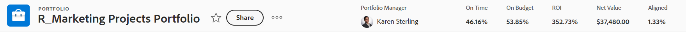
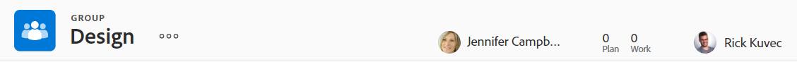
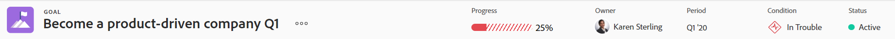

# 개체 헤더 개요

의 객체에 대한 정보를 한 눈에 볼 수 있습니다 [!DNL Adobe Workfront] 헤더 검토

헤더에는 객체 이름 외에도 객체 소유자, 상태 또는 완료율이 포함될 수 있습니다.

[!DNL Workfront] 은(는) 개체 이름에 우선 순위를 부여하고, 헤더에서 가능한 한 많은 공간을 할당하는 것입니다. 개체 이름이 너무 길면 잘립니다. 개체의 전체 이름을 표시하려면 개체 위로 마우스를 가져가면 됩니다.

## 개체의 헤더에 액세스합니다

의 개체 헤더에 액세스 [!DNL Workfront] 이 변수는 있는 모든 개체에 대해 동일합니다.

예를 들어 프로젝트의 헤더에 액세스하려면

1. 프로젝트로 이동합니다.\
   헤더는 페이지 맨 위에 표시되고 프로젝트 이름이 포함되어 있습니다.

   

## [!UICONTROL 홈] 헤더 개요

홈에서는 다음 헤더를 사용할 수 있습니다.

* 작업: 이 헤더를 사용하는 방법에 대한 자세한 내용은 [작업 헤더 개요](#task-header-overview) 참조하십시오.
* 문제: 이 헤더를 사용하는 방법에 대한 자세한 내용은 [문제 헤더 개요](#issue-header-overview) 참조하십시오.

## 사용자 지정 가능한 헤더

사용자 [!DNL Workfront]  또는 그룹 관리자는 레이아웃 템플릿을 사용하여 프로젝트, 작업 및 문제의 헤더를 사용자 지정할 수 있습니다.

이 문서에서는 프로젝트 및 작업 및 문제를 포함하여 모든 개체의 기본 헤더를 설명합니다.

객체 헤더에 대한 정보 사용자 지정에 대한 자세한 내용은 [레이아웃 템플릿을 사용하여 개체 머리글 사용자 지정](../../administration-and-setup/customize-workfront/use-layout-templates/customize-object-headers.md).

## 프로젝트 헤더 개요

프로젝트 헤더에는 기본적으로 다음 정보가 표시됩니다.

<table style="table-layout:auto"> 
 <col> 
 <col> 
 <thead> 
  <tr> 
   <th>헤더 정보</th> 
   <th>메모</th> 
  </tr> 
 </thead> 
 <tbody> 
  <tr> 
   <td role="rowheader">상위 개체가 있는 탐색 표시</td> 
   <td>프로젝트가 프로그램 또는 포트폴리오와 연결된 경우 헤더의 왼쪽 위 모서리에 있는 탐색 표시에 표시됩니다. 상위 이름을 클릭하면 해당 상위 개체가 열립니다.</td> 
  </tr> 
  <tr data-mc-conditions=""> 
   <td role="rowheader">개체 아이콘 </td> 
   <td> 
자주색 [!UICONTROL Project] 아이콘  프로젝트 이름의 왼쪽에 이 표시됩니다.
 </td> 
  </tr> 
  <tr> 
   <td role="rowheader">프로젝트 이름</td> 
   <td>헤더에서 프로젝트 이름을 편집할 수 있습니다.</td> 
  </tr> 
  <tr> 
   <td role="rowheader">개체 유형의 이름</td> 
   <td> 
"[!UICONTROL PROJECT]" 텍스트가 헤더의 프로젝트 이름 위에 표시됩니다.
 </td> 
  </tr> 
  <tr> 
   <td role="rowheader">작업의 작업 영역</td> 
   <td> 
프로젝트 이름 옆에 작업 영역이 표시됩니다.
 
  
  </td> 
  </tr> 
  <tr> 
   <td role="rowheader">[!UICONTROL Percent Complete]</td> 
   <td>헤더에서는 프로젝트 완료율을 편집할 수 없습니다.</td> 
  </tr> 
  <tr> 
   <td role="rowheader">[!UICONTROL 프로젝트 소유자]</td> 
   <td> 
헤더에서 [!UICONTROL 프로젝트 소유자]를 편집할 수 있습니다.
 </td> 
  </tr> 
  <tr> 
   <td role="rowheader">[!UICONTROL 계획된 완료 날짜] </td> 
   <td> 
[!UICONTROL 완료 날짜]에서 프로젝트를 예약한 경우 헤더에서 프로젝트 [!UICONTROL 계획 완료 날짜] 및 시간을 편집할 수 있습니다. 프로젝트가 [!UICONTROL 시작 날짜]에서 예약된 경우 이 정보는 프로젝트의 작업에서 업데이트됩니다.
 </td> 
  </tr> 
  <tr> 
   <td role="rowheader">[!UICONTROL Condition] </td> 
   <td> 
프로젝트의 [!UICONTROL 조건 유형]을 수동으로 설정하면 헤더에서 프로젝트 [!UICONTROL 조건]을 업데이트할 수 있습니다.
</td> 
  </tr> 
  <tr> 
   <td role="rowheader">[!UICONTROL 상태]</td> 
   <td>헤더에서 프로젝트 [!UICONTROL 상태]를 편집할 수 있습니다.</td> 
  </tr> 
  <tr> 
   <td role="rowheader">[!UICONTROL Approvals] 영역</td> 
   <td> 
승인자 중 하나인 경우 다음 아이콘을 사용하여 프로젝트의 승인을 관리합니다.
 
  </img> [!UICONTROL Approve]
 
  </img> [!UICONTROL 거부]
 
  </img> [!UICONTROL Recall]
 
승인자가 아닌 경우 [!UICONTROL 자세히] 아이콘을 클릭합니다  현재 승인 단계에 대한 정보를 보려면
 
승인에 대한 자세한 내용은 <a href="../../review-and-approve-work/manage-approvals/approval-process-in-workfront.md" class="MCXref xref">승인 프로세스 개요</a>.
 </td> 
  </tr> 
 </tbody> 
</table>

## 작업 헤더 개요

작업 헤더에는 기본적으로 다음 정보가 포함됩니다.

<table style="table-layout:auto"> 
 <col> 
 <col> 
 <thead> 
  <tr> 
   <th>헤더 정보</th> 
   <th>메모</th> 
  </tr> 
 </thead> 
 <tbody> 
  <tr> 
   <td role="rowheader">상위 개체가 있는 탐색 표시</td> 
   <td> 
작업의 상위 객체가 이동 경로에 표시됩니다. 상위 이름을 클릭하면 해당 상위 개체가 열립니다.
 
자세한 내용은 <a href="../../workfront-basics/the-new-workfront-experience/breadcrumb-overview.md" class="MCXref xref">탐색 표시 개요</a>.
 </td> 
  </tr> 
  <tr data-mc-conditions=""> 
   <td role="rowheader">개체 아이콘 </td> 
   <td> 
녹색 [!UICONTROL Task] 아이콘  작업 이름의 왼쪽에 표시됩니다.
 </td> 
  </tr> 
  <tr> 
   <td role="rowheader">작업의 이름</td> 
   <td>헤더에서 작업 이름을 편집할 수 있습니다.</td> 
  </tr> 
  <tr> 
   <td role="rowheader">개체 유형의 이름</td> 
   <td> 
"[!UICONTROL TASK]" 텍스트가 헤더의 작업 이름 위에 표시됩니다.
 </td> 
  </tr> 
  <tr> 
   <td role="rowheader">작업의 작업 영역</td> 
   <td> 
작업 이름 옆에 [!UICONTROL 작업] 영역이 표시됩니다.
 
  
 
종속성 아이콘이 표시되면 아이콘을 클릭하여 작업에 대한 선행 작업 또는 후속 작업을 볼 수 있습니다.
 </td> 
  </tr> 
  <tr> 
   <td role="rowheader">[!UICONTROL Percent Complete]</td> 
   <td>헤더에서 완료율을 편집할 수 있습니다.</td> 
  </tr> 
  <tr> 
   <td role="rowheader">[!UICONTROL Assignments]</td> 
   <td>헤더에서 작업 할당을 편집할 수 있습니다.</td> 
  </tr> 
  <tr> 
   <td role="rowheader"> 
[!UICONTROL Work on It], [!UICONTROL Done] 또는 [!UICONTROL Start Task] 단추
 </td> 
   <td> 
작업이 할당되면 [!UICONTROL Work on It]를 클릭할 수 있습니다 또는 [!UICONTROL 시작 작업] 단추를 사용하여 작업을 수행하고 있음을 나타내거나 [!UICONTROL 완료] 단추를 클릭하여 작업을 완료했음을 나타냅니다.
 
[!UICONTROL Work On It] 단추를 [!UICONTROL Start Task] 단추로 대체하는 방법에 대한 자세한 내용은 다음을 참조하십시오 <a href="../../people-teams-and-groups/create-and-manage-teams/work-on-it-button-to-start-button.md" class="MCXref xref">[!UICONTROL Work On It] 단추를 [!UICONTROL 시작] 단추로 바꿉니다.</a>.
 </td> 
  </tr> 
  <tr> 
   <td role="rowheader">[!UICONTROL 계획된 완료 날짜]</td> 
   <td> 
[!UICONTROL 계획된 완료 날짜] 작업을 편집할 수 있습니다 및 시간 헤더.
 
팁: 헤더에 [!UICONTROL 커밋 날짜]가 표시되지 않습니다. [!UICONTROL 세부 사항] 페이지에서 볼 수 있습니다.
 </td> 
  </tr> 
  <tr> 
   <td role="rowheader">[!UICONTROL 상태]</td> 
   <td>헤더에서 [!UICONTROL 상태] 작업을 편집할 수 있습니다.</td> 
  </tr> 
  <tr> 
   <td role="rowheader">[!UICONTROL Approvals] 영역</td> 
   <td> 
승인자 중 하나인 경우 다음 아이콘을 사용하여 작업에 대한 승인을 관리합니다.
 
  </img> [!UICONTROL Approve]
 
  </img> [!UICONTROL 거부]
 
  </img> [!UICONTROL Recall]
 
승인자가 아닌 경우 [!UICONTROL 자세히] 아이콘을 클릭합니다  현재 승인 단계에 대한 정보를 보려면
 
승인에 대한 자세한 내용은 <a href="../../review-and-approve-work/manage-approvals/approval-process-in-workfront.md" class="MCXref xref">승인 프로세스 개요</a>.
 </td> 
  </tr> 
 </tbody> 
</table>

## 문제 헤더 개요

문제 헤더에는 기본적으로 다음 정보가 포함되어 있습니다.

<table style="table-layout:auto"> 
 <col> 
 <col> 
 <thead> 
  <tr> 
   <th>헤더 정보</th> 
   <th>메모</th> 
  </tr> 
 </thead> 
 <tbody> 
  <tr> 
   <td role="rowheader">상위 개체가 있는 탐색 표시</td> 
   <td> 
문제의 상위 개체가 이동 경로에 표시됩니다. 상위 이름을 클릭하면 해당 상위 개체가 열립니다.
 
자세한 내용은 <a href="../../workfront-basics/the-new-workfront-experience/breadcrumb-overview.md" class="MCXref xref">탐색 표시 개요</a>.
 </td> 
  </tr> 
  <tr> 
   <td role="rowheader">개체 아이콘 </td> 
   <td> 
분홍색 [!UICONTROL Issue] 아이콘  문제 이름의 왼쪽에 이 표시됩니다.
 </td> 
  </tr> 
  <tr> 
   <td role="rowheader">문제 이름</td> 
   <td>헤더에서 문제 이름을 편집할 수 있습니다.</td> 
  </tr> 
  <tr> 
   <td role="rowheader">개체 유형의 이름</td> 
   <td> 
"[!UICONTROL ISSUE]" 텍스트가 헤더의 문제 이름 위에 표시됩니다.
 </td> 
  </tr> 
  <tr> 
   <td role="rowheader">문제의 작업 영역</td> 
   <td> 
문제 이름 옆에 [!UICONTROL 작업] 영역이 표시됩니다.
 
  
 
[!UICONTROL 종속성] 아이콘이 표시되면 아이콘을 클릭하여 문제에 대한 선행 작업 또는 후속 작업을 볼 수 있습니다.
  </td> 
  </tr> 
  <tr> 
   <td role="rowheader">[!UICONTROL Percent Complete]</td> 
   <td> 
헤더에서 문제 완료율을 편집할 수 있습니다.
 </td> 
  </tr> 
  <tr> 
   <td role="rowheader">[!UICONTROL Assignments]</td> 
   <td>헤더에서 문제 지정을 편집할 수 있습니다.</td> 
  </tr> 
  <tr> 
   <td role="rowheader">[!UICONTROL Work on It], [!UICONTROL Done], 또는 [!UICONTROL 시작 문제] 단추</td> 
   <td>문제가 할당되면 [!UICONTROL Work on It]를 클릭할 수 있습니다 또는 [!UICONTROL 시작 문제] 단추를 클릭하여 현재 문제 작업을 수행하고 있음을 나타내거나 [!UICONTROL 완료] 단추를 클릭하여 문제를 완료했음을 나타냅니다.[!UICONTROL Work On It] 단추를 [!UICONTROL Start Task] 단추로 대체하는 방법에 대한 자세한 내용은 다음을 참조하십시오 <a href="../../people-teams-and-groups/create-and-manage-teams/work-on-it-button-to-start-button.md" class="MCXref xref">[!UICONTROL Work On It] 단추를 [!UICONTROL 시작] 단추로 바꿉니다.</a>.</td> 
  </tr> 
  <tr> 
   <td role="rowheader">[!UICONTROL 계획된 완료 날짜]</td> 
   <td> 
[!UICONTROL 계획된 완료 날짜] 문제를 편집할 수 있습니다 및 시간 헤더.
 
팁: 헤더에 [!UICONTROL 커밋 날짜]가 표시되지 않습니다. [!UICONTROL 세부 사항] 페이지에서 볼 수 있습니다.
 </td> 
  </tr> 
  <tr> 
   <td role="rowheader">[!UICONTROL 상태]</td> 
   <td>헤더에서 문제 [!UICONTROL 상태]를 편집할 수 있습니다.</td> 
  </tr> 
  <tr> 
   <td role="rowheader">[!UICONTROL Approvals] 영역</td> 
   <td> 
승인자 중 하나인 경우 다음 아이콘을 사용하여 문제에 대한 승인을 관리합니다.
 
  [!UICONTROL Approve]
 
  [!UICONTROL 거부]
 
  [!UICONTROL Recall]
 
승인자가 아닌 경우 [!UICONTROL 자세히] 아이콘을 클릭합니다  현재 승인 단계에 대한 정보를 보려면
 
승인에 대한 자세한 내용은 <a href="../../review-and-approve-work/manage-approvals/approval-process-in-workfront.md" class="MCXref xref">승인 프로세스 개요</a>.
 </td> 
  </tr> 
 </tbody> 
</table>

## 프로그램 헤더 개요

프로그램 헤더에는 다음 정보가 표시됩니다.

<table style="table-layout:auto"> 
 <col> 
 <col> 
 <thead> 
  <tr> 
   <th>헤더 정보</th> 
   <th>메모</th> 
  </tr> 
 </thead> 
 <tbody> 
  <tr> 
   <td role="rowheader">Portfolio 이름이 있는 탐색 표시</td> 
   <td> 
[!UICONTROL Program]의 헤더에서 [!UICONTROL Portfolio]에 액세스할 수 있습니다. 상위 이름을 클릭하면 해당 상위 개체가 열립니다.
 
자세한 내용은 <a href="../../workfront-basics/the-new-workfront-experience/breadcrumb-overview.md" class="MCXref xref">탐색 표시 개요</a>.
 </td> 
  </tr> 
  <tr> 
   <td role="rowheader">개체 아이콘 </td> 
   <td> 
주황색 [!UICONTROL Program] 아이콘  프로그램 이름의 왼쪽에 표시됩니다.
 </td> 
  </tr> 
  <tr> 
   <td role="rowheader">프로그램 이름</td> 
   <td>헤더에서 프로그램 이름을 편집할 수 있습니다.</td> 
  </tr> 
  <tr> 
   <td role="rowheader">개체 유형의 이름</td> 
   <td> 
프로그램이 [!UICONTROL Active]로 표시된 경우 "[!UICONTROL PROGRAM]" 텍스트가 헤더의 프로그램 이름 위에 표시됩니다.
 </td> 
  </tr> 
  <tr> 
   <td role="rowheader">활성화 상태</td> 
   <td> 
프로그램이 비활성화되면 "[!UICONTROL PROGRAM DEACTIVATED]" 텍스트가 헤더의 프로그램 이름 위에 표시됩니다.
 </td> 
  </tr> 
  <tr> 
   <td role="rowheader">프로그램의 작업 영역</td> 
   <td> 
프로그램 이름 옆에 [!UICONTROL 작업] 영역이 표시됩니다.
 
  
 </td> 
  </tr> 
  <tr> 
   <td role="rowheader">[!UICONTROL Percent Complete]</td> 
   <td> 
헤더에서 프로그램의 [!UICONTROL 완료율]을 편집할 수 없습니다. 이 정보는 프로그램의 프로젝트에서 업데이트됩니다.
 
팁: 기본적으로 프로그램 완료율은 프로그램에 속한 [!UICONTROL Current] 또는 [!UICONTROL Approved Status]에서 프로젝트의 완료율 값의 평균입니다.
 </td> 
  </tr> 
  <tr> 
   <td role="rowheader">[!UICONTROL 프로그램 관리자]</td> 
   <td> 
헤더에서 [!UICONTROL 프로그램 관리자]를 편집할 수 있습니다. [!UICONTROL 프로그램 소유자]와 동일합니다.
 </td> 
  </tr> 
  <tr> 
   <td role="rowheader">[!UICONTROL 계획된 완료 날짜]</td> 
   <td>헤더에서는 프로그램 [!UICONTROL 계획된 완료 날짜]를 편집할 수 없습니다. 이 정보는 프로그램에 있는 프로젝트의 [!UICONTROL 계획 완료 날짜]에서 업데이트됩니다.</td> 
  </tr> 
  <tr> 
   <td role="rowheader">[!UICONTROL 활성 프로젝트 조건]</td> 
   <td>이는 프로그램에서 [!UICONTROL Condition]이 [!UICONTROL On Target], [!UICONTROL At Risk] 또는 [!UICONTROL In Trol]으로 설정된 활성 프로젝트의 백분율을 계산합니다.</td> 
  </tr> 
 </tbody> 
</table>

## Portfolio 헤더 개요 {#portfolio-header-overview}

포트폴리오 헤더에는 다음 정보가 포함됩니다.

<table style="table-layout:auto"> 
 <col> 
 <col> 
 <thead> 
  <tr> 
   <th>헤더 정보</th> 
   <th>메모</th> 
  </tr> 
 </thead> 
 <tbody> 
  <tr> 
   <td role="rowheader">개체 아이콘 </td> 
   <td> 
파란색 [!UICONTROL Portfolio] 아이콘 포트폴리오 이름의 왼쪽에 표시됩니다.
 </td> 
  </tr> 
  <tr> 
   <td role="rowheader">포트폴리오의 이름</td> 
   <td>헤더에서 포트폴리오 이름을 편집할 수 있습니다.</td> 
  </tr> 
  <tr> 
   <td role="rowheader">개체 유형의 이름</td> 
   <td> 
포트폴리오가 활성으로 표시된 경우 "[!UICONTROL PORTFOLIO]" 텍스트가 헤더의 포트폴리오 이름 위에 표시됩니다.
 </td> 
  </tr> 
  <tr> 
   <td role="rowheader">활성화 상태</td> 
   <td> 
포트폴리오가 비활성화되면 "[!UICONTROL PORTFOLIO DEACTIVATED]" 텍스트가 헤더의 포트폴리오 이름 위에 표시됩니다.
 </td> 
  </tr> 
  <tr> 
   <td role="rowheader">포트폴리오의 [!UICONTROL 작업] 영역</td> 
   <td> 
포트폴리오의 이름 옆에 [!UICONTROL 작업] 영역이 표시됩니다.
 
  
</td> 
  </tr> 
  <tr> 
   <td role="rowheader">[!UICONTROL Portfolio 관리자]</td> 
   <td>헤더에서 [!UICONTROL Portfolio 관리자]를 편집할 수 있습니다. [!UICONTROL Portfolio 소유자]와 동일합니다.</td> 
  </tr> 
  <tr> 
   <td role="rowheader">[!UICONTROL On Time]</td> 
   <td>포트폴리오에서 현재 설정 중인 프로젝트의 백분율을 계산한 것입니다.</td> 
  </tr> 
  <tr> 
   <td role="rowheader">[!UICONTROL On Budget]</td> 
   <td>이는 현재 포트폴리오의 프로젝트 중 예산이 얼마나 되는지에 대한 계산이다.</td> 
  </tr> 
  <tr> 
   <td role="rowheader">[!UICONTROL Aligned]</td> 
   <td>포트폴리오에서 프로젝트의 백분율이 포트폴리오에 정렬되는 것을 계산할 수 있습니다.</td> 
  </tr> 
  <tr> 
   <td role="rowheader">[!UICONTROL ROI]</td> 
   <td>포트폴리오의 모든 프로젝트에 대한 [!UICONTROL Return on Investment] 계산입니다.</td> 
  </tr> 
  <tr> 
   <td role="rowheader">[!UICONTROL Net Value]</td> 
   <td>포트폴리오의 모든 프로젝트에 대한 [!UICONTROL Net Value] 계산입니다.</td> 
  </tr> 
 </tbody> 
</table>

## 템플릿 헤더 개요 {#template-header-overview}

템플릿 헤더에는 다음 정보가 표시됩니다.

<table style="table-layout:auto"> 
 <col> 
 <col> 
 <thead> 
  <tr> 
   <th>헤더 정보</th> 
   <th>메모</th> 
  </tr> 
 </thead> 
 <tbody> 
  <tr> 
   <td role="rowheader">개체 아이콘 </td> 
   <td> 
녹색 [!UICONTROL 템플릿] 아이콘 템플릿 이름의 왼쪽에 표시됩니다.
 </td> 
  </tr> 
  <tr> 
   <td role="rowheader">템플릿 이름</td> 
   <td>헤더에서 템플릿 이름을 편집할 수 있습니다.</td> 
  </tr> 
  <tr> 
   <td role="rowheader">개체 유형의 이름</td> 
   <td> 
템플릿이 활성으로 표시되면 "[!UICONTROL TEMPLATE]" 텍스트가 헤더의 템플릿 이름 위에 표시됩니다.
 </td> 
  </tr> 
  <tr> 
   <td role="rowheader">활성화 상태</td> 
   <td> 
템플릿이 비활성화되면 "[!UICONTROL TEMPLATE DEACTIVATED]" 텍스트가 헤더의 템플릿 이름 위에 표시됩니다.
 </td> 
  </tr> 
  <tr> 
   <td role="rowheader">템플릿의 작업 영역입니다</td> 
   <td> 
템플릿 이름 옆에 작업 영역이 표시됩니다.
 
  
 </td> 
  </tr> 
  <tr> 
   <td role="rowheader">[!UICONTROL Template Owner]</td> 
   <td>헤더에서 [!UICONTROL 템플릿 소유자] 필드를 편집할 수 있습니다.</td> 
  </tr> 
  <tr> 
   <td role="rowheader">[!UICONTROL Duration]</td> 
   <td>템플릿의 기간입니다. 헤더에서는 이 필드를 편집할 수 없습니다.</td> 
  </tr> 
 </tbody> 
</table>

## 템플릿 작업 헤더 개요

템플릿 작업 헤더에 다음 정보가 표시됩니다.

<table style="table-layout:auto"> 
 <col> 
 <col> 
 <thead> 
  <tr> 
   <th>헤더 정보</th> 
   <th>메모</th> 
  </tr> 
 </thead> 
 <tbody> 
  <tr> 
   <td role="rowheader">상위 개체로 이동 경로</td> 
   <td> 
템플릿 작업의 상위 객체가 이동 경로에 표시됩니다. 상위 개체의 이름을 클릭하면 해당 상위 개체가 열립니다.
 
자세한 내용은 <a href="../../workfront-basics/the-new-workfront-experience/breadcrumb-overview.md" class="MCXref xref">탐색 표시 개요</a>.
 </td> 
  </tr> 
  <tr> 
   <td role="rowheader">개체 아이콘 </td> 
   <td> 
녹색 [!UICONTROL Task] 아이콘 템플릿 작업 이름의 왼쪽에 표시됩니다.
 </td> 
  </tr> 
  <tr> 
   <td role="rowheader">템플릿 작업의 이름</td> 
   <td>헤더에서 템플릿 작업 이름을 편집할 수 있습니다.</td> 
  </tr> 
  <tr> 
   <td role="rowheader">개체 유형의 이름</td> 
   <td> 
"[!UICONTROL TEMPLATE TASK]" 텍스트가 헤더의 템플릿 작업 이름 위에 표시됩니다.
 </td> 
  </tr> 
  <tr> 
   <td role="rowheader">템플릿 작업의 작업 영역</td> 
   <td> 
템플릿 작업의 이름 옆에 작업 영역이 표시됩니다.
 
  
 </td> 
  </tr> 
  <tr> 
   <td role="rowheader">[!UICONTROL Assignments]</td> 
   <td>헤더에서 템플릿 작업의 [!UICONTROL 할당]을 편집할 수 있습니다.</td> 
  </tr> 
  <tr> 
   <td role="rowheader">[!UICONTROL 완료일]</td> 
   <td>템플릿 작업이 완료되어야 하는 템플릿 기간(일)입니다.</td> 
  </tr> 
 </tbody> 
</table>

## 청구 레코드 헤더 개요

청구 레코드 헤더에는 다음 정보가 표시됩니다.

<table style="table-layout:auto"> 
 <col> 
 <col> 
 <thead> 
  <tr> 
   <th>헤더 정보</th> 
   <th>메모</th> 
  </tr> 
 </thead> 
 <tbody> 
  <tr> 
   <td role="rowheader">상위 개체로 이동 경로</td> 
   <td> 
청구 레코드의 상위 객체가 이동 경로에 표시됩니다. 상위 개체의 이름을 클릭하면 해당 상위 개체가 열립니다.
 
자세한 내용은 <a href="../../workfront-basics/the-new-workfront-experience/breadcrumb-overview.md" class="MCXref xref">탐색 표시 개요</a>.
 </td> 
  </tr> 
  <tr> 
   <td role="rowheader">개체 아이콘 </td> 
   <td> 
파란색 [!UICONTROL Billing Record] 아이콘  청구 레코드 이름의 왼쪽에 표시됩니다.
 </td> 
  </tr> 
  <tr> 
   <td role="rowheader">청구 레코드의 이름</td> 
   <td>헤더에서 청구 레코드의 이름을 편집할 수 있습니다.</td> 
  </tr> 
  <tr> 
   <td role="rowheader">개체 유형의 이름</td> 
   <td> 
"[!UICONTROL BILLING RECORD]" 텍스트가 헤더의 청구 레코드 이름 위에 표시됩니다.
 </td> 
  </tr> 
  <tr> 
   <td role="rowheader">청구 레코드의 작업 영역</td> 
   <td> 
청구 레코드의 이름 옆에 [!UICONTROL 자세히] 메뉴가 있습니다  표시 - 다음 옵션을 선택할 수 있습니다.
 
    <ul> 
     <li> 
[!UICONTROL Edit]
 </li> 
     <li> 
 
 </li> 
    </ul> </td> 
  </tr> 
  <tr> 
   <td role="rowheader">[!UICONTROL 청구 레코드 합계]</td> 
   <td>청구 레코드의 총 금액입니다. 이 필드는 편집할 수 없습니다.</td> 
  </tr> 
  <tr> 
   <td role="rowheader">[!UICONTROL 청구 날짜]</td> 
   <td>청구 레코드가 생성될 때 수동으로 변경하지 않는 한, 청구 레코드가 생성된 날짜입니다. 헤더에서 [!UICONTROL 청구 날짜]를 편집할 수 있습니다.</td> 
  </tr> 
  <tr> 
   <td role="rowheader">[!UICONTROL 상태]</td> 
   <td> 
청구 레코드의 상태가 [!UICONTROL 청구됨]이면 더 이상 편집할 수 없습니다.
 
헤더에서 청구 레코드의 상태를 편집할 수 있습니다.
 </td> 
  </tr> 
 </tbody> 
</table>

## 사용자 헤더 개요

사용자 헤더에는 다음 정보가 표시됩니다.

<table style="table-layout:auto"> 
 <col> 
 <col> 
 <thead> 
  <tr> 
   <th>헤더 정보</th> 
   <th>메모</th> 
  </tr> 
 </thead> 
 <tbody> 
  <tr> 
   <td role="rowheader">사용자의 프로필 사진</td> 
   <td>헤더에서는 프로필 사진을 업데이트할 수 없습니다.</td> 
  </tr> 
  <tr> 
   <td role="rowheader">사용자 이름 및 제목</td> 
   <td> 
 사용자의 제목은 이름의 모든 대문자로 표시됩니다. 헤더에서는 사용자 이름을 편집할 수 없습니다.
 </td> 
  </tr> <!--
   <tr> 
    <td role="rowheader">Name of the object type</td> 
    <td> 
The name of the object type does not display.
 </td> 
   </tr>
  --> 
  <tr> 
   <td role="rowheader">활성화 상태</td> 
   <td> 
사용자가 비활성화된 경우 헤더의 모든 텍스트와 프로필 사진은 흐리게 표시됩니다.
 </td> 
  </tr> 
  <tr> 
   <td role="rowheader">사용자의 작업 영역</td> 
   <td> 
사용자 이름 옆에 작업 영역이 표시됩니다.
 
  
</td> 
  </tr> 
  <tr> 
   <td role="rowheader">이메일 주소</td> 
   <td>헤더에서는 이메일 주소를 편집할 수 없습니다. 일반적으로 사용자 이름입니다.</td> 
  </tr> 
  <tr> 
   <td role="rowheader">전화번호</td> 
   <td>헤더에서는 전화 번호를 편집할 수 없습니다.</td> 
  </tr> 
  <tr> 
   <td role="rowheader">팀</td> 
   <td> 
사용자가 속한 팀을 볼 수 있습니다. 팀 아바타 위로 마우스를 가져가면 팀 이름이 표시됩니다. 헤더에서 팀을 편집할 수 없습니다.
 </td> 
  </tr> 
 </tbody> 
</table>

## 팀 헤더 개요

팀 헤더에는 다음 정보가 표시됩니다.

<table style="table-layout:auto"> 
 <col> 
 <col> 
 <thead> 
  <tr> 
   <th>헤더 정보</th> 
   <th>메모</th> 
  </tr> 
 </thead> 
 <tbody> 
  <tr> 
   <td role="rowheader">개체 아이콘 </td> 
   <td> 
자주색 [!UICONTROL Team] 아이콘  팀 이름의 왼쪽에 표시됩니다.
 </td> 
  </tr> 
  <tr> 
   <td role="rowheader">팀 이름</td> 
   <td>헤더에서 팀 이름을 편집할 수 있습니다.</td> 
  </tr> 
  <tr> 
   <td role="rowheader">개체 유형의 이름</td> 
   <td> 
"[!UICONTROL TEAM]" 텍스트가 헤더의 팀 이름 위에 표시됩니다.
 </td> 
  </tr> 
  <tr> 
   <td role="rowheader">팀의 작업 영역입니다</td> 
   <td> 
팀 이름 옆에 [!UICONTROL 작업] 영역이 표시됩니다.
 
  
</td> 
  </tr> 
  <tr> 
   <td role="rowheader">팀 구성원 프로필 사진</td> 
   <td>팀 구성원의 프로필 사진입니다. 사진 위에 마우스를 올려 놓으면 사용자의 이름이 표시됩니다.</td> 
  </tr> 
  <tr> 
   <td role="rowheader">설명</td> 
   <td>팀 구성원에 대한 간략한 설명입니다. 헤더에서는 팀 설명을 편집할 수 없습니다.</td> 
  </tr> 
 </tbody> 
</table>

## 반복 헤더 개요

이터레이션 헤더에 다음 정보가 표시됩니다.

<table style="table-layout:auto"> 
 <col> 
 <col> 
 <thead> 
  <tr> 
   <th>헤더 정보</th> 
   <th>메모</th> 
  </tr> 
 </thead> 
 <tbody> 
  <tr> 
   <td role="rowheader">개체 아이콘 </td> 
   <td> 
주황색 [!UICONTROL Iteration] 아이콘  반복 이름의 왼쪽에 표시됩니다.
 </td> 
  </tr> 
  <tr> 
   <td role="rowheader">반복 이름</td> 
   <td>헤더에서 이터레이션 이름을 편집할 수 있습니다.</td> 
  </tr> 
  <tr> 
   <td role="rowheader">개체 유형의 이름</td> 
   <td> 
"[!UICONTROL ITERATION]" 텍스트가 헤더의 반복 이름 위에 표시됩니다.
 </td> 
  </tr> 
  <tr> 
   <td role="rowheader">반복의 작업 영역</td> 
   <td> 
헤더의 오른쪽 위 모서리에 작업 영역이 표시됩니다.
 
  
</td> 
  </tr> 
  <tr> 
   <td role="rowheader">소유자</td> 
   <td>이터레이션의 [!UICONTROL 소유자]입니다. 헤더에서는 [!UICONTROL Owner]를 편집할 수 없습니다.</td> 
  </tr> 
  <tr> 
   <td role="rowheader">[!UICONTROL Timeline]</td> 
   <td>[!UICONTROL 타임라인]은 반복의 시작 날짜와 종료 날짜를 표시합니다. 헤더에서는 [!UICONTROL 타임라인] 을 편집할 수 없습니다.</td> 
  </tr> 
  <tr> 
   <td role="rowheader">[!UICONTROL Team]</td> 
   <td>헤더에서는 반복되는 팀을 편집할 수 없습니다. 팀 이름을 클릭하면 팀 페이지로 이동합니다.</td> 
  </tr> 
 </tbody> 
</table>

## 그룹 헤더 개요

그룹 헤더에는 다음 정보가 표시됩니다.

<table style="table-layout:auto"> 
 <col> 
 <col> 
 <thead> 
  <tr> 
   <th>헤더 정보</th> 
   <th>메모</th> 
  </tr> 
 </thead> 
 <tbody> 
  <tr> 
   <td role="rowheader">개체 아이콘 </td> 
   <td> 
주황색 [!UICONTROL Group] 아이콘  그룹 이름의 왼쪽에 표시됩니다.
 </td> 
  </tr> 
  <tr> 
   <td role="rowheader">그룹 이름</td> 
   <td>헤더에서 그룹 이름을 편집할 수 있습니다.</td> 
  </tr> 
  <tr> 
   <td role="rowheader">개체 유형의 이름</td> 
   <td> 
"[!UICONTROL GROUP]" 텍스트가 헤더의 그룹 이름 위에 표시됩니다.
 </td> 
  </tr> 
  <tr> 
   <td role="rowheader">그룹의 [!UICONTROL 작업] 영역</td> 
   <td> 
그룹 이름 옆에 있는 [!UICONTROL 자세히] 메뉴  표시 - 다음 옵션을 선택할 수 있습니다.
 
    <ul> 
     <li> 
[!UICONTROL Edit]
 </li> 
     <li> 
[!UICONTROL Copy]
 </li> 
     <li> 
[!UICONTROL Delete]
 </li> 
    </ul> </td> 
  </tr> 
  <tr> 
   <td role="rowheader">[!UICONTROL Business Leader]</td> 
   <td>헤더에서 [!UICONTROL Business Leader]를 편집할 수 있습니다.</td> 
  </tr> 
  <tr> 
   <td role="rowheader">[!UICONTROL 사용 중인 라이선스] </td> 
   <td> 
[!UICONTROL Licenses in use] 상자에는 그룹 및 해당 하위 그룹의 [!UICONTROL Plan] 및 [!UICONTROL Work] 라이선스 사용자 수가 표시됩니다. 숫자를 클릭하여 5개의 모든 라이선스 유형에 대한 이 정보를 볼 수 있습니다.
 
자세한 내용은 <a href="../../administration-and-setup/manage-groups/create-and-manage-groups/view-number-licenses-allocated-used-group.md" class="MCXref xref">새 그룹의 그룹에 할당되고 사용되는 라이선스 수 보기 [!DNL Adobe Workfront] 경험</a>.
 </td> 
  </tr> 
  <tr> 
   <td role="rowheader">[!UICONTROL Group Administrators]</td> 
   <td>헤더에서 그룹 관리자를 편집할 수 있습니다.</td> 
  </tr> 
 </tbody> 
</table>

## 문서 헤더 개요

문서 헤더에 다음 정보가 표시됩니다.

<table style="table-layout:auto"> 
 <col> 
 <col> 
 <thead> 
  <tr> 
   <th>헤더 정보</th> 
   <th>메모</th> 
  </tr> 
 </thead> 
 <tbody> 
  <tr> 
   <td role="rowheader">상위 개체가 있는 탐색 표시</td> 
   <td> 
문서의 상위 객체가 이동 경로에 표시됩니다. 상위 개체의 이름을 클릭하면 해당 상위 개체가 열립니다.
 
자세한 내용은 <a href="../../workfront-basics/the-new-workfront-experience/breadcrumb-overview.md" class="MCXref xref">탐색 표시 개요</a>.
 </td> 
  </tr> 
  <tr> 
   <td role="rowheader">개체 아이콘 </td> 
   <td> 
파란색 [!UICONTROL Document] 아이콘  문서 이름의 왼쪽에 표시됩니다.
 </td> 
  </tr> 
  <tr> 
   <td role="rowheader">문서의 이름</td> 
   <td>헤더에서 문서 이름을 편집할 수 있습니다.</td> 
  </tr> 
  <tr> 
   <td role="rowheader">개체 유형의 이름</td> 
   <td> 
"[!UICONTROL DOCUMENT]" 텍스트가 헤더의 문서 이름 위에 표시됩니다.
 </td> 
  </tr> 
  <tr> 
   <td role="rowheader">문서의 작업 영역</td> 
   <td> 
문서 이름 옆에 작업 영역이 표시됩니다.
 
  
</td> 
  </tr> 
  <tr> 
   <td role="rowheader">승인 [!UICONTROL 결정] 영역</td> 
   <td> 
문서가 승인 단계에 있으면 문서 헤더의 오른쪽 위 모서리에 [!UICONTROL 결정] 영역이 표시됩니다.
 
다음 아이콘을 사용하여 문서에 대한 승인을 관리합니다.
 
  [!UICONTROL Approve]
 
  [!UICONTROL Recall]
 
  [!UICONTROL 거부]
 
승인 결정에 대한 자세한 내용은 <a href="../../review-and-approve-work/manage-approvals/approving-work.md" class="MCXref xref">작업 승인 </a>.
 </td> 
  </tr> 
 </tbody> 
</table>

## 회사 헤더 개요 {#company-header-overview}

회사 헤더에는 다음 정보가 표시됩니다.

<table style="table-layout:auto"> 
 <col> 
 <col> 
 <thead> 
  <tr> 
   <th>헤더 정보</th> 
   <th>메모</th> 
  </tr> 
 </thead> 
 <tbody> 
  <tr> 
   <td role="rowheader">개체 아이콘 </td> 
   <td> 
파란색 [!UICONTROL Company] 아이콘  회사 이름의 왼쪽에 표시됩니다.
 </td> 
  </tr> 
  <tr> 
   <td role="rowheader">회사 이름</td> 
   <td>헤더에서 회사 이름을 편집할 수 있습니다.</td> 
  </tr> 
  <tr> 
   <td role="rowheader">개체 유형의 이름</td> 
   <td> 
"[!UICONTROL COMPANY]" 텍스트가 헤더의 회사 이름 위에 표시됩니다.
 </td> 
  </tr> 
  <tr> 
   <td role="rowheader">회사의 작업 영역</td> 
   <td> 
회사 이름 옆에 있는 [!UICONTROL 자세히] 메뉴  표시 - 다음 옵션을 선택할 수 있습니다.
 
    <ul> 
     <li> 
[!UICONTROL Edit]
 </li> 
     <li> 
[!UICONTROL 회사 삭제]
 </li> 
    </ul> </td> 
  </tr> 
 </tbody> 
</table>

## 계획 헤더 개요

계획은 [!DNL Workfront Scenario Planner]. 에 대한 정보 [!DNL Scenario Planner]를 참조하십시오. [다음 [!DNL Scenario Planner] 개요](../../scenario-planner/scenario-planner-overview.md).

계획 헤더에는 다음 정보가 표시됩니다.

<table style="table-layout:auto"> 
 <col> 
 <col> 
 <thead> 
  <tr> 
   <th>헤더 정보</th> 
   <th>메모</th> 
  </tr> 
 </thead> 
 <tbody> 
  <tr> 
   <td role="rowheader">플랜으로 돌아가기</td> 
   <td>이 링크를 클릭하면 [!UICONTROL 계획] 목록으로 이동합니다.</td> 
  </tr> 
  <tr> 
   <td role="rowheader">개체 아이콘 </td> 
   <td> 
파란색 [!UICONTROL Plan] 아이콘 계획 이름의 왼쪽에 표시됩니다.
 </td> 
  </tr> 
  <tr> 
   <td role="rowheader">계획의 이름</td> 
   <td>헤더에서 계획 이름을 편집할 수 있습니다.</td> 
  </tr> 
  <tr> 
   <td role="rowheader">개체 유형의 이름</td> 
   <td> 
"[!UICONTROL PLAN]" 텍스트가 헤더의 계획 이름 위에 표시됩니다.
 </td> 
  </tr> 
  <tr> 
   <td role="rowheader">계획의 작업 영역</td> 
   <td> 
계획 이름 옆에 작업 영역이 표시됩니다.
 
  
</td> 
  </tr> 
  <tr> 
   <td role="rowheader">추가 계획 작업</td> 
   <td> 
계획 이름 및 작업 영역 아래에서 다음 작업을 완료할 수 있습니다.
 
    <ul> 
     <li> 
<strong>[!UICONTROL 충돌 표시]</strong>: 이 전환을 클릭하면 이니셔티브에서 충돌을 표시하거나 숨깁니다.
 </li> 
     <li> 
<strong>[!UICONTROL 시나리오 비교]</strong>: 이 링크를 클릭하면 생성한 시나리오에 대한 나란히 비교가 표시됩니다.
 </li> 
     <li> 
<strong>[!UICONTROL 시나리오 선택]</strong>: 이 드롭다운 메뉴에서 시나리오를 복사하거나 선택하여 다른 시나리오를 볼 수 있습니다.
 </li> 
    </ul> </td> 
  </tr> 
  <tr> 
   <td role="rowheader">작업 역할 정보</td> 
   <td>[!UICONTROL 작업 역할] 상자에서 계획에 사용할 수 있는 작업 역할 수를 필수 수와 비교하여 확인할 수 있습니다. 상자를 클릭하면 사용 가능한 작업 역할을 조정할 수 있습니다.</td> 
  </tr> 
  <tr> 
   <td role="rowheader">[!UICONTROL Financial] 정보</td> 
   <td>[!UICONTROL Financial] 상자에서 계획에 대한 예산, 비용 및 활용률 비율을 볼 수 있습니다. 상자를 클릭하면 예산 금액을 조정하고 인력 비용이 계획에 포함되었는지 확인할 수 있습니다.</td> 
  </tr> 
  <tr> 
   <td role="rowheader">[!UICONTROL Net Value]</td> 
   <td>[!UICONTROL 순 값] 상자에서 계획에 대해 입력한 예산 및 비용을 기준으로 계획의 순 값을 볼 수 있습니다.</td> 
  </tr> 
  <tr> 
   <td role="rowheader">[!UICONTROL Shared with] 정보</td> 
   <td>계획을 보거나 관리할 수 있는 액세스 권한이 있는 사용자가 헤더의 오른쪽 위 모서리에 표시됩니다. 프로필 사진을 마우스로 가리키면 해당 이름이 표시됩니다.</td> 
  </tr> 
  <tr> 
   <td role="rowheader">[!UICONTROL 게시로 이동]</td> 
   <td>[!UICONTROL 게시로 이동]을 클릭하면 보고 있는 시나리오에서 이니셔티브에 연결된 프로젝트를 만들거나 업데이트할 수 있습니다.</td> 
  </tr> 
 </tbody> 
</table>

## 목표 헤더 개요

회사에서 Workfront 목표에 액세스할 수 있으면 전략적 목표를 만들 수 있습니다. 에 대한 자세한 정보 [!DNL Workfront Goals]를 참조하십시오. [시작하기 [!DNL Adobe Workfront Goals]](../../workfront-goals/goal-management/getting-started-with-wf-goals.md).

목표 헤더에는 다음 정보가 표시됩니다.

<table style="table-layout:auto"> 
 <col> 
 <col> 
 <thead> 
  <tr> 
   <th>헤더 정보</th> 
   <th>메모</th> 
  </tr> 
 </thead> 
 <tbody> 
  <tr> 
   <td role="rowheader">개체 아이콘 </td> 
   <td> 
자주색 [!UICONTROL 목표] 아이콘  목표 이름의 왼쪽에 이 표시됩니다.
 </td> 
  </tr> 
  <tr> 
   <td role="rowheader">목표의 이름</td> 
   <td>헤더에서 목표 이름을 편집할 수 있습니다.</td> 
  </tr> 
  <tr> 
   <td role="rowheader">개체 유형의 이름</td> 
   <td> 
"[!UICONTROL GOAL]" 텍스트가 헤더의 목표 이름 위에 표시됩니다.
 </td> 
  </tr> 
  <tr> 
   <td role="rowheader">목표의 작업 영역</td> 
   <td> 
목표 이름 옆에 작업 영역이 표시됩니다.
 
  

   목표의 작업 영역에서 다음 작업을 수행할 수 있습니다.
   <ul><li>[!UICONTROL Edit]</li>
   <li>[!UICONTROL 복사 목표]</li>
   <li>[!UICONTROL 삭제 목표]</li>
   <li>[!UICONTROL Share]</li>
   <li>[!UICONTROL 활성화] 또는 [!UICONTROL 비활성화]</li>
   <li>[!UICONTROL Close] 또는 [!UICONTROL Reopen]</li>
   </td> 
  </tr> 
  <tr> 
   <td role="rowheader">[!UICONTROL Progress]</td> 
   <td>목표의 백분율로, 목표의 완료율을 나타냅니다. 목표 진행 상태는 업데이트할 수 없습니다. Workfront은 목표에 있는 각 진행률 표시기의 진행 상황을 기반으로 계산합니다.</td> 
  </tr> 
  <tr> 
   <td role="rowheader">[!UICONTROL Owner]</td> 
   <td>이게 목표의 소유자입니다. 목표 소유자를 수동으로 업데이트할 수 있습니다. 사용자, 팀, 그룹 또는 조직이 목표 소유자가 될 수 있습니다.</td> 
  </tr> 
  <tr> 
   <td role="rowheader">[!UICONTROL Period]</td> 
   <td>목표를 완료해야 하는 기간 </td> 
  </tr> 
  <tr> 
   <td role="rowheader">[!UICONTROL Condition]</td> 
   <td>목표 조건은 목표가 제 시간에 완료되는 목표인지, 아니면 뒤쳐지고 있는지를 나타냅니다 </td> 
  </tr> 
  <tr> 
   <td role="rowheader">[!UICONTROL 상태]</td> 
   <td>목표가 활성 상태인지, 신규 상태인지, 아니면 닫힌 상태인지를 나타냅니다. 목표 상태를 수동으로 업데이트할 수 없습니다. 자세한 내용은 <a href="../../workfront-goals/goal-management/goal-status-overview.md" class="MCXref xref">의 목표 상태 개요 [!DNL Adobe Workfront Goals]</a></td> 
  </tr> 
 </tbody> 
</table>