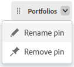

# 페이지를 고정하여 작업 공간 사용자 지정

가장 중요한 작업을 [!DNL Adobe Workfront] 가시성 향상, 조직 향상 및 더욱 신속한 액세스 고정된 페이지는 항상 Workfront의 모든 페이지 맨 위에서 액세스할 수 있습니다.

에 설명된 대로 페이지가 이미 고정된 레이아웃 템플릿에 할당될 수 있습니다 [레이아웃 템플릿을 사용하여 고정된 페이지 사용자 지정](../../administration-and-setup/customize-workfront/use-layout-templates/customize-pinned-pages.md)). 미리 정의된 이러한 핀의 이름을 바꾸거나 제거할 수 없습니다. 핀으로 고정하는 모든 페이지는 사전 정의된 핀의 오른쪽에 표시됩니다.

## 액세스 요구 사항

이 문서의 절차를 수행하려면 다음 액세스 권한이 있어야 합니다.

<table style="table-layout:auto"> 
 <col> 
 </col> 
 <col> 
 </col> 
 <tbody> 
  <tr> 
   <td role="rowheader"><strong>[!DNL Adobe Workfront] 플랜*</strong></td> 
   <td> 
모든
 </td> 
  </tr> 
  <tr> 
   <td role="rowheader"><strong>[!DNL Adobe Workfront] 라이센스*</strong></td> 
   <td> 
[!UICONTROL Request] 이상
 </td> 
  </tr> 
 </tbody> 
</table>

&#42;보유하고 있는 플랜 또는 라이선스 유형을 확인하려면 [!DNL Workfront] 관리자

## 페이지 고정

1. 고정할 페이지로 이동합니다.

   프로젝트, 작업, 요청 큐 등과 같은 모든 작업 항목일 수 있습니다.

1. 클릭 **[!UICONTROL 현재 페이지 고정]** 를 클릭합니다.

   이제 의 모든 페이지 맨 위에서 고정된 페이지에 액세스할 수 있습니다 [!DNL Workfront].

## 고정된 페이지 액세스

1. 페이지 맨 위에서 보려는 고정된 페이지를 클릭합니다.

   >[!TIP]
   >
   >고정된 페이지 위로 마우스를 가져가면 전체 이름과 설명을 볼 수 있습니다.

   또는

   고정된 페이지가 많은 경우 **[!UICONTROL 자세히] 메뉴**  고정된 추가 페이지를 보려면

   고정된 페이지가 표시됩니다.

## 고정된 페이지 이름 바꾸기

고정된 페이지의 이름을 변경할 수 있으므로 사용자에게 더 의미 있습니다.

1. 위쪽 탐색에서 고정된 페이지 위로 마우스를 가져갑니다. **[!UICONTROL 추가 메뉴]**.
1. 핀 이름 옆에 있는 화살표를 클릭하고 을 선택합니다 **[!UICONTROL PIN 이름 바꾸기]**.

   

1. 새 핀 이름을 입력하고 확인 표시 아이콘을 클릭하거나 Enter 키를 누릅니다.

   

   확인 표시를 클릭하거나 Enter 키를 누른 후 몇 초 동안 작은 팝업 창이 나타나므로 PIN 이름 변경을 취소하여 저장할 수 있습니다.

## 고정된 페이지 재정렬

고정된 페이지가 표시되는 순서를 재정렬할 수 있습니다.

1. 위쪽 탐색에서 고정된 페이지 위로 마우스를 가져갑니다. **[!UICONTROL 추가 메뉴]**. 손 커서가 표시되면 핀을 클릭하고 원하는 순서로 드래그합니다.

   변경 사항은 자동으로 저장되고 다음에 Workfront에 액세스할 때 기억됩니다.

## 고정된 페이지 제거

1. 고정 해제할 고정 페이지를 클릭합니다.
1. 클릭 **[!UICONTROL 현재 페이지 고정 해제]** 화면 상단에 있습니다.

   또는

   핀 이름 옆에 있는 화살표를 클릭하고 을 선택합니다 **[!UICONTROL 핀 제거]**.

   

   페이지의 맨 위에서 더 이상 페이지에 액세스할 수 없습니다 [!DNL Workfront].
