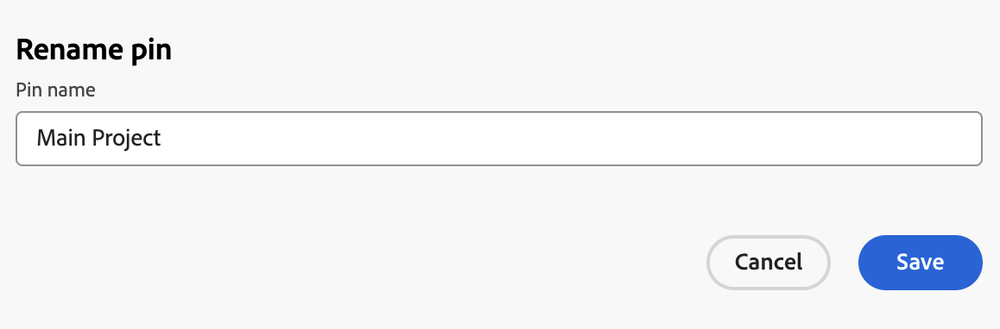

# 페이지를 고정하여 작업 영역 사용자 지정

가시성 향상, 조직 개선 및 빠른 액세스를 위해 [!DNL Adobe Workfront]에서 가장 중요한 작업을 고정할 수 있습니다. 고정된 페이지는 항상 Workfront의 모든 페이지 맨 위에서 액세스할 수 있습니다.

[레이아웃 템플릿을 사용하여 고정된 페이지 사용자 지정](../../administration-and-setup/customize-workfront/use-layout-templates/customize-pinned-pages.md)에 설명된 대로 페이지가 이미 고정된 레이아웃 템플릿에 할당되었을 수 있습니다. 이러한 사전 정의된 핀은 이름을 변경하거나 제거할 수 없습니다. 고정한 모든 페이지가 사전 정의된 고정 항목의 오른쪽에 표시됩니다.

## 액세스 요구 사항

+++ 을 확장하여 이 문서의 기능에 대한 액세스 요구 사항을 봅니다.

이 문서의 단계를 수행하려면 다음 액세스 권한이 있어야 합니다.

<table style="table-layout:auto"> 
 <col> 
 </col> 
 <col> 
 </col> 
 <tbody> 
  <tr> 
   <td role="rowheader"><strong>[!DNL Adobe Workfront] 플랜</strong></td> 
   <td> 
임의
 </td> 
  </tr> 
  <tr> 
   <td role="rowheader"><strong>[!DNL Adobe Workfront] 라이센스</strong></td> 
   <td> 
새로운 기능: 기여자
 
   
또는

     
현재: 요청

   </td> 
  </tr> 
 </tbody> 
</table>

이 표의 정보에 대한 자세한 내용은 [Workfront 설명서의 액세스 요구 사항](/help/quicksilver/administration-and-setup/add-users/access-levels-and-object-permissions/access-level-requirements-in-documentation.md)을 참조하십시오.

+++

## 페이지 고정

1. 고정할 페이지로 이동합니다. 프로젝트, 작업, 요청 대기열 등과 같은 모든 작업 항목일 수 있습니다.

1. 페이지의 왼쪽 상단 모서리에서 **[!UICONTROL 현재 페이지 고정]**&#x200B;을 클릭합니다. 이제 고정된 페이지에 [!DNL Workfront]의 모든 페이지 맨 위에서 액세스할 수 있습니다.

## 고정된 페이지에 액세스

1. 페이지 맨 위에서 보려는 고정된 페이지를 클릭합니다.

   >[!TIP]
   >
   >고정된 페이지에 마우스를 가져다 대면 전체 이름과 설명을 볼 수 있습니다.

   또는

   고정된 페이지가 많으면 **[!UICONTROL 자세히]** 아이콘을 클릭하세요.  고정된 페이지를 더 볼 수 있습니다.

   

   고정된 페이지가 표시됩니다.

## 고정된 페이지 이름 바꾸기

1. 위쪽 탐색에서 고정된 페이지 위로 마우스를 가져갑니다.
1. 핀 이름 옆에 나타나는 **자세히** 아이콘 을 클릭하고 **[!UICONTROL 핀 이름 바꾸기]**&#x200B;를 선택합니다.

   

1. 새 핀 이름을 입력한 다음 **저장**&#x200B;을 클릭합니다.

   

## 고정된 페이지 순서 바꾸기

고정된 페이지가 나타나는 순서를 재정렬할 수 있습니다.

1. 이동할 고정된 페이지 위로 마우스를 가져간 다음 **자세히** 아이콘 을 클릭합니다.
1. 핀을 이동하려면 **왼쪽으로 이동** 또는 **오른쪽으로 이동**&#x200B;을 선택하십시오.
1. (선택 사항) 핀을 핀 막대의 맨 왼쪽 위치로 이동하려면 **앞쪽으로 이동**&#x200B;을 선택합니다.

   

   변경 사항은 자동으로 저장되고 다음에 Workfront에 액세스할 때 기억됩니다.

## 고정된 페이지 제거

1. 제거할 핀 옆에 있는 **자세히** 아이콘 을(를) 클릭합니다.
1. **핀 제거**&#x200B;를 클릭합니다. [!DNL Workfront]의 페이지 맨 위에서 페이지에 더 이상 액세스할 수 없습니다.

   

