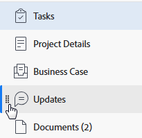

# [!DNL Adobe Workfront]에서 왼쪽 탐색

WF의 대부분의 영역과 오브젝트는 화면 왼쪽에 있는 간단한 탐색 패널을 사용합니다. 왼쪽 패널 탐색의 이점은 다음과 같습니다.

* 화면 공간을 보다 효율적으로 관리할 수 있습니다.
* [!DNL Workfront] 관리자는 레이아웃 템플릿을 사용하여 개체의 세부 정보를 제외한 왼쪽 패널의 모든 섹션을 숨길 수 있습니다.

  레이아웃 템플릿 사용에 대한 자세한 내용은 문서 [레이아웃 템플릿 만들기 및 관리](../../administration-and-setup/customize-workfront/use-layout-templates/create-and-manage-layout-templates.md)를 참조하십시오.

* 원하는 순서대로 끌어서 놓아 추가 화면을 열지 않고도 왼쪽 탐색에서 섹션의 순서를 쉽게 변경할 수 있습니다.

  자세한 내용은 이 문서에서 다음 섹션을 참조하십시오. [왼쪽 탐색 패널 사용](#use-the-left-navigation-panel).

* 대시보드를 추가하여 왼쪽 패널을 사용자 정의할 수 있습니다.

## 액세스 요구 사항

이 문서의 단계를 수행하려면 다음 액세스 권한이 있어야 합니다.

<table style="table-layout:auto"> 
 <col> 
 </col> 
 <col> 
 </col> 
 <tbody> 
  <tr> 
   <td role="rowheader"><strong>[!DNL Adobe Workfront] 플랜*</strong></td> 
   <td> 
임의
 </td> 
  </tr> 
  <tr> 
   <td role="rowheader"><strong>[!DNL Adobe Workfront] 라이센스*</strong></td> 
   <td> 
[!UICONTROL Request] 이상
 </td> 
  </tr> 
 </tbody> 
</table>

&#42;보유 중인 플랜 또는 라이선스 유형을 확인하려면 [!DNL Workfront] 관리자에게 문의하세요.

## 왼쪽 탐색 패널의 기본 섹션

Adobe Workfront의 다양한 오브젝트 또는 영역에 대한 왼쪽 패널에서 오브젝트 또는 영역에 대한 자세한 정보에 액세스할 수 있습니다.

탐색한 개체 또는 영역에 따라 왼쪽 패널에 나타나는 섹션이 다릅니다.

왼쪽 패널은 다음 개체에 사용할 수 있습니다.

* 프로젝트
* 작업
* 문제
* 포트폴리오
* 프로그램
* 템플릿
* 템플릿 작업
* 반복
* 사용자
* 팀
* 그룹
* 목표

>[!IMPORTANT]
>
>왼쪽 패널에 기본적으로 한 개의 섹션만 표시되는 경우(예: **[!UICONTROL 프로젝트]** 영역의 **[!UICONTROL 모든 프로젝트]**) [!DNL Workfront] 관리자는 레이아웃 템플릿을 작성할 때 이 영역에 대시보드를 하나 이상 추가하고 왼쪽 패널이 해당 영역에 표시되기 전에 해당 템플릿에 사용자를 할당해야 합니다.
>&#x200B;>[!DNL Workfront] 관리자가 레이아웃 템플릿에서 왼쪽 패널을 사용자 지정하는 방법에 대한 자세한 내용은 [레이아웃 템플릿을 사용하여 왼쪽 패널 사용자 지정](../../administration-and-setup/customize-workfront/use-layout-templates/customize-left-panel.md)을 참조하십시오.

왼쪽 패널은 다음 영역에 사용할 수 있습니다.

* [[!UICONTROL 대시보드] 영역의 기본 섹션](#default-sections-in-the-dashboards-area)
* [[!UICONTROL 요청] 영역의 기본 섹션](#default-sections-in-the-requests-area)
* [[!UICONTROL 리소스 조달] 영역의 기본 섹션](#default-sections-in-the-resourcing-area)
* [[!UICONTROL 프로젝트] 영역의 기본 섹션](#default-sections-in-the-projects-area)
* [[!UICONTROL 타임시트] 영역의 기본 섹션](#default-sections-in-the-timesheets-area)
* [&#x200B; [!DNL Goals] 영역의 기본 섹션](#default-sections-in-the-goals-area)

### [!UICONTROL 대시보드] 영역의 기본 섹션

**[!UICONTROL 대시보드]** 영역의 왼쪽 패널에 다음 섹션이 표시됩니다.

<table style="table-layout:auto">
    <tr>
        <td><strong>[!UICONTROL 내 대시보드]</strong></td>
        <td>사용자가 빌드한 대시보드를 표시합니다.</td>
    </tr>
    <tr>
        <td><strong>[!UICONTROL 공유 대시보드]</strong></td>
        <td>다른 사용자가 만들고 사용자와 공유한 대시보드를 표시합니다.</td>
    </tr>
    <tr>
        <td><strong>[!UICONTROL 모든 대시보드]</strong></td>
        <td>사용자 또는 다른 사용자가 만든 대시보드와 보기 이상의 권한이 있는 대시보드를 표시합니다.</td>
    </tr>
</table>

대시보드 영역에서 왼쪽 패널을 사용하는 방법에 대해 알아보려면 이 문서의 [왼쪽 탐색 패널 사용](#use-the-left-navigation-panel) 섹션을 참조하십시오.

### [!UICONTROL 요청] 영역의 기본 섹션

<table style="table-layout:auto">
    <tr>
        <td><strong>[!UICONTROL 제출됨]</strong></td>
        <td>사용자 또는 다른 사용자가 제출했으며 보기 이상의 권한이 있는 요청을 표시합니다. 요청 목록의 오른쪽 위 모서리에 있는 필터를 사용하여 다른 사람이 제출한 요청 또는 요청을 볼 수 있으며, 볼 수 있는 액세스 권한이 있습니다.</td>
    </tr>
    <tr>
        <td><strong>[!UICONTROL 초안]</strong></td>
        <td>시작했지만 아직 제출하지 않은 요청을 표시합니다. [!DNL Workfront]은(는) 대기열 주제를 선택한 후 모든 새 요청을 자동으로 임시 보관함에 저장합니다.</td>
    </tr>
</table>

[!UICONTROL 요청] 영역에서 왼쪽 패널을 사용하는 방법에 대해 알아보려면 이 문서의 [왼쪽 탐색 패널 사용](#use-the-left-navigation-panel) 섹션을 참조하십시오.

### [!UICONTROL 리소스 조달] 영역의 기본 섹션

**[!UICONTROL 리소스 조달]** 영역의 왼쪽 패널에 다음 섹션이 표시됩니다.

<table style="table-layout:auto"> 
 <col> 
 <col> 
 <tbody> 
  <tr> 
   <td role="rowheader"><strong>플래너</strong></td> 
   <td>리소스 플래너를 표시합니다. 이 영역을 사용하여 여러 프로젝트에 걸쳐 리소스를 계획할 수 있습니다. 리소스 플래너 사용에 대한 자세한 내용은 <a href="../../resource-mgmt/resource-planning/get-started-resource-planning.md" class="MCXref xref">리소스 계획 시작</a>을 참조하세요.</td> 
  </tr> 
  <tr> 
   <td role="rowheader"><strong>[!UICONTROL 업무 균형자]</strong></td> 
   <td>업무 균형자 를 표시합니다. 이 영역을 사용하여 리소스에 실제 작업을 할당합니다.  
   예약 리소스 사용에 대한 자세한 내용은 <a href="../../resource-mgmt/workload-balancer/assign-work-in-workload-balancer.md" class="MCXref xref">업무 균형자에서 작업 할당 개요</a>를 참조하십시오.</td> 
  </tr> 
  <tr> 
   <td role="rowheader"><strong>활용성</strong></td> 
   <td>활용률 보고서를 표시합니다. 사용률 보고서를 읽는 방법에 대한 자세한 내용은 <a href="../../reports-and-dashboards/reports/using-built-in-reports/resource-utilization-report.md" class="MCXref xref">리소스 사용률 보고서 개요</a>를 참조하십시오.</td> 
  </tr> 
  <tr> 
   <td role="rowheader"><strong>리소스 풀</strong></td> 
   <td>Workfront의 모든 리소스 풀을 표시합니다. 리소스 풀에 대한 자세한 내용은 <a href="../../resource-mgmt/resource-planning/resource-pools/work-with-resource-pools.md" class="MCXref xref"> 리소스 풀 개요 </a>을(를) 참조하십시오.</td>
  </tr> 
 </tbody> 
</table>

[!UICONTROL 리소스 조달] 영역에서 왼쪽 패널을 사용하는 방법에 대해 알아보려면 이 문서의 [왼쪽 탐색 패널 사용](#use-the-left-navigation-panel) 섹션을 참조하십시오.

### [!UICONTROL 프로젝트] 영역의 기본 섹션

**[!UICONTROL 프로젝트]** 영역의 왼쪽 패널에 다음 섹션이 표시됩니다.

<table style="table-layout:auto">
    <tr>
        <td><strong>[!UICONTROL All Projects]</strong></td>
        <td>볼 수 있는 액세스 권한이 있는 모든 프로젝트를 표시합니다. 보려는 프로젝트를 변경하려면 [!UICONTROL 필터] 드롭다운 메뉴를 사용합니다</td>
    </tr>
    <tr>
        <td><strong>[!UICONTROL 대시보드]</strong></td>
        <td>[!DNL Workfront] 관리자가 레이아웃 템플릿의 [!UICONTROL 프로젝트] 영역에 대한 왼쪽 패널에 추가한 모든 대시보드를 볼 수 있습니다. 이러한 대시보드에는 환경에 맞게 사용자 지정된 이름이 있습니다.</td>
    </tr>
</table>

[!UICONTROL 프로젝트] 영역에서 왼쪽 패널을 사용하는 방법에 대해 알아보려면 이 문서의 [왼쪽 탐색 패널 사용](#use-the-left-navigation-panel) 섹션을 참조하십시오.

### [!UICONTROL 타임시트] 영역의 기본 섹션

**[!UICONTROL 타임시트]** 영역의 왼쪽 패널에 다음 섹션이 표시됩니다.

<table style="table-layout:auto">
    <tr>
        <td><strong>[!UICONTROL 내 타임시트]</strong></td>
        <td>기본적으로 모든 활성 타임시트를 표시합니다. 제출되거나 종료된 타임시트를 표시하려면 [!UICONTROL 필터] 드롭다운 메뉴에서 [!UICONTROL 제출됨] 또는 [!UICONTROL 모두]를 선택합니다.</td>
    </tr>
    <tr>
        <td><strong>[!UICONTROL 타임시트 I Approve]</strong></td>
        <td>승인을 위해 기본적으로 제출된 타임시트를 표시합니다. 승인자인 활성 또는 모든 타임시트를 표시하려면 필터 드롭다운 메뉴에서 [!UICONTROL 활성] 또는 앱을 선택합니다.</td>
    </tr>
    <tr>
        <td><strong>[!UICONTROL 모든 타임시트]</strong></td>
        <td>왼쪽 필터 영역에서 선택한 필터에 따라 보기 액세스 권한이 있는 모든 타임시트를 표시합니다.</td>
    </tr>
</table>

[!UICONTROL 타임시트] 영역에서 왼쪽 패널을 사용하는 방법에 대해 알아보려면 이 문서의 [왼쪽 탐색 패널 사용](#use-the-left-navigation-panel) 섹션을 참조하십시오.

### [!DNL Goals] 영역의 기본 섹션

>[!NOTE]
>
>목표에 액세스하려면 추가 라이센스가 필요합니다. [!DNL Workfront Goals]에 대한 자세한 내용은 [[!DNL Adobe Workfront Goals] 개요](../../workfront-goals/goal-management/wf-goals-overview.md)를 참조하십시오.

**[!UICONTROL 목표]** 영역의 왼쪽 패널에 다음 섹션이 표시됩니다.

<table style="table-layout:auto">
    <tr>
        <td><strong>[!UICONTROL 목표 목록]</strong></td>
        <td>보려는 액세스 권한이 있는 모든 목표를 표시합니다. 자세한 내용은 <a href="../../workfront-goals/goal-review-and-workfront-goals-sections/manage-goals-in-goal-list.md">의 [!UICONTROL 목표 목록]에서 [!DNL Adobe Workfront Goals]</a>목표 관리를 참조하십시오.</td>
    </tr>
    <tr>
        <td><strong>[!UICONTROL 그래프]</strong></td>
        <td>목표 성과를 차트에 표시합니다. 자세한 내용은 <a href="../../workfront-goals/goal-review-and-workfront-goals-sections/review-goal-graphs.md">그래프를 검토하여 [!DNL Adobe Workfront] 목표의 목표 진행 추세를 파악하십시오</a>.</td>
    </tr>
    <tr>
        <td><strong>[!UICONTROL 목표 정렬]</strong></td>
        <td>계층에서 서로 목표를 정렬하여 표시합니다. 자세한 내용은 <a href="../../workfront-goals/goal-alignment/goal-alignment-overview.md">의 [!DNL Adobe Workfront Goals]</a>목표 정렬 개요를 참조하십시오.</td>
    </tr>
    </table>

<!--
   Drafted - removed from UI 
   <table>
    <tr>
        <td><strong>[!UICONTROL Pulse]</strong></td>
        <td>Displays a quick overview of all active goals and their progress. For more information, see <a href="../../workfront-goals/goal-review-and-workfront-goals-sections/review-goals-in-pulse.md">Review goals in the [!UICONTROL [!DNL Adobe Workfront Goals] Pulse] section</a>.
        
This section has been removed from the Preview environment.

        </td>
    </tr>
    <tr>
        <td><strong>[!UICONTROL Check-in]</strong></td>
        <td>Displays a quick overview of your active goals and their progress. For more information, see <a href="../../workfront-goals/goal-review-and-workfront-goals-sections/check-in-goals.md">Update goal progress in [!DNL Adobe Workfront Goals]</a>.
        
This section has been removed from the Preview environment.

        </td>
    </tr>
</table>
-->
[!UICONTROL 목표] 영역에서 왼쪽 패널을 사용하는 방법에 대해 알아보려면 이 문서의 [왼쪽 탐색 패널 사용](#use-the-left-navigation-panel) 섹션을 참조하십시오.

## 왼쪽 탐색 패널 사용

왼쪽 패널에서 정보를 찾고 편집하는 방법은 이러한 오브젝트에 대해 유사합니다. 왼쪽 패널에서 사용할 수 있는 옵션은 액세스하는 객체에 따라 다릅니다.

특정 영역에 사용할 수 있는 섹션을 알아보려면 왼쪽 탐색 패널에서 [[!UICONTROL 기본 섹션]을 참조하십시오](#default-sections-in-the-left-navigation-panel).

{{step1-click-main-menu}}

1. 액세스할 객체의 이름을 클릭합니다.

   객체 페이지가 표시됩니다.

1. (조건부) 개체 목록이 포함된 영역(예: **[!UICONTROL 프로젝트]** 또는 **[!UICONTROL 포트폴리오]**)을 선택한 경우 왼쪽 패널 탐색에 액세스하려면 다음을 수행해야 합니다.

   1. 목록에서 개체를 클릭합니다.
   1. (선택 사항) 왼쪽 패널 탐색에서 프로젝트 내의 **[!UICONTROL 작업]** 또는 **[!UICONTROL 문제]**&#x200B;와 같은 다른 개체를 선택하여 개체 목록에 액세스한 다음 특정 개체의 이름을 클릭할 수 있습니다.

      객체 페이지가 표시됩니다.

1. 개체 페이지에서 왼쪽 패널의 섹션을 클릭하여 해당 섹션의 정보를 보거나 편집합니다.

   정보를 편집하려면 먼저 개체를 편집할 권한이 있어야 합니다.

   

1. (선택 사항) 대시보드 빠른 링크를 추가하려면 왼쪽 패널 하단에 있는 **[!UICONTROL 대시보드 추가]**&#x200B;를 클릭한 후 다음을 수행합니다.

   1. **[!UICONTROL 빠른 링크 이름]** 필드에 대시보드 이름을 입력하십시오.
   1. **[!UICONTROL 대시보드 선택]** 필드에 기존 대시보드 이름을 입력한 다음 목록에 표시될 때 대시보드를 클릭합니다.

      >[!TIP]
      >
      >대시보드가 목록에 나타나기 전에 먼저 빌드해야 합니다.

1. (선택 사항) 대시보드 빠른 링크를 제거하려면 왼쪽 탐색 메뉴의 대시보드를 마우스로 가리킨 다음 표시되는 **제거** 아이콘 을 클릭합니다.

1. (선택 사항) 왼쪽 패널에서 섹션의 순서를 변경하려면 섹션 옆에 있는 **[!UICONTROL 끌기]** 아이콘 을(를) 클릭하고 위 또는 아래로 끕니다.

   

1. (선택 사항) 왼쪽 패널을 닫으려면 **[!UICONTROL 축소]** 아이콘 을 클릭합니다.

   >[!NOTE]
   >
   >왼쪽 패널을 축소하면 다른 [!DNL Workfront] 개체로 이동할 때에도 [!DNL Workfront]이(가) 기본 설정을 유지합니다. 왼쪽 패널을 다시 확장하려면 **[!UICONTROL 확장]** 아이콘 을 클릭하세요.
