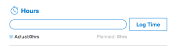

# [!UICONTROL 요약] 개요

다음을 사용할 수 있습니다. [!UICONTROL 요약] 작업 문제 목록, 문서 또는 의 다른 영역에서 작업 항목 정보를 직접 검토하고 업데이트하는 패널 [!DNL Adobe Workfront] 작업 및 문제를 표시합니다.

다음 표에는 를 찾아 사용할 수 있는 영역이 나와 있습니다. [!UICONTROL 요약] 패널:

<table style="table-layout:auto"> 
 <col data-mc-conditions=""> 
 <tbody> 
  <tr> 
   <td>작업</td> 
  </tr> 
  <tr> 
   <td> 
다음 범위 내의 작업 목록
 
    <ul> 
     <li>프로젝트</li> 
     <li>하위 작업</li> 
    </ul> </td> 
  </tr> 
  <tr> 
   <td>[!UICONTROL 업무 균형자]의 [!UICONTROL Unassigned] 및 [!UICONTROL Assigned] 작업 영역의 작업</td> 
  </tr> 
  <tr data-mc-conditions=""> 
   <td>문제</td> 
  </tr> 
  <tr data-mc-conditions=""> 
   <td> 
문제 목록
 
    <ul> 
     <li>프로젝트</li> 
     <li>작업</li> 
     <li>하위 작업</li> 
    </ul> </td> 
  </tr> 
  <tr data-mc-conditions=""> 
   <td>[!UICONTROL 업무 균형자]의 [!UICONTROL 할당된 작업] 영역에서 문제</td> 
  </tr> 
  <tr data-mc-conditions=""> 
   <td>[!UICONTROL Requests] 영역의 [!UICONTROL Submitted] 섹션에 있는 문제</td> 
  </tr> 
  <tr data-mc-conditions=""> 
   <td>문서</td> 
  </tr> 
  <tr data-mc-conditions=""> 
   <td>[!UICONTROL Documents] 영역</td> 
  </tr> 
  <tr data-mc-conditions=""> 
   <td>개체(프로젝트, 작업, 문제, 프로그램, 포트폴리오, 템플릿, 템플릿 작업, 사용자)의 [!UICONTROL 문서] 섹션</td> 
  </tr> 
 </tbody> 
</table>

<!--

Workfront administrators can customize the Summary in the Layout Template. For more information, see <a href="../../administration-and-setup/customize-workfront/use-layout-templates/create-and-manage-layout-templates.md" class="MCXref xref">Create and manage layout templates</a>.

-->

이 문서에서는 [!UICONTROL 요약] 목록의 작업 및 문제에 대한 패널.

에 액세스하는 방법에 대한 자세한 내용은 [!UICONTROL 요약] 다음에서 [!UICONTROL 업무 균형자], 참조 [에서 작업 항목 업데이트 [!UICONTROL 업무 균형자] 사용 [!UICONTROL 요약]](../../resource-mgmt/workload-balancer/update-items-in-summary-panel-in-workload-balancer.md).

에 액세스하는 방법에 대한 자세한 내용은 [!UICONTROL 요약] 문서의 경우 다음을 참조하십시오 [[!UICONTROL 요약] 문서 개요](../../documents/managing-documents/summary-for-documents.md).

## 액세스 요구 사항

이 문서의 단계를 수행하려면 다음 액세스 권한이 있어야 합니다.

<table style="table-layout:auto"> 
 <col> 
 <col> 
 <tbody> 
  <tr> 
   <td role="rowheader"><strong>[!DNL Adobe Workfront] 플랜*</strong></td> 
   <td> 
모든
 </td> 
  </tr> 
  <tr> 
   <td role="rowheader"><strong>[!DNL Adobe Workfront] 라이센스*</strong></td> 
   <td> 
[!UICONTROL Request] 이상
 </td> 
  </tr> 
  <tr> 
   <td role="rowheader"><strong>액세스 수준 구성*</strong></td> 
   <td> 
작업, 문제, 문서에 대한 [!UICONTROL 보기] 이상 액세스
 
문서의 [!UICONTROL 요약]을(를) 보려는 개체에 대한 [!UICONTROL 보기] 이상 액세스
 
참고: 여전히 액세스 권한이 없는 경우 [!DNL Workfront] 관리자가 액세스 수준에 추가 제한을 설정하는 경우. 자세한 내용: [!DNL Workfront] 관리자가 액세스 수준을 수정할 수 있습니다. 다음을 참조하십시오. <a href="../../administration-and-setup/add-users/configure-and-grant-access/create-modify-access-levels.md" class="MCXref xref">사용자 정의 액세스 수준 만들기 또는 수정</a>.
 </td> 
  </tr> 
  <tr> 
   <td role="rowheader"><strong>개체 권한</strong></td> 
   <td> 
작업, 문제 또는 문서에 대한 [!UICONTROL 보기] 이상 권한
 
추가 액세스 요청에 대한 자세한 내용은 <a href="../../workfront-basics/grant-and-request-access-to-objects/request-access.md" class="MCXref xref">오브젝트에 대한 액세스 요청 </a>.
 </td> 
  </tr> 
 </tbody> 
</table>

&#42;보유 중인 플랜, 라이선스 유형 또는 액세스 권한을 알아보려면 [!DNL Workfront] 관리자.

## 보기 [!UICONTROL 요약] 작업 또는 문제 목록의 패널

1. 작업 또는 문제로 이동하여 목록에서 항목을 선택합니다.
1. 다음을 클릭합니다. **[!UICONTROL 요약]** 아이콘 

   또는

   다음을 클릭합니다. **[!UICONTROL 요약 열기]** 아이콘  다음에서 [!UICONTROL 제출됨] 의 섹션 [!UICONTROL 요청] 영역입니다.

   요약은 다른 작업 또는 문제를 클릭하거나 선택할 때 열려 있으며 수동으로 닫을 때까지 열려 있습니다.

   >[!TIP]
   >
   >한 번에 하나의 작업 또는 문제만 선택하여 다음에서 해당 세부 사항을 볼 수 있습니다. [!UICONTROL 요약] 패널.

   

1. (선택 사항) [!UICONTROL 요약] 패널, 다음 중 하나를 수행합니다.

   * 작업 또는 문제 목록에서 **[!UICONTROL 요약 열기]** 아이콘 

     또는

     다음을 클릭합니다. **X** 의 오른쪽 위 모서리에 있는 아이콘 [!UICONTROL 요약] 패널.

   * 다음에서 [!UICONTROL 제출됨] 의 섹션 [!UICONTROL 요청] 영역을 클릭하고 **[!UICONTROL 요약 닫기]** 아이콘 

     또는

     다음을 클릭합니다. **X** 아이콘: 요약 패널의 오른쪽 위 모서리

## [!UICONTROL 완료율]

진행률 표시줄 사용 [!UICONTROL 요약] 을(를) 클릭하여 선택한 작업 또는 문제에 대한 완료율을 업데이트합니다. 숫자를 입력하거나 막대를 올바른 백분율로 끕니다.

## [!UICONTROL 업데이트]

사용 [!UICONTROL 업데이트] 의 섹션 [!UICONTROL 요약] 선택한 작업 또는 문제에 대한 최근 업데이트를 보고 업데이트하기 위해 클릭 **[!UICONTROL 모두 보기]** 로 직접 이동 [!UICONTROL 업데이트] 탭에서 액세스할 수 있습니다.

## [!UICONTROL 문서]

사용 [!UICONTROL 문서] 의 섹션 [!UICONTROL 요약] 을 눌러 선택한 작업 또는 문제에 첨부된 문서를 확인합니다. 문서 미리보기를 열려면 썸네일을 클릭합니다. 로 직접 이동 [!UICONTROL 문서] 작업 또는 문제의 탭에서 **[!UICONTROL 문서]** 제목.

## [!UICONTROL 세부 정보]

사용 [!UICONTROL 세부 사항] 의 섹션 [!UICONTROL 요약] 상위 레벨 작업 항목 세부 정보를 보거나, 할당하거나, 시작 일자를 추가하려면. 클릭 **[!UICONTROL 모두 보기]** 로 직접 이동 [!UICONTROL 세부 사항] 작업 또는 문제의 탭

>[!NOTE]
>
>이 섹션에 나타나는 필드는 홈의 오른쪽 패널에 나타나는 필드와 동일합니다. 이러한 필드는 사용자 지정할 수 있습니다 [사용자 지정 [!UICONTROL 홈] 및 [!UICONTROL 요약] 레이아웃 템플릿 사용](../../administration-and-setup/customize-workfront/use-layout-templates/customize-home-summary-layout-template.md).

## [!UICONTROL 하위 작업]

이 섹션은 작업에만 사용할 수 있습니다. 사용 [!UICONTROL 하위 작업] 의 섹션 [!UICONTROL 요약] 보기 [!UICONTROL 신규], [!UICONTROL 진행 중], 및 [!UICONTROL 종료됨] 선택한 작업의 하위 작업. 다음을 클릭합니다. **[!UICONTROL 상태]** 드롭다운 메뉴를 사용하여 상태 간 전환 로 직접 이동 [!UICONTROL 하위 작업] 작업에서 탭을 클릭하고 **[!UICONTROL 하위 작업]**&#x200B;제목&#x200B;.

작업에 하위 작업을 추가하지 않은 경우 **[!UICONTROL 여기에 하나 추가]** 로 직접 이동 [!UICONTROL 하위 작업] 탭에서 액세스할 수 있습니다.

## [!UICONTROL 시간]

사용 [!UICONTROL 시간] 의 섹션 [!UICONTROL 요약] 선택한 작업 또는 문제에 시간을 기록합니다. 클릭 **[!UICONTROL 로그 시간]** 시간을 입력합니다. 작업 또는 문제의 시간 탭으로 직접 이동하려면 **[!UICONTROL 시간]** 제목.

의 시간 계산 [!UICONTROL 요약] 사용자가 기록한 시간을 표시합니다. 다른 사용자는에서 다른 시간 합계를 갖게 됩니다. [!UICONTROL 요약] 작업에 로그온하는 시간에 따라 다릅니다.

계획이 없는 경우 [!UICONTROL 시간] 작업 또는 문제에서 시간을 기록하면 시간 표시줄에 빨간색으로 표시됩니다.

## 승인

사용 [!UICONTROL 승인] 의 섹션 [!UICONTROL 요약] 선택한 작업 또는 문제에 첨부된 승인을 봅니다. 승인을 추가하지 않은 경우 드롭다운 메뉴에서 기존 승인을 선택하거나 을(를) 클릭합니다 **[!UICONTROL 일회용 승인 프로세스 만들기]** 로 직접 이동 [!UICONTROL 승인] 작업 또는 문제의 탭

로 직접 이동 [!UICONTROL 승인] 작업 또는 문제의 탭에서 **[!UICONTROL 승인]** 제목.

