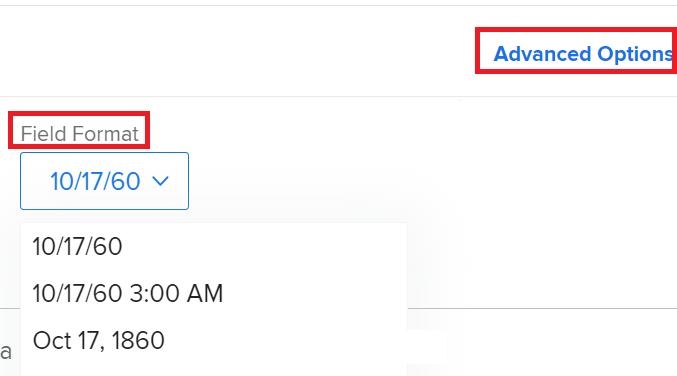

# [!DNL Adobe Workfront]에서 날짜 형식 변경

<!--this article used to be called "Change the date format in Adobe Workfront when using Chrome". The team decieded to make it more generic and hide the steps. Also see drafted content below-->

>[!IMPORTANT]
>
> 이 문서의 정보는 아직 Adobe 통합 경험에 온보딩되지 않은 조직에만 적용됩니다.
> 조직이 Adobe 통합 경험에 온보딩된 경우 날짜 환경 설정은 Adobe 통합 쉘에 설정된 언어 환경 설정에 따라 제어됩니다. 기본 언어 설정과 기본 날짜 설정은 `en-US`입니다.

[!UICONTROL 계획된 완료 일자], [!UICONTROL 실제 완료 일자] 또는 [!UICONTROL 예상 완료 일자]와 같은 [!DNL Adobe Workfront] 날짜의 날짜 형식을 변경할 수 있습니다.

예를 들어 날짜 형식을 _DD/MM/YYYY_&#x200B;에서 _MM/DD/YYYY_(으)로 변경하거나 그 반대로 변경할 수 있습니다.
또는 날짜 형식을 _MM/DD/YY_&#x200B;에서 _YYYY년 월 DD일_(으)로 변경할 수 있습니다.

보고자 하는 변경 내용과 변경 내용을 보려는 위치에 따라 다음과 같은 방법으로 Workfront의 날짜 형식을 변경할 수 있습니다.

* 위치 및 언어에 따라 [!DNL Workfront]의 모든 페이지에 대한 모든 날짜 형식을 변경하려면 브라우저에서 언어 설정을 변경해야 합니다.

  예를 들어 브라우저의 기본 언어가 *[!UICONTROL 영어(미국)]*(으)로 설정되어 있으면 날짜가 다음 형식으로 표시됩니다.

   * MM/DD/YYYY
   * YYYY년 월 DD일

  [!DNL Chrome] 또는 다른 브라우저에서 언어 설정을 변경하려면 해당 브라우저의 설정을 수정해야 합니다. 브라우저 설정을 수정하는 단계는 브라우저마다 다릅니다. 브라우저의 설정을 수정하는 방법을 알아보려면 브라우저의 [!UICONTROL 도움말], [!UICONTROL 환경 설정] 또는 [!UICONTROL 설정] 영역을 참조하세요.

* 보고서와 보기만 날짜 형식을 변경하려면 보고서 또는 보기를 만들 때 열의 [!UICONTROL 고급 옵션] 영역에서 [!UICONTROL 필드 형식] 설정을 업데이트해야 합니다. 위치나 언어에 따라 날짜 형식이 수정되지는 않습니다. 동일한 위치 또는 언어의 컨텍스트에서 날짜 형식을 수정합니다.

  

  자세한 내용은 [사용자 지정 보고서 만들기](../../reports-and-dashboards/reports/creating-and-managing-reports/create-custom-report.md)를 참조하세요.

* 전체 조직의 모든 발신 전자 메일 알림에서 날짜 형식을 변경하려면 [!UICONTROL 설정]의 [!UICONTROL 고객 정보] 영역에서 [!UICONTROL 기본 전자 메일 로케일] 설정을 업데이트해야 합니다.

  

  자세한 내용은 [시스템에 대한 기본 정보 구성](../../administration-and-setup/get-started-wf-administration/configure-basic-info.md)을 참조하십시오.

* 한 명의 사용자에 대해 보내는 모든 전자 메일 알림의 모든 날짜 형식을 변경하려면 사용자 프로필을 편집할 때 [!UICONTROL 사용자 편집] 상자에서 [!UICONTROL 전자 메일 로케일] 설정을 업데이트해야 합니다.

  

  자세한 내용은 [사용자 프로필 편집](../../administration-and-setup/add-users/create-and-manage-users/edit-a-users-profile.md)을 참조하세요.

<!--drafted because we should not document steps for a third-party application

To change your language settings in Chrome:

1. Click the 3-dots in the top right corner of your Chrome interface, then click **Settings**.
1. On the left area of the Settings page, expand **Advanced**, then click **Languages**.  
   Or  
   Search for *language*&nbsp;at the top of the Settings page, then click **Languages**.

1. In the **Language** list, locate the language and region that use your preferred date format.

   **Example:** If you speak English and you want the date format to be MM/DD/YYYY, you would select **English (United States)**. If you speak English and you want the date format to be DD/MM/YYY, you would select **English (United Kingdom)**.

1. (Conditional) If the language and region you want to use are not visible in the list, click **Add languages** to add it to the list.
1. Click the 3-dot menu next to the language and region you want to use, then click **Move to the top**.
1. Return to the Workfront interface, then refresh the page.  
   The date format is now updated in projects and other areas of Workfront that use MM/DD/YYYY or DD/MM/YYYY format when displaying dates.

   -->
