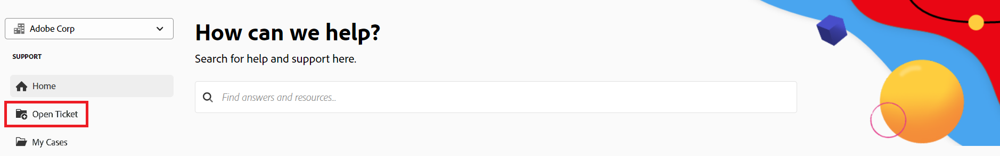
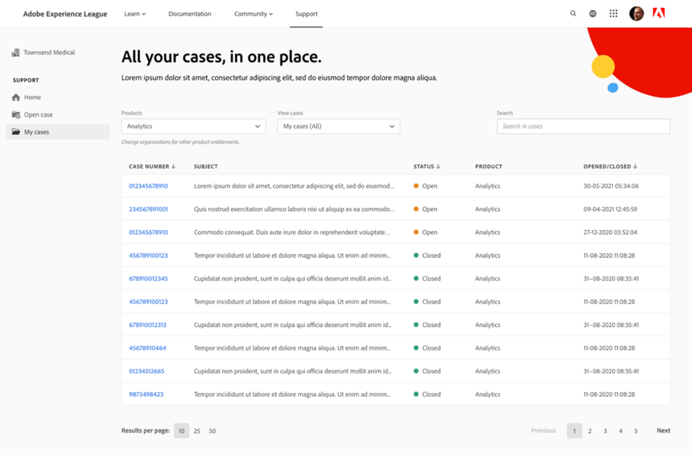

# 고객 지원에 문의

<!--

(We need to keep this as a standalone article. It is linked in multiple articles and FAQs.)

-->

로서의 [!DNL Adobe Workfront] 고객, [!DNL Workfront] 전화 또는 온라인으로 티켓을 제출하는 고객 지원 팀

>[!NOTE]
>
>중요한 문제는 [!DNL Workfront] 전화로 고객 지원.

## 휴대폰

연락하시면 됩니다 [!DNL Workfront Customer Support] 주 7일, 하루 24시간, 다음 숫자를 통해:

* 미국: 844-306-HELP(4357)
* EMEA: +44 1256 274200
* 오스트레일리아: +61 1800 849259

## 웹

셀프 서비스에서 지원 티켓을 제출할 수 있습니다 [!DNL Experience League] 포털.

>[!CAUTION]
>
>승인된 지원 담당자(또는 자격이 있는 고객)만 온라인 지원 티켓을 제출할 수 있습니다.

1. 에서 [[!DNL Experience League]](https://experienceleague.adobe.com) 웹 사이트 **[!UICONTROL 지원]**  를 클릭합니다.

   

   지원 홈 페이지에서 오픈 지원 사례에 쉽게 이동하거나, 새로운 사례를 기록하고, 주요 지원 문서를 보거나, 추가 학습 소스에 액세스할 수 있습니다.

1. 사례를 제출하려면 &quot; 옵션을 선택합니다.[!UICONTROL 지원 사례 열기]&quot;. **[!UICONTROL Sign] in**.

1. 클릭 **[!UICONTROL 열린 사례]** 왼쪽 사이드바

   

   다음 [!UICONTROL 사례 생성] 제품 이름([!DNL Adobe Workfront], [!DNL Adobe Workfront Fusion]등), 사례 제목 및 사례 설명

   >[!TIP]
   >
   >문제 해결 프로세스를 신속하게 진행하기 위해 직면하고 있는 문제를 설명할 때 가능한 한 설명하십시오.

1. 자세한 내용을 제공하려면 다음 필드에 대한 정보를 입력합니다.

   * **[!UICONTROL 사례 우선 순위]** ([!UICONTROL 낮음], [!UICONTROL Medium], [!UICONTROL 높음], [!UICONTROL 중요])
   * **[!UICONTROL 사례 제품]** ([!UICONTROL DAM], [!DNL Fusion], [!DNL Goals]등)
   * **[!UICONTROL 환경]** ([!UICONTROL 프로덕션], [!UICONTROL 미리 보기], [!UICONTROL 샌드박스]등)
   * **[!UICONTROL 고객 지역]** (미국, EMEA, APAC)

1. 관련 파일을 업로드한 다음 **[!UICONTROL 사례 제출]**.

   다음 [!UICONTROL 내 사례] 페이지가 표시됩니다.

   

1. (선택 사항) **[!UICONTROL 내 사례]** 페이지에서 조직이 제출한 사례를 검토합니다.

   >[!TIP]
   >
   >또한 [!UICONTROL 내 사례] 페이지를 클릭하여 **[!UICONTROL 내 사례]** 왼쪽 사이드바

1. 설정 [!UICONTROL 내 사례] 페이지에서 페이지 상단의 옵션을 사용하여 제품별로 필터링([!DNL Experience Cloud] 솔루션) 또는 사례 [!UICONTROL 상태] (열기 또는 닫힘). 를 사용할 수도 있습니다 [!UICONTROL 검색] 상자를 사용하여 지원 사례와 관련된 키워드를 검색합니다.

1. 사례에 대한 자세한 내용을 보려면 **사례 번호** 액세스해야 합니다. 다음 [!UICONTROL 사례] 보기가 열립니다.

1. 에서 [!UICONTROL 사례] 지정된 사례 소유자와 함께 최신 주석을 검토하고 추가 첨부 파일 또는 응답을 추가합니다.

1. 클릭 **[!UICONTROL 관리 문제 제기]** 아래의 페이지 오른쪽에서 **[!UICONTROL 사례 세부 사항]** 사건을 확대하다.

1. 을(를) 클릭합니다. **[!UICONTROL 닫기 사례]** 버튼을 클릭하여 케이스를 닫습니다.

요청 제출 시 문의 사항이나 문제가 있으면 고객 지원 팀에 문의하십시오.

<!--drafted: I took the information above from this blog post by Jon Chen (on September 13, 2022): https://experienceleaguecommunities.adobe.com/t5/workfront-blogs/how-to-submit-a-support-ticket-on-experience-league/ba-p/461737)

- this is the information that was there before - pointing to WorkfrontOne: 

If you are logged in as an Authorized Support Contact, you can contact Workfront Customer Support through the Workfront One site and create a case, formally called a ticket.

1. Log in to [**one.workfront.com**](https://one.workfront.com/) as an Authorized Support Contact.
1. On the **Home** page, click **Support**.

   

   The Customer Support page displays.

   >[!NOTE]
   >
   >If you don't see the Support option on the Home page, you are not an Authorized Support Contact. Your Workfront administrator can contact Workfront Customer Support and request you be added an Authorized Support Contact. If you are the only Workfront administrator for your organization, contact the Workfront Support team by phone.

1. Complete the fields in the **Create a Support Case** form. All fields are required.  

   <table style="table-layout:auto">
    <tr>
        <td><strong>Subject</strong></td>
        <td>Type a brief question or explanation of the issue you are experiencing.</td>
    </tr>
    <tr>
        <td><strong>Description</strong></td>
        <td>Type a detailed description of the issue. Include as much information as possible.</td>
    </tr>
    <tr>
        <td><strong>Priority</strong></td>
        <td> </td>
    </tr>
    <tr>
        <td><strong>Case Product</strong></td>
        <td>Select the product in which you are experiencing the issue. If the issue is not related to a specific product, select None.</td>
    </tr>
    <tr>
        <td><strong>Product Area</strong></td>
        <td>Select the area of the product that best relates to the issue. If the related area is not listed in the drop-down menu, select Not Listed.</td>
    </tr>
    <tr>
        <td><strong>Environment</strong></td>
        <td>Select the environment in which the issue occurs. If you are seeing the issue in both the Production and Sandbox environments, please select Production.</td>
    </tr>
    <tr>
        <td><strong>Customer Region</strong></td>
        <td> </td>
    </tr>
   </table>

1. (Optional) Attach a file, such as an image or video file.

   1. At the bottom of the form, click **Upload File**.
   1. Click **Upload File**, then browse for and select the desired file.

      

   1. Click **Done** to upload the file to the case.

1. Click **Submit** to submit the case to Workfront Customer Support.

-->

