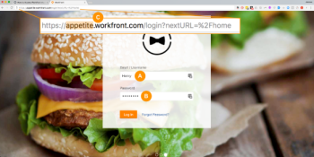

# 다음 [!DNL Adobe Workfront] 커뮤니티

Adobe [!DNL Workfront] 커뮤니티는 10,000명이 넘는 온라인 그룹입니다. [!DNL Workfront] 사용자 참조. 커뮤니티를 통해 제품 릴리스를 최신 상태로 유지하거나 고객 이벤트에 대해 학습하고 다른 사용자에게 [!DNL Workfront] 제품 및 서비스. 질문에 대한 답변을 찾고 다른 과의 연결을 설정할 수 있습니다 [!DNL Workfront] 고객.

<!--

-->

## 로그인하는 중

* [공인 지원 담당자](#authorized-support-contact)
* [SSO 로그인 없이 비인증 지원 연락처](#non-authorized-support-contact-without-sso-login)
* [SSO 로그인 시 비인증 지원 연락처](#non-authorized-support-contact-with-sso-login)

### 공인 지원 담당자 {#authorized-support-contact}

ASC(Authorized Support Contact)인 경우 [!UICONTROL 안내 데스크], [!UICONTROL Innovation Lab], 및 [!DNL Workfront] [!UICONTROL 상승]. 동일한 자격 증명을 사용하여 [!DNL Workfront] 커뮤니티. 이 경우 하위 도메인을 비워 둡니다.

### SSO 로그인 없이 비인증 지원 연락처 {#non-authorized-support-contact-without-sso-login}

공인 지원 담당자가 아닌 경우 정기적으로 로그인할 수 있습니다 [!DNL Workfront] 인스턴스 자격 증명. 와 동일한 하위 도메인 사용 [!DNL Workfront] 인스턴스.

>[!NOTE]
>
>이 옵션은 회사에서 SSO(Single Sign-On)를 사용하여 Workfront에 로그인하지 않는 경우에만 작동합니다.

### SSO 로그인 시 비인증 지원 연락처 {#non-authorized-support-contact-with-sso-login}

회사에서 SSO를 사용하는 경우 연락처에 문의해야 합니다 [!DNL Workfront] 계정을 요청하기 위해 전화로 고객 지원 센터입니다. 티켓을 제출하거나 실시간 채팅을 수행할 수 없는 경우 공인 파트너에게 문의하십시오 [!DNL Workfront] 고객 지원 담당자에게 문의하십시오.

Ascent Training 내에 이미 계정이 설정된 경우 동일한 자격 증명을 사용하여 커뮤니티 사이트에 액세스할 수 있습니다(이 경우 하위 도메인을 비워 둡니다).

커뮤니티 사이트에 대한 암호를 기억하지 못하는 경우 다음 주소로 문의하십시오 [!DNL Workfront Customer Support] 그리고 그들은 당신을 도울 수 있습니다.

## FAQ

* [내 하위 도메인은 무엇입니까?](#what-s-my-subdomain)
* [사용자 이름이나 암호를 잊어버렸습니다. 사용자 이름 또는 암호를 어떻게 재설정합니까?](#i-forgot-my-username-or-password-how-do-i-reset-my-username-or-password)

### URL은 무엇입니까? [!DNL Workfront] 커뮤니티?

다음 [!DNL Workfront] 커뮤니티는 [!DNL Workfront One] 다음 URL의 웹 사이트:  [https://one.workfront.com/s/community](https://one.workfront.com/s/community).

### 내 하위 도메인은 무엇입니까? {#what-s-my-subdomain}

하위 도메인에 익숙하지 않다면 쉽게 찾을 수 있는 방법이 있습니다. 로그인한 경우 [!DNL Workfront]: 하위 도메인이 이전 텍스트 문자열 또는 단어입니다 *.workfront.com*  또는 *my.workfront.com* 를 입력합니다. 예를 들어 Workfront URL이 *appey.workfront.com,* 그런 다음 *식욕* 은 하위 도메인입니다. 아래 다이어그램에서 마커 C를 참조하십시오.

### 사용자 이름이나 암호를 잊어버렸습니다. 사용자 이름 또는 암호를 어떻게 재설정합니까? {#i-forgot-my-username-or-password-how-do-i-reset-my-username-or-password}

사용자 이름 또는 암호를 잊어버린 경우 지원 센터에 연락하면 담당자가 자격 증명을 재설정해 줍니다.
