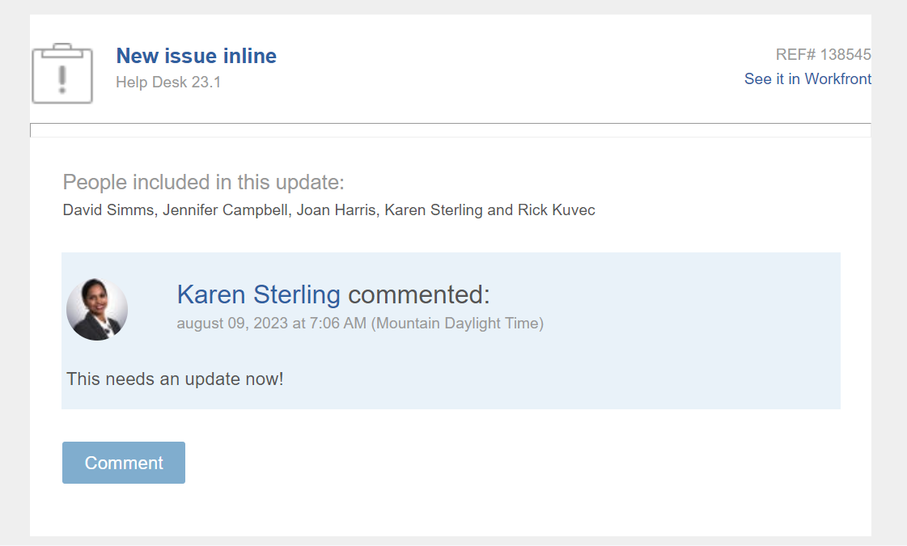

# 업데이트에 대한 회신

<!--take "Beta" references out when we remove the beta-->

이 페이지에서 강조 표시된 정보는 아직 일반적으로 사용할 수 없는 기능을 참조합니다. 미리보기 환경에서만 사용할 수 있습니다.

>[!NOTE]
>
>현재 Adobe Workfront의 댓글 달기 환경을 다시 디자인하고 있습니다.
>
>새 댓글 달기 환경에 대한 자세한 내용은 [새 댓글 달기 환경](../../product-announcements/betas/new-commenting-experience-beta/unified-commenting-experience.md).
>
>다음 객체에 대한 새 경험에 액세스할 수 있습니다.
> * 문제, 프로젝트, 작업 및 문서.
>
>     댓글 달기 Beta 경험을 활성화하면 사용할 수 있습니다.
>
>     이 기능은 업데이트 섹션에만 사용할 수 있으며 다음 영역에는 사용할 수 없습니다.
>
>     * 홈
>     * 목록의 요약 패널
>     * 타임시트의 요약 패널
>
> * 목표, 보드 영역의 카드
>
>   새로운 댓글 달기 경험은 목표에 대한 유일한 경험입니다. 및 카드. Workfront 목표에 액세스하려면 추가 라이선스가 있어야 합니다. 자세한 내용은 [Workfront 목표를 사용하기 위한 요구 사항](../../workfront-goals/goal-management/access-needed-for-wf-goals.md).
>
>     카드에서 주석 및 시스템 활동 섹션을 활성화하면 보드 영역에서 카드에 대한 업데이트를 추가하고 볼 수 있습니다. 자세한 내용은 [보드에 애드혹 카드 추가](../../agile/get-started-with-boards/add-card-to-board.md).

누군가 작업 개체에 대한 댓글 또는 시스템 업데이트에 답글을 달면 해당 답글이 해당 개체의 업데이트 섹션에 있는 통신 스레드에 나타납니다.

>[!IMPORTANT]
>
>새 댓글 달기 Beta 경험에서 시스템 업데이트에 답글을 달 수 없습니다. 자세한 내용은 [새 댓글 달기 환경](../../product-announcements/betas/new-commenting-experience-beta/unified-commenting-experience.md).

## 액세스 요구 사항

이 문서의 단계를 수행하려면 다음 액세스 권한이 있어야 합니다.

<table style="table-layout:auto"> 
 <col> 
 <col> 
 <tbody> 
  <tr> 
   <td role="rowheader"><strong>Adobe Workfront 플랜*</strong></td> 
   <td> 
모든
 </td> 
  </tr> 
  <tr> 
   <td role="rowheader"><strong>Adobe Workfront 라이센스*</strong></td> 
   <td> 
문제 및 문서에 대해 요청 이상, 기타 모든 오브젝트에 대해 검토 이상
 </td> 
  </tr> 
  <tr> 
   <td role="rowheader"><strong>액세스 수준 구성*</strong></td> 
   <td> 
문제 및 문서에 대한 요청자 이상, 기타 모든 오브젝트에 대한 검토자 이상
 
<b>메모</b>

여전히 액세스 권한이 없는 경우 Workfront 관리자에게 액세스 수준에 추가 제한을 설정하는지 문의하십시오. Workfront 관리자가 액세스 수준을 수정하는 방법에 대한 자세한 내용은 <a href="../../administration-and-setup/add-users/configure-and-grant-access/create-modify-access-levels.md" class="MCXref xref">사용자 정의 액세스 수준 만들기 또는 수정</a>.
 </td>
</tr> 
  <tr> 
   <td role="rowheader"><strong>개체 권한</strong></td> 
   <td> 
오브젝트에 대한 액세스 보기
 
추가 액세스 요청에 대한 자세한 내용은 <a href="../../workfront-basics/grant-and-request-access-to-objects/request-access.md" class="MCXref xref">오브젝트에 대한 액세스 요청 </a>.
 </td> 
  </tr> 
 </tbody> 
</table>

&#42;보유 중인 플랜, 라이선스 유형 또는 액세스 권한을 확인하려면 Workfront 관리자에게 문의하십시오.

## 업데이트 또는 회신에 회신

댓글 또는 답글에 대한 답글은 선택한 경험과 개체에 따라 다릅니다.

### 업데이트에 대한 회신 또는 현재 업데이트 섹션의 회신

1. 회신을 추가할 객체로 이동합니다.
1. 다음에서 **업데이트** 오브젝트의 탭에서 회신할 업데이트 또는 회신을 찾습니다.

1. (선택 사항) 기존 업데이트에서 이미지를 보려면 다음 중 하나를 수행하십시오.

   * 다음을 클릭합니다. **미리 보기** 아이콘  이미지 축소판을 클릭하여 새 브라우저 탭에서 전체 크기 이미지를 엽니다.
   * 다음을 클릭합니다. **다운로드** 아이콘  이미지를 다운로드하려면 이미지 썸네일에서 을(를) 선택합니다.

1. 클릭 **답변** 업데이트에서 나타나는 상자에 회신을 입력합니다.

   해당 업데이트 스레드의 맨 위에서 대화에 적극적으로 참여하거나 각 회신에 태그를 지정한 사용자를 볼 수 있습니다. 이러한 사용자는 오브젝트에 가입된 사용자와 함께 오브젝트에 대한 업데이트 또는 회신이 이루어질 때마다 알림을 받습니다. 더 많은 사용자에 태그를 지정하여 회신에 추가할 수도 있습니다.  더 많은 사용자에 태그를 지정하려면 다음을 참조하십시오. [업데이트에 다른 사용자 태그 지정](../../workfront-basics/updating-work-items-and-viewing-updates/tag-others-on-updates.md).

   

1. (선택 사항) 회신에 이전 업데이트의 텍스트를 포함하려면 **자세히** 견적을 작성할 업데이트 또는 회신 옆에 있는 메뉴 **견적 회신**. 이전 업데이트의 텍스트가 입력 영역에 세로로 회색 선으로 표시됩니다.
1. (선택 사항) 문서의 &quot;Workfront 업데이트에서 리치 텍스트 사용&quot; 섹션에 설명된 대로 서식, 이모지를 사용하고, 링크 또는 이미지를 포함합니다 [작업 업데이트](../../workfront-basics/updating-work-items-and-viewing-updates/update-work.md).
1. 클릭 **답변** 회신을 저장합니다.

### 댓글 달기 Beta 경험 사용 시 댓글에 회신

1. 회신을 추가할 객체로 이동합니다.
1. 클릭 **업데이트**&#x200B;을(를) 클릭하고 **댓글** 을 탭하여 개체에서 답글을 달거나 답글을 달 수 있습니다.
1. 클릭 **답변**.

   대화에 적극적으로 참여하는 사용자를 아래 부분에서 확인할 수 있습니다 **새 댓글** 상자를 선택하면 더 이상 관련이 없는 항목을 추가하거나 제거할 수 있습니다. 이러한 사용자는 오브젝트에 가입된 사용자와 함께 오브젝트에 대한 업데이트 또는 회신이 이루어질 때마다 알림을 받습니다. 더 많은 사용자에 태그를 지정하여 회신에 추가할 수도 있습니다.  더 많은 사용자에 태그를 지정하려면 다음을 참조하십시오. [업데이트에 다른 사용자 태그 지정](../../workfront-basics/updating-work-items-and-viewing-updates/tag-others-on-updates.md).

1. 답글 입력을 시작하고 리치 텍스트 도구 모음에서 추가 옵션을 사용하십시오. 리치 텍스트 또는 기타 업데이트 기능 사용에 대한 자세한 내용은 [작업 업데이트](../updating-work-items-and-viewing-updates/update-work.md).

1. 클릭 **제출** 회신을 저장합니다.

1. (선택 사항) **자세히** 메뉴  업데이트 옆에 있는 을(를) 클릭하여 회신을 관리할 수 있습니다. 자세한 내용은 [작업 업데이트](../updating-work-items-and-viewing-updates/update-work.md).

## 이메일 알림을 통해 업데이트에 회신

이메일 알림 구성 방식에 따라 액세스 권한이 있는 특정 오브젝트가 업데이트될 때 이메일 알림을 받을 수 있습니다.

>[!NOTE]
>
>클러스터 6의 환경에서는 이메일로 업데이트에 대한 답장을 보낼 수 없습니다.

다음은 작업의 업데이트 탭에서 업데이트한 결과로서 트리거되는 이메일 알림의 예입니다.

이메일에서 Workfront에 있는 개체의 통신 스레드에 직접 회신을 쉽게 추가할 수 있습니다. 다음 개체에 대한 댓글로 생성된 이메일의 Workfront에 로그인하지 않고 회신을 추가할 수도 있습니다.

* 프로젝트
* 작업
* 문제
* 문서
* 템플릿 및 템플릿 작업
* 포트폴리오
* 프로그램
* 반복
* 타임시트

### 이메일 알림에서 업데이트에 회신

이메일 알림을 받으면 연결된 Workfront 개체를 빠르게 열고 회신을 통신 스레드에 바로 추가할 수 있습니다.

1. 클릭 **댓글** 이메일 알림.

   개체에 대한 세부 정보 페이지가 Workfront에서 열립니다.

1. 회신을 추가할 업데이트로 이동합니다.

   대화에 적극적으로 참여하는 사용자를 보는 것 외에도 해당 업데이트 스레드의 맨 위에서 각 회신에서 누가 태그 지정되었는지 확인할 수 있습니다. 이러한 사용자는 오브젝트에 가입된 사용자와 함께 오브젝트에 대한 업데이트나 회신이 있을 때마다 알림을 받습니다. 더 많은 사용자에 태그를 지정하려면 다음을 참조하십시오. [업데이트에 다른 사용자 태그 지정](../../workfront-basics/updating-work-items-and-viewing-updates/tag-others-on-updates.md).

1. 클릭 **회신,** 답글을 입력한 다음 **답변**.

### Workfront 외부의 오브젝트에 업데이트 추가

Workfront 이메일 알림을 받으면 Workfront에 로그인하지 않고도 통신 스레드에 업데이트를 빠르게 추가할 수 있습니다.

Workfront 이메일에 업데이트를 추가하려면 다음 작업을 수행하십시오.

1. 이메일 애플리케이션에서 응답하려는 Workfront 이메일을 연 다음 회신 이메일 창을 엽니다.
1. 업데이트를 입력합니다.\
   첨부 파일이 허용되지 않으며 이메일의 업데이트에 적용된 서식 있는 텍스트 서식이 업데이트 탭에서 볼 때 업데이트에 표시되지 않습니다.
1. 클릭 **보내기**.

   업데이트가 개체의 통신 스레드에 추가됩니다.
