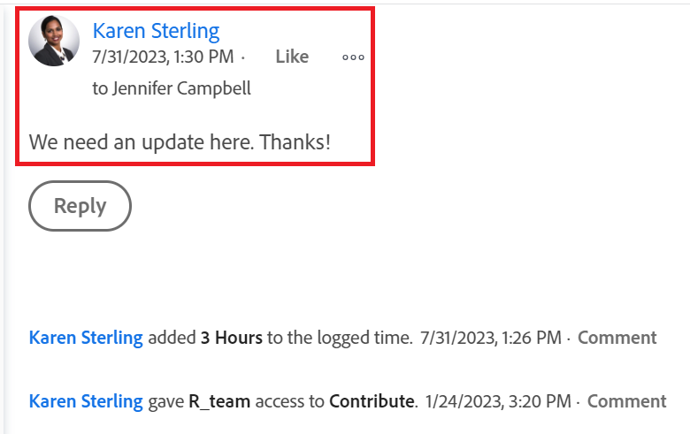

# 작업 업데이트

<!-- Audited: 1/2024 -->

<!--The highlighted information on this page refers to functionality not yet generally available. It is available only in the Preview environment.  (*****for all customers or in Production for customers who enabled fast releases-->

<!--For information about fast releases, see [Enable or disable fast releases for your organization](/help/quicksilver/administration-and-setup/set-up-workfront/configure-system-defaults/enable-fast-release-process.md).

For information about the current release schedule, see [Second Quarter 2024 release overview](/help/quicksilver/product-announcements/product-releases/24-q2-release-activity/24-q2-release-overview.md).
-->

<!--info for April 11: hide the "Important" box below-->

<!--
>[!IMPORTANT]
>
>We are currently redesigning the commenting experience in Adobe Workfront.
>
>Depending on what objects you access the commenting experience for, you might see the following functionality for the Updates section:
>* The new experience
>* The legacy experience
>* The new and the legacy experience
>
>For more information about the new commenting experience and its availability, see [New commenting experience](../../product-announcements/betas/new-commenting-experience-beta/unified-commenting-experience.md). 
>
> The legacy commenting experience has been removed from projects, tasks, issues, and documents in the Preview environment. 
>
>The new commenting experience is available only for the Updates section of Workfront objects, and it is not available when you access updates from the following areas:
>
> * Home
> * Summary panel in lists
> * Summary panel in timesheets 
> * Summary panel in the Workload Balancer
>
>The new commenting experience is available in the Summary panel in lists, timesheets, and the Workload Balancer in the Preview environment and in the Production environment for customers who have opted for the fast release process. 
-->

다른 사용자에게 오브젝트의 상태 또는 진행 상황을 알리거나 추가 정보 또는 추가 리소스를 요청하기 위해 주석을 추가하여 Adobe Workfront 오브젝트에 업데이트를 추가할 수 있습니다.

Workfront에서 업데이트를 추가할 수 있는 개체에 대한 자세한 내용은 [업데이트 섹션 개요](/help/quicksilver/workfront-basics/updating-work-items-and-viewing-updates/updates-tab-overview.md)를 참조하십시오.

이 문서의 정보에서는 프로젝트, 작업 및 문제에 대해 댓글을 작성하는 방법에 대해 설명합니다. 오브젝트에 할당되거나 가입한 사용자는 업데이트를 볼 수 있습니다. 사용자에 태그를 지정하여 업데이트에 주의를 기울일 수도 있습니다.

다른 Workfront 오브젝트에 주석을 추가하는 것은 프로젝트, 작업 및 문제를 업데이트하는 것과 비슷합니다.

Workfront Planning의 카드, 목표 및 레코드에 대한 댓글에 대한 추가 정보는 다음 문서를 참조하십시오.

* [Adobe Workfront 목표의 목표 댓글을 관리합니다](../../workfront-goals/goal-management/manage-goal-comments.md).

* [보드에 애드혹 카드 추가](/help/quicksilver/agile/get-started-with-boards/add-card-to-board.md)

* [보드에서 연결된 카드 사용](/help/quicksilver/agile/get-started-with-boards/connected-cards.md)

* [레코드 주석 관리](/help/quicksilver/planning/records/manage-record-comments.md)

## 액세스 요구 사항

+++ 을 확장하여 이 문서의 기능에 대한 액세스 요구 사항을 봅니다.

이 문서의 단계를 수행하려면 다음 액세스 권한이 있어야 합니다.

<table style="table-layout:auto"> 
 <col> 
 </col> 
 <col> 
 </col> 
 <tbody> 
  <tr> 
   <td role="rowheader"><strong>Adobe Workfront 플랜</strong></td> 
   <td> 
임의
 </td> 
  </tr> 
  <tr> 
   <td role="rowheader"><strong>Adobe Workfront 라이센스*</strong></td> 
   <td> 
   
현재: 문제 및 문서에 대해 요청 이상, 다른 모든 객체에 대해 검토 이상

   
새로운 기능: 문제 및 문서에 대한 기여자 이상: 기타 모든 오브젝트에 대해 라이트 이상
 
   </td> 
  </tr> 
  <tr> 
   <td role="rowheader"><strong>액세스 수준 구성</strong></td> 
   <td> 
업데이트가 있는 오브젝트에 대한 보기 또는 편집 액세스 권한
</td> 
  </tr> 
  <tr> 
   <td role="rowheader"><strong>개체 권한</strong></td> 
   <td> 
오브젝트에 대한 액세스 보기
</td> 
  </tr> 
 </tbody> 
</table>

*자세한 내용은 [Workfront 설명서의 액세스 요구 사항](/help/quicksilver/administration-and-setup/add-users/access-levels-and-object-permissions/access-level-requirements-in-documentation.md)을 참조하십시오.

+++

## 개체에 댓글을 달 때 고려 사항

* 업데이트 섹션에서 Adobe Workfront의 대부분의 오브젝트에 주석을 추가할 수 있습니다. 업데이트 섹션을 표시하는 개체에 대한 자세한 내용은 [업데이트 섹션 개요](../updating-work-items-and-viewing-updates/updates-tab-overview.md)를 참조하십시오.

* Workfront과 통합된 다른 애플리케이션 또는 Workfront 모바일 앱에서 Workfront 오브젝트에 주석을 추가할 수 있습니다.

  Workfront과 통합된 모든 애플리케이션이 Workfront 개체에 주석을 추가할 수 있는 것은 아닙니다.

  Workfront에 있는 오브젝트의 업데이트 섹션에서 사용할 수 있는 기능 중 일부가 다른 애플리케이션에서 Workfront 오브젝트에 액세스할 때 사용할 수 있는 것은 아닙니다. 예를 들어 서드파티 애플리케이션에서 Workfront 객체에 댓글을 추가할 때 리치 텍스트 기능이나 댓글을 누군가의 회사에 비공개로 만들 수 없는 경우가 있을 수 있습니다.

* Workfront 개체(프로젝트, 작업 또는 문제)에 대한 댓글을 달면서 해당 개체의 진행 상황에 대해 소통할 수 있습니다. 개체를 할당받거나 구독하는 사용자는 업데이트에 대한 알림을 받을 수 있습니다. 오브젝트에 대한 보기 액세스 권한이 있는 모든 사람이 업데이트를 볼 수 있습니다.

* 사용자에 태그를 지정하여 업데이트에 주의를 기울일 수 있습니다. 태그가 지정된 사용자는 인앱 알림 및 업데이트에 대한 이메일을 받습니다.

  >[!TIP]
  >
  >댓글 소유자에 자동으로 태그가 지정됩니다. 자세한 내용은 [업데이트에 다른 사용자 태그 지정](../../workfront-basics/updating-work-items-and-viewing-updates/tag-others-on-updates.md)을 참조하세요.

* 볼 수 있는 오브젝트에 댓글을 추가하거나 Workfront 또는 그룹 관리자로 로그인하고 다른 사용자를 대신하여 댓글을 추가할 수 있습니다. 자세한 내용은 [다른 사용자로 로그인](../../administration-and-setup/add-users/create-and-manage-users/log-in-as-another-user.md)을 참조하십시오.

* Workfront의 다음 영역에서 프로젝트, 작업 및 문제에 대한 업데이트를 추가할 수 있습니다.

   * Workfront 개체의 업데이트 섹션(프로젝트, 작업 및 문제의 경우)에서
   * 홈 영역에서(작업 및 문제의 경우)

     자세한 내용은 [내 작업 위젯으로 작업 관리](/help/quicksilver/workfront-basics/using-home/using-the-home-area/my-work-widget.md)를 참조하십시오.
   * 다음 영역(작업, 문제 및 문서의 경우)의 요약 패널에서

      * 오브젝트 목록
      * 타임시트
      * 홈
      * 업무 균형자

     자세한 내용은 다음 문서를 참조하십시오.

      * [요약 개요](/help/quicksilver/workfront-basics/the-new-workfront-experience/summary-overview.md)
      * [요약을 사용하여 업무 균형자에서 작업 항목 업데이트](/help/quicksilver/resource-mgmt/workload-balancer/update-items-in-summary-panel-in-workload-balancer.md)

<!--info for April 11: hide the section below: add an update to a work item-->

<!--
## Add an update to a work item

Adding an update to a work item differs depending on what version of the Updates section you use.

You can add updates to the following objects: 

* Projects
* Tasks
* Issues
* Programs
* Portfolios
* Templates
* Template tasks
* Users
* Timesheets
* Teams
* Goals
* Cards in the Boards area
* Iterations
-->

<!--info for April 11: hide the section below completely:-->

<!--
### Add an update to a work item in the legacy Updates section

>[!IMPORTANT]
>
>The information on this page describes how you update projects, tasks, and issues.

1. Go to the work item for which you want to provide an update (such as a project, task, or issue).
1. Click the **Updates** section.
1. (Conditional) If it is enabled, click the **New commenting** option in the upper-right corner of the Updates section to disable it and enable the legacy commenting experience.
1. Click **Start a new update,** then type your update.  
1. (Optional) Use the options in the Rich Text toolbar to format your text, add emojis, links, or images to your update, to enhance your content. For more information, see the [Use Rich Text in a Workfront update](#use-rich-text-in-a-workfront-update) section in this article.
1. (Optional) Update any of the following information about the work item:

   <table style="table-layout:auto"> 
    <col> 
    <col> 
    <tbody> 
     <tr> 
      <td role="rowheader"><strong>Notify</strong></td> 
      <td>Identify users who must be notified of the update. Users assigned or subscribed to the object automatically receive notification when an update is made. 
For information about how to include others on an update, see <a href="../../workfront-basics/updating-work-items-and-viewing-updates/tag-others-on-updates.md" class="MCXref xref">Tag others on updates</a>.
</td> 
     </tr> 
     <tr> 
      <td role="rowheader"><strong>Commit Date</strong></td> 
      <td>In the date picker, select the date that you commit to complete the work item. For information about Commit Date, see <a href="../../manage-work/projects/updating-work-in-a-project/overview-of-commit-dates.md" class="MCXref xref">Commit Date overview</a>.</td> 
     </tr> 
     <tr> 
      <td role="rowheader"><strong>Condition</strong></td> 
      <td>Select a new condition for the task or issue. For information about selecting a condition, see <a href="../../manage-work/projects/updating-work-in-a-project/update-condition-for-tasks-and-issues.md" class="MCXref xref">Update Condition for tasks and issues</a>.</td> 
     </tr> 
     <tr> 
      <td role="rowheader"><strong>Status</strong></td> 
      <td>Click the arrow beside the current status, then select the desired status from the drop-down menu. For information about setting a Status, see <a href="../../manage-work/projects/updating-work-in-a-project/update-task-status.md" class="MCXref xref">Update task status</a>.
Updating the status of a work item does not automatically change the status of a project. Depending on how your project is set up, you might make updates to the project status separately. For more information on the various project update types, see <a href="../../manage-work/projects/manage-projects/select-project-update-type.md" class="MCXref xref">Select the project Update Type </a>.

<b>NOTE</b>
      
      You cannot change the status of a work item while it is in a Pending Approval status.
</td> 
     </tr> 
     <tr> 
      <td role="rowheader"><strong>Completion Bar</strong></td> 
      <td>(Only available on tasks) Indicate the percentage of work completed by sliding the progress bar to the desired percentage. You can also double-click the completion bar and enter the percent complete.</td> 
     </tr> 
     <tr> 
      <td role="rowheader"><strong>Private to my company</strong></td> 
      <td> 
Disable this option to prevent users outside your company from having access to view this update.
 
      
<b>NOTE</b>

      
This option displays only when the user is associated with a Company.

      
This option is not available in all areas where you can add updates from. For example, this is not available in third-party applications where you can add updates from. 

      </td> 
     </tr> 
    </tbody> 
   </table>

1. Click **Update** to add the update to the Workfront object.

   >[!NOTE]
   >
   >A small pop-up window will appear for seven seconds after clicking **Update**, allowing you to undo the update and return to the editing pane before the update is posted. The update is posted if you dismiss the undo pop-up, wait for it to disappear, or navigate away from the page. 
   >
   >If your Workfront administrator selects the "Never allow users to delete comments" setting in your access level, you cannot undo a comment. For more information, see [Create and modify custom access levels](../../administration-and-setup/add-users/configure-and-grant-access/create-modify-access-levels.md).

1. To reply to an update, see [Reply to updates](../../workfront-basics/updating-work-items-and-viewing-updates/reply-to-updates.md).
-->

<!--info for April 11: reword the title of this section to: "Add an update to a work item"; take out the step that says you need to enable the "New commenting" toggle (I think it is step 3??)-->

## 작업 항목에 주석 추가

이 문서에서는 프로젝트, 작업 또는 문제를 업데이트하는 방법에 대해 설명합니다. 대부분의 다른 객체를 업데이트하는 것도 유사합니다.

1. 주석을 추가할 개체를 찾은 다음 해당 이름을 클릭하여 개체 페이지를 엽니다.
1. 왼쪽 패널에서 **업데이트**를 클릭합니다.
기본적으로 **댓글** 탭이 선택되어 있습니다.

1. **새 댓글** 상자에 댓글을 입력하세요.

   

   >[!TIP]
   >
   >댓글을 입력하고 제출하기 전에 업데이트 섹션에서 다른 곳으로 이동하면 로그오프했다가 다시 로그온한 후에도 페이지에서 댓글이 초안 모드로 유지됩니다. 주석에 추가된 모든 이미지도 초안에 저장됩니다. 초안은 7일 동안 저장되며 이후 삭제되며 복구할 수 없습니다. 초안 주석은 설명을 입력한 사용자만 볼 수 있습니다.

1. (선택 사항) 변경을 실행 취소하거나 재실행하려면 다음 단축키를 사용합니다.
   * 변경 내용을 취소하려면 CTRL+Z(Mac의 경우 ⌘+z)
   * CTRL+Y(Mac의 경우 ⌘+y) 를 눌러 변경 사항을 재실행합니다

1. (선택 사항) **사람 또는 팀 태그 지정** 영역에서 이 댓글에 포함할 사용자 또는 팀의 이름 또는 전자 메일을 입력한 다음 목록에 표시될 때 선택합니다.
1. (선택 사항) 리치 텍스트 도구 모음의 옵션을 사용하여 텍스트 서식을 지정하고, 업데이트에 이모지, 링크 또는 이미지를 추가하여 콘텐츠를 개선합니다. 자세한 내용은 이 문서의 [Workfront 업데이트에서 서식 있는 텍스트 사용](#use-rich-text-in-a-workfront-update) 섹션을 참조하십시오.

   >[!TIP]
   >
   >다른 사용자가 업데이트하고 있는 동일한 항목에 주석을 제출하는 경우 새로운 주석을 알려주는 &quot;신규&quot; 표시기가 있는 빨간색 줄이 있습니다.
   >
   >표시기는 항목에 대한 댓글이 제출된 후에만 표시되며 댓글이 아직 작성된 경우에는 표시되지 않습니다.
   >
   >&quot;새로 만들기&quot; 표시기는 새 업데이트를 입력한 사용자와 현재 업데이트를 입력 중인 사용자가 모두 새 댓글 달기 경험을 사용하는 경우에만 표시됩니다.
   >

1. **제출**&#x200B;을 클릭하여 Workfront 개체에 업데이트를 추가합니다.
1. (선택 사항) 댓글을 편집하려면 댓글의 오른쪽 상단에 있는 **자세히** 메뉴 을(를) 클릭한 다음 **편집**&#x200B;을(를) 클릭합니다.

   >[!IMPORTANT]
   >
   >의견을 제출한 후 15분 이내에만 편집할 수 있습니다.

1. 주석의 정보를 편집하거나, 이미지를 추가 또는 제거하거나, 태그 지정된 사용자를 제거합니다. 댓글을 입력했을 때 표시되는 날짜 스탬프 왼쪽에 &quot;편집됨&quot; 표시기가 추가됩니다.

   >[!TIP]
   >
   >현재 연도의 주석은 날짜 스탬프에 연도를 표시하지 않습니다. 타임스탬프를 마우스로 가리키면 연도를 포함한 전체 날짜가 표시됩니다.

   

   >[!TIP]
   >
   >* 원본 업데이트를 제출한 경우에만 사용자에게 업데이트를 알리는 이메일이 생성됩니다. 업데이트를 편집한 후 이메일이 생성되지 않습니다.
   >* 주석 옆에 있는 날짜 스탬프는 마지막 편집 날짜가 아닌 원래 주석의 날짜입니다.
   >* 다른 사용자를 대신하여 주석을 추가할 때(Workfront 또는 그룹 관리자로 다른 사용자로 로그인할 때) 다른 사용자로 로그인된 경우 주석을 편집할 수 없습니다. 사용자로 로그아웃한 후 다시 사용자로 로그인한 후에만 주석을 편집할 수 있습니다.

1. (선택 사항) **답글**&#x200B;을 클릭하거나 **답글 추가...** 영역에서 댓글을 입력하여 기존 댓글에 답글을 단 다음 위의 3-7단계를 따릅니다. <!--(**************insure this stays accurate***********)--> 업데이트에 회신하는 방법에 대한 자세한 내용은 [업데이트에 회신](../../workfront-basics/updating-work-items-and-viewing-updates/reply-to-updates.md)을 참조하세요.

1. (조건부 및 선택 사항) 댓글을 추가하는 동안 다른 사용자가 업데이트 섹션의 표시 영역 밖에 표시되는 댓글을 추가한 경우 화면 하단의 파란색 **새 댓글 배너** 내부에 있는 **보기**&#x200B;를 클릭하여 해당 댓글을 표시합니다.

   

   추가 주석이 화면 하단에 표시됩니다.

1. (선택 사항) **좋아요** 아이콘을 클릭합니다. 아이콘이 좋아요 수로 업데이트됩니다.
1. (조건부 및 선택 사항) 댓글에 다른 사람을 포함한 경우 업데이트에 포함된 멤버 수를 클릭하여 입력한 댓글이 공유되는 엔티티 목록을 표시합니다.

   

   >[!TIP]
   >
   >태그가 지정된 처음 두 엔티티의 이름이 아바타 옆에 표시됩니다. 두 개 이상의 엔티티에 태그가 지정되면 첫 번째 엔티티 이름과 추가 엔티티 수만 표시됩니다.

1. (선택 사항) commententer의 이름을 클릭하면 정보 상자에 이름, 역할 및 이메일 주소가 표시됩니다. 정보 상자에서 댓글의 이름을 다시 클릭하여 해당 사용자 프로필을 엽니다.
1. (선택 사항) 시스템에서 기록한 업데이트를 보려면 **시스템 활동** 탭을 클릭합니다. 개체 또는 그 하위 항목이 업데이트되면 Workfront은 해당 업데이트에 대한 메모를 생성하고 시스템 활동 탭에 표시합니다.

   자세한 내용은 [업데이트 섹션 개요](../updating-work-items-and-viewing-updates/updates-tab-overview.md)를 참조하십시오.

   >[!TIP]
   >
   >시스템 업데이트에 주석을 추가할 수 없습니다. 그러나 이전 댓글 달기 경험의 시스템 활동 레코드에 대한 모든 답글은 시스템 활동 탭에 읽기 전용으로 추가되었습니다. 기존 댓글 달기 환경은 2024년 4월 11일에 Workfront에서 제거되었습니다.

1. (선택 사항) **모두** 탭을 클릭하여 사용자 댓글과 시스템 활동 댓글을 한 곳에서 모두 봅니다. 보기 전용 탭입니다.

   >[!TIP]
   >
   >모든 탭에서 기존 댓글에 댓글에 답글을 달거나 다른 사용자를 태그 지정할 수 없습니다. 모두 탭에서 댓글에 회신하려면 **댓글에 회신**&#x200B;을 클릭하여 댓글 탭에서 댓글을 엽니다.

## Workfront 주석에서 서식 있는 텍스트 사용{#use-rich-text-in-a-workfront-comment}

리치 텍스트를 사용하거나 이모지, 링크 또는 이미지와 같은 다양한 항목을 추가하여 설명을 향상시킬 수 있습니다.

1. Workfront 개체의 **업데이트** 영역으로 이동하여 **댓글** 탭을 열고 댓글을 입력하세요.
1. (선택 사항) 설명에 서식 있는 텍스트 서식을 추가하려면 **서식 있는 텍스트** 도구 모음의 특성을 입력하세요.

   

   | **특성** | **도구 모음 단추** | **Mac 바로 가기 키** | **Windows 바로 가기 키** |
   |---|---|---|---|
   | 볼드체 |  | ⌘+b | Ctrl+B |
   | 기울임체 |  | ⌘+i | Ctrl+I |
   | 밑줄 |  | ⌘+u | Ctrl+U |
   | 하이퍼링크 |  |  링크 추가 상자를 열려면 ⌘+K   선택한 텍스트 위에 링크를 붙여넣으려면: ⌘+V  |  링크 추가 상자를 열려면 Ctrl+K   선택한 텍스트 위에 링크를 붙여넣으려면: Ctrl+V  |
   | 글머리 기호 목록 |  | ⌘+Shift+8 | Ctrl+Shift+8 |
   | 번호 매기기 목록 |  | ⌘+Shift+7 | Ctrl+Shift+7 |

   <!--| Block Quote | |⌘+Shift+9 | Ctrl+Shift+9   This is not available in the new commenting experience.   |-->

   <!--remove the last row when we remove legacy from the system-->

   텍스트 서식을 중지하려면 **서식 있는 텍스트** 도구 모음에서 특성을 선택 취소합니다.

   <!-- in the table above: take "Create Links" verbiage from the hyperlink when the old commenting is removed and the commenting beta is the only way to comment - with October 2023-->

   >[!NOTE]
   >
   >* 서식은 사용자가 업데이트를 포함하여 받는 모든 이메일 알림에도 표시됩니다.
   >* 전자 메일의 업데이트에 적용된 서식 있는 텍스트 서식을 업데이트 탭에서 보면 업데이트에 표시되지 않습니다.
   >* 조직에서 Internet Explorer와 함께 Workfront을 사용하는 경우 업데이트에 붙여넣은 서식 있는 텍스트 서식이 손실되고 일반 텍스트로 표시됩니다. 리치 텍스트 도구 모음의 속성을 사용하여 텍스트 서식을 변경할 수 있습니다.
   >* 타임시트 영역에서 수행한 업데이트 또는 보고서에서 본 메모 및 마지막 조건 개체에 대해 서식 있는 텍스트 서식을 사용할 수 없습니다.

   <!--1. (Optional and conditional) If you want to include text from previous updates or from other sources and distinguish it from your own update, you can mark it as a Block Quote. Click the **Block Quote** icon  and type the text you want to quote. The quoted text displays marked with a vertical gray line. Click the **Block Quote** icon again to return to normal formatting. This is not available in the new commenting experience.-->

   <!--remove this picture below and the bullet above when we remove legacy-->

   <!---->

1. (선택 사항) 업데이트에 이모지를 추가하려면 **이모지** 아이콘 을(를) 클릭합니다.

   >[!NOTE]
   >
   >* Workfront은 :)와 같은 구두점 이모티콘을 이모티콘으로 대체하지 않습니다.
   >* 보고서에서 본 메모 및 마지막 조건 개체에는 이모지를 사용할 수 없습니다.
   >* Workfront의 이모지 기능은 유니코드 문자를 사용하며, 따라서 유니코드 코드 포인트를 지원하는 브라우저와 운영 체제에만 표시됩니다. 사용자의 것과 다른 플랫폼, 브라우저 또는 운영 체제 버전의 사용자는 동일한 이모지에 액세스하지 못할 수 있습니다.
   >* 지원되지 않는 이모지는 검은색 또는 흰색 상자로 표시됩니다.
   >* Windows 7에서는 흑백 이모티콘만 지원합니다.
   >* 이메일을 통해 수행한 업데이트에 적용되는 이모지는 업데이트 영역에서 볼 때 업데이트에 표시되지 않습니다.

1. (선택 사항) 추가 정보 소스에 URL 링크를 추가하려면 다음을 수행합니다.

   1. 링크를 삽입할 업데이트를 클릭합니다.
   1. **서식 있는 텍스트** 도구 모음에서 **하이퍼링크** 아이콘 을(를) 클릭합니다.

   1. **링크 만들기** 상자의 **URL**&#x200B;에 연결할 원본 URL을 입력하거나 붙여 넣습니다.

   1. **표시할 텍스트**&#x200B;에서 링크 텍스트를 입력하거나 붙여 넣습니다.
   1. **저장**&#x200B;을 클릭합니다.

1. (선택 사항) 이미지를 업데이트에 첨부합니다.

   >[!WARNING]
   >
   >다음 객체의 업데이트 영역에는 이미지를 첨부할 수 없습니다.
   >
   >* 목표
   >* 보드의 임시 카드
   >* Workfront Planning의 레코드. 자세한 내용은 [Adobe Workfront 계획 개요](/help/quicksilver/planning/general/planning-overview.md)를 참조하십시오.
   >

   업데이트에 이미지를 첨부하려면 다음 중 하나를 수행하십시오.

   * 이미지를 컴퓨터에 저장한 다음 새 댓글 영역에 끌어서 놓습니다.
   * 컴퓨터에서 스크린샷을 복사한 다음 주석에 붙여넣습니다.
   * **이미지 추가** 아이콘 을(를) 클릭하고 컴퓨터에서 이미지를 찾습니다.

   >[!IMPORTANT]
   >
   >
   ><!--You cannot add images to goals or ad-hoc cards on boards. -->
   >
   >* 이미지 또는 첨부 파일 추가 아이콘을 보려면 Workfront 관리자가 Workfront 인터페이스 영역의 피드 업데이트 환경 설정 섹션에서 이미지 추가를 활성화해야 합니다. 자세한 내용은 [사용자 업데이트에 대한 환경 설정 구성](../../administration-and-setup/set-up-workfront/system-tracked-update-feeds/configure-preferences-user-updates.md)을 참조하십시오.
   >* 최대 이미지 파일 크기는 7MB입니다. 지원되는 이미지 파일 유형은 .jpg, .gif 및 .png입니다.
   >* 이미지는 개체의 업데이트 섹션에서 액세스할 수 있으며 기본 메뉴 아래의 문서 영역에서도 사용할 수 있습니다.
   >키보드 조합 또는 Windows 컴퓨터의 화면 인쇄 기능 등을 사용하여 컴퓨터에서 스크린샷을 복사할 수 있습니다.
   >* Mac 새 주석을 마우스 오른쪽 단추로 클릭한 다음 **붙여넣기**&#x200B;를 클릭하거나 키보드에서 Ctrl+V(Windows의 경우 ⌘+V)를 눌러 이미지를 붙여넣을 수 있습니다.
   >* 텍스트가 아닌 이미지로 업데이트를 보낼 수 있습니다.
   >* 이미지가 포함된 댓글을 삭제하면 해당 이미지는 업데이트 섹션과 문서 영역에서 제거됩니다. 댓글을 편집하고 이미지를 삭제하면 문서 영역에서도 이미지가 삭제됩니다.
   >* 누군가 문서 영역에서 댓글에 첨부된 이미지를 삭제하면 해당 이미지도 댓글에서 제거됩니다.

   <!--remove the statement above about legacy, when we remove the legacy environment.-->

1. (선택 사항) 기존 업데이트에서 이미지를 보려면 다음 중 하나를 수행하십시오.

   * 이미지 썸네일에서 **미리 보기** 아이콘 을(를) 클릭하여 새 브라우저 탭에서 전체 크기 이미지를 엽니다.
   * 이미지를 다운로드하려면 이미지 썸네일에서 **다운로드** 아이콘 을(를) 클릭하십시오.

1. 댓글을 추가하려면 **제출**&#x200B;을 클릭하세요.

## 업데이트 검색

오브젝트의 업데이트 섹션에서 댓글 또는 답글을 검색할 수 있습니다.

1. 개체의 **업데이트** 섹션으로 이동합니다.
1. **댓글** 탭의 오른쪽 위 모서리에 있는 **검색** 상자에 <!--or a user's name --> 키워드를 입력하십시오.

   <!--Add this tip or note instead of the note below - when it'll be possible: You can search for users who have been tagged or for comment owners.-->

   >[!NOTE]
   >
   >댓글이나 답글의 텍스트에 속하는 단어만 검색할 수 있습니다. 업데이트에서 태그가 지정된 사용자 또는 팀의 이름은 검색할 수 없습니다.

   

   검색한 키워드 <!--or user-->이(가) 강조 표시되고 이 키워드가 포함된 댓글이 [업데이트] 섹션의 맨 위에 표시됩니다.

   Workfront은 화면에 표시되는 주석 외부에서 개체의 전체 업데이트 스트림을 검색합니다.

1. 검색 필드에서 **x** 아이콘을 클릭하여 검색 결과를 지우고 모든 댓글로 돌아갑니다.

<!-- when we release search to production, check above and make sure you don't have to add that the users tagged/ owners are also searchable-->

## 주석 복사

주석을 복사할 수 있는 방법에는 몇 가지가 있습니다.

댓글에 대한 링크를 복사하거나, 댓글의 콘텐츠를 복사하여 새 업데이트에 사용할 수 있습니다.

<!--Copying an update differs depending on which commenting experience you use.-->

<!--info for April 11: take the sentence above out and reword the section title below to: Copy an update-->

### 댓글 복사

다음 중 하나를 수행하여 기존 주석에서 정보를 복사할 수 있습니다.

* [링크 복사](#copy-link)
* [본문 복사](#copy-body-text)
* [견적 회신](#quote-reply)

#### 댓글에 링크 복사

링크 복사 옵션은 댓글 또는 스레드 링크를 클립보드에 복사하여 다른 사용자와 댓글 또는 전체 스레드를 공유할 수 있습니다.

1. 링크를 복사할 주석으로 이동합니다.

1. **자세히** 메뉴를 클릭한 다음 **링크 복사**&#x200B;를 클릭합니다.

1. 이전 단계에서 복사한 링크를 전자 메일 또는 다른 애플리케이션에 붙여넣어 다른 사용자와 공유합니다. 공유 링크를 클릭하면 링크를 공유한 댓글이 열립니다.

   >[!TIP]
   >
   >상위 개체의 하위 개체에 대한 대화 링크를 공유하면 상위 개체의 업데이트 영역에서 스레드가 열립니다.
   >
   >예를 들어 프로젝트의 업데이트 영역에서 작업 주석의 링크를 복사하면 주석에 프로젝트 페이지가 열립니다.

#### 본문 복사

본문 텍스트 복사 옵션은 특정 주석의 텍스트를 클립보드로 복사합니다.

1. 복사할 댓글 또는 답장으로 이동합니다.
1. **자세히** 메뉴를 클릭한 다음 **본문 복사**&#x200B;를 클릭합니다.

#### 견적 회신

견적 회신 옵션은 원래 댓글을 새 회신에 블록 견적으로 복사합니다.

1. 복사할 댓글 또는 답장으로 이동합니다.
1. **자세히** 메뉴를 클릭한 다음 **회신 견적**&#x200B;을 클릭합니다.

   새 댓글 상자가 열리고 인용된 회신이 새 댓글에 포함되어 블록 인용으로 표시됩니다.

   

1. 업데이트를 계속 추가하고 **제출**&#x200B;을 클릭하여 댓글을 추가합니다.

<!--info for April 11: hide the entire section below - notice that there are several sub-sub sections below this main section - hide them all, all the way up to "Delete an update"-->

<!--
### Copy an update in the legacy commenting experience

* [Copy the update](#copy-the-update) 
* [Copy the thread link](#copy-the-thread-link) 
* [Copy the update link](#copy-the-update-link)
* [Quote Reply](#quote-reply)

   >[!TIP]
   >
   >When you copy and share the link of a conversation on a child object from a higher-ranking object, the link opens the thread in the child object's Updates area. 
   >
   >For example, if you copy the link of a task comment from the project's Updates area, the comment opens the task page.

#### Copy the update {#copy-the-update}

This option copies the text from a specific update to the clipboard.

1. Go to the update or reply you want to copy.
1. Click the **More** menu, then click **Copy body text**.

   

#### Copy the thread link {#copy-the-thread-link}

This option copies the full thread link to the clipboard so you can share the thread with other users.

1. Go to the update thread you want to copy.

1. Click the **More** menu, then click **Copy thread link**.

    

1. Paste the link you copied in the previous step in an email or another application to share it with others. The shared link opens the comment you shared the link from. 

#### Copy the update link {#copy-the-update-link}

This option copies a specific update link to the clipboard. When you share the update link, the user who follows it sees a border around the update.

1. Go to the update or reply you want to copy.
1. Click the **More** menu next to the individual update, then click **Copy update link**.

   

1. Paste the link you copied in the previous step in an email or another application to share it with others. The shared link opens the comment you shared the link from. 

#### Quote Reply  

The Quote Reply option copies the original comment to a new reply as a block quote. 

1. Go to the update or reply you want to copy.
1. Click the **More** menu, then click **Quote Reply**.

   A new comment box opens and the quoted reply is included in the new comment and marked as a block quote.

1. Continue adding your update and click **Reply** to add the comment.
-->

## 댓글 또는 답글 삭제

Workfront 관리자가 제공하는 액세스 권한에 따라, 오브젝트의 업데이트 섹션에서 추가한 주석을 삭제할 수 있습니다.

자세한 내용은 문서 [사용자 지정 액세스 수준 만들기 또는 수정](../../administration-and-setup/add-users/configure-and-grant-access/create-modify-access-levels.md)에서 [사용자 지정 액세스 수준 만들기 또는 수정](../../administration-and-setup/add-users/configure-and-grant-access/create-modify-access-levels.md#creating-a-new-access-from-scratch)을 참조하십시오.

Workfront 사용자(Workfront 관리자 포함)는 다른 사용자가 업데이트한 내용을 삭제할 수 없습니다. 그러나 사용자의 액세스 수준에서 자체 업데이트를 삭제할 수 있는 경우 Workfront 관리자가 해당 사용자로 로그인하여 수행한 업데이트를 삭제할 수 있습니다. 자세한 내용은 [사용자 지정 액세스 수준 만들기 또는 수정](../../administration-and-setup/add-users/configure-and-grant-access/create-modify-access-levels.md#creating-a-new-access-from-scratch) 및 [다른 사용자로 로그인](../../administration-and-setup/add-users/create-and-manage-users/log-in-as-another-user.md)을 참조하십시오.

1. 삭제하려는 댓글 또는 답장으로 이동합니다.
1. 삭제하려는 댓글 또는 답글 옆에 있는 **기타** 메뉴를 클릭한 다음 **삭제**&#x200B;를 클릭합니다.

   

1. 표시되는 메시지에서 **삭제**&#x200B;를 클릭합니다.

   >[!NOTE]
   >
   >이미지가 첨부된 업데이트를 삭제하면 댓글과 이미지가 모두 삭제됩니다. 자세한 내용은 이 문서의 [Workfront 업데이트에서 서식 있는 텍스트 사용](#use-rich-text-in-a-workfront-update) 섹션을 참조하십시오.

   삭제한 댓글에 연결된 댓글이 있는 경우 댓글을 삭제한 사용자의 이름으로 댓글이 제거되었음을 나타냅니다.

   

   삭제된 주석은 Workfront에서 즉시 제거됩니다. 업데이트 섹션을 사용하는 사용자는 다른 사용자가 삭제 중인 댓글을 실시간으로 볼 수 있습니다.

## 시스템 업데이트 검토

Workfront 객체의 업데이트 섹션에는 두 가지 유형의 정보가 표시됩니다.

* **사용자 업데이트:** 사용자 업데이트는 귀하와 시스템의 다른 사용자가 입력하는 댓글입니다. 사용자 업데이트는 업데이트 섹션의 설명 및 모든 탭에 표시됩니다.

  

* **시스템 업데이트:** 시스템은 기록 레코드를 업데이트하여 작업 또는 문제 제거, 문서 버전 추가 또는 삭제, 승인 요청 첨부 또는 제거, 개체에 대한 편집 또는 변경 사항을 모두 기록합니다. 시스템 업데이트가 시스템 활동 및 업데이트 섹션의 모든 탭에 표시됩니다.

  

  Workfront 관리자는 [시스템 추적 업데이트](../../administration-and-setup/set-up-workfront/system-tracked-update-feeds/system-tracked-update-feeds.md)에 설명된 대로 시스템 업데이트에서 추적되는 항목을 확인할 수 있습니다. 모든 객체에 대한 사용자 업데이트만 표시되도록 시스템 업데이트 또는 활동을 필터링할 수도 있습니다.

  다음 개체에는 시스템 생성 업데이트가 없습니다.

   * 팀
   * 템플릿
   * 템플릿 작업
   * 보드의 Ad Hoc 카드

사용자 및 시스템 업데이트와 Workfront 개체의 업데이트 섹션에 표시되는 방법에 대한 자세한 내용은 [업데이트 섹션 개요](../updating-work-items-and-viewing-updates/updates-tab-overview.md)를 참조하십시오.

<!--
After the monthly releases to Production, the same features are also available in the Production environment for customers who enabled fast releases.   
For information about fast releases, see [Enable or disable fast releases for your organization](../../administration-and-setup/set-up-workfront/configure-system-defaults/enable-fast-release-process.md)  
-->

<!-- with October 26 release: add somewhere this, and decide where we need to keep information about the legacy commenting. Should we create an article about iterations comments like we have for goals and cards?!:

>[!NOTE]
>
>Iterations display the legacy commenting experience.-->

<!--old message, before Auhust 17: 

>[!NOTE]
>
>We are currently redesigning the commenting experience in Adobe Workfront.
>
>For more information about the new commenting experience, see [New commenting experience](../../product-announcements/betas/new-commenting-experience-beta/unified-commenting-experience.md). 
>
>You can access the new experience for the following objects:
> * Issues, projects, tasks, and documents.
>
>     This is available when you enable the commenting Beta experience.
>
>     This functionality is available only for the Updates section, and it is not available for the following areas:
>
>     * Home
>     * Summary panel in lists
>     * Summary panel in timesheets
>
> * Goals, cards in the Boards area
>
>   The new commenting experience is the only experience for goals and cards. You must have an additional license to access Workfront Goals. For more information, see [Requirements to use Workfront Goals](../../workfront-goals/goal-management/access-needed-for-wf-goals.md). 
>
>     You can add and view updates to cards in the Boards area when you enable the Comments and System Activity sections on a card. For more information, see [Add an ad hoc card to a board](../../agile/get-started-with-boards/add-card-to-board.md).
-->