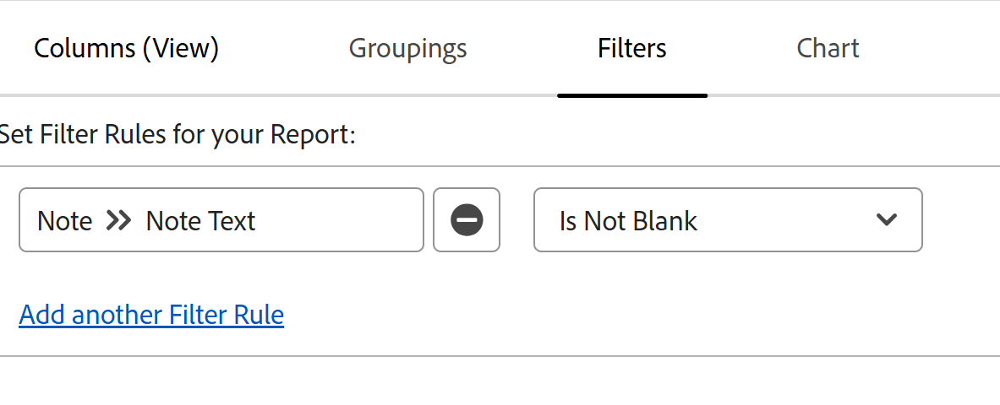

# 메모 보고서의 모든 업데이트 보기

<!-- Audited: 6/2025 -->

<!--

(NOTE: Alina: ***This is a report and it is in the Getting Started/ Updates section because I think it makes more sense to be in this area, where people want to view updates. - added this to this section from Reporting on 7/3/2018 ) 

-->

오브젝트의 업데이트 영역에는 기본적으로 최대 200개의 업데이트가 표시됩니다. 사용자가 객체에 대해 입력한 모든 업데이트를 보려면 모든 업데이트를 표시하는 메모 보고서를 작성할 수 있습니다.

>[!NOTE]
>
>보고서를 작성하여 분개 입력 보고서를 사용하여 미리보기에서 객체에 대한 갱신을 볼 수 있습니다. 자세한 내용은 [저널 게시물 보고서로 업데이트 영역 보고](../../reports-and-dashboards/reports/creating-and-managing-reports/create-journal-entry-report.md)를 참조하세요.

## 액세스 요구 사항

이 문서의 단계를 수행하려면 다음 액세스 권한이 있어야 합니다.

<table style="table-layout:auto"> 
 <col> 
 </col> 
 <col> 
 </col> 
 <tbody> 
  <tr> 
   <td role="rowheader">Adobe Workfront 플랜</td> 
   <td> 
임의
 </td> 
  </tr> 
  <tr> 
   <td role="rowheader">Adobe Workfront 라이선스</td> 
   <td> 
새로운 기능: 표준 

   
현재: 플랜
 </td> 
  </tr> 
  <tr> 
   <td role="rowheader">액세스 수준 구성</td> 
   <td> 
액세스 권한 편집 대상:
 
    <ul> 
     <li> 
보고서, 대시보드 및 캘린더 만들기
 </li> 
     <li> 
필터, 보기 및 그룹화 만들기
 </li> 
    </ul> </td> 
  </tr> 
  <tr> 
   <td role="rowheader">개체 권한</td> 
   <td> 
보기

    
참고: 오브젝트에 대한 보기 권한 이상이 없는 경우 해당 오브젝트에 대한 정보가 보고서에 표시되지 않습니다.
  </td> 
  </tr> 
 </tbody> 
</table>

이 표의 정보에 대한 자세한 내용은 [Workfront 설명서의 액세스 요구 사항](/help/quicksilver/administration-and-setup/add-users/access-levels-and-object-permissions/access-level-requirements-in-documentation.md)을 참조하십시오.

## 메모 보고서 만들기

객체에 관계없이 모든 객체에 대한 메모에 대한 보고서를 작성하는 것은 동일합니다.

예를 들어 프로젝트의 모든 메모에 대한 메모 보고서를 생성하려면 다음을 수행합니다.

{{step1-to-reports}}

1. 페이지의 왼쪽 상단 모서리에서 **새 보고서**&#x200B;를 클릭한 다음 **참고**&#x200B;을 선택합니다.

1. (선택 사항) **(열) 보기**&#x200B;를 클릭한 다음 **열 추가**&#x200B;를 클릭하여 보고서 보기에 **프로젝트**&#x200B;의 **이름**&#x200B;을(를) 추가합니다. 

1. (선택 사항) 동시에 여러 프로젝트에 대해 보고하는 경우 **그룹화**&#x200B;을 클릭한 다음 **그룹화 추가**&#x200B;를 클릭하여 **프로젝트**&#x200B;의 **이름**&#x200B;을(를) 기준으로 그룹화합니다. 이렇게 하면 참고가 해당 프로젝트별로 그룹화되어 보고서를 더 쉽게 읽을 수 있습니다. 

1. (선택 사항) **필터**&#x200B;를 클릭한 다음 **필터 규칙 추가**&#x200B;를 클릭합니다.
1. **참고** > **참고 텍스트** > **비어 있지 않음**&#x200B;에 대한 필터를 추가합니다.

   

   >[!TIP]
   >
   >   프로젝트 필드가 업데이트되었지만 업데이트 시 메모가 추가되지 않은 경우 업데이트의 **메모 텍스트**&#x200B;가 **(업데이트에 추가된 텍스트 없음)**&#x200B;으로 표시됩니다.

1. (선택 사항) **프로젝트** > **이름** > **다음과 같음**&#x200B;에 대한 다른 필터를 추가하고 메모를 보려는 하나 이상의 프로젝트 이름을 추가합니다.
1. **저장 + 닫기**&#x200B;를 클릭합니다. 프로젝트를 볼 수 있는 권한이 있는 모든 사용자가 프로젝트에 입력한 모든 업데이트가 보고서에 표시됩니다.
