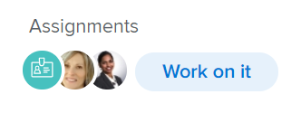

# 작업 및 완료 버튼 개요

작업 또는 문제에 할당되면 작업 항목에 대한 참여에 따라 이름과 기능이 변경되는 상황별 버튼을 사용할 수 있습니다.

상황별 버튼을 사용하여 작업 항목을 수락하거나 완료하면 Adobe Workfront에서 직접 업데이트하지 않고도 항목의 여러 필드를 업데이트할 수 있습니다.

다음과 같은 사용자는 처리 중(Work On It) 및 완료(Done) 단추를 볼 수 있습니다.

* Standard 라이센스(신규) 또는 Plan 또는 Work 라이센스(현재)
* 작업 또는 문제에 대한 편집 액세스 권한 이상 제한

>[!NOTE]
>
>완료 버튼은 Workfront의 모든 영역에서 완료로 표시로 표시됩니다.

## 작업 및 완료 버튼 이름

작업 또는 문제에 액세스하는 Workfront의 영역에 따라 다음 시나리오에 설명된 대로 작업 또는 완료 버튼이 이름을 변경할 수 있습니다.

* 작업 또는 문제가 처음 사용자에게 할당되고 상태가 신규인 경우 해당 작업에 대한 작업으로 버튼이 표시됩니다.

  

  >[!TIP]
  >
  >처리 중(Work On It) 단추를 시작(Start) 단추로 바꿀 수 있습니다. [처리 중] 단추를 [시작] 단추로 바꾸는 방법에 대한 자세한 내용은 [[처리 중] 단추를 [시작] 단추로 바꾸기](../../people-teams-and-groups/create-and-manage-teams/work-on-it-button-to-start-button.md) 를 참조하십시오.

* 처리(Work On It) 동의를 클릭하면 버튼이 완료로 표시로 변경됩니다. 처리 중 단추에 액세스할 수 있는 위치에 대한 자세한 내용은 이 문서의 [처리 중 찾기 및 완료 단추](#locate-the-work-on-it-and-done-button) 섹션을 참조하십시오.

  

<!--If you are not the only one assigned to the task or issue and you are accessing your work item from the My Work widget in the Home area, the button changes to Done with my part.

  -->

## 작업 위치 및 완료 버튼 {#locate-the-work-on-it-and-done-button}

Workfront의 다음 영역에서 처리 및 완료 버튼을 찾을 수 있습니다.

* 내 작업 위젯의 홈 영역

  항목을 [홈] 영역에서 [완료]로 표시하는 방법에 대한 자세한 내용은 [항목을 [홈] 영역에서 [완료]로 표시](../../workfront-basics/using-home/using-the-home-area/mark-item-done-in-home.md)를 참조하십시오.

* 작업 또는 문제의 헤더

  개체 헤더에 대한 자세한 내용은 [새 개체 헤더](../../workfront-basics/the-new-workfront-experience/new-object-headers.md)를 참조하십시오.

* 작업 또는 문제 요약 패널에서

  요약 패널 사용에 대한 자세한 내용은 [요약 개요](../../workfront-basics/the-new-workfront-experience/summary-overview.md)를 참조하십시오.

## 처리 중 또는 완료 단추를 클릭하면 자동으로 업데이트되는 필드 개요

처리 중(Work On It) 및 완료(Done) 단추를 사용하면 Workfront에서 사용자에게 할당된 작업 항목에 대한 정보를 자동으로 업데이트할 수 있다는 이점이 있습니다.

* [처리 중 단추](#work-on-it-button)
* [시작 단추](#start-button)
* [완료 버튼](#the-done-button)

### 처리 중 버튼 {#work-on-it-button}

처리(Work On It)를 클릭하면 다음 항목도 업데이트됩니다.

* 할당 상태가 요청됨에서 작업중으로 갱신됨

  >[!TIP]
  >
  >할당 상태 필드는 보고서와 목록에만 표시됩니다. 할당 상태 필드에 대한 자세한 내용은 [Adobe Workfront 용어 설명](../../workfront-basics/navigate-workfront/workfront-navigation/workfront-terminology-glossary.md)을 참조하세요.

* 커밋 일자

  커밋 날짜에 대한 자세한 내용은 [커밋 날짜 개요](../../manage-work/projects/updating-work-in-a-project/overview-of-commit-dates.md)를 참조하십시오.

### 시작 단추 {#start-button}

팀을 편집할 수 있는 권한이 있는 경우 [처리 중] 단추를 팀의 [시작] 단추로 바꿀 수 있습니다. 해당 팀을 홈 팀으로 사용하는 사용자가 할당된 항목에서 시작 단추를 클릭하면 작업 항목의 추가 필드가 자동으로 업데이트됩니다. [처리 중] 단추를 [시작] 단추로 바꾸는 방법에 대한 자세한 내용은 [[처리 중] 단추를 [시작] 단추로 바꾸기](../../people-teams-and-groups/create-and-manage-teams/work-on-it-button-to-start-button.md)를 참조하십시오.

처리 중 단추를 클릭할 때 업데이트되는 필드 외에도 다음 필드는 시작 단추를 클릭할 때 작업 또는 문제에 대해 자동으로 업데이트됩니다.

* 상태
* 실제 시작 일자 기준

  실제 시작 날짜에 대한 자세한 내용은 [프로젝트 실제 시작 날짜의 개요](../../manage-work/projects/planning-a-project/project-actual-start-date.md)를 참조하십시오.

* 시작 단추가 완료 또는 마감과 동일한 상태와 연관된 경우 실제 완료 일자.

  실제 완료 날짜에 대한 자세한 내용은 [프로젝트 실제 완료 날짜 개요](../../manage-work/projects/planning-a-project/project-actual-completion-date.md)를 참조하십시오.

>[!NOTE]
>
>실행 취소 버튼을 클릭하면 작업 항목이 원래 상태로 돌아가고 실제 시작 일자가 삭제됩니다.
>
>다음 영역에서는 실행 취소 단추를 사용할 수 없습니다.
>
>* 팀 요청
>* 작업 헤더
>

### 완료 버튼 {#the-done-button}

팀을 편집할 수 있는 액세스 권한이 있는 경우, 항목을 완료됨으로 표시할 때 팀에서 작업 또는 문제 상태를 업데이트하도록 완료 버튼을 구성할 수 있습니다. 해당 팀을 홈 팀으로 사용하는 사용자가 해당 항목에서 완료로 표시 단추를 클릭하면 작업 또는 문제에 대해 다음 필드가 자동으로 업데이트됩니다.

* 상태
* 할당 상태 업데이트 작업에서 완료로
* 실제 완료 일자 기준

팀의 완료 버튼 구성에 대한 자세한 내용은 다음 문서를 참조하십시오.

* [작업에 대한 완료 단추 구성](../../people-teams-and-groups/create-and-manage-teams/configure-the-done-button-for-tasks.md)
* [문제에 대한 완료 버튼 구성](../../people-teams-and-groups/create-and-manage-teams/configure-the-done-button-for-issues.md)
