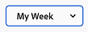

# Adobe Workfront의 새 홈 시작

새 홈은 작업 관리를 위한 강력한 새 기능입니다. 이 유연한 공간은 사용자에게 가장 중요한 작업을 강조하고 작업, 문제, 요청 및 승인 관리를 간소화하도록 사용자 지정할 수 있습니다.

## 새 홈 맞춤화

New Home은 사용자 정의 기능이 뛰어나게 설계되어 있어 가장 중요한 작업을 추적하는 위젯을 선택하고 마감일을 기준으로 해당 작업의 범위를 필터링하거나 다양한 색상을 추가할 수 있습니다.

### 위젯

위젯은 새 홈의 기초입니다. 홈 페이지에 위젯을 추가하여 작업 요구 사항에 가장 잘 맞도록 표시되는 정보 유형을 선택할 수 있습니다. 일부 위젯은 추적되는 오브젝트를 해당 라이센스에서만 사용할 수 있으므로 특정 라이센스 유형에서만 사용할 수 있습니다. 다음은 현재 선택할 수 있는 10개의 위젯과 표시되는 정보에 대한 요약입니다.

* **내 작업**\
    다양한 작업 관리를 시작하기에 좋은 위치인 이 위젯은 할당된 모든 작업, 문제 및 요청을 한 곳에 표시합니다.

* **내 프로젝트**\
    소유한 프로젝트만 표시하거나 속해 있는 모든 프로젝트, 표준 필터, 보기 및 그룹화 옵션, 새 프로젝트를 직접 만들기 위한 단추를 표시하도록 정렬할 수 있는 테이블에 할당된 프로젝트를 표시합니다.

* **내 작업**\
    사용자 정의 가능한 필터, 보기 및 그룹화가 있는 테이블에서 사용자에게 할당된 작업과 새 작업을 직접 만들 수 있는 단추를 표시합니다.

* **내 문제**\
    사용자 지정 가능한 필터, 보기 및 그룹화가 있는 테이블에서 사용자에게 할당된 문제와 새 문제를 직접 만들 수 있는 단추를 표시합니다.

* **내 요청**\
    제출한 모든 요청, 열려 있는 요청만 표시하는 필터 및 요청에 대한 요약 창을 여는 단추를 표시합니다.

* **팀 요청**\
    팀별로 정렬한 팀에 대해 보류 중인 모든 요청과 사용자에게 요청을 직접 할당하거나 직접 작업할 수 있는 단추를 표시합니다.

* **승인 대기 중**\
    보류 중인 모든 지정 또는 위임된 승인, 승인을 위임하는 버튼 및 위젯 내에서 직접 승인 결정을 내리는 버튼을 표시합니다.

* **모든 승인**\
    특정 승인을 검색할 수 있는 검색 창뿐만 아니라 사용자 정의 가능한 열이 있는 테이블에 조직에 대한 모든 승인을 표시합니다.

* **언급**\
    Workfront 전체에서 사용자의 @ 멘션이 포함된 최근 댓글 스레드와 위젯 내에서 답글을 작성할 수 있는 답글 단추를 표시합니다.

* **할 일**\
    이 고유한 위젯을 사용하면 자유롭게 편집할 수 있는 개인 체크리스트에 텍스트 항목을 추가할 수 있습니다.

위젯 추가, 이동, 크기 조정 또는 삭제에 대한 자세한 내용은 다음을 참조하십시오. [새 홈에서 위젯 추가, 편집 또는 제거](/help/quicksilver/workfront-basics/using-home/new-home/add-edit-remove-widgets-in-new-home.md)

### 백그라운드 사용자 정의

페이지 상단의 화려한 배너를 선택하여 홈 페이지에 개인적인 소란을 추가할 수 있습니다.

**홈 배경의 색상을 변경하려면:**

1. Adobe Workfront 아이콘을 클릭하여 홈 페이지로 이동합니다  홈 이 랜딩 페이지로 설정된 경우 화면 맨 위에서 또는 기본 메뉴 아이콘을 클릭하여  그런 다음 클릭 **홈**.

1. 화면 오른쪽 상단의 사용자 지정 버튼을 클릭합니다.

   

1. 다음에서 **배경** 의 섹션 **사용자 지정** 나타나는 창에서 홈 배경에 대해 선택할 색상을 클릭합니다. 다음을 클릭할 수도 있습니다. **없음** 배경을 제거합니다.

### 시간 범위별로 필터링

홈 페이지의 모든 정보를 빠르게 필터링하여 세 가지 특정 시간 범위(일, 주 또는 월) 내에 오브젝트 정보를 표시할 수 있습니다. 또한 기한이 정해진 작업 수와 범위 내에서 완료한 작업 수에 대한 요약이 홈 페이지 맨 위에 표시됩니다.

**홈 페이지의 시간 범위를 변경하려면:**

1. Adobe Workfront 아이콘을 클릭하여 홈 페이지로 이동합니다  홈 이 랜딩 페이지로 설정된 경우 화면 맨 위에서 또는 기본 메뉴 아이콘을 클릭하여  그런 다음 클릭 **홈**.

1. 홈 페이지의 왼쪽 상단 모서리에 있는 시간 범위 필터를 클릭합니다. 기본적으로 필터는 로 설정됩니다 **내 주**.

   

1. 다음 중 하나를 클릭합니다. **일**, **주**, 또는 **월** 홈 페이지를 필터링하여 해당 기간 내에 만기되는 오브젝트에 대한 정보만 표시하도록 할 수 있습니다.

## 현재 홈 경험으로 되돌리기

기존 홈 환경을 선호하는 사용자의 경우 새 홈을 전환할 수 있습니다.

**현재 홈 경험으로 돌아가려면**

1. Adobe Workfront 아이콘을 클릭하여 홈 페이지로 이동합니다  홈 이 랜딩 페이지로 설정된 경우 화면 맨 위에서 또는 기본 메뉴 아이콘을 클릭하여  그런 다음 클릭 **홈**.

1. 을(를) 클릭합니다 **현재 홈으로 돌아가기** 페이지의 오른쪽 아래 모서리에 있는 단추입니다.

   

1. 표시되는 확인 창에서 New Home에 대한 간단한 설문 조사를 선택하거나 을(를) 클릭합니다 **현재 홈으로 돌아가기** 을(를) 클릭하여 결정을 완료하고 현재 홈 환경으로 돌아갑니다.

>[!NOTE]
>
> 시스템 관리자는 사용자의 기본값으로 새 홈을 비활성화할 수 있습니다. 시스템 전체에서 사용자의 기본 홈 환경 변경에 대한 자세한 내용은 [시스템 환경 설정 구성](/help/quicksilver/administration-and-setup/manage-workfront/security/configure-security-preferences.md).
