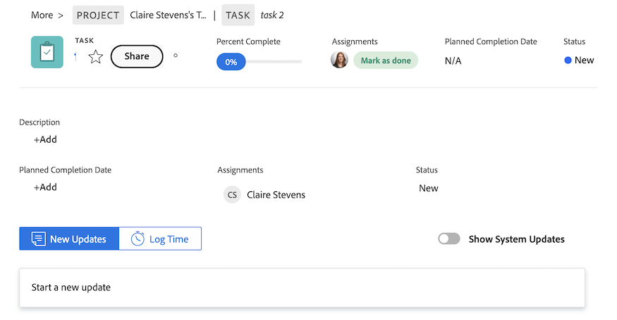

# 기존 홈에서 새 홈으로 이동

레거시 홈은 4분기 릴리스를 통해 10월 17일에 Workfront에서 제거됩니다. 이 문서에서는 새 홈에서 사용할 수 있는 기능에 대한 정보와 사용자를 새 홈 환경으로 이동하는 Workfront 관리자를 위한 권장 사항을 제공합니다.

기존 홈 사용 중단에 대한 자세한 내용은 [기존 홈 사용 중단 안내서](/help/quicksilver/product-announcements/announcements/legacy-home-deprecation.md)를 참조하십시오.

## 기존 홈에서 새 홈으로 변경되는 내용 이해

### 작업 목록

#### 내 작업 위젯으로 작업 구성

내 작업 위젯은 레거시 홈 작업 목록을 가능한 한 가깝게 미러링하기 위해 위젯 형식으로 생성되었습니다. 사용자는 유사한 필터 및 그룹화를 사용하여 내 작업 위젯에서 작업 목록을 그룹화하고 필터링할 수 있습니다.

| **필터** | **그룹화** |
|------------|-----------|
| -  에서 작업 중 - 시작 준비 완료   - 준비 안 됨   - 요청된   - 위임됨   - 완료됨 | - 프로젝트   - 상태   - 기한   - 없음 |

**기존 홈 그룹화를 새 홈에서 사용할 수 없음**

* 계획된 완료 일자 - 새 홈에서 납기 일자로 이름이 변경됨
* 계획된 시작
* 커밋 일자
* 내 우선순위

| **기존 홈** | **새 홈** |
|------------|-----------|
|  |  |

#### 작업 위임

사용자는 여전히 다음 위젯의 새 홈에서 작업을 위임할 수 있습니다.

* 내 작업
* 내 작업
* 내 문제
* 내 승인 대기 중

사용자는 다음 위젯에서 자신에게 위임된 작업을 찾을 수 있습니다.

* 내게 위임된 필터를 사용한 내 작업 위젯
* 위임된 승인 필터를 사용하여 내 승인 대기 중

| **기존 홈** | **새 홈** |
|------------|-----------|
|  |  |

#### 달력 보기 사용

New Home에서는 더 이상 달력 보기를 사용할 수 없습니다. 그러나 달력 대체는 우선 순위 로드맵에 있습니다.

#### 개인 작업 만들기

사용자는 더 이상 이전 홈에서 수행한 것과 동일한 방식으로 개인 작업을 생성할 수 없습니다. 대신, 사용자는 할 일 항목을 생성할 수 있습니다.

#### 내가 제출한 승인 보기

사용자가 새 홈에서 제출한 승인을 볼 수 없습니다. 조직의 사용자에게 이 기능이 필요한 경우 다음 커뮤니티 게시물에 해결 방법 또는 투표를 통해 승인 보고서를 작성하거나 댓글을 달 수 있습니다.

* [새 홈에 &quot;내가 제출한 승인&quot; 위젯 추가](https://experienceleaguecommunities.adobe.com/t5/workfront-ideas/add-quot-approvals-i-submitted-quot-widget-to-new-home/idc-p/704664#M25269)
* [새 홈에 &quot;내가 제출한 승인&quot; 추가](https://experienceleaguecommunities.adobe.com/t5/workfront-ideas/add-quot-approvals-i-submitted-quot-widget-to-new-home/idc-p/704664#M25269)

#### 내 우선 순위에 항목 추가

사용자는 새 홈에서 내 우선 순위 기능에 더 이상 액세스할 수 없습니다. 이를 대체할 우선 순위가 있는 새로운 내 포커스 열을 소개합니다.

원하는 경우 보드 위젯을 사용하여 우선순위가 높은 항목을 추적할 수 있습니다.

### 작업 항목 업데이트

기존 홈에서 사용자는 오른쪽 패널을 사용하여 작업을 업데이트할 수 있습니다. 새 홈에서 사용자는 이제 요약 패널을 사용하여 작업을 업데이트합니다. 프로젝트, 작업, 문제 및 문서에서 사용할 수 있는 것과 동일한 요약 패널입니다.

#### 요약 패널 사용

요약에서 사용자는 다음을 수행할 수 있습니다.

* 완료율 업데이트
* 업데이트 추가
* 문서 영역으로 이동하여 문서 업로드
* 작업 항목 세부 정보 보기 및 사용자 정의 필드 업데이트
Workfront 관리자는 레이아웃 템플릿의 요약에 표시되는 필드를 사용자 정의할 수 있습니다. 자세한 내용은 [레이아웃 템플릿을 사용하여 홈 및 요약 사용자 지정](/help/quicksilver/administration-and-setup/customize-workfront/use-layout-templates/customize-home-summary-layout-template.md)을 참조하십시오.
* 작업 항목 상태 변경
* 하위 작업 보기
* 로그 시간
* 첨부된 승인 진행 보기
* 파일 업로드 - 이 기능은 새로운 기능입니다

| **기존 홈** | **새 홈** |
|------------|-----------|
|  |  |

#### 요약 패널 열기

사용자는 작업 항목 위로 마우스를 이동한 다음 **요약** 아이콘 을(를) 클릭하여 요약 패널을 열 수 있습니다.

요약 패널 사용 방법에 대한 자세한 내용은 [요약 개요](/help/quicksilver/workfront-basics/the-new-workfront-experience/summary-overview.md)를 참조하십시오.

#### 빠른 작업 사용

요약 패널 외에도 사용자는 빠른 작업 을 사용하여 다음을 수행할 수 있습니다.

* 로그 시간
* 업데이트 추가
* 사용자 정의 양식 업데이트
* 파일 업로드

빠른 작업 메뉴를 찾으려면 작업 항목 위로 마우스를 가져갑니다. 빠른 작업 목록은 **처리 중** 또는 **완료** 단추 근처에 표시됩니다.

### 승인 및 팀 요청 보기

사용자는 여전히 다음 위젯을 사용하여 새 홈에서 승인 및 팀 요청을 관리할 수 있습니다.

* 승인 대기 중
* 모든 승인
* 팀 요청

새 홈 페이지에 위젯을 추가하는 방법에 대한 자세한 내용은 [새 홈에서 위젯 추가, 편집 또는 제거](/help/quicksilver/workfront-basics/using-home/new-home/add-edit-remove-widgets-in-new-home.md)를 참조하십시오.

## 사용 가능한 위젯에 대해 알아보기

위젯은 새 홈의 기초입니다. 홈 페이지에 위젯을 추가하면 사용자는 작업 요구 사항에 가장 잘 맞게 표시되는 정보 유형을 선택할 수 있습니다. 일부 위젯은 추적되는 오브젝트를 해당 라이센스에서만 사용할 수 있으므로 특정 라이센스 유형에서만 사용할 수 있습니다.

Workfront 관리자는 레이아웃 템플릿을 사용하여 새 홈에서 사용할 수 있는 위젯을 사용자 정의할 수 있습니다. 자세한 내용은 [레이아웃 템플릿을 사용하여 새 홈 사용자 지정](/help/quicksilver/administration-and-setup/customize-workfront/use-layout-templates/customize-new-home-layout-template.md)을 참조하십시오.

+++ 를 확장하여 사용 가능한 위젯의 세부 목록을 봅니다.
다음은 현재 선택할 수 있는 11개의 위젯과 표시되는 정보에 대한 요약입니다.

* **내 작업**\
   할당된 모든 작업, 문제 및 요청을 한 곳에 표시합니다. 처리 중(Work On It) 단추를 눌러 항목에 대한 작업을 시작하거나 완료(Done) 단추를 눌러 완료로 표시할 수 있습니다. 내 작업 위젯에서 작업 및 문제에 대한 정보(상태, 조건, 완료율)를 업데이트하고, 시간을 기록하며, 업데이트를 추가할 수도 있습니다.

* **보드**\
    사용자가 만들었거나 사용하도록 초대된 모든 보드를 표시합니다. 기본 보드, Kanban 보드, Retrospective 보드, 동적 보드 템플릿을 기반으로 새 보드를 생성할 수도 있습니다.

* **내 프로젝트**\
    목록에서 _자신이 소유한 프로젝트_ 또는 _현재 진행 중인 프로젝트_&#x200B;을 표시합니다. 기존 필터, 보기 또는 그룹화를 사용하여 목록을 사용자 정의하거나 위젯에서 직접 프로젝트를 만들 수 있습니다.

* **내 작업**\
    사용자에게 할당된 작업을 목록에 표시합니다. 기존 필터, 보기 또는 그룹화를 사용하여 목록을 사용자 정의하거나 위젯에서 직접 작업을 만들 수 있습니다. 사무실을 떠나 있는 동안 작업을 위임할 수도 있습니다.

* **내 문제**\
    사용자에게 할당된 문제를 목록에 표시합니다. 기존 필터, 보기 또는 그룹화를 사용하여 목록을 사용자 정의하거나 위젯에서 직접 문제를 생성할 수 있습니다. 이 위젯에는 관련 프로젝트가 현재로 설정된 문제만 포함되며 완료된 프로젝트는 포함되지 않습니다. 사무실을 떠나 있는 동안 문제를 위임할 수도 있습니다.

* **내 요청**\
    제출한 모든 요청, 열려 있는 요청만 표시하는 필터 및 요청에 대한 요약 패널을 여는 단추를 표시합니다.

* **팀 요청**\
    팀별로 정렬된 팀에 대해 보류 중인 모든 요청과 사용자에게 직접 요청을 할당하거나 직접 작업할 수 있는 버튼을 표시합니다.

* **내 승인 대기 중**\
    보류 중인 할당 또는 위임된 승인, 승인을 위임하는 버튼 및 위젯 내에서 직접 승인을 결정하는 버튼을 모두 표시합니다.

* **모든 승인**\
        평균 승인 시간 및 의사 결정과 보류 중인 승인 및 기한 경과 승인의 목록 보기에 대한 정보가 포함된 2개의 차트를 표시합니다. 이 기능은 단계적 릴리스의 일부이며 현재 특정 고객에게만 제공됩니다.

* **언급**\
    내 업데이트 페이지와 유사하게 Workfront 전체에서 최근 댓글 스레드를 표시합니다. 회신 버튼을 사용하여 위젯 내에서 회신을 작성할 수 있습니다. 또한 이 위젯에는 지난 30일 동안 작업 또는 문제가 업데이트된 경우 할당한 작업 및 문제에 대한 댓글, 다른 사용자에게 할당한 댓글, 소유한 댓글, 기본 담당자인 댓글 또는 생성한 댓글이 표시됩니다.

* **할 일**\
    이 고유한 위젯을 사용하면 자유롭게 편집할 수 있는 개인 체크리스트에 항목을 추가할 수 있습니다. 할 일은 개인 프로젝트의 작업으로 추적되며 완료 후 최대 2주 동안 유지됩니다.

  >[!NOTE]
  >
  >할 일 위젯에서 할 일을 만들려면 작업을 만들 수 있는 권한이 있어야 하며 현재 사용자가 입력한 개인 작업만 위젯에 표시됩니다.

+++

  

### 각 라이선스 유형에 사용할 수 있는 위젯 보기

기본적으로 홈 페이지는 라이선스 유형에 따라 몇 가지 특정 위젯으로 채워집니다. 아래 표는 각 라이선스 유형의 사용자가 새 홈으로 처음 이동할 때 표시되는 위젯에 대한 개요입니다.

<table border="1" class="inlineTable">
    <tr>
        <td><b>새 라이선스 유형</b></td>
        <td><b>기본 위젯</b></td>
    </tr>
    <tr>
        <td>표준</td>
        <td>내 프로젝트, 내 작업, 언급, 할 일</td>
    </tr>
    <tr>
        <td>라이트</td>
        <td>내 작업, 승인 대기 중</td>
    </tr>
    <tr>
        <td>기여자</td>
        <td>내 요청, 언급, 승인 대기 중, 게시판</td>
    </tr>
    <tr>
        <td>외부</td>
        <td>내 승인 대기 중</td>
    </tr>
</table>

<table border="1" class="inlineTable">
    <tr>
        <td><b>현재 라이선스 유형</b></td>
        <td><b>기본 위젯</b></td>
    </tr>
    <tr>
        <td>플랜</td>
        <td>내 프로젝트, 언급, 할 일</td>
    </tr>
    <tr>
        <td>작업</td>
        <td>내 작업, 언급, 할 일</td>
    </tr>
    <tr>
        <td>검토</td>
        <td>내 작업, 언급</td>
    </tr>
    <tr>
        <td>요청</td>
        <td>내 프로젝트, 승인 대기 중</td>
    </tr>
    <tr>
        <td>참여</td>
        <td>내 작업, 언급</td>
    </tr>
    <tr>
        <td>외부</td>
        <td>내 승인 대기 중</td>
    </tr>
</table>

## 사용 중단 준비

귀사와 조직의 중단을 최소화하기 위해 전환 작업을 간소화하는 데 도움이 되는 몇 가지 권장 사항이 아래에 나와 있습니다.

### 새 홈으로 전환 시작

기본 권장 사항은 가능한 한 빨리 새 홈으로 전환을 시작하는 것입니다. 즉, 조직적으로 관리자는 기존 홈과 유사한 레이아웃 템플릿을 통해 사용자의 경험을 사용자 정의하여 각 사용자에게 필요한 것이 있는지 확인합니다.

관리자를 권장합니다.

1. 레이아웃 템플릿을 사용하여 기본 새 홈 페이지 레이아웃을 만듭니다(또는 고유한 레이아웃이 필요한 각 사용자, 팀, 그룹 또는 작업 역할에 대해 만들 수 있음). 자세한 내용은 [레이아웃 템플릿을 사용하여 새 홈 사용자 지정](/help/quicksilver/administration-and-setup/customize-workfront/use-layout-templates/customize-new-home-layout-template.md)을 참조하십시오.

1. 위젯과 일반 설정이 작업 요구 사항을 충족하는지 확인할 수 있는 적은 수의 테스트 사용자에게 새 레이아웃 템플릿을 할당합니다.

1. 나머지 사용자를 새 홈 페이지 레이아웃에 재할당합니다.

이를 최대한 빨리 수행하면 사용자가 새 경험에 적응하고 개별 요구 사항에 가장 적합하게 새 홈 페이지를 사용자 지정할 수 있는 시간이 제공됩니다. 사용자가 자신의 새 홈 페이지에서 위젯을 사용자 지정하는 방법에 대한 자세한 내용은 [새 홈에서 위젯 제거, 추가 및 다시 정렬](/help/quicksilver/workfront-basics/using-home/new-home/add-edit-remove-widgets-in-new-home.md)을 참조하십시오.