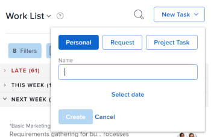

# 홈 영역에서 작업 항목 만들기

<!--

(NOTE: From Courtney: Need to rename)

-->

에서 작업 항목을 만들 수 있습니다. [!UICONTROL 홈] 영역입니다. 개인 작업을 직접 만들거나 다른 사용자에게 작업을 요청하거나 특정 프로젝트에 작업을 추가할 수 있습니다.

## 액세스 요구 사항

이 문서의 단계를 수행하려면 다음 액세스 권한이 있어야 합니다.

<table style="table-layout:auto"> 
 <col> 
 <col> 
 <tbody> 
  <tr> 
   <td role="rowheader"><strong>[!DNL Adobe Workfront plan*]</strong></td> 
   <td> 
모든
 </td> 
  </tr> 
  <tr> 
   <td role="rowheader"><strong>[!DNL Adobe Workfront] 라이센스*</strong></td> 
   <td> 
[!UICONTROL Work] 이상
 </td> 
  </tr> 
  <tr> 
   <td role="rowheader"><strong>액세스 수준 구성*</strong></td> 
   <td> 
[!UICONTROL Worker]
 
<b>메모</b>
 
   
아직 액세스 권한이 없는 경우 [!DNL Workfront] 관리자가 액세스 수준에 추가 제한을 설정하는 경우. 자세한 내용: [!DNL Workfront] 관리자가 액세스 수준을 수정할 수 있습니다. 다음을 참조하십시오. <a href="../../../administration-and-setup/add-users/configure-and-grant-access/create-modify-access-levels.md" class="MCXref xref">사용자 정의 액세스 수준 만들기 또는 수정</a>.
 </td> 
  </tr> 
  <tr> 
   <td role="rowheader"><strong>개체 권한</strong></td> 
   <td> 
작업에 대한 [!UICONTROL 편집] 액세스 이상
 
추가 액세스 요청에 대한 자세한 내용은 <a href="../../../workfront-basics/grant-and-request-access-to-objects/request-access.md" class="MCXref xref">오브젝트에 대한 액세스 요청 </a>.
 </td> 
  </tr> 
 </tbody> 
</table>

&#42;보유 중인 플랜, 라이선스 유형 또는 액세스 권한을 알아보려면 [!DNL Workfront] 관리자.

## 개인 작업 만들기

다음에서 본인만 사용할 수 있는 개인 작업을 만들 수 있습니다. [!UICONTROL 홈] 영역:

1. 다음을 클릭합니다. **[!UICONTROL 메인 메뉴]**  오른쪽 상단에서 을(를) 클릭한 다음 **[!UICONTROL 홈]**.
1. 클릭 **[!UICONTROL 새 작업]** > **[!UICONTROL 개인]**.

   

1. 다음에서 **[!UICONTROL 이름]** 필드에서 작업의 이름을 지정합니다.
1. (선택 사항) **[!UICONTROL 날짜 선택]**&#x200B;을(를) 클릭한 다음 작업 기한의 날짜를 선택합니다. 이렇게 하면 [!UICONTROL 계획된 완료 일자] 작업에 사용됩니다.\
   다음을 변경할 수 있습니다. **[!UICONTROL 계획된 완료 일자]** 오른쪽 패널에서 날짜를 클릭하거나 **[!UICONTROL 이 작업은 다음 기한까지 완료됩니다.]** 작업에서 바로 날짜입니다.

1. 클릭 **[!UICONTROL 만들기]** 을 눌러 작업을 저장합니다.\
   작업이 귀하에게 할당되었으며 다음에서 사용할 수 있습니다. [!UICONTROL 홈] 영역입니다.

>[!NOTE]
>
>* 개인 작업을 만들 때,에서 검색할 수 없는 &quot;숨겨진&quot; 프로젝트에 저장됩니다 [!UICONTROL Workfront]. 프로젝트 이름은 &quot;&lt; 사용자 이름 > 의 작업&quot;으로 지정됩니다. 사용자 이름은 작업을 만든 사용자의 전체 이름입니다. 에서 개인 작업을 클릭해야 이 프로젝트에 액세스할 수 있습니다. [!UICONTROL 홈] 작업 탐색 표시를 예로 들 수 있습니다.
>
>* 일반 프로젝트 작업과 달리, 개인 작업은 Workfront 인터페이스에 표시되는 제한된 필드 집합을 가지며 타임라인이나 프로젝트의 진행에 영향을 주지 않습니다. 개인 작업을 다른 사용자에게 재할당하면 모든 작업 필드가 개인 작업에 추가되지만 작업은 작업을 만든 사용자의 개인 프로젝트에 유지됩니다.
>
>
>* 개인 작업은 시간이 기록되거나 타임시트에 고정된 경우에만 타임시트에 표시됩니다. 작업에 기록된 시간이 있는 경우에만 개인 작업을 타임시트에 고정할 수 있습니다. 자세한 내용은 [로그 시간](../../../timesheets/create-and-manage-timesheets/log-time.md).
> 
>* 개인 작업을 일반 워크플로우의 일부로 만들려면 프로젝트를 만들고 개인 작업을 프로젝트로 이동하는 것이 좋습니다.
>
> ![[!UICONTROL 개인 작업을 위한 프로젝트]](assets/createworkitems-personal--project-350x105.png)

## 다른 사용자로부터 작업 요청

홈 영역에서 직접 다른 사용자에게 작업을 요청할 수 있습니다. 이 섹션에 설명된 대로 다른 사용자에게 작업을 요청하면 사용자가 클릭할 때까지 작업이 사용자의 홈 영역에 요청으로 표시됩니다 **[!UICONTROL 처리 중]**.

의 다른 사용자에게 작업을 요청하려면 [!UICONTROL 홈] 영역:

1. 다음을 클릭합니다. **[!UICONTROL 메인 메뉴]**  오른쪽 상단에서 을(를) 클릭한 다음 **[!UICONTROL 홈]**.
1. 클릭 **[!UICONTROL 새 작업]**&#x200B;을 선택한 다음 을 선택합니다. **[!UICONTROL 요청]**.

   

1. 다음에서 **[!UICONTROL 이름]** 필드에서 작업의 이름을 지정합니다.
1. 다음에서 **[!UICONTROL 할당 대상]** 필드를 지정하고 할당하려는 사용자, 팀 또는 역할의 이름을 입력한 다음 드롭다운 메뉴에 나타나면 이름을 클릭합니다.
1. 다음에서 [!UICONTROL 다른 이름으로 추가] 드롭다운 메뉴에서 작업 또는 문제를 추가할지 여부를 선택합니다.
1. 클릭 **[!UICONTROL 날짜 선택]**&#x200B;을(를) 클릭한 다음 작업 기한의 날짜 및 시간을 선택합니다.
1. 클릭 **[!UICONTROL 만들기]** 을 눌러 작업을 저장합니다.\
   작업이 의 작업 요청으로 표시됩니다. [!UICONTROL 홈] 지정한 사용자의 영역입니다.

## 프로젝트에 작업 또는 문제 추가

홈 영역에서 기존 프로젝트에 작업 또는 문제를 직접 추가할 수 있습니다.

1. 다음을 클릭합니다. **[!UICONTROL 메인 메뉴]**  오른쪽 상단에서 을(를) 클릭한 다음 **홈**.
1. 클릭 **[!UICONTROL 새 작업]**&#x200B;을 선택한 다음 을 선택합니다. **[!UICONTROL 프로젝트 작업]**.

   

1. 다음에서 **[!UICONTROL 이름]** 필드에 작업 또는 문제의 이름을 지정합니다.
1. 다음에서 **[!UICONTROL 할당 대상]** 필드를 지정하고 할당하려는 사용자, 팀 또는 역할의 이름을 입력한 다음 드롭다운 메뉴에 나타나면 이름을 클릭합니다.
1. 작업 또는 문제를 만들 프로젝트의 이름을 입력한 다음 드롭다운 메뉴에 표시될 때 이름을 클릭합니다.

   >[!IMPORTANT]
   >
   >작업 또는 문제가 [!UICONTROL 작업 목록] 프로젝트가 있을 때만 [!UICONTROL 상태] 이(가) (으)로 설정됨 [!UICONTROL 현재].

1. (조건부) 문제를 만들려면 다음을 선택합니다 **[!UICONTROL 문제]** 다음에서 **[!UICONTROL 다른 이름으로 추가]** 드롭다운 메뉴. 기본적으로, **[!UICONTROL 작업]** 이(가) 선택되어 있습니다.

1. 클릭 **[!UICONTROL 날짜 선택]**&#x200B;을(를) 클릭한 다음 작업 기한의 날짜 및 시간을 선택합니다.
1. 클릭 **[!UICONTROL 만들기]** 을 눌러 작업을 저장합니다.
