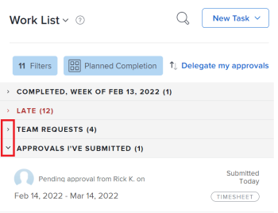

# [!UICONTROL Home] 영역의 [!UICONTROL 작업 목록]에 항목 표시

<!-- Audited: 1/2024 -->

[!UICONTROL Home] 영역의 [!UICONTROL 작업 목록]에는 사용자에게 할당된 모든 작업 항목이 표시됩니다. 필터를 사용하고 작업 항목을 그룹화 및 정렬하여 [!UICONTROL 작업 목록]에 표시할 항목을 제어할 수 있습니다.

>[!NOTE]
>
>* 문제를 작업 또는 프로젝트로 전환할 때 문제에 할당된 사용자의 홈 영역에서 문제가 제거됩니다.
>
>* 작업을 프로젝트로 전환할 때 작업이 삭제되고 작업에 할당된 사용자의 홈 영역에서 제거됩니다.

## 액세스 요구 사항

+++ 을 확장하여 이 문서의 기능에 대한 액세스 요구 사항을 봅니다.

이 문서의 단계를 수행하려면 다음 액세스 권한이 있어야 합니다.

<table style="table-layout:auto"> 
 <col> 
 </col> 
 <col> 
 </col> 
 <tbody> 
  <tr> 
   <td role="rowheader"><strong>[!DNL Adobe Workfront plan]</strong></td> 
   <td> 
임의
 </td> 
  </tr> 
  <tr> 
   <td role="rowheader"><strong>[!DNL Adobe Workfront] 라이센스</strong></td> 
   <td> 
신규:
<ul><li>승인용 [!UICONTROL Contributor]</li> <li>다른 모든 개체의 [!UICONTROL Standard] 이상</li> 
또는
 
  </ul>
현재:
<ul><li>승인용 [!UICONTROL Review]</li> <li>다른 모든 개체에 대해 [!UICONTROL Work] 이상</li> </td> 
  </tr> </ul>
  <tr> 
   <td role="rowheader"><strong>액세스 수준 구성</strong></td> 
   <td> 
프로젝트, 작업, 문제 및 문서에 대한 [!UICONTROL 보기] 이상 액세스 권한
 </td> 
  </tr> 
  <tr> 
   <td role="rowheader"><strong>개체 권한</strong></td> 
   <td> 
작업해야 하는 작업 및 문제에 대한 Contribute 권한 이상
  </td> 
  </tr> 
 </tbody> 
</table>

이 표의 정보에 대한 자세한 내용은 [Workfront 설명서의 액세스 요구 사항](/help/quicksilver/administration-and-setup/add-users/access-levels-and-object-permissions/access-level-requirements-in-documentation.md)을 참조하십시오.

+++

## [!UICONTROL 작업 목록] 필터링

[!UICONTROL 작업 목록]의 항목을 필터링하여 특정 유형의 항목만 볼 수 있습니다. 예를 들어 [!UICONTROL 작업 목록]을(를) 필터링하여 문제 또는 요청만 표시할 수 있습니다.

>[!NOTE]
>
>필터 옵션은 브라우저에 저장됩니다. 동일한 컴퓨터에서 동일한 브라우저를 일관되게 사용하고 사이트 데이터를 지우지 않으면 선택한 필터가 변경되지 않습니다. 브라우저나 컴퓨터를 전환하면 모든 필터가 선택 해제된 기본 옵션으로 필터가 되돌아갑니다.

1. Adobe Workfront의 오른쪽 상단에 있는 **[!UICONTROL 주 메뉴]** 아이콘 을 클릭하거나(가능한 경우) 왼쪽 상단에 있는 **[!UICONTROL 주 메뉴]** 아이콘 을 클릭한 다음 **[!UICONTROL 홈]**&#x200B;을 클릭합니다.
1. **[!UICONTROL 필터]**  드롭다운 메뉴를 클릭합니다. 필터를 선택한 경우 아이콘 대신 선택한 필터의 수가 표시됩니다.
1. 다음 필터 옵션 중에서 선택하여 표시할 항목 유형을 지정합니다.

   <table style="table-layout:auto"> 
    <col> 
    <col> 
    <tbody> 
     <tr> 
      <td role="rowheader"><strong>[!UICONTROL All]</strong></td> 
      <td>모든 항목을 표시하고 선택합니다. 여기에는 작업, 문제, 승인, 개인 작업 및 완료된 작업 및 문제가 포함됩니다. </td>
     </tr> 
     <tr> 
      <td role="rowheader"><strong>[!UICONTROL 작업: 처리 중]</strong></td> 
      <td> 
현재 작업 중인 작업만 표시합니다. 이는 [!UICONTROL Work On It] 버튼을 클릭한 사용자에게 할당된 작업입니다.
 </td> 
     </tr> 
     <tr> 
      <td role="rowheader"><strong>[!UICONTROL 작업: 시작할 준비 완료]</strong></td> 
      <td> 
       
 
        
시작할 준비가 된 작업만 표시합니다. 다음 문은 모두 true여야 합니다.
 
        <ul> 
         <li> 
과제와 그 부모에게는 작업을 할 수 없는 전임자나 과업 제한이 없다.
 </li> 
         <li> 
작업의 [!UICONTROL 계획된 시작 일자]가 과거 또는 최대 2주 후입니다.
 </li> 
        </ul> 
       
 </td> 
     </tr> 
     <tr> 
      <td role="rowheader"><strong>[!UICONTROL 작업: 준비되지 않음]</strong></td> 
      <td> 
       
 
        
아직 시작할 준비가 되지 않은 작업만 표시합니다. 다음 문 중 하나가 true여야 합니다.
 
        <ul> 
         <li> 
작업 및 상위 사용자에게 작업을 수행할 수 없는 선행 작업 또는 작업 제한이 있을 수 있습니다.
 </li> 
         <li> 
작업에 앞으로 2주 이상 소요되는 [!UICONTROL 계획된 시작 일자]가 있습니다.
 </li> 
        </ul> 
       
 </td> 
     </tr> 
     <tr> 
      <td role="rowheader"><strong>[!UICONTROL 문제: 처리 중]</strong></td> 
      <td> 
현재 진행 중인 문제만 표시합니다. 이는 [!UICONTROL Work On It] 버튼을 클릭한 사용자에게 할당된 문제입니다.
 </td> 
     </tr> 
     <tr> 
      <td role="rowheader"><strong>[!UICONTROL 문제: 요청됨]</strong></td> 
      <td>나에게 할당되었지만 [!UICONTROL Work On It] 단추를 클릭하지 않은 문제만 표시합니다.</td> 
     </tr> 
     <tr> 
      <td role="rowheader"><strong>개인</strong></td> 
      <td>개인 작업만 표시합니다. 문서 <a href="../../../workfront-basics/using-home/using-the-home-area/create-work-items-in-home.md">[!UICONTROL 홈] 영역에서 작업 항목 만들기</a>의 <a href="../../../workfront-basics/using-home/using-the-home-area/create-work-items-in-home.md#create-a-personal-task">개인 작업 만들기</a> 섹션에 설명된 대로 [!UICONTROL 할 일] 작업으로 만드는 작업입니다.</td> 
     </tr> 
     <tr> 
      <td role="rowheader"><strong>[!UICONTROL Approvals]</strong></td> 
      <td> 
       
 
        
귀하에게 할당되거나 위임된 승인 및 귀하가 제출한 승인만 표시합니다. 승인에는 작업 항목(프로젝트, 작업 및 문제)에 대한 승인과 문서, 증명, 액세스 요청 및 타임시트에 대한 승인이 포함됩니다. 승인에 대한 자세한 내용은 다음 문서를 참조하십시오.
 
        <ul> 
         <li><a href="../../../review-and-approve-work/manage-approvals/view-approvals.md" class="MCXref xref">승인 보기</a> </li> 
        </ul> 
        <ul> 
         <li> 
<a href="../../../review-and-approve-work/manage-approvals/manage-approvals.md" class="MCXref xref">작업 승인</a> 
 </li> 
        </ul> 
        
참고: 제출한 승인과 승인자 중 하나인 승인은 두 번 계산됩니다.
 
       
 </td> 
     </tr> 
     <tr> 
      <td role="rowheader"><strong>[!UICONTROL 위임됨: 내가 위임함]</strong></td> 
      <td> 
       
 
        
다른 사용자에게 위임한 작업 항목만 표시합니다.
 
        
작업 위임에 대한 자세한 내용은 <a href="/help/quicksilver/manage-work/delegate-work/how-to-delegate-work.md#delegate-tasks-and-issues-to-another-user" class="MCXref xref">다른 사용자에게 작업 및 문제 위임</a>을 참조하십시오.
       
 </td> 
     </tr> 
     <tr> 
      <td role="rowheader"><strong>[!UICONTROL 위임됨: 내게 위임됨]</strong></td> 
      <td> 
       
 
        
다른 사용자가 일시적으로 귀하에게 위임한 작업 항목만 표시합니다.
 
       
 </td> 
     </tr> 
     <tr> 
      <td role="rowheader"><strong>[!UICONTROL 완료]</strong></td> 
      <td> 
완료된 작업, 문제 및 개인 작업만 표시합니다. 완료된 작업이 이전 2주 동안 표시되고 완료된 주에 따라 작업 목록에 그룹화됩니다. 승인이 포함되지 않습니다.
 
이 필터를 선택하지 않으면 완료된 작업이 [!UICONTROL 작업 목록]에 표시되지 않습니다.
 </td> 
     </tr> 
    </tbody> 
   </table>

   

   >[!TIP]
   >
   >* 필터 옵션은 개체(작업, 문제, 승인, 개인 작업)를 기반으로 합니다.
   >* 작업 및 문제는 작업할 준비가 된 상태별로 필터링됩니다(작업의 경우 [!UICONTROL 작업 중], [!UICONTROL 시작 준비 완료], [!UICONTROL 준비 안 됨], 문제의 경우 [!UICONTROL 작업 중] 및 [!UICONTROL 요청]). 을(를) 선택하여 특정 상태의 작업 또는 문제를 표시하거나 작업 또는 문제를 클릭하여 모든 상태를 선택하고 표시할 수 있습니다.
   >* 완료된 항목에 대한 별도의 필터가 있으며 여기에는 작업과 문제가 모두 포함됩니다. 여기에는 승인이 포함되지 않습니다. [!UICONTROL 완료됨] 필터에 개인 작업이 포함되어 있습니다.
   >* 한 번에 하나의 상태만 표시하도록 선택할 수 있습니다. 예를 들어 [!UICONTROL 작업 중]개 작업과 [!UICONTROL 요청된]개 문제만 표시할 수 있습니다. 한 번에 여러 상태를 선택할 수도 있습니다.
   >* 팀 중 하나에 할당된 항목에 필터를 적용할 수 없으며 팀 할당은 사용자에게 직접 할당된 항목에 포함되지 않습니다.

1. (선택 사항) 이 문서의 [날짜, 프로젝트 및 우선 순위별로 그룹화 및 정렬](#group-and-sort-by-date-project-and-priority) 섹션에 설명된 대로 [!UICONTROL 작업 목록]을 추가로 구성합니다.

## [!UICONTROL 날짜], [!UICONTROL 프로젝트] 및 [!UICONTROL 우선 순위]별로 그룹화 및 정렬

[!UICONTROL 계획된 완료 일자], [!UICONTROL 커밋 일자], [!UICONTROL 프로젝트] 또는 [!UICONTROL 내 우선 순위]별로 [!UICONTROL 작업 목록]을(를) 그룹화하고 정렬할 수 있습니다. 선택한 옵션은 [!UICONTROL 작업 목록]에서 항목을 그룹화하는 방법을 결정합니다.

1. Adobe Workfront의 오른쪽 상단에 있는 **[!UICONTROL 주 메뉴]** 아이콘 을 클릭하거나(가능한 경우) 왼쪽 상단에 있는 **[!UICONTROL 주 메뉴]** 아이콘 을 클릭한 다음 **[!UICONTROL 홈]**&#x200B;을 클릭합니다.
1. **[!UICONTROL 그룹화 기준]**  드롭다운 메뉴를 클릭합니다.

   <!--
   
   -->

1. 다음 옵션 중에서 선택합니다.

   <table style="table-layout:auto"> 
    <col> 
    <col> 
    <tbody> 
     <tr> 
      <td role="rowheader"><strong>[!UICONTROL 계획된 완료]</strong></td> 
      <td> 
 항목은 [!UICONTROL 계획된 완료 일자]에 따라 [!UICONTROL 작업 목록]에서 다음 그룹화로 표시됩니다(각 그룹화에 포함된 항목 수는 제목 옆에 괄호로 표시됨).
 
       <ul> 
        <li> 
[!UICONTROL 지연]
 </li> 
        <li> 
[!UICONTROL 계획된 완료 일자 없음]
 </li> 
        <li> 
[!UICONTROL This Week]
 
이 그룹화는 기본적으로 확장되어 있습니다.
 </li> 
        <li> 
[!UICONTROL Next Week]
 </li> 
        <li> 
[!UICONTROL Planned] 다음에 여러 [!UICONTROL Planned Completion Dates](여러 그룹화)가 옵니다.
 </li> 
        <li> 
[!UICONTROL 완료]
 </li> 
       </ul> </td> 
     </tr> 
     <tr> 
      <td role="rowheader"><strong>[!UICONTROL 계획 시작]</strong></td> 
      <td> 
항목은 [!UICONTROL 계획된 시작 일자]에 따라 [!UICONTROL 작업 목록]에서 다음 그룹화로 표시됩니다(각 그룹화에 포함된 항목 수는 제목 옆에 괄호로 표시됨).
 
       <ul> 
        <li> 
[!UICONTROL 지연]
 </li> 
        <li> 
[!UICONTROL This Week] 
 
이 그룹화는 기본적으로 확장되어 있습니다.
 </li> 
        <li> 
[!UICONTROL Next Week]
 </li> 
        <li> 
[!UICONTROL Planned] 다음에 여러 [!UICONTROL Planned Start Dates](여러 그룹화)가 옵니다.
 </li> 
       </ul> </td> 
     </tr> 
     <tr> 
      <td role="rowheader"><strong>[!UICONTROL 커밋 일자]</strong></td> 
      <td> 
항목은 [!UICONTROL 작업 목록]에서 다음 그룹화로 표시됩니다(각 그룹화 내에 포함된 항목의 수는 제목 옆에 괄호로 표시됨).
 
       <ul> 
        <li> 
[!UICONTROL 커밋 일자 없음]
 </li> 
        <li> 
[!UICONTROL Committed Next Week]
 </li> 
       </ul> </td> 
     </tr> 
     <tr> 
      <td role="rowheader"><strong>[!UICONTROL 프로젝트]</strong></td> 
      <td>항목은 프로젝트에 따라 그룹화되고 프로젝트는 [!UICONTROL 작업 목록]에 알파벳순으로 표시됩니다. 각 그룹화 내에 포함된 항목의 수는 제목 제목 옆에 괄호로 표시됩니다.</td> 
     </tr> 
     <tr> 
      <td role="rowheader"><strong>[!UICONTROL 내 우선 순위]</strong></td> 
      <td>선택한 순서대로 항목이 표시됩니다. 자세한 내용은 <a href="../../../workfront-basics/using-home/using-the-home-area/prioritize-work-in-home.md" class="MCXref xref">[!UICONTROL Home] 영역에서 작업 우선 순위 지정</a>을 참조하십시오.</td> 
     </tr> 
    </tbody> 
   </table>

>[!NOTE]
>
>기본 정렬은 오름차순입니다. 정렬을 내림차순으로 변경하면 선택한 정렬 옵션이 브라우저에 저장됩니다. 동일한 컴퓨터에서 동일한 브라우저를 일관되게 사용하고 사이트 데이터를 지우지 않으면 정렬이 변경되지 않지만 브라우저나 컴퓨터를 전환하면 정렬이 기본 정렬로 변경됩니다.

## 지연 항목 보기

[!DNL Adobe Workfront]은(는) 다음 날짜를 사용하여 작업 요청이 늦는지 확인합니다.

* **작업**: [!UICONTROL 계획된 완료 일자]
* **문제**: [!UICONTROL 계획된 완료 일자]
* **문서**: [!UICONTROL 제출 날짜]
* **타임시트**: [!UICONTROL 제출 날짜]
* **승인**: [!UICONTROL 제출 날짜]
* **증명 승인**: [!UICONTROL 증명 기한]

## [!UICONTROL 작업 목록] 검색

[!UICONTROL 작업 목록]을(를) 검색하면 사용자에게 할당된 모든 항목이 검색에서 반환됩니다(현재 화면에 로드되지 않은 항목도). [!UICONTROL 완료 표시] 옵션을 선택하면 지난 2주 이내에 완료로 표시한 항목도 모두 반환됩니다.

또한 작업 항목의 이름만 검색됩니다(작업 항목 내의 정보는 검색되지 않으며 작업 항목이 있는 프로젝트의 이름도 검색되지 않음).

[!UICONTROL 작업 목록]을 검색하려면 다음을 수행하십시오.

1. Adobe Workfront의 오른쪽 상단에 있는 **[!UICONTROL 주 메뉴]** 아이콘 을 클릭하거나(가능한 경우) 왼쪽 상단에 있는 **[!UICONTROL 주 메뉴]** 아이콘 을 클릭한 다음 **[!UICONTROL 홈]**&#x200B;을 클릭합니다.
1. (선택 사항) [작업 목록 필터링[!UICONTROL 작업 목록]](#filter-the-work-list) 및 [그룹 및 정렬 기준 ](#group-and-sort-by-date-project-and-priority)에 설명된 대로 [!UICONTROL 작업 목록]을 필터링하고 그룹화합니다.

1. (선택 사항) 이미 완료된 작업 항목을 검색하는 경우 검색하기 전에 완료된 항목을 표시하도록 [!UICONTROL 작업 목록]을 구성해야 합니다.

1. 검색 아이콘 을 클릭합니다.
1. 검색 중인 항목 이름의 이름을 입력하십시오.\
   [!UICONTROL 작업 목록]은(는) 이름이 일치하는 항목을 포함하도록 자동으로 필터링됩니다.

## 작업 목록 크기 변경

[!UICONTROL 작업 목록]의 크기를 변경하여 Home 영역의 약 4분의 1에서 [!UICONTROL Home] 영역의 약 절반까지 사용할 수 있습니다.

1. Adobe Workfront의 오른쪽 상단에 있는 **[!UICONTROL 주 메뉴]** 아이콘 을 클릭하거나(가능한 경우) 왼쪽 상단에 있는 **[!UICONTROL 주 메뉴]** 아이콘 을 클릭한 다음 **[!UICONTROL 홈]**&#x200B;을 클릭합니다.
1. [!UICONTROL 작업 목록]의 오른쪽 가장자리 위로 마우스를 가져간 다음 작업 목록이 원하는 크기가 될 때까지 왼쪽이나 오른쪽으로 끕니다.

## 그룹화 축소 및 확장

[!UICONTROL 작업 목록]의 항목이 그룹화 내에 표시됩니다. 그룹화를 축소 및 확장하여 주어진 시간에 페이지에 표시되는 정보의 양을 제어할 수 있습니다.

[!UICONTROL 작업 목록]에서 그룹화를 축소하고 확장하여 표시되는 정보를 더 잘 제어할 수 있습니다.\
기본적으로 [!UICONTROL 이번 주] 그룹화는 확장되며 다른 모든 그룹화는 축소됩니다. 변경한 내용은 다음에 홈 영역에 액세스할 때 기억됩니다.

1. Adobe Workfront의 오른쪽 상단에 있는 **[!UICONTROL 주 메뉴]** 아이콘 을 클릭하거나(가능한 경우) 왼쪽 상단에 있는 **[!UICONTROL 주 메뉴]** 아이콘 을 클릭한 다음 **[!UICONTROL 홈]**&#x200B;을 클릭합니다.
1. 확장하거나 축소하려는 그룹화 옆의 **[!UICONTROL 확장]** 또는 **[!UICONTROL 축소]** 화살표를 클릭합니다.

   

   또는\
   모든 그룹화를 동시에 확장하거나 축소하려면 [!UICONTROL Shift] 키를 누른 채 모든 그룹화 옆에 있는 **[!UICONTROL 확장]** 또는 **[!UICONTROL 축소]** 화살표를 클릭합니다.
