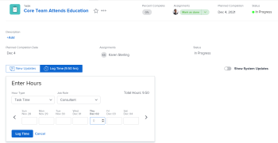

# 시작 [!UICONTROL 홈]

이 문서에서는 현재 의 개요를 설명합니다 [!UICONTROL 홈] 영역 [!DNL Adobe Workfront]. 새 작업에서 작업에 대한 정보 [!UICONTROL 홈], 참조 [Adobe Workfront의 새 홈 시작](../new-home/get-started-with-new-home.md).

현재 상태에서 작업을 보는 방법에는 두 가지가 있습니다 [!UICONTROL 홈] 영역:

* 다음에서 [!UICONTROL 작업 목록]
* 다음에서 [!UICONTROL 캘린더].

## 작업 목록

할당된 모든 작업을 [!UICONTROL 작업 목록]:

![[!UICONTROL 작업 목록] 패널](assets/worklist-and-right-panel-home.png)

현재 섹션에서 다음 섹션을 검토하십시오 [!UICONTROL 홈] 위 이미지에서 강조 표시된 영역:

* **A**: 왼쪽 패널을 사용하여 자신에게 할당된 작업을 필터링, 정렬 및 선택합니다.

* **B**: 왼쪽 패널에서 작업 항목을 선택한 후 오른쪽 패널을 사용하여 사용자 정의 필드와 상호 작용하고, 업데이트하고, 시간을 기록합니다.

사용에 대한 자세한 내용은 [!UICONTROL 홈 작업 목록], 다음 문서를 참조하십시오.

* [에 항목 표시 [!UICONTROL 작업 목록] 다음에서 [!UICONTROL 홈] 영역](../../../workfront-basics/using-home/using-the-home-area/display-items-in-home-work-list.md)
* [에서 작업 항목 만들기 [!UICONTROL 홈] 영역](../../../workfront-basics/using-home/using-the-home-area/create-work-items-in-home.md)

## 캘린더

작업 항목의 기한이 되었을 때 표시하여 작업을 시각화할 수 있으며, 작업 시간을 차단하여 작업을 완료할 수 있습니다. [!UICONTROL 캘린더] 다음에서 [!UICONTROL 홈] 영역:

현재 섹션에서 다음 섹션을 검토하십시오 [!UICONTROL 홈] 위 이미지에서 강조 표시된 영역:

* **A**: 사용 [!UICONTROL 캘린더] 완료해야 하는 작업의 시각적 맵을 만들려면 을(를) 봅니다. 을(를) 클릭하고 의 작업 항목을 [!UICONTROL 작업 목록] 다음에 대한 [!UICONTROL 캘린더] 출근 시간을 차단하기 위해

* **B**: 사용 [!UICONTROL 캘린더]과(와) 동기화할 의 동기화 옵션 [!DNL Outlook] 달력. 회의를 관리하고 한 곳에서 모두 작업하십시오.

* **C**: 사용 [!UICONTROL 세부 사항] 단추를 클릭하여 작업 항목에 대한 자세한 정보를 볼 수 있는 새 오른쪽 패널을 엽니다.

* **D**: 기한 표시줄을 사용하여 할당된 작업이 기한인 시점을 추적합니다.

홈 캘린더 사용 방법에 대한 자세한 내용은 [사용 [!UICONTROL 홈 캘린더] 보기](../../../workfront-basics/using-home/using-the-home-area/use-home-calendar-view.md).

## 내 작업 찾기

다음 [!UICONTROL 홈] area는 할당된 작업, 문제 및 승인을 찾기 위한 원스톱 샵입니다. 필터 및 정렬 옵션은 [!UICONTROL 홈] 영역은 여러분이 원하는 방식으로 작업할 수 있도록 지원하기 위해 함께 협력합니다. 다음을 사용할 수 있습니다. [!UICONTROL 정렬 기준:] 옵션을 사용하여 항목을 함께 그룹화한 다음 필터를 사용하여 완료해야 하는 작업에 집중합니다.

>[!NOTE]
>
>필터 및 정렬 옵션은 브라우저에 저장됩니다. 동일한 컴퓨터에서 동일한 브라우저를 일관되게 사용하는 경우(그리고 사이트 데이터를 지우지 않는 경우) 필터 및 정렬은 변경되지 않지만 브라우저나 컴퓨터를 전환하는 경우 필터 및 정렬은 달라집니다.

### 유사한 작업 항목을 &#39;[!UICONTROL 그룹화 기준]&#39; 옵션

다음 [!UICONTROL 정렬 기준:] 옵션을 사용하면 작업 목록에서 같은 항목을 그룹화할 수 있습니다. 다음을 기준으로 정렬할 수 있습니다.

* [!UICONTROL 계획된 완료]
* [!UICONTROL 계획된 시작]
* [!UICONTROL 커밋 일자]
* [!UICONTROL 프로젝트]
* [!UICONTROL 내 우선 순위]

그룹화를 사용하는 방법에 대한 자세한 내용은 [에 항목 표시 [!UICONTROL 작업 목록] 다음에서 [!UICONTROL 홈] 영역](../../../workfront-basics/using-home/using-the-home-area/display-items-in-home-work-list.md).

### 필터로 초점 좁히기

다음 [!UICONTROL 작업 목록] 필터를 사용하면 특정 작업 항목으로 포커스를 좁힐 수 있습니다.

다음은 홈에서 보는 항목을 필터링하는 방법의 예입니다.

* 항목 유형 및 상태별로 필터링합니다.

  예를 들어 모든 작업을 표시하려면 다음을 선택할 수 있습니다. [!UICONTROL 작업] 필터. 보다 구체적으로 작업하고 작업을 시작할 준비가 된 작업만 표시하려면 다음을 선택합니다 [!UICONTROL 시작할 준비 완료] 아래의 필터 [!UICONTROL 작업] 필터.

* 항목 유형으로만 필터링합니다.

  예를 들어 다음을 선택할 수 있습니다 [!UICONTROL 문제] 모든 상태의 모든 문제를 보려면 ([!UICONTROL 작업 중] 또는 [!UICONTROL 요청됨]), 또는 [!UICONTROL 승인] 모든 작업 항목을 보려면 액세스 요청, 타임시트, 문서 및 증명 승인을 받으십시오.

* 상태로만 필터링합니다.

  예를 들어 [!UICONTROL 완료됨] 완료된 작업 및 문제를 표시하도록 필터링합니다. 여기에는 개인 작업이 포함되지만 승인에는 포함되지 않습니다.

필터 사용 방법에 대한 자세한 내용은 [에 항목 표시 [!UICONTROL 작업 목록] 다음에서 [!UICONTROL 홈] 영역](../../../workfront-basics/using-home/using-the-home-area/display-items-in-home-work-list.md).

### 내 팀에 할당된 액세스 작업

다음 [!UICONTROL 홈] 영역에는 팀의 요청 페이지에 대한 직접 링크와 함께 팀 요청 전용 영구 그룹화가 있습니다. 이 그룹화를 사용하여 진행 중인 모든 팀에 대한 요청을 보고 액세스할 수 있습니다.

>[!NOTE]
>
>다음 [!UICONTROL 필터] 및 [!UICONTROL 정렬 기준:] 옵션은 [!UICONTROL 팀 요청] 그룹화. 이 그룹화는 팀에 할당된 작업이 있는 한 볼 수 있습니다.

팀 요청 액세스에 대한 자세한 내용은 문서 를 참조하십시오 [[!UICONTROL 관리] 의 작업 및 팀 요청 [!UICONTROL 홈] 영역](../../../workfront-basics/using-home/using-the-home-area/manage-work-and-team-requests-home.md).

### 제출한 작업 모니터링

승인을 위해 제출한 작업을에서 직접 추적합니다. [!UICONTROL 작업 목록]. 승인자에게 승인이 필요한 작업을 알려 줄 수 있습니다. 필요한 경우 승인을 회수할 수도 있습니다.

>[!NOTE]
>
>다음 [!UICONTROL 필터] 및 [!UICONTROL 정렬 기준:] 옵션은 [!UICONTROL 내가 제출한 승인] 그룹화. 승인 대기 중인 작업이 있는 한 이 그룹화가 표시됩니다.

## 본인에게 중요한 것에 우선 순위 지정

다음 [!UICONTROL 작업 목록] 을(를) 통해 자신에게 중요한 작업을 표시하고 우선 순위를 지정할 수 있습니다. [!UICONTROL 내 우선 순위 정렬 기준] 옵션을 선택합니다. 에 최대 20개의 항목을 추가할 수 있습니다. [!UICONTROL 내 우선 순위] 목록을 표시합니다. 사용 [!UICONTROL 자세히] 작업 항목을 우선순위 목록에 추가하는 메뉴.

>[!NOTE]
>
>에 추가된 모든 작업 항목 [!UICONTROL 내 우선 순위] 은 사용자에게만 표시되며, 누구도 사용자의 작업 우선 순위를 지정할 수 없습니다.

사용 방법에 대한 자세한 정보 [!UICONTROL 내 우선 순위], 참조 [에서 작업 우선 순위 지정 [!UICONTROL 홈] 영역](../../../workfront-basics/using-home/using-the-home-area/prioritize-work-in-home.md).

## 완료

에서 오른쪽 패널 사용 [!UICONTROL 홈] 작업을 업데이트하고 완료합니다.

### 사용자 지정된 공간에서 작업

사용자 [!DNL Adobe Workfront] 관리자는 필요한 정보를 더 쉽게 찾고 업데이트할 수 있도록 최대 16개의 사용자 정의 필드를 추가할 수 있습니다. 대부분의 필드는 편집할 수 있으므로 작업 항목으로 이동할 필요가 없습니다.

이 영역의 필드를 업데이트하려면 필드를 클릭하면 됩니다.

>[!NOTE]
>
>다음 항목을 업데이트할 수 없습니다. [!UICONTROL 커밋 일자] 이 지역에서요.

### 중요한 정보로 동료 업데이트

의 동료와 신속하고 효율적으로 의사 소통 [!UICONTROL 홈] 영역입니다. 동료에게 질문하거나 최근 업데이트를 알리거나 댓글에 직접 답글을 달 수 있습니다. 또한 다음과 같은 방법으로 진행 상황에 대한 다른 정보를 업데이트할 수 있습니다.

* 업데이트 중 [!UICONTROL 커밋 일자]

  <!--
  <note type="note">
  This is the only place you can update the Commit Date in Home.
   
  </note>
  -->

* 진행 상황에 대한 의견 보고
* 완료율 막대 업데이트

에서 통신하는 방법에 대한 자세한 내용은 [!UICONTROL 홈] 영역, 참조 [작업 업데이트](../../../workfront-basics/updating-work-items-and-viewing-updates/update-work.md).

### 시간 기록

개별 작업 항목에서 작업한 시간을 추적합니다. 다음과 같은 일반 시간 유형을 선택할 수 있습니다. [!UICONTROL 작업 시간]또는 사용자가 설정한 프로젝트별 시간 유형을 선택할 수 있습니다. [!DNL Workfront] 관리자.

에서 시간을 기록하는 방법에 대한 자세한 내용은 [!UICONTROL 홈] 영역, 섹션 참조 [홈](../../../timesheets/create-and-manage-timesheets/log-time.md#home) 이 문서에서 [로그 시간](../../../timesheets/create-and-manage-timesheets/log-time.md).

