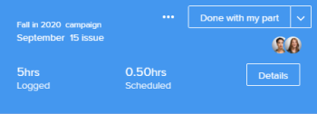

# [!UICONTROL 홈 달력] 보기

<!--

Updated for QS except for section about expanding a work item in the list--this isn't working yet in QS.

-->

다음 [!UICONTROL 홈 달력] 에서 보기 [!UICONTROL 홈] 영역에서는 작업주 및 작업주를 사용자가 볼 수 있는 개인 작업 달력에 대한 작업 지정을 보고 관리할 수 있습니다. 이를 사용하여 원하는 작업을 언제 계획할 수 있습니다. 그리고 이를 외부 달력(예: [!UICONTROL Microsoft Outlook] 달력.

>[!NOTE]
>
>다음 [!UICONTROL 홈 달력] 보기가 [!UICONTROL 달력] 보고서. 에 대한 자세한 정보 [!UICONTROL 달력] 보고서, [[!UICONTROL 달력] 보고서 개요](../../../reports-and-dashboards/reports/calendars/calendar-reports-overview.md).

설정 관련 지침이 필요한 경우 [!UICONTROL 홈 달력]를 참조하십시오. [구성 [!UICONTROL 홈 달력] 설정 보기](../../../workfront-basics/using-home/using-the-home-area/configure-home-calendar-view.md).

액세스 방법에 대한 자세한 정보 [!UICONTROL 홈 달력] 보기, [보기 [!UICONTROL 홈 달력]](../../../workfront-basics/using-home/using-the-home-area/view-home-calendar.md).

통합 관련 정보 [!UICONTROL 홈 달력] 외부 달력을 사용하는 경우 [[!UICONTROL [!UICONTROL 홈 달력 구성]] 보기 설정](../../../workfront-basics/using-home/using-the-home-area/configure-home-calendar-view.md).

이 문서의 나머지 섹션에서는 [!UICONTROL 홈 달력] 자세히 보기

## 의 작업 목록 [!UICONTROL 홈 달력]

사용자, 그룹, 팀 및 역할에 할당된 작업 항목(작업, 문제, 요청 및 승인)은 [!UICONTROL 작업 목록] 달력 왼쪽의 [!UICONTROL 홈] 영역.

작업 항목을 [!UICONTROL 작업 목록] 아래와 같이 [!UICONTROL 홈 달력] 작업 시간을 예약하는 중입니다. 작업 예약에 대한 자세한 내용은 [를 사용하십시오 [!UICONTROL 홈 달력] 보기](../../../workfront-basics/using-home/using-the-home-area/use-home-calendar-view.md).

목록에서 작업 항목을 클릭하여 진행 상황을 보고 업데이트할 수 있습니다.

항목에 따라 작업 목록에서 선택한 항목에 대해 달력 왼쪽에 다음 정보가 표시될 수 있습니다.

* **[!UICONTROL 프로젝트 이름]**: 작업 항목의 왼쪽 상단에 표시됩니다. 항목이 연관된 프로젝트입니다. 위의 예에서 프로젝트 제목은 &quot;2020년 가을 캠페인&quot;입니다.
* **[!UICONTROL 작업 항목 이름]**: 프로젝트 이름 아래에 표시됩니다. 위의 예에서 작업 항목의 제목은 &quot;9월 15일&quot;입니다.
* **[!UICONTROL 완료]**: 작업 지정 상태를 로 변경하려면 이 단추를 누릅니다 [!UICONTROL 완료]. 이 단추는 작업이나 문제에 지정된 경우에만 표시됩니다.
* **[!UICONTROL 내 몫으로 끝남]**: 을(를) 클릭합니다. [!UICONTROL 내 몫으로 끝남] 작업 지정 상태를 로 변경하는 버튼 [!UICONTROL 완료].
* **[!UICONTROL 계획됨]**: 자원 관리자가 항목에 대한 작업을 완료하기 위해 할당한 시간을 표시합니다. 계획된 시간에 대한 자세한 내용은 [계획 시간 개요](../../../manage-work/tasks/task-information/planned-hours.md).

* **[!UICONTROL 기록됨]**: 작업표 또는 작업표에 작업 항목에 로그온한 시간을 표시합니다 [!UICONTROL 업데이트] 탭에서 검색할 수 있습니다. 자세한 내용은 [작업 항목에 대한 [!UICONTROL 홈] 영역](../../../workfront-basics/using-home/using-the-home-area/log-time-on-work-item-in-home.md)

* **[!UICONTROL 예약됨]**: 작업 항목에 대해 예약한 시간을 [!UICONTROL 달력] 보기. 작업 항목을 [!UICONTROL 달력] 보기, [작업 항목을 [!UICONTROL 홈 달력]](../../../workfront-basics/using-home/using-the-home-area/use-home-calendar-view.md#scheduling-work-items-in-home-calendar) in [를 사용하십시오 [!UICONTROL 홈 달력] 보기](../../../workfront-basics/using-home/using-the-home-area/use-home-calendar-view.md).

* **[!UICONTROL 세부 사항]**: 이 단추를 클릭하여 작업 항목의 세부 사항을 오른쪽 패널에 표시합니다 [!UICONTROL 달력] 보기.
* **[!UICONTROL 작업]**: 항목에 대해 작업할 지정을 수락하려면 이 단추를 누릅니다.

## 할당 막대

을 설정할 때 [!UICONTROL 홈 달력]로 지정하는 경우 일반적으로 한 주에 작업하는 시간을 지정합니다( [구성 [!UICONTROL 홈 달력] 설정 보기](../../../workfront-basics/using-home/using-the-home-area/configure-home-calendar-view.md)). [!DNL Adobe Workfront] 이 숫자를 사용하여 할당된 총 작업 시간을 결정합니다.

다음 [!UICONTROL 할당] 표시줄은 작업 주의 시간 및 작업 주의 시간 사용 방법을 시각적으로 나타냅니다.

색상 [!UICONTROL 할당] 표시줄에는 다음 정보가 표시됩니다.

* **회색**: 통합 달력의 이벤트에 대해 예약된 시간 수입니다. 달력 통합에 대한 자세한 내용은 섹션을 참조하십시오 [구성 [!UICONTROL 홈 달력] 설정 보기](../../../workfront-basics/using-home/using-the-home-area/configure-home-calendar-view.md#configuring-your-home-calendar-view) in [구성 [!UICONTROL 홈 달력] 설정 보기](../../../workfront-basics/using-home/using-the-home-area/configure-home-calendar-view.md).

* **파란색**: 예약한 시간 [!DNL Workfront] 사용자에게 할당된 작업 항목입니다. 에서 항목을 끌어 작업 일정을 잡을 수 있습니다 [!UICONTROL 작업 목록] 달력에 놓고 작업 예약에 대한 자세한 내용은 [작업 항목을 [!UICONTROL 홈 달력]](../../../workfront-basics/using-home/using-the-home-area/use-home-calendar-view.md#scheduling-work-items-in-home-calendar) 섹션 [를 사용하십시오 [!UICONTROL 홈 달력] 보기](../../../workfront-basics/using-home/using-the-home-area/use-home-calendar-view.md).

* **연한 파란색**: 할당에 사용할 수 있는 무료 시간 수입니다.
* **빨간색**(위에 표시되지 않음): 해당 주에 사용할 수 있는 시간을 초과한 예약된 이벤트 및 작업 항목입니다.

## [!UICONTROL 기한] 막대

다음 [!UICONTROL 기한] 바 [!UICONTROL 홈 달력] 현재 표시된 주의 만기 항목이 해당 항목에 따라 표시됩니다 [!UICONTROL 계획 완료 일자].

>[!NOTE]
>
>Microsoft 캘린더를 [!DNL Workfront] 달력, [!UICONTROL 기한] 작업 목록에서 작업 테이블로 드래그하지 않으면 Microsoft 달력에 표시줄이 표시되지 않습니다 [!DNL Workfront] 달력. 자세한 내용은 섹션을 참조하십시오  [의 작업 목록 [!UICONTROL 홈 달력]](#work-list-on-the-home-calendar) 위 및 문서  [구성 [!UICONTROL 홈 달력] 설정 보기](../../../workfront-basics/using-home/using-the-home-area/configure-home-calendar-view.md).
