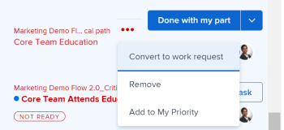

# 에서 작업 및 팀 요청 관리 [!UICONTROL 홈] 영역

작업 작업 및 문제가 사용자에게 할당되면 [!UICONTROL 작업 목록] 에서 [!UICONTROL 홈] 영역. 요청을 조회, 재지정, 회신, 작업 또는 제거할 수 있습니다. 의 작업 요청 [!UICONTROL 홈] 영역은 요청 큐와 관련된 문제로 제한되지 않습니다.

## 액세스 요구 사항

이 문서의 절차를 수행하려면 다음 액세스 권한이 있어야 합니다.

<table style="table-layout:auto"> 
 <col> 
 </col> 
 <col> 
 </col> 
 <tbody> 
  <tr> 
   <td role="rowheader"><strong>[!DNL Adobe Workfront plan*]</strong></td> 
   <td> 
모든
 </td> 
  </tr> 
  <tr> 
   <td role="rowheader"><strong>[!DNL Adobe Workfront] 라이센스*</strong></td> 
   <td> 
[!UICONTROL Work] 이상
 </td> 
  </tr> 
  <tr> 
   <td role="rowheader"><strong>액세스 수준 구성*</strong></td> 
   <td> 
작업 및 문제에 대한 [!UICONTROL 편집] 액세스
 
참고: 여전히 액세스할 수 없는 경우 [!DNL Workfront] 관리자가 액세스 수준에서 추가 제한을 설정한 경우 자세한 내용은 [!DNL Workfront] 관리자는 액세스 수준을 수정할 수 있습니다. <a href="../../../administration-and-setup/add-users/configure-and-grant-access/create-modify-access-levels.md" class="MCXref xref">사용자 정의 액세스 수준 만들기 또는 수정</a>.
 </td> 
  </tr> 
  <tr> 
   <td role="rowheader"><strong>개체 권한</strong></td> 
   <td> 
작업해야 하는 작업 및 문제에 대한 사용 권한 이상을 제공합니다.
 
추가 액세스 요청에 대한 자세한 내용은 <a href="../../../workfront-basics/grant-and-request-access-to-objects/request-access.md" class="MCXref xref">개체에 대한 액세스 요청 </a>.
 </td> 
  </tr> 
 </tbody> 
</table>

&#42;어떤 계획, 라이센스 유형 또는 액세스 권한을 보유하고 있는지 확인하려면 [!DNL Workfront] 관리자

## 작업 요청 보기

사용자에게 할당된 작업 요청은 의 왼쪽 패널에 표시됩니다 [!UICONTROL 홈]. 에 표시되는 요청을 구성할 수 있습니다 [!UICONTROL 홈] 의 맨 위에서 필터 사용 [!UICONTROL 작업 목록].

작업할 준비가 된 항목을 표시하는 필터 또는 현재 작업 중인 항목을 선택할 수 있습니다.

이 문서에서는 [!UICONTROL 홈] 영역을 사용하여 현재 작업 중이거나 작업 시작을 고려할 수 있습니다. 의 모든 필터에 대한 정보 [!UICONTROL 홈] 영역 [작업 목록에서 항목을 [!UICONTROL 홈] 영역](../../../workfront-basics/using-home/using-the-home-area/display-items-in-home-work-list.md).

1. 을(를) 클릭합니다. **[!UICONTROL 기본 메뉴]**  오른쪽 위 모서리에서 을(를) 클릭하고 **[!UICONTROL 홈]**.
1. 을(를) 클릭합니다. **[!UICONTROL 필터]** 드롭다운 메뉴

   

1. 작업에 대해 다음 옵션 중 하나 또는 둘 다 클릭합니다.

   **[!UICONTROL 시작 준비 완료]:** 시작할 준비가 된 작업 및 문제만 표시합니다. 다음 문은 모두 true여야 합니다.

   * 일과부모에게는 일과가 되지 않도록 하는 선행 작업이나 작업 제약 조건이 없습니다.
   * 다음 [!UICONTROL 계획 시작 날짜] 작업 또는 문제 중 일부는 과거 또는 최대 2주 후에 표시됩니다.

   **[!UICONTROL 준비 안 됨]**: 아직 시작할 준비가 되지 않은 작업 및 문제만 표시합니다. 다음 문 중 하나는 true여야 합니다.

   * 일과부모에게는 일과가 되지 않도록 하는 선행 또는 작업 제약 조건이 있을 수 있습니다.
   * 작업 또는 문제에 [!UICONTROL 계획 시작 날짜] 앞으로 2주 이상 걸립니다.

1. 클릭 **[!UICONTROL 작업]** 아래에 [!UICONTROL 작업] 또는 [!UICONTROL 문제] 현재 작업 중인 작업 및 문제를 표시합니다.
1. 클릭 **[!UICONTROL 요청]** 아래에 [!UICONTROL 문제] 사용자로부터 요청되었지만 아직 작업을 수락하지 않은 문제를 표시합니다(지정됨).

## 팀 요청 액세스

에서 직접 팀에 할당된 요청에 액세스할 수 있습니다 [!UICONTROL 홈] 영역. 팀 요청에 대한 자세한 내용은 [팀 요청 개요](../../../people-teams-and-groups/work-with-team-requests/team-requests-overview.md).

1. 을(를) 클릭합니다. **[!UICONTROL 기본 메뉴]**  오른쪽 위 모서리에서 을(를) 클릭하고 **[!UICONTROL 홈]**.
1. 에서 **[!UICONTROL 작업 목록]** 영역을 클릭하여 확장합니다. **[!UICONTROL 팀 요청]** 그룹화.

   팀에 할당된 요청이 없으면 그룹이 표시되지 않습니다.

   

1. 팀 이름을 클릭합니다.\
   다음 **[!UICONTROL 팀 요청]** 섹션에 팀에 지정된 모든 요청이 표시되고 표시됩니다. 팀 요청 작업에 대한 자세한 내용은 [작업 및 팀 요청 관리](../../../people-teams-and-groups/work-with-team-requests/manage-work-and-team-requests.md).

## 요청 재지정

1. 을(를) 클릭합니다. **[!UICONTROL 기본 메뉴]**  오른쪽 위 모서리에서 을(를) 클릭하고 **[!UICONTROL 홈]**.
1. 에서 **[!UICONTROL 작업 목록]** 영역에서 재지정할 요청을 선택합니다.

1. 을(를) 클릭합니다. **[!UICONTROL 지정]** 위젯을 만든 다음 요청에서 자신을 제거한 다음 요청을 재할당할 사용자의 이름을 입력합니다.

   >[!TIP]
   >
   >작업 요청이 아직 시작 준비 또는 준비 안 됨 상태인 경우, **[!UICONTROL 재지정]** 단추 **[!UICONTROL 자세히]** 메뉴의 [!UICONTROL 작업 목록].\
   >

1. 작업 상태가 [!UICONTROL 새로 만들기] 또는 [!UICONTROL 진행 중] 작업이 완료되면 사용자의 할당을 취소하고 작업을 저장한 다음 사용자의 홈 작업 목록에 작업을 다시 표시하려면 사용자를 재할당해야 합니다.

## 요청에 회신

요청에 응답하여 요청을 더 명확하게 하거나 새 날짜를 제안할 수 있습니다.

1. 을(를) 클릭합니다. **[!UICONTROL 기본 메뉴]**  오른쪽 위 모서리에서 을(를) 클릭하고 **[!UICONTROL 홈]**.
1. 에서 **[!UICONTROL 작업 목록]** 영역에서 회신할 요청을 선택합니다.
1. 요청을 할당한 개인을 찾습니다.

   이 정보는 [!UICONTROL 업데이트] 작업 탭. 옵션을 **[!UICONTROL 시스템 업데이트 표시]** 이 활성화되어 있습니다.

1. 클릭 **[!UICONTROL 새 업데이트 시작]** 답글을 입력하기 시작합니다.
1. 에서 수신자의 이름을 입력합니다 **[!UICONTROL 알림]** 상자를 클릭한 다음 **[!UICONTROL 업데이트]**.

   >[!TIP]
   >
   >작업 요청이 아직 시작 준비 또는 [!UICONTROL 준비 안 됨] state, **[!UICONTROL 회신]** 단추 **[!UICONTROL 자세히]** 메뉴의 [!UICONTROL 작업 목록].\
   >![[!UICONTROL 회신 단추]](assets/reassign-in-left-panel-350x204.png)   >

## 요청 작업

를 클릭하면 [!UICONTROL 작업] 버튼은 요청을 제출한 사용자와 요청에 할당될 수 있는 다른 사용자에게 요청에서 작업을 시작할 것을 나타냅니다. 요청 작업에 대한 자세한 내용은  [작업 및 팀 요청 관리](../../../people-teams-and-groups/work-with-team-requests/manage-work-and-team-requests.md).

1. 을(를) 클릭합니다. **[!UICONTROL 기본 메뉴]**  오른쪽 위 모서리에서 을(를) 클릭하고 **[!UICONTROL 홈]**.
1. 에서 **[!UICONTROL 작업 목록]** 영역에서 작업할 요청을 선택한 다음 **[!UICONTROL 작업]**.\
   문제에 대한 정보가 오른쪽 패널에 표시됩니다.

## 요청 제거

요청에서 작업을 수행하지 않아야 한다고 결정하는 경우 작업을 변환하거나 다시 요청으로 발행하거나 목록에서 제거할 수 있습니다.

1. 을(를) 클릭합니다. **[!UICONTROL 기본 메뉴]**  오른쪽 위 모서리에서 을(를) 클릭하고 **[!UICONTROL 홈]**.
1. 에서 **[!UICONTROL 작업 목록]**&#x200B;를 눌러 작업 대기 중인 항목을 가리킵니다.
1. 을(를) 클릭합니다. **[!UICONTROL 지정]** 위젯을 제거하고 자신을 제거하십시오. 작업 목록에서 작업 항목이 제거됩니다. 다른 사람 또는 다른 팀이나 작업 역할에 요청이 할당되지 않은 경우 요청이 할당되지 않은 상태로 유지됩니다.

   또는

   을(를) 클릭합니다. **[!UICONTROL 자세히]** 메뉴 아이콘  작업 오른쪽이나 [!UICONTROL 홈 작업] 목록.

   

1. 다음 옵션 중에서 선택합니다.

   * **[!UICONTROL 작업 요청으로 변환]:** 작업 항목을 다시 작업 요청으로 변환하려면 이 옵션을 선택합니다.\

      작업 항목은 다시 요청으로 전환되며, 사용자는 요청에 지정된 상태로 유지됩니다.\
      나중에 을 클릭하여 요청을 수락할 수 있습니다 **[!UICONTROL 작업]** 다시 한 번

   * **[!UICONTROL 제거]:** 에서 요청을 제거하려면 이 옵션을 선택합니다 [!UICONTROL 작업 목록].\

      요청에서 지정이 취소되어 더 이상 요청과 사용자의 이름이 연결되지 않습니다. [!DNL Adobe Workfront].\
      다른 사람 또는 다른 팀이나 작업 역할에 요청이 할당되지 않은 경우 요청이 할당되지 않은 상태로 유지됩니다.
