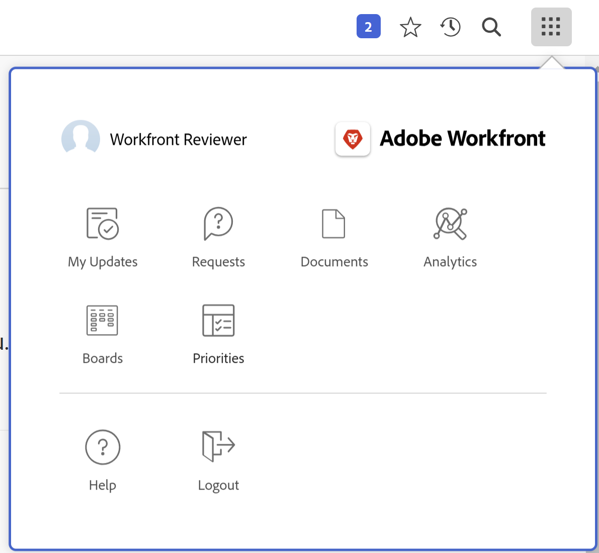
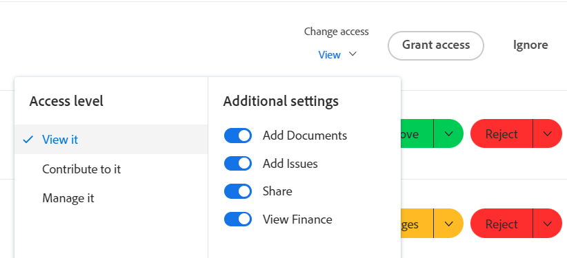

# 사용 [!UICONTROL 내 업데이트] 영역

<!--

(NOTE: there is a similar article like this in the "My Work" folder that is conditioned for Classic only)

-->

다음을 사용할 수 있습니다. [!UICONTROL 내 업데이트] 결정을 기다리는 승인 또는 포함된 대화를 빠르게 검토할 수 있는 영역입니다.

을(를) 가진 사용자로 [!UICONTROL 리뷰] 라이센스, 다음을 찾을 수 있음 [!UICONTROL 내 업데이트] 의 영역 [!UICONTROL 메인 메뉴] 기본적으로 및 [!UICONTROL 내 업데이트] area 가 기본 랜딩 페이지입니다.

다음에 대한 정보: [!DNL Adobe Workfront] 라이센스, 참조 [[!DNL Adobe Workfront] 라이선스 개요](../../../administration-and-setup/add-users/access-levels-and-object-permissions/wf-licenses.md).

리뷰와 다른 라이선스 유형이 있는 경우 [!DNL Workfront] 또는 그룹 관리자가 [!UICONTROL 내 업데이트] 레이아웃 템플릿을 메인 메뉴에 표시할 영역입니다. 자세한 내용은 [사용자 지정 [!UICONTROL 메인 메뉴] 레이아웃 템플릿 사용](../../../administration-and-setup/customize-workfront/use-layout-templates/customize-main-menu.md).

## 액세스 요구 사항

이 문서의 단계를 수행하려면 다음 액세스 권한이 있어야 합니다.

<table style="table-layout:auto"> 
 <col> 
 <col> 
 <tbody> 
  <tr> 
   <td role="rowheader"><strong>[!DNL Adobe Workfront plan]</strong></td> 
   <td> 
임의
 </td> 
  </tr> 
  <tr> 
   <td role="rowheader"><strong>[!DNL Adobe Workfront] 라이센스*</strong></td> 
   <td> 
새로운 기능: 기여자 이상

   또는   
   
현재: [!UICONTROL Request] 이상
 </td> 
  </tr> 
  <tr> 
   <td role="rowheader"><strong>액세스 수준 구성</strong></td> 
   <td> 
대화에서 태그 지정되었거나 승인을 해결해야 하는 오브젝트(프로젝트, 작업, 문제, 문서)에 대한 액세스 권한 이상 보기
 </td> 
  </tr> 
  <tr> 
   <td role="rowheader"><strong>개체 권한</strong></td> 
   <td> 
대화에서 태그가 지정되었거나 승인을 해결해야 하는 프로젝트, 작업, 문제, 문서에 대한 [!UICONTROL 보기] 이상의 권한
 </td> 
  </tr> 
 </tbody> 
</table>

*보유 중인 플랜, 라이선스 유형 또는 액세스 권한을 확인하려면 [!DNL Workfront] 관리자. 자세한 내용은 [Workfront 설명서의 액세스 요구 사항](/help/quicksilver/administration-and-setup/add-users/access-levels-and-object-permissions/access-level-requirements-in-documentation.md).

## 전제 조건

시작하기 전에 다음을 수행해야 합니다.

* 다음 항목이 있는 경우: [!DNL Workfront] 라이선스 제외 [!UICONTROL 리뷰], 사용자 [!DNL Workfront] 또는 그룹 관리자가 [!UICONTROL 내 업데이트] 영역: [!UICONTROL 메인 메뉴] 레이아웃 템플릿을 사용하고 해당 템플릿에 할당합니다.

* Review-license 사용자는 [!UICONTROL 내 업데이트] 영역 내 [!UICONTROL 메인 메뉴] 기본적으로.

## 액세스 [!UICONTROL 내 업데이트] 영역

1. 클릭 **[!UICONTROL 내 업데이트]** 다음에서 **[!UICONTROL 메인 메뉴]**.

   

   다음 [!UICONTROL 내 업데이트] 영역이 열립니다.

   귀하에게 할당된 액세스 승인 및 요청은 페이지 전반의 아래 아래에 나열됩니다 **내 업데이트**.

   

1. (선택 사항) [!UICONTROL 내 업데이트] 영역을 지정하고 오른쪽 화살표를 클릭하면 추가 페이지에 표시되는 승인이 더 많이 표시됩니다.

   >[!TIP]
   >
   >기본적으로 처음 5개의 액세스 승인 또는 요청이 표시됩니다. 나머지 승인은 추가 페이지에 표시됩니다. 에서 최대 2000개의 승인을 표시할 수 있습니다. [!UICONTROL 내 업데이트] 영역입니다.

   

1. (선택 사항) **[!UICONTROL 필터]** 드롭다운 메뉴  의 오른쪽 위 모서리 **[!UICONTROL 내 업데이트]** 을 클릭하고 다음 중에서 선택합니다.

   <table style="table-layout:auto"> 
    <col> 
    </col> 
    <col> 
    </col> 
    <tbody> 
     <tr> 
      <td role="rowheader"><strong>[!UICONTROL All]</strong></td> 
      <td>귀하에게 제출되거나 다른 사용자가 귀하에게 위임한 승인. 승인 위임에 대한 자세한 내용은 <a href="../../../review-and-approve-work/manage-approvals/delegate-approval-requests.md" class="MCXref xref">승인 요청 위임</a>. </td> 
     </tr> 
     <tr> 
      <td role="rowheader"><strong>[!UICONTROL 위임된 승인]</strong></td> 
      <td>다른 사용자가 귀하에게 위임한 승인. </td> 
     </tr> 
     <tr> 
      <td role="rowheader"><strong>[!UICONTROL 내 승인]</strong></td> 
      <td> 
승인이 귀하에게 제출되었습니다. 
 
항목 승인에 대한 자세한 내용은 <a href="../../../review-and-approve-work/manage-approvals/approving-work.md" class="MCXref xref">작업 승인 </a>.
 </td> 
     </tr> 
    </tbody> 
   </table>

1. 승인하기 전에 항목을 승인 또는 거부하거나 문서에 대한 변경 사항을 제안하려면 다음을 수행합니다.

   1. (선택 사항) **드롭다운** 아이콘  을 클릭합니다.**[!UICONTROL 승인]**, **[!UICONTROL 변경 사항]**,**[!UICONTROL 거부]**) 주석을 추가하고 을 클릭합니다. **[!UICONTROL 추가]**.

      또는

      클릭 **[!UICONTROL 건너뛰기]** 댓글을 입력하지 않으려면 을(를) 선택합니다.

      

      >[!NOTE]
      >
      >다음 [!UICONTROL 변경 사항] 옵션은 문서 승인에만 표시됩니다.

      선택한 드롭다운 아이콘에 따라 항목이 승인, 거부되거나, 문서 승인의 경우 추가 변경을 요청하는 승인됩니다.

      >[!TIP]
      >
      >결정에 주석을 추가하지 않으려면 **[!UICONTROL 승인]**, **[!UICONTROL 거부]**, 또는 **[!UICONTROL 변경 사항]** 버튼을 클릭하면 승인 결정이 즉시 부여됩니다.
      >
      >
      >
      >
      >작업 승인에 대한 자세한 내용은 [작업 승인](../../../review-and-approve-work/manage-approvals/approving-work.md).

1. 클릭 **[!UICONTROL 액세스 권한 부여]** 제출된 액세스 요청을 승인하려면

   또는

   확장 **[!UICONTROL 액세스 변경]** 드롭다운 메뉴를 사용하여 권한을 부여하기 전에 요청된 액세스 권한을 수정할 수 있습니다.

   

1. (선택 사항) **[!UICONTROL 무시]** 승인 목록에서 액세스 요청을 승인하지 않고 지웁니다.
1. 클릭 **[!UICONTROL 내 승인 위임]** 한동안 승인 결정을 내릴 수 없는 경우 제출된 승인을 위임합니다. 승인 위임에 대한 자세한 내용은 [승인 요청 위임](../../../review-and-approve-work/manage-approvals/delegate-approval-requests.md).
1. 다음으로 스크롤 **[!UICONTROL 언급]** 승인 바로 아래에 있는 영역입니다. 여기에서 대화에 포함된 모든 항목을 볼 수 있습니다.

   

   >[!TIP]
   >
   >처음 50개 언급 이 기본적으로 표시됩니다.

1. (선택 사항) **[!UICONTROL 업데이트 더 보기]** 추가 언급을 보려면 다음을 수행하십시오.
1. (선택 사항) **[!UICONTROL 답변]** 댓글에 응답하고 다음 중 하나를 수행합니다.
   * 답글 입력 시작
   * 리치 텍스트 도구 모음을 사용하여 텍스트 서식을 지정하고, 메시지에 링크, 목록, 이모지, 따옴표 또는 이미지를 추가합니다
   * 사용자 또는 팀을 추가하여 회신을 알려 주십시오.

     답글 추가가 끝나면 **[!UICONTROL 답변]** 다시.

     
1. (선택 사항) **[!UICONTROL 현재 페이지 고정]** 고정 [!UICONTROL 내 업데이트] 위쪽 탐색에 추가합니다.
