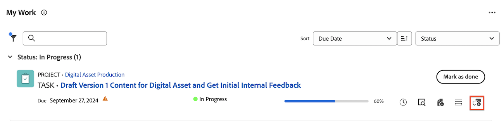

# [!UICONTROL Home] 영역에서 작업 항목 업데이트 또는 편집

<!--Audited: April 2024-->

이 페이지에서 강조 표시된 정보는 아직 일반적으로 사용할 수 없는 기능을 참조합니다. 모든 고객을 위한 미리보기 환경에서만 사용할 수 있습니다. 월별 프로덕션 릴리스 이후 빠른 릴리스를 활성화한 고객을 위해 프로덕션 환경에서도 동일한 기능을 사용할 수 있습니다. 

빠른 릴리스에 대한 자세한 내용은 [조직의 빠른 릴리스 사용 또는 사용 안 함](/help/quicksilver/administration-and-setup/set-up-workfront/configure-system-defaults/enable-fast-release-process.md)을 참조하세요. 

[!DNL Adobe Workfront]의 [!UICONTROL Home] 영역 내에서 작업 항목에 대한 업데이트를 보고 추가할 수 있습니다. 작업 항목 편집 액세스 권한이 있는 경우 작업 항목과 관련된 다른 데이터를 편집할 수도 있습니다.

## 액세스 요구 사항

+++ 을 확장하여 이 문서의 기능에 대한 액세스 요구 사항을 봅니다.

이 문서의 단계를 수행하려면 다음 액세스 권한이 있어야 합니다.

<table style="table-layout:auto"> 
 <col> 
 </col> 
 <col> 
 </col> 
 <tbody> 
  <tr> 
   <td role="rowheader"><strong>[!DNL Adobe Workfront plan]</strong></td> 
   <td> 
임의
 </td> 
  </tr> 
  <tr> 
   <td role="rowheader"><strong>[!DNL Adobe Workfront] 라이센스*</strong></td> 
   <td> 
새로운 기능: 표준

   또는

현재: [!UICONTROL Work] 이상
 </td> 
  </tr> 
  <tr> 
   <td role="rowheader"><strong>액세스 수준 구성</strong></td> 
   <td> 
작업 및 문제에 대한 [!UICONTROL 편집] 액세스
 </td> 
  </tr> 
  <tr> 
   <td role="rowheader"><strong>개체 권한</strong></td> 
   <td> 
작업해야 하는 작업 및 문제에 대한 Contribute 권한 이상
 </td> 
  </tr> 
 </tbody> 
</table>

*보유 중인 플랜, 라이선스 유형 또는 액세스 권한을 확인하려면 [!DNL Workfront] 관리자에게 문의하십시오. 자세한 내용은 [Workfront 설명서의 액세스 요구 사항](/help/quicksilver/administration-and-setup/add-users/access-levels-and-object-permissions/access-level-requirements-in-documentation.md)을 참조하십시오.

+++

<!--not sure if this  from the old UI: we don't have a Work List anymore - should this section come off? 

## View updates on a work item

You can view updates on any work item in the [!UICONTROL Work List]:

1. Click the **[!UICONTROL Main Menu]**  in the upper-right corner, or the **Main Menu**  in the upper-left corner, if available, then click **[!UICONTROL Home]**.
1. In the **[!UICONTROL Work List]** area, select the item where you want to view updates.\
   Updates are displayed in the right panel.

-->

## 홈 영역에서 댓글을 추가하거나 항목을 편집할 수 있는 위젯의 개요

홈 영역의 다음 위젯에서 주석을 추가할 수 있습니다.

| 위젯 | 설명 |
|--------------|---------------------------------------------------------------------------------------------------|
| 보드 | 사용자가 만들었거나 사용하도록 초대된 모든 보드를 표시합니다 |
| 내 작업 | 나에게 할당된 작업 및 문제를 표시합니다. |
| 내 프로젝트 | 소유한 프로젝트 또는 진행 중인 프로젝트를 표시합니다. |
| 내 작업 | 나에게 할당된 작업을 표시합니다. |
| 내 문제 | 나에게 할당된 문제 표시 |
| 내 요청 | 제출한 모든 요청을 표시합니다. |
| 내 승인 | 보류 중, 지정, 위임 및 제출된 승인을 모두 표시합니다. |
| 언급 | 내 업데이트 페이지와 유사한 Workfront 전체의 최근 댓글 스레드와 위젯 내에서 회신을 작성할 수 있는 회신 버튼을 표시합니다. |

홈 영역의 다음 위젯에서 작업 항목을 편집할 수 있습니다.

| 위젯 | 설명 |
|--------------|---------------------------------------------------------------------------------------------------|
| 보드 | 사용자가 만들었거나 사용하도록 초대된 모든 보드를 표시합니다 |
| 내 작업 | 나에게 할당된 작업 및 문제를 표시합니다. |
| 내 프로젝트 | 소유한 프로젝트 또는 진행 중인 프로젝트를 표시합니다. |
| 내 작업 | 나에게 할당된 작업을 표시합니다. |
| 내 문제 | 나에게 할당된 문제 표시 |
| 내 요청 | 제출한 모든 요청을 표시합니다. |
| 내 승인 | 보류 중, 지정, 위임 및 제출된 승인을 모두 표시합니다. |

## 내 작업 위젯의 작업 항목에 주석 추가

[!UICONTROL 내 작업] 위젯에서 모든 작업 항목에 대한 업데이트를 제공할 수 있습니다.

1. 오른쪽 상단의 **[!UICONTROL 주 메뉴]** 을(를) 클릭하거나 왼쪽 상단의 **주 메뉴** 을(를) 클릭합니다(가능한 경우). **[!UICONTROL 홈]**&#x200B;을 클릭합니다.
1. (조건부) **사용자 지정**&#x200B;을 클릭하여 [!UICONTROL **내 작업**] 위젯을 추가합니다.

1. [!UICONTROL **내 작업**] 위젯에서 업데이트할 작업 항목을 찾습니다.
1. 이름을 마우스로 가리킨 다음 **새 업데이트 추가** 아이콘을 클릭합니다.

   

1. 댓글을 입력하세요.
1. (선택 사항) **사람 또는 팀에 태그 지정** 상자에서 이 댓글에 포함할 사용자 또는 팀의 이름 또는 전자 메일을 입력한 다음 목록에 표시될 때 선택합니다.
1. (선택 사항) 리치 텍스트 도구 모음의 옵션을 사용하여 텍스트 서식을 지정하고, 댓글에 이모지, 링크 또는 이미지를 추가하여 콘텐츠를 개선합니다.
1. 작업 항목에 댓글을 추가하려면 **제출**&#x200B;을 클릭합니다.

   >[!IMPORTANT]
   >
   >의견을 제출한 후 15분 이내에만 편집할 수 있습니다. 댓글을 편집하려면 댓글의 오른쪽 상단에 있는 **자세히** 메뉴를 클릭한 다음 **편집**&#x200B;을 클릭합니다.

   업데이트 추가에 대한 자세한 내용은 [작업 업데이트](/help/quicksilver/workfront-basics/updating-work-items-and-viewing-updates/update-work.md)를 참조하세요.

## 언급 위젯의 항목에 주석 추가

1. 홈 영역에 **멘션** 위젯을 추가합니다.

1. 업데이트에 포함되었으며 회신할 항목을 찾습니다.

1. **회신**&#x200B;을 클릭합니다.

   

   

   

1. 댓글을 입력하세요.
1. (선택 사항) **인물 태그** 상자에서 이 댓글에 포함할 사용자 또는 팀의 이름을 입력한 다음 목록에 표시될 때 선택합니다.
1. (선택 사항) 리치 텍스트 도구 모음의 옵션을 사용하여 텍스트 서식을 지정하고, 댓글에 이모지, 링크 또는 이미지를 추가하여 콘텐츠를 개선합니다.
1. 댓글을 작업 항목에 추가하려면 **제출**&#x200B;을 클릭합니다.

   >[!IMPORTANT]
   >
   >댓글을 제출한 후 15분 이내에만 편집할 수 있습니다. 댓글을 편집하려면 댓글의 오른쪽 상단에 있는 **자세히** 메뉴를 클릭한 다음 **편집**&#x200B;을 클릭합니다.

   업데이트 추가에 대한 자세한 내용은 [작업 업데이트](/help/quicksilver/workfront-basics/updating-work-items-and-viewing-updates/update-work.md).를 참조하세요.

## 작업 항목 편집

편집할 수 있는 액세스 권한이 있는 작업 항목의 모든 필드를 편집할 수 있습니다.

1. 오른쪽 상단의 **[!UICONTROL 주 메뉴]** 을(를) 클릭하거나 왼쪽 상단의 **주 메뉴** 을(를) 클릭합니다(가능한 경우). **[!UICONTROL 홈]**&#x200B;을 클릭합니다.
1. (조건부) **사용자 지정**&#x200B;을 클릭하여 **내 작업** 위젯을 추가합니다.

1. 작업 항목을 마우스로 가리킨 다음 **요약** 아이콘을 클릭합니다.
   

1. 요약 패널에서 편집할 필드를 마우스로 가리킵니다.
필드를 편집할 권한이 있는 경우 필드를 마우스로 가리키면 필드가 강조 표시됩니다.
1. 편집할 필드를 클릭한 다음 원하는 업데이트를 만듭니다.
1. 변경 사항을 저장하려면 필드 바깥쪽을 클릭합니다.
