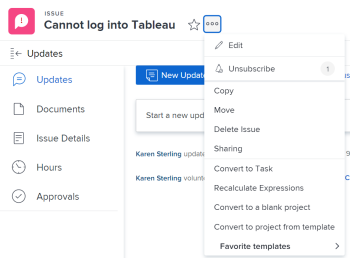

# 의 항목 구독 [!DNL Adobe Workfront]

[!UICONTROL Adobe Workfront] 은(는) 귀하에게 할당되거나 귀하가 소유한 항목에 대한 알림을 보냅니다. 귀하에게 할당되지 않았지만 작업에 영향을 줄 수 있는 항목에 대한 커뮤니케이션을 따르려면 해당 항목에 가입할 수 있습니다.

보유한 항목의 업데이트 상태에 관리자 및 피어를 구독하여 작업에 대한 업데이트 상태를 유지할 수도 있습니다. [!UICONTROL 관리] 및 [!UICONTROL 공유] 사용 권한.

현재 다음 항목을 구독할 수 있습니다.

* 문제
* 작업
* 프로젝트

문제, 작업 또는 프로젝트를 구독할 때 누군가 댓글을 올리면 인앱 알림을 받습니다. 활성화한 기능에 따라 구독하는 항목에 대한 이메일 및 모바일 앱 푸시 알림도 받을 수 있습니다.

>[!NOTE]
>
>가입한 항목에서 발생하는 다른 이벤트에 대한 알림이 전송되지 않습니다. 누군가 항목에 댓글을 달 때만 알림이 전송됩니다.

구독 작업에 대한 자세한 내용은 [구독 작업 기본 정보](#about-working-with-subscriptions).

## 액세스 요구 사항

이 문서의 단계를 수행하려면 다음 액세스 권한이 있어야 합니다.

<table style="table-layout:auto"> 
 <col> 
 </col> 
 <col> 
 </col> 
 <tbody> 
  <tr> 
   <td role="rowheader"><strong>[!UICONTROL Adobe Workfront] 계획*</strong></td> 
   <td> 
모든
 </td> 
  </tr> 
  <tr> 
   <td role="rowheader"><strong>[!DNL Adobe Workfront] 라이센스*</strong></td> 
   <td> 
[!UICONTROL Request] 이상
 </td> 
  </tr> 
  <tr> 
   <td role="rowheader"><strong>액세스 수준 구성*</strong></td> 
   <td> 
다음의 경우 [!DNL Workfront] 관리자가 활성화했습니다. <strong>[!UICONTROL 대화에 포함된 업데이트만 보기]</strong> 액세스 수준에서는 의 항목을 구독할 수 없습니다. [!DNL Workfront].
 
참고: 여전히 액세스 권한이 없는 경우 [!UICONTROL Workfront] 관리자에게 문의하여 액세스 수준에서 추가적인 제한을 설정하는지 확인하십시오. [!UICONTROL Workfront] 관리자가 액세스 수준을 변경하는 방법에 대한 자세한 내용은 다음을 참조하십시오. <a href="../../administration-and-setup/add-users/configure-and-grant-access/create-modify-access-levels.md" class="MCXref xref">사용자 정의 액세스 수준 만들기 또는 수정</a>.
 </td> 
  </tr> 
  <tr> 
   <td role="rowheader"><strong>개체 권한</strong></td> 
   <td> 
프로젝트, 작업 또는 문제에 대한 [!UICONTROL 보기] 액세스 이상 권한(가입)
 
프로젝트, 작업 또는 문제에 대한 [!UICONTROL 관리] 액세스 및 [!UICONTROL 공유] 권한(다른 사용자를 구독하도록 설정)
 </td> 
  </tr> 
 </tbody> 
</table>

보유 중인 플랜, 라이선스 유형 또는 액세스 권한을 알아보려면 [!DNL Workfront] 관리자.

## 항목 구독

항목을 구독하는 프로세스는 모든 항목에 대해 동일합니다.

예를 들어 문제에 가입하려면 다음을 수행합니다.

1. 구독하려는 문제로 이동합니다.

   >[!TIP]
   >
   >프로젝트를 구독하려면 다음 중 하나를 수행할 수 있습니다.
   >
   >* 구독하려는 프로젝트로 이동하여 **[!UICONTROL 자세히]** 아이콘  프로젝트 이름의 오른쪽에 있는 다음 **[!UICONTROL 구독]**.
   >* 프로젝트 목록 또는 보고서로 이동하여 프로젝트를 선택하고 **[!UICONTROL 자세히]** 아이콘  목록의 맨 위에서 을(를) 클릭한 다음 **[!UICONTROL 구독]**. 이 기능은 프로젝트 목록에서만 사용할 수 있습니다.

1. 클릭 **[!UICONTROL 자세히]** 을 클릭한 다음 을 클릭합니다 **[!UICONTROL 구독]**.

   

   벨에 확인 표시가 나타나고 옆에 있는 숫자가 업데이트되어 구독한 사용자 수에 추가됩니다.

   이제 이 문제를 구독합니다. 문제에 대한 업데이트 상태 는 문제를 구독했음을 기록합니다.

   누군가 문제에 대해 댓글을 달 때마다 인앱 알림을 받게 됩니다. 활성화한 기능에 따라 이메일 알림 및 모바일 앱 푸시 알림을 받을 수도 있습니다.

   구독 이메일에 대한 자세한 내용은 다음을 참조하십시오. [이메일 알림 수정](../../workfront-basics/using-notifications/activate-or-deactivate-your-own-event-notifications.md).

## 항목에서 구독 취소

의 항목에서 가입을 쉽게 해지할 수 있습니다. [!DNL Workfront]. 의 항목에서 구독 취소 프로세스 [!DNL Workfront] 는 모든 항목에 대해 동일합니다.

예를 들어, 문제에서 구독을 취소하려면 다음 작업을 수행하십시오.

1. 구독을 취소할 문제로 이동합니다.

   >[!TIP]
   >
   >프로젝트 구독을 취소하려면 다음 중 하나를 수행할 수 있습니다.
   >
   >* 구독을 취소할 프로젝트로 이동하여 **[!UICONTROL 자세히]** 아이콘  프로젝트 이름의 오른쪽에 있는 다음 **[!UICONTROL 구독 취소]**.
   >* 프로젝트 목록 또는 보고서로 이동하여 프로젝트를 선택하고 **[!UICONTROL 자세히]** 아이콘  목록의 맨 위에서 을(를) 클릭한 다음 **[!UICONTROL 구독 취소]**. 이 기능은 프로젝트 목록에서만 사용할 수 있습니다.

1. 클릭 **[!UICONTROL 자세히]** 을 클릭한 다음 을 클릭합니다 **[!UICONTROL 구독 취소]**.

   

1. 을 클릭하여 구독 중인 항목에서 구독을 취소할 수도 있습니다. [!UICONTROL 구독 취소] 구독 이메일의 링크.

   항목에 대한 구독을 취소하면 누군가 문제에 대해 댓글을 남길 때 더 이상 알림을 받지 않습니다.

   항목 업데이트 상태 는 문제 구독을 취소한 것으로 기록됩니다.

## 구독자 관리

관리 및 공유 권한이 있는 프로젝트, 작업 및 문제를 구독하는 사용자를 관리할 수 있습니다.

* [항목에 다른 사용자 구독](#subscribe-another-user-to-an-item)
* [항목에서 다른 사용자 구독 취소](#unsubscribe-another-person-from-an-item)

모든 구독자가 제공됩니다. [!UICONTROL 보기] 구독 항목에 대한 권한. 새 구독자에게 항목에 대한 권한이 이미 있는 경우 해당 권한은 그대로 유지됩니다.

### 항목에 다른 사용자 구독

1. 다른 사용자를 구독하려는 항목으로 이동합니다.

   >[!TIP]
   >
   >다른 사용자를 프로젝트에 구독하려면 다음 중 하나를 수행할 수 있습니다.
   >
   >* 다른 사용자를 구독하려는 프로젝트로 이동하거나
   >   
   >* 프로젝트 목록 또는 보고서로 이동하여 프로젝트를 선택합니다.

1. 클릭 **[!UICONTROL 자세히]** .
1. 다음 옆에 있는 숫자 버블을 클릭합니다. **[!UICONTROL 구독]** 링크를 클릭합니다.
1. 표시되는 상자에서 사용자 이름을 **[!UICONTROL 다른 사용자 구독]** 상자를 선택한 다음 표시된 옵션에서 사용자를 선택합니다.

1. (선택 사항) 구독자를 더 추가하려면 4단계를 반복합니다.
1. **[!UICONTROL 저장]**&#x200B;을 클릭합니다.

구독자에게 구독에 대한 알림이 전송되지 않지만 해당 항목에 대한 시스템 업데이트에 구독에 대한 항목이 추가됩니다.

다른 사용자가 댓글을 추가할 때 [!UICONTROL 업데이트] 항목의 탭에서 구독자는 인앱 알림을 받습니다. Workfront 관리자가 활성화한 기능에 따라 구독자가 항목에 대한 이메일 및 모바일 알림을 받을 수도 있습니다.

### 항목에서 다른 사용자 구독 취소

1. 다른 사용자의 구독을 취소할 항목으로 이동합니다.

   >[!TIP]
   >
   >다른 사용자의 프로젝트 구독을 취소하려면 다음 중 하나를 수행할 수 있습니다.
   >
   >* 다른 사용자의 구독을 취소할 프로젝트로 이동하거나
   >   
   >* 프로젝트 목록 또는 보고서로 이동하여 프로젝트를 선택합니다.

1. 클릭 **[!UICONTROL 자세히]** .
1. 다음 옆에 있는 숫자 버블을 클릭합니다. **[!UICONTROL 구독]** 또는 **[!UICONTROL 구독 취소]** 링크를 클릭합니다.
1. 다음에서 **[!UICONTROL 구독자]** 표시되는 페이지에서 구독을 취소하려는 사용자 이름 옆에 있는 &quot;X&quot;를 클릭합니다.

   또는

   에 사용자 이름을 입력하십시오. **[!UICONTROL 목록에서 사람 검색]** 상자를 클릭한 다음 사용자 이름 오른쪽에 있는 &quot;X&quot;를 클릭합니다.

1. **[!UICONTROL 저장]**&#x200B;을 클릭합니다.

   항목에 대한 구독 취소에 대한 알림이 사용자에게 표시되지 않지만 항목에 대한 시스템 업데이트에 구독 관련 항목이 추가됩니다.

## 인앱 알림 수신

누군가가 내가 가입한 항목에 대한 댓글을 게시하면 바로 인앱 알림을 받게 된다.

자세한 내용은 [인앱 알림 보기 및 관리](../../workfront-basics/using-notifications/view-and-manage-in-app-notifications.md).

## 구독 이메일 수신

의 기능에 따라 [!UICONTROL Workfront] 관리자가 을 활성화하면 구독하는 항목에 대해 누군가 댓글을 달 때마다 인앱 알림 외에 구독 이메일을 받을 수 있습니다.

이메일 설정 또는 비활성화에 대한 자세한 내용은 [시스템의 모든 사용자를 위한 이벤트 알림 구성](../../administration-and-setup/manage-workfront/emails/configure-event-notifications-for-everyone-in-the-system.md).

>[!NOTE]
>
>구독 이메일을 끄더라도 구독하는 항목에 누군가 댓글을 달 때마다 인앱 알림을 계속 수신하게 됩니다.

## 항목을 구독한 사용자 나열

항목을 구독하는 사용자를 보려면 다음 작업을 수행하십시오.

1. 가입자를 보려는 항목으로 이동합니다.

   항목에 대한 구독자가 있는 경우 벨 옆에 구독자 수가 표시됩니다. 숫자 위로 마우스를 가져가 항목을 구독하는 사용자 목록을 표시할 수 있습니다. 처음 25명의 구독자는 알파벳 순서로 표시됩니다.

   

   을(를) 추가하여 구독자 목록을 볼 수도 있습니다 [!UICONTROL 구독자] 필드를 구독한 항목에 대한 보고서 또는 보기의 열로 사용합니다. 자세한 내용은 [용어집 [!DNL Adobe Workfront] 용어](../../workfront-basics/navigate-workfront/workfront-navigation/workfront-terminology-glossary.md).

## 구독 작업 기본 정보

구독을 사용하여 작업할 때 다음 사항을 고려하십시오.

* 다음 [!DNL Workfront] 관리자는 사용자가 가입하거나 가입할 수 없는 항목을 제어할 수 없습니다.

  다음 대상이 있는 모든 사용자 [!UICONTROL 보기] 작업, 문제 또는 프로젝트에 대한 이상의 권한이 구독될 수 있습니다.

* 일별 다이제스트 전자 메일에 대해서는 구독을 구성할 수 없습니다.
* 작업, 문제 또는 프로젝트를 구독하고 피할당자, 기본 담당자 또는 프로젝트 소유자인 경우 구독하는 항목에 대해 누군가 의견을 남길 때만 구독 전자 메일이 전송됩니다.

  항목 중 하나에 댓글이 있을 때 트리거되는 이메일 알림에 대한 자세한 내용은 [Adobe Workfront 알림](../../workfront-basics/using-notifications/wf-notifications.md).

* 항목을 구독하고 댓글을 달면 댓글에 사용자 이름을 포함하지 않는 한 해당 댓글에 대한 구독 이메일을 받지 못합니다.
* 항목에 댓글을 다는 사용자가 댓글을 잠궈 댓글을 비공개로 만들고, 사용자가 해당 사용자와 같은 회사에 속하지 않으면 해당 댓글에 대한 알림을 받지 않습니다. 귀하의 회사에 대한 댓글을 비공개로 만드는 방법에 대한 자세한 내용은 [작업 항목에 업데이트 추가](../../workfront-basics/updating-work-items-and-viewing-updates/update-work.md#add) 의 섹션 [작업 업데이트](../../workfront-basics/updating-work-items-and-viewing-updates/update-work.md).

* 구독에 대한 보고서를 작성할 수 없습니다. 다른 사용자가 항목을 구독하거나 구독 취소하면 모든 항목의 업데이트 상태에 감사가 기록됩니다.
* 하위 객체에 대한 댓글은 상위 객체에 대한 가입 통지를 트리거하지 않습니다. 프로젝트를 구독하면 해당 프로젝트에 대한 댓글 알림만 수신됩니다. 각 하위 항목을 구독하지 않으면 프로젝트와 관련된 하위 항목(예: 작업 또는 문제)에 대한 의견 알림을 받지 못합니다. 개체 관계에 대한 자세한 내용은 [객체의 상호 의존성 및 계층](../../workfront-basics/navigate-workfront/workfront-navigation/understand-objects.md#understanding-interdependency-and-hierarchy-of-objects) 의 섹션 [의 오브젝트 이해 [!DNL Adobe Workfront]](../../workfront-basics/navigate-workfront/workfront-navigation/understand-objects.md).
