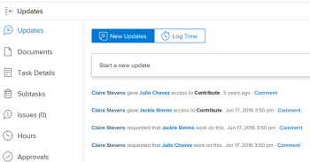

# 인앱 알림 보기 및 관리

인앱 알림은 공지 알림과 작업 항목 알림의 두 가지 정보 유형에 대해 계속 알려줍니다. 웹 애플리케이션과 모바일 애플리케이션 모두에서 사용할 수 있습니다.

받을 수 있는 작업 항목 및 공지 알림 목록은 [인앱 알림 개요](../../workfront-basics/using-notifications/in-app-notifications-overview.md)를 참조하십시오.

>[!NOTE]
>
>* 작업 활동에 대한 인앱 알림이 [!DNL Workfront]의 전자 메일 알림에 연결되어 있지 않습니다. 자세한 내용은 [[!DNL Adobe Workfront] 알림](../../workfront-basics/using-notifications/wf-notifications.md)을 참조하세요.
>* 인앱 알림은 사용자 지정할 수 없습니다.
>

## 액세스 요구 사항

+++ 을 확장하여 이 문서의 기능에 대한 액세스 요구 사항을 봅니다. 

<table style="table-layout:auto"> 
 <col> 
 </col> 
 <col> 
 </col> 
 <tbody> 
  <tr> 
   <td role="rowheader"><strong>[!DNL Adobe Workfront] 패키지</strong></td> 
   <td> 
임의
 </td> 
  </tr> 
  <tr> 
   <td role="rowheader"><strong>[!DNL Adobe Workfront] 라이센스</strong></td> 
   <td> 
   
기여자 이상

   
요청 이상
 </td> 
  </tr> 
 </tbody> 
</table>

자세한 내용은 [Workfront 설명서의 액세스 요구 사항](/help/quicksilver/administration-and-setup/add-users/access-levels-and-object-permissions/access-level-requirements-in-documentation.md)을 참조하십시오.

+++

## 알림 보기

[!DNL Workfront]의 오른쪽 위 모서리에 있는 번호 매기기 아이콘은 아직 확인하지 않은 알림 수를 표시합니다.

>[!NOTE]
>
>웹 애플리케이션과 모바일 애플리케이션 모두에서 모든 인앱 알림을 볼 수 있습니다. 이러한 알림 중 일부만 모바일 애플리케이션에서 푸시 알림으로 전송됩니다. 모바일 앱의 알림에 대한 자세한 내용은 [[!DNL Adobe Workfront] iOS의 경우](../../workfront-basics/mobile-apps/using-the-workfront-mobile-app/workfront-for-ios.md) 또는 [[!DNL Adobe Workfront] Android의 경우](../../workfront-basics/mobile-apps/using-the-workfront-mobile-app/workfront-for-android.md)을 참조하십시오.

1. 알림 목록을 열려면 알림 아이콘[!DNL Workfront]을 클릭하세요.

   최근에 읽지 않은 알림은 번호 매기기 아이콘 아래에 표시되며 가장 최근 알림은 맨 위에 표시됩니다.

   

   번호 아이콘은 최대 80개의 알림과 함께 스크롤 가능한 목록을 표시합니다. 더 많은 정보를 보려면 목록 하단의 **[!UICONTROL 모든 알림]**&#x200B;을 클릭하여 최대 500개의 알림을 볼 수 있습니다. 알림은 30일 후에 자동으로 삭제됩니다.

   각 알림의 맨 아래에 [!UICONTROL 알림 유형] 및 해당 식별 아이콘이 표시됩니다. 이를 통해 언급된 [!DNL Workfront] 항목에 발생한 상황을 식별하고 작업 항목이 있는 경우 이를 알려 줍니다.

   * 공지 알림은 [!UICONTROL 공지] 아이콘으로 표시됩니다. 

   * 다른 모든 알림은 연결된 작업 항목의 유형을 제안하는 아이콘으로 표시됩니다.

     
파란색 점 오른쪽에 있는 아이콘은 다음 중 하나를 표시합니다.

   * 정보를 입력한 사람의 프로필 사진(일반적으로 작업 중인 [!DNL Workfront] 개체에 대한 업데이트)입니다.
   * 알림이 시스템 알림인 경우 [!DNL Workfront] 로고.

1. (선택 사항) 알림을 받은 날짜를 보려면 알림의 오른쪽 상단에 있는 날짜 또는 시간 표시기 위로 마우스를 가져갑니다.

   

1. 보려는 알림을 클릭합니다.

   * 클릭한 알림이 작업 항목에 대한 알림인 경우 연결된 [!DNL Workfront] 개체가 열리고 **[!UICONTROL 업데이트]** 탭에 전체 메시지가 표시됩니다. **[!UICONTROL 새 업데이트 영역을 시작]**&#x200B;하거나 **[!UICONTROL 답장을 입력]**&#x200B;할 수 있습니다.

     

   * 클릭하는 알림이 공지 에 대한 알림인 경우 **[!UICONTROL 공지]** 페이지가 표시되어 모든 공지가 나열됩니다. 클릭한 공지가 왼쪽에서 선택되고 메시지가 오른쪽에 표시됩니다.

     

1. (선택 사항) 알림 메시지에 포함된 첨부 파일을 다운로드하거나 모든 첨부 파일을 ZIP 파일로 다운로드합니다.

   

## 알림 확인

알림을 보고 나면 [!UICONTROL 알림] 목록에서 알림을 지우도록 승인하거나 나중에 응답할 수 있도록 할 수 있습니다.

[!UICONTROL 알림] 페이지에서 현재 알림과 지워진 알림을 볼 수 있습니다. 지운 알림을 [!UICONTROL 알림] 목록으로 다시 가져올 수도 있습니다.

* [알림 확인](#acknowledge-notifications)
* [승인된 알림 보기](#view-acknowledged-notifications)

### 알림 확인

번호가 매겨진 아이콘을 클릭하여 알림 목록을 열면 모든 알림을 읽었다는 것을 자동으로 인식하지 못합니다.

통지를 승인하고 통지 목록에서 지우려면

1. 알림 목록을 열려면 알림 아이콘[!DNL Workfront]을 클릭하세요.
1. 다음 중 하나를 수행하십시오.

   * 알림의 왼쪽 위 모서리에 있는 파란색 점을 클릭합니다.
   * 알림이 작업 항목(공지 아님)에 대한 것인 경우 알림을 클릭하여 항목으로 이동합니다.
   * 알림이 공지 사항인 경우 알림을 클릭하여 **[!UICONTROL 공지]** 페이지를 엽니다.
   * 알림 목록의 오른쪽 아래 모서리에 있는 **[!UICONTROL 모든 알림]**&#x200B;을 클릭하여 **[!UICONTROL 알림]** 페이지를 표시한 다음 Workfront 오른쪽 위 모서리에 있는 **[!UICONTROL 모두 표시]**&#x200B;를 클릭합니다.

### 승인된 알림 보기

이미 확인한 통지를 조회하려면

1. 알림 목록을 열려면 알림 아이콘[!DNL Workfront]을 클릭하세요.
1. 알림 목록의 오른쪽 아래 모서리에서 **[!UICONTROL 모든 알림]**&#x200B;을 클릭합니다.
1. 표시되는 **[!UICONTROL 알림]** 페이지에서 아래로 스크롤하여 이전 알림을 봅니다.
1. (선택 사항) 승인된 알림을 알림 목록으로 되돌리려면 알림 옆에 있는 파란색 원을 클릭합니다.

## 공지 알림 삭제

작업 항목 알림은 삭제할 수 없습니다. [!DNL Workfront]은(는) 30일 후에 모든 알림을 삭제합니다(읽었는지 읽지 않음).

하지만 공지 알림은 삭제할 수 있습니다. 삭제한 후 30일 이내에 공지에 액세스할 수도 있습니다. [!DNL Workfront]은(는) 공지를 자동으로 삭제하지 않습니다.

* [공지 삭제](#delete-an-announcement)
* [최근에 삭제한 공지 액세스 및 복원](#access-and-restore-an-announcement-you-deleted-recently)

### 공지 삭제

1. 알림 목록을 열려면 알림 아이콘[!DNL Workfront]을 클릭하세요.
1. **[!UICONTROL 공지]** 또는 **[!UICONTROL 모든 공지 보기]**&#x200B;를 클릭합니다.

1. 표시되는 **[!DNL Announcements]** 페이지에서 왼쪽 목록에 있는 삭제할 공지를 클릭한 다음 페이지의 오른쪽 상단에 있는 **[!UICONTROL 삭제]**&#x200B;를 클릭합니다.

### 최근에 삭제한 공지 액세스 및 복원

지난 30일 이내에 삭제한 알림에 액세스할 수 있습니다.

1. 알림 목록을 열려면 알림 아이콘[!DNL Workfront]을 클릭하세요.
1. **[!UICONTROL 공지]** 또는 **[!UICONTROL 모든 공지 보기]**&#x200B;를 클릭합니다.

1. 표시되는 **[!UICONTROL 공지]** 페이지에서 **[!UICONTROL 삭제]**&#x200B;을(를) 클릭합니다.

1. 보려는 메시지를 클릭합니다.
1. (선택 사항) 알림을 복원하려면 알림 본문의 위쪽과 오른쪽에 있는 **[!UICONTROL 받은 편지함으로 이동]**&#x200B;을 클릭합니다.
