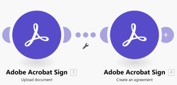

# [!DNL Adobe Acrobat Sign]개 모듈

[!DNL Adobe Acrobat Sign] 모듈을 사용하면 [!DNL Adobe Acrobat Sign] 계정의 이벤트를 기반으로 [!DNL Adobe Workfront Fusion] 시나리오를 시작하고, 계약 및 기타 레코드를 만들거나 읽거나 업데이트하고, 설정한 기준을 사용하여 레코드를 검색하고, 문서를 업로드할 수 있습니다.

## 액세스 요구 사항

이 문서의 기능을 사용하려면 다음 액세스 권한이 있어야 합니다.

<table style="table-layout:auto"> 
 <col> 
 <col> 
 <tbody> 
  <tr> 
   <td role="rowheader">[!DNL Adobe Workfront] 플랜*</td>
  <td> 
[!UICONTROL Pro] 이상
 </td>
  </tr> 
  <tr data-mc-conditions=""> 
   <td role="rowheader">[!DNL Adobe Workfront] 라이센스*</td>
   <td> 
[!UICONTROL Plan], [!UICONTROL Work]
 </td> 
  </tr> 
  <tr> 
   <td role="rowheader">[!DNL Adobe Workfront Fusion] 라이센스**</td> 
   <td>
   
현재 라이선스 요구 사항: [!DNL Workfront Fusion] 라이선스 요구 사항이 없습니다.

   
또는

   
레거시 라이선스 요구 사항: 작업 자동화 및 통합을 위한 [!UICONTROL [!DNL Workfront Fusion]] 

   </td>  
  </tr> 
  <tr> 
   <td role="rowheader">제품</td> 
   <td>
   
현재 제품 요구 사항: [!UICONTROL Select] 또는 [!UICONTROL Prime] [!DNL Adobe Workfront] 플랜이 있는 경우 조직에서 이 문서에 설명된 기능을 사용하려면 [!DNL Adobe Workfront Fusion]과(와) [!DNL Adobe Workfront]을(를) 구매해야 합니다. [!DNL Workfront Fusion]이(가) [!UICONTROL Ultimate] [!DNL Workfront] 계획에 포함되어 있습니다.

   
또는

   
레거시 제품 요구 사항: 이 문서에 설명된 기능을 사용하려면 조직에서 [!DNL Adobe Workfront Fusion]과(와) [!DNL Adobe Workfront]을(를) 구매해야 합니다.

   </td> 
  </tr> 
 </tbody> 
</table>

보유 중인 플랜, 라이선스 유형 또는 액세스 권한을 확인하려면 [!DNL Workfront] 관리자에게 문의하세요.

[!DNL Adobe Workfront Fusion] 라이선스에 대한 자세한 내용은 [[!DNL Adobe Workfront Fusion] 라이선스](../../workfront-fusion/get-started/license-automation-vs-integration.md)를 참조하세요.

## [!DNL Adobe Acrobat Sign] API 정보

Adobe Acrobat Sign 커넥터는 다음을 사용합니다.

<table style="table-layout:auto"> 
 <col> 
 <col> 
 <tbody> 
  <tr> 
   <td role="rowheader">API 버전</td> 
   <td> v6 </td> 
  </tr> 
  <tr> 
   <td role="rowheader">API 태그</td> 
   <td>v1.35.1</td> 
  </tr>
 </tbody> 
</table>

## [!DNL Adobe Acrobat Sign] 커넥터 사용 권장 사항

[!DNL Adobe Sign]앱을 사용하면 [!DNL Fusion]에서 eSignature 비즈니스 프로세스를 훨씬 쉽고 강력하게 자동화할 수 있습니다.

[!DNL Adobe Sign]에 새로 온 사용자는 계약 업데이트에 대한 일부 제한 사항에 주의를 기울여야 합니다. 계약은 일반적으로 시작된 후에는 변경되지 않습니다. [!DNL Adobe Sign]의 새 사용자는 계약 만들기 모듈을 사용하여 새 계약을 만드는 데 주력하는 것이 좋습니다. 이렇게 하면 [!DNL Fusion]의 자동화가 더 쉬워지고 [!DNL Adobe Sign]에서 더 잘 작동합니다.

[!DNL Adobe Sign] 계약에는 작업할 필드가 필요합니다. 이를 위한 몇 가지 옵션이 있지만 가장 쉽고 일반적인 방법은 임시 문서를 업로드한 다음 해당 문서를 계약에 매핑하는 것입니다.

## [!DNL Adobe Acrobat Sign]개 모듈 및 해당 필드

[!DNL Adobe Acrobat Sign] 모듈을 구성할 때 [!DNL Workfront Fusion]에 아래 나열된 필드가 표시됩니다. 앱 또는 서비스의 액세스 수준과 같은 요소에 따라 이러한 필드와 함께 [!DNL Adobe Acrobat Sign] 필드가 추가로 표시될 수 있습니다. 모듈의 굵은 제목은 필수 필드를 나타냅니다.

필드나 함수 위에 맵 단추가 표시되면 이 단추를 사용하여 해당 필드에 대한 변수와 함수를 설정할 수 있습니다. 자세한 내용은 [한 모듈에서 다른 모듈로 정보를 매핑 [!DNL Adobe Workfront Fusion]](../../workfront-fusion/mapping/map-information-between-modules.md)을 참조하십시오.

* [트리거](#triggers)
* [액션](#actions)
* [검색 결과](#searches)

### 트리거

<!--
* [Watch for agreements](#watch-for-agreements) 
* [Watch for events](#watch-for-events)
-->

+++ **[!UICONTROL 계약 보기]**

이 트리거 모듈은 계약이 생성되거나 업데이트될 때 시나리오를 시작합니다.

<table style="table-layout:auto"> 
 <col> 
 <col> 
 <tbody> 
  <tr> 
   <td role="rowheader">[!UICONTROL Connection]</td> 
<td>[!DNL Adobe Acrobat Sign] 계정을 [!DNL Workfront Fusion]에 연결하는 방법에 대한 지침은 <a href="../../workfront-fusion/connections/connect-to-fusion-general.md" class="MCXref xref">[!DNL Adobe Workfront Fusion]에 연결 만들기 - 기본 지침</a>을 참조하세요.</td>  </tr> 
  <tr> 
   <td role="rowheader">[!UICONTROL Filter]</td> 
   <td>새 레코드, 업데이트된 레코드 또는 둘 다 시청할지 여부를 선택합니다.</td> 
  </tr> 
  <tr> 
   <td role="rowheader">[!UICONTROL 레코드 유형] </td> 
   <td>레코드를 보려는 레코드 유형을 선택합니다.</td> 
  </tr> 
  <tr> 
   <td role="rowheader">[!UICONTROL 텍스트 찾기]</td> 
   <td> 
검색할 용어를 입력하십시오. 모듈은 이러한 용어를 필드 값으로 포함하는 레코드를 반환합니다.
 
[!DNL Adobe Acrobat Sign]의 필드 검색에 대한 자세한 내용은 <a href="https://helpx.adobe.com/sign/using/adobesign-search-users-agreements.html#HowSearchWorks">Adobe Sign 검색 - 작동 방식</a>의 "텍스트 검색 작동 방식"을 참조하십시오.
 </td> 
  </tr> 
  <tr> 
   <td role="rowheader">[!UICONTROL 반환되는 최대 계약 수]</td> 
   <td> 
각 시나리오 실행 주기 동안 모듈이 반환할 최대 레코드 수를 입력하거나 매핑합니다.
 </td> 
  </tr> 
 </tbody> 
</table>

+++

+++ **[!UICONTROL 이벤트 보기]**

이 트리거 모듈은 선택한 이벤트가 발생할 때 시나리오를 시작합니다.

<table style="table-layout:auto"> 
 <col> 
 <col> 
 <tbody> 
  <tr> 
   <td role="rowheader">[!UICONTROL Webhook]</td> 
   <td>사용할 웹후크를 선택하거나 <b>[!UICONTROL 추가]</b>를 클릭하고 다음 필드를 채우십시오.</td> 
  </tr> 
  <tr> 
   <td role="rowheader">[!UICONTROL Webhook name]</td> 
   <td> 
Webhook의 이름 입력
 </td> 
  </tr> 
  <tr> 
   <td role="rowheader">[!UICONTROL Connection]</td> 
   <td> 
[!DNL Adobe Acrobat Sign] 계정을 [!DNL Workfront Fusion]에 연결하는 방법에 대한 지침은 <a href="../../workfront-fusion/connections/connect-to-fusion-general.md" class="MCXref xref">[!DNL Adobe Workfront Fusion]에 연결 만들기 - 기본 지침</a>을 참조하세요.
 </td> 
  </tr> 
  <tr> 
   <td role="rowheader">[!UICONTROL 범위]</td> 
   <td> 
    <ul> 
     <li> 
[!UICONTROL 계정]
 </li> 
     <li> 
[!UICONTROL Group]
 </li> 
     <li> 
[!UICONTROL User]
 </li> 
     <li> 
[!UICONTROL Resource]
 
[!UICONTROL Resource]를 선택하는 경우 리소스 ID와 리소스 유형을 입력합니다.
 </li> 
    </ul> </td> 
  </tr> 
  <tr> 
   <td role="rowheader">[!UICONTROL 리소스 수준]</td> 
   <td> 
보려는 리소스 유형을 선택합니다.
 
    <ul> 
     <li> 
[!UICONTROL 계약]
 </li> 
     <li> 
[!UICONTROL 위젯]
 </li> 
     <li> 
[!UICONTROL Megasigns]
 </li> 
     <li> 
[!UICONTROL 라이브러리 문서]
 </li> 
    </ul> </td> 
  </tr> 
  <tr> 
   <td role="rowheader">[!UICONTROL Webhook 가입 이벤트]</td> 
   <td>모듈에서 감시할 [!DNL Adobe Sign] 이벤트를 선택합니다.</td> 
  </tr> 
  <tr> 
   <td role="rowheader">[!UICONTROL 응용 프로그램 표시 이름]</td> 
   <td>웹후크를 작성할 응용 프로그램의 표시 이름입니다.</td> 
  </tr> 
  <tr> 
   <td role="rowheader">[!UICONTROL Application name]</td> 
   <td>웹후크를 작성할 응용 프로그램의 표시 이름입니다.</td> 
  </tr> 
  <tr> 
   <td role="rowheader">[!UICONTROL 문제 알림 이메일]</td> 
   <td> 
이 설정은 관리자 계정에만 작동합니다
 
문제 알림 이메일을 보낼 각 이메일 주소에 대해 <b>[!UICONTROL 추가]</b>를 클릭하고 이메일 주소를 입력합니다.
 </td> 
  </tr> 
  <tr> 
   <td role="rowheader">[!UICONTROL 계약 조건부 매개 변수]</td> 
   <td>조건부 매개 변수를 추가하려면 매개 변수를 추가할 레코드 형식에서 <b>[!UICONTROL 예]</b>를 선택한 다음 사용할 매개 변수에서 <b>[!UICONTROL 예]</b>을(를) 선택합니다.</td> 
  </tr> 
 </tbody> 
</table>

+++

### 액션

<!--
* [Create a record](#create-a-record) 
* [Create an agreement](#create-an-agreement) 
* [Create related records](#create-related-records) 
* [Custom API Call](#custom-api-call) 
* [List records](#list-records) 
* [Read a record](#read-a-record) 
* [Read related records](#read-related-records) 
* [Update a record](#update-a-record) 
* [Update related record](#update-related-record) 
* [Upload document](#upload-document)
-->

+++ **[!UICONTROL 레코드 만들기]**

이 작업 모듈은 선택한 유형의 새 레코드를 만듭니다.

<table style="table-layout:auto"> 
 <col> 
 <col> 
 <tbody> 
  <tr> 
   <td role="rowheader">[!UICONTROL Connection]</td> 
   <td>[!DNL Adobe Acrobat Sign] 계정을 [!DNL Workfront Fusion]에 연결하는 방법에 대한 지침은 <a href="../../workfront-fusion/connections/connect-to-fusion-general.md" class="MCXref xref">[!DNL Adobe Workfront Fusion]에 연결 만들기 - 기본 지침</a>을 참조하세요.</td> 
  </tr> 
  <tr> 
   <td role="rowheader">[!UICONTROL Headers]</td> 
   <td>표준 JSON 개체 형식으로 요청의 헤더를 추가합니다.예: <code>{"Content-type":"application/json"}</code></td> 
  </tr> 
  <tr> 
   <td role="rowheader">[!UICONTROL 레코드 유형]</td> 
   <td> 
만들려는 레코드 유형을 선택합니다.
 
    <ul> 
     <li> 
<b>[!UICONTROL 그룹]</b> 
 </li> 
     <li> 
<b>[!UICONTROL 라이브러리 문서]</b> 
 </li> 
     <li> 
<b>[!UICONTROL 사용자]</b> 
 </li> 
     <li> 
<b>[!UICONTROL 웹 양식]([!UICONTROL 위젯])</b> 
 </li> 
    </ul> </td> 
  </tr> 
  <tr> 
   <td role="rowheader">[!UICONTROL 그룹 정보]</td> 
   <td> 
그룹의 [!UICONTROL Name] 및 [!UICONTROL ID]를 입력하거나 매핑하고 이 그룹이 계정의 기본 그룹인지 여부를 표시합니다.
 </td> 
  </tr> 
  <tr> 
   <td role="rowheader">[!UICONTROL Library document info]</td> 
   <td> 
다음 필드를 채웁니다.
 
    <ul> 
     <li> 
보낼 <b>[!UICONTROL 파일]</b> 
 
추가할 각 파일에 대해 <b>[!UICONTROL 항목 추가]</b>를 클릭하고 필드를 채웁니다.
 
      <ul> 
       <li><b>[!UICONTROL 임시 문서 ID]</b> 
임시 문서의 ID 입력
 </li> 
       <li> 
<b>[!UICONTROL URL 파일 전송]</b> 
 
다음 필드를 채웁니다.
 
        <ul> 
         <li> 
<b>[!UICONTROL Mime-Type]</b> 
 
원본 파일의 MIME 유형을 입력합니다. MIME(Multipurpose Internet Mail Extension) 유형은 소프트웨어가 인터넷에서 공유되는 다른 유형의 데이터를 식별할 수 있도록 하는 레이블입니다. 웹 서버 및 브라우저는 MIME 유형을 사용하여 파일로 수행할 작업을 결정합니다. 예를 들어 MIME 형식이 <code>text/html</code>인 파일은 MIME 형식이 <code>image/jpeg</code>인 파일과 다르게 브라우저에서 처리됩니다.
 </li> 
         <li> 
<b>[!UICONTROL 이름]</b> 
 
파일 이름을 입력합니다.
 </li> 
         <li> 
<b>[!UICONTROL URL]</b> 
 
보낼 파일의 URL을 입력합니다.
 </li> 
        </ul> </li> 
       <li> 
<b>[!UICONTROL Notarize]</b> 
 
이 문서의 공증 필요 여부를 선택합니다.
 </li> 
      </ul> </li> 
     <li> 
<b>[!UICONTROL 라이브러리 템플릿 이름]</b> 
 
라이브러리 템플릿 이름 입력 또는 매핑
 </li> 
     <li> 
<b>[!UICONTROL 공유 모드]</b> 
 
라이브러리 문서에 대한 액세스 권한을 가져야 하는 사용자를 지정합니다.
 </li> 
     <li> 
<b>[!UICONTROL 라이브러리 문서 상태]</b> 
 
문서가 작성 상태인지 활성 상태인지 선택합니다.
 </li> 
     <li> 
<b>[!UICONTROL 라이브러리 템플릿 유형]</b> 
 
사용하려는 각 라이브러리 템플릿 유형에 대해 <b>[!UICONTROL 항목 추가]</b>를 클릭하고 템플릿 유형을 선택합니다.
 </li> 
     <li> 
<b>[!UICONTROL 마지막 이벤트 날짜]</b> 
 
라이브러리 문서에서 이벤트가 마지막으로 발생한 날짜를 입력합니다.
 
지원되는 날짜 및 시간 형식 목록을 보려면 [!DNL Adobe Workfront Fusion]</a>의 <a href="../../workfront-fusion/mapping/type-coercion.md" class="MCXref xref">형식 변환을 참조하십시오.
 </li> 
     <li> 
<b>[!UICONTROL 라이브러리 문서 상태]</b> 
 
라이브러리 문서의 상태를 선택합니다.
 </li> 
    </ul> </td> 
  </tr> 
  <tr> 
   <td role="rowheader">[!UICONTROL 사용자 정보]</td> 
   <td> 
다음 필드를 채웁니다.
 
    <ul> 
     <li> 
<b>[!UICONTROL Email]</b> 
 
사용자의 이메일 주소를 입력합니다.
 </li> 
     <li> 
<b>[!UICONTROL은(는) 계정 관리자]</b> 
 
생성된 사용자가 계정 관리자인 경우 이 옵션을 선택합니다.
 </li> 
     <li> 
<b>[!UICONTROL 사용자 ID]</b> 
 
사용자의 고유 ID 입력
 </li> 
     <li> 
<b>[!UICONTROL 계정 ID]</b> 
 
이 사용자와 연결된 [!DNL Adobe Acrobat Sign] 계정의 고유 ID를 입력하십시오.
 </li> 
     <li> 
<b>[!UICONTROL 이름]</b> 
 
사용자의 이름을 입력합니다.
 </li> 
     <li> 
<b>[!UICONTROL 성]</b> 
 
사용자의 성 입력
 </li> 
     <li> 
<b>[!UICONTROL Company]</b> 
 
사용자의 회사명을 입력합니다.
 </li> 
     <li> 
<b>[!UICONTROL Initials]</b> 
 
사용자의 이니셜을 입력합니다.
 </li> 
     <li> 
<b>[!UICONTROL 로케일]</b> 
 
사용자의 로케일을 입력합니다. UI의 언어를 결정합니다. 
 </li> 
     <li> 
<b>[!UICONTROL Phone]</b> 
 
사용자의 전화 번호 입력
 </li> 
     <li> 
<b>기본 그룹 ID</b> 
 
새 사용자를 추가할 그룹을 입력합니다. 아무것도 입력하지 않으면 사용자는 계정의 기본 그룹에 추가됩니다.
 </li> 
     <li> 
<b>[!UICONTROL 작업 제목]</b> 
 
사용자의 직함을 입력합니다.
 </li> 
    </ul> </td> 
  </tr> 
  <tr> 
   <td role="rowheader">[!UICONTROL 웹 양식 정보]</td> 
   <td> 
다음 필드를 입력하십시오
 
    <ul> 
     <li> 
<b>[!UICONTROL 파일 정보]</b> 
 
웹 양식에 추가할 각 파일에 대해 추가 를 클릭하고 다음 필드를 채웁니다.
 
      <ul> 
       <li> 
[!UICONTROL 파일 유형]
 
[!UICONTROL 문서]
 </li> 
       <li> 
[!UICONTROL 임시 문서]
 </li> 
       <li> 
[!UICONTROL URL 파일 정보]
 </li> 
      </ul> </li> 
     <li> 
<b>[!UICONTROL 웹 양식 이름]</b> 
 
웹 양식의 이름을 입력합니다. 이 이름은 이메일 및 웹 사이트와 같은 위치에서 웹 양식을 식별하는 데 사용됩니다.
 </li> 
     <li> 
<b>[!UICONTROL 웹 양식 상태]</b> 
 
새 웹 양식을 만들 상태를 선택합니다.
 </li> 
     <li> 
<b>[!UICONTROL 웹 양식 참가자 집합 정보]</b> 
 
      <ul> 
       <li> 
<b>[!UICONTROL 구성원 정보]</b> 
 
참가자 집합에 추가할 각 멤버에 대해 <b>[!UICONTROL 항목 추가]</b>를 클릭합니다. 
 
        <ul> 
         <li> 
<b>[!UICONTROL Email]</b> 
 
이 옵션을 비워 둡니다.
 </li> 
         <li> 
<b>[!UICONTROL 보안 옵션]</b> 
 
이 사용자를 인증하기 위한 보안 옵션을 추가하려면 <b>[!UICONTROL 예]</b>를 선택한 다음 보안 옵션을 선택하고 필요한 필드를 채우십시오.
 </li> 
        </ul> </li> 
       <li> 
<b>[!UICONTROL 역할]</b> 
 
역할을 선택합니다. 이 참가자 집합의 모든 구성원이 역할을 공유합니다.
 </li> 
      </ul> </li> 
     <li> 
<b>[!UICONTROL 웹 폼 추가 참가자 집합 정보]</b> 
 
      <ul> 
       <li> 
<b>[!UICONTROL 구성원 정보]</b> 
 
참가자 집합에 추가할 각 멤버에 대해 <b>[!UICONTROL 항목 추가]</b>를 클릭합니다.
 
        <ul> 
         <li> 
<b>[!UICONTROL Email]</b> 
 
이 옵션을 비워 둡니다.
 </li> 
         <li> 
<b>[!UICONTROL 보안 옵션]</b> 
 
이 사용자를 인증하기 위한 보안 옵션을 추가하려면 <b>[!UICONTROL 예]</b>를 선택한 다음 보안 옵션을 선택하고 필요한 필드를 채우십시오.
 </li> 
        </ul> </li> 
       <li> 
<b>[!UICONTROL 역할]</b> 
 </li> 
       <li> 
<b>[!UICONTROL 웹 양식 참가자 ID] </b> 
 
웹 양식 참가자의 ID를 입력합니다.
 </li> 
       <li> 
<b>[!UICONTROL 순서]</b> 
 
이 참가자 집합이 웹 양식과 상호 작용해야 하는 순서를 지정합니다. 예를 들어, 순서 값이 1인 참가자 그룹은 먼저 가고, 2는 다음으로 가야 합니다. 주문 번호는 1로 시작해야 하며 시리즈에 간격이 없습니다. 
 </li> 
       <li> 
<b>[!UICONTROL 공급자 참가자 집합 정보]</b> 
 
가입자를 알 수 없는 경우, 공급자가 가입자에 대한 상세내역을 제공해야 하는지 여부를 입력하고, 알 수 없는 가입자에 대해 필요한 상세내역이 포함된 메시지를 입력합니다.
 </li> 
      </ul> </li> 
     <li> 
<b>[!UICONTROL 인증 실패 정보]</b> 
 
사용자에게 오류 또는 오류 페이지를 제공하려면 <b>[!UICONTROL 예]</b>를 선택한 후 다음 필드를 채우십시오.
 
      <ul> 
       <li> 
<b>[!UICONTROL URL]</b> 
 
오류 페이지의 URL 입력
 </li> 
       <li> 
<b>[!UICONTROL Deframe]</b> 
 
웹 양식 내부에 오류 페이지를 표시하려면 이 옵션을 활성화합니다
 </li> 
       <li> 
<b>[!UICONTROL Delay]</b> 
 
사용자가 오류 페이지로 리디렉션되기 전 지연 시간을 초 단위로 입력합니다.
 </li> 
      </ul> </li> 
     <li> 
<b>[!UICONTROL CC 정보]</b> 
 
웹 양식의 최종 계약에 서명할 때 전자 메일을 받을 각 전자 메일 주소에 대해 <b>[!UICONTROL 항목 추가]</b>를 클릭하고 전자 메일 주소를 입력합니다.
 </li> 
     <li> 
<b>[!UICONTROL 완료 정보]</b> 
 
사용자에게 성공 페이지를 제공하려면 <b>[!UICONTROL 예]</b>를 선택한 후 다음 필드를 채우십시오.
 
      <ul> 
       <li> 
<b>[!UICONTROL URL]</b> 
 
성공 페이지의 URL을 입력합니다
 </li> 
       <li> 
<b>[!UICONTROL Deframe]</b> 
 
웹 양식 내에 성공 페이지를 표시하려면 이 옵션을 활성화합니다
 </li> 
       <li> 
<b>[!UICONTROL Delay]</b> 
 
사용자가 성공 페이지로 리디렉션되기 전 지연 시간을 초 단위로 입력합니다.
 </li> 
      </ul> </li> 
     <li> 
<b>[!UICONTROL 그룹 ID]</b> 
 
웹 양식이 속한 그룹의 ID를 입력합니다. 아무것도 입력하지 않으면 웹 양식은 계정 사용자의 기본 그룹에 속합니다.
 </li> 
     <li> 
<b>[!UICONTROL 마지막 이벤트 날짜]</b> 
 
웹 양식에서 마지막으로 이벤트가 발생한 날짜를 입력합니다. <code>yyyy-MM-dd'T'HH:mm:ssZ</code> 형식을 사용합니다.
 </li> 
     <li> 
<b>[!UICONTROL 로케일]</b> 
 
사용자의 로케일을 입력합니다. UI의 언어를 결정합니다. 
 </li> 
     <li> 
<b>[!UICONTROL 보안 옵션]n</b> 
 
문서 보호에 사용되는 암호를 입력합니다. 이 암호를 관련 당사자에게 별도로 전달해야 합니다.
 </li> 
     <li> 
<b>[!UICONTROL 보관 정보]</b> 
 
사용자 계정이 문서 보관을 위해 설정되어 있고 계약별로 활성화할 수 있는 옵션이 있는 경우 이 옵션을 활성화하여 이 계약을 보관할 수 있습니다.
 </li> 
    </ul> </td> 
  </tr> 
 </tbody> 
</table>

+++

+++ **[!UICONTROL 계약 만들기]**

이 작업 모듈은 계약을 만들고 서명을 위해 외부로 보내고 계약 ID를 반환합니다.

>[!NOTE]
>
>문서를 업로드하여 임시 문서로 로그인한 다음 [!UICONTROL 계약 만들기] 모듈의 [!UICONTROL 전송할 파일] 필드에 매핑하는 것이 좋습니다. 예를 들어 이 문서의 &quot;문서 업로드&quot;를 참조하십시오.

<table style="table-layout:auto"> 
 <col> 
 <col> 
 <tbody> 
  <tr> 
   <td role="rowheader">[!UICONTROL Connection]</td> 
<td>[!DNL Adobe Acrobat Sign] 계정을 [!DNL Workfront Fusion]에 연결하는 방법에 대한 지침은 <a href="../../workfront-fusion/connections/connect-to-fusion-general.md" class="MCXref xref">[!DNL Adobe Workfront Fusion]에 연결 만들기 - 기본 지침</a>을 참조하세요.</td>  </tr> 
  <tr> 
   <td role="rowheader">[!UICONTROL Headers]</td> 
   <td>표준 JSON 개체 형식으로 요청의 헤더를 추가합니다.예: <code>{"Content-type":"application/json"}</code></td> 
  </tr> 
  <tr> 
   <td role="rowheader">보낼 [!UICONTROL 파일]</td> 
   <td> 
계약에 포함할 각 항목에 대해 <b>[!UICONTROL 항목 추가]</b>를 클릭하고 다음 필드를 채우십시오.
 
    <ul> 
     <li> 
<b>[!UICONTROL 파일 형식]</b> 
 
      <ul> 
       <li> 
<b>[!UICONTROL 문서]</b> 
 
다음 필드를 채웁니다.
 
        <ul> 
         <li> 
<b>[!UICONTROL 만든 날짜]</b> 
 
문서를 만든 날짜를 <code>yyyy-MM-dd'T'HH:mm:ssZ</code> 형식으로 입력하거나 매핑합니다. 예를 들어 <code>2016-02-25T18:46:19Z</code>은(는) UTC 시간을 나타냅니다.
 </li> 
         <li> 
<b>[!UICONTROL ID]</b> 
 
문서의 ID를 입력하거나 매핑합니다.
 </li> 
         <li> 
<b>[!UICONTROL 레이블]</b> 
 
파일에 대한 고유한 레이블을 입력하거나 매핑합니다. 사용자 지정 워크플로우의 경우 파일을 워크플로우 정의의 해당 파일 요소에 매핑합니다. 사용자 지정 워크플로우 계약 만들기 요청의 경우 이를 지정해야 합니다.
 </li> 
         <li> 
<b>[!UICONTROL 페이지 수]</b> 
 
문서의 페이지 수를 입력하거나 매핑합니다.
 </li> 
         <li> 
<b>[!UICONTROL Mime-Type]</b> 
 
원본 파일의 MIME 형식을 입력하거나 매핑합니다. MIME(Multipurpose Internet Mail Extension) 유형은 소프트웨어가 인터넷에서 공유되는 다른 유형의 데이터를 식별할 수 있도록 하는 레이블입니다. 웹 서버 및 브라우저는 MIME 유형을 사용하여 파일로 수행할 작업을 결정합니다. 예를 들어 MIME 형식이 <code>text/html</code>인 파일은 MIME 형식이 <code>image/jpeg</code>인 파일과 다르게 브라우저에서 처리됩니다.
 </li> 
         <li> 
<b>[!UICONTROL 이름]</b> 
 
문서의 이름을 입력하거나 매핑합니다. 
 </li> 
        </ul> </li> 
       <li> 
<b>[!UICONTROL 라이브러리 문서 ID]</b> 
 
라이브러리 문서의 ID 입력
 </li> 
       <li> 
<b>[!UICONTROL 임시 문서 ID]</b> 
 
임시 문서의 ID 입력
 </li> 
       <li> 
<b>[!UICONTROL URL 파일 전송]</b> 
 
다음 필드를 채웁니다.
 
        <ul> 
         <li> 
<b>[!UICONTROL Mime-Type]</b> 
 
원본 파일의 MIME 유형을 입력합니다. MIME(Multipurpose Internet Mail Extension) 유형은 소프트웨어가 인터넷에서 공유되는 다른 유형의 데이터를 식별할 수 있도록 하는 레이블입니다. 웹 서버 및 브라우저는 MIME 유형을 사용하여 파일로 수행할 작업을 결정합니다. 예를 들어 MIME 형식이 <code>text/html</code>인 파일은 MIME 형식이 <code>image/jpeg</code>인 파일과 다르게 브라우저에서 처리됩니다.
 </li> 
         <li> 
<b>[!UICONTROL 이름]</b> 
 
파일 이름을 입력합니다.
 </li> 
         <li> 
<b>[!UICONTROL URL]</b> 
 
보낼 파일의 URL을 입력합니다.
 </li> 
        </ul> </li> 
      </ul> </li> 
     <li> 
<b>[!UICONTROL 레이블]</b> 
 
파일에 대한 레이블을 입력합니다.
 </li> 
     <li> 
<b>[!UICONTROL Notarize]</b> 
 
이 옵션을 활성화하여 파일을 공증해야 함을 나타냅니다.
 </li> 
    </ul> </td> 
  </tr> 
  <tr> 
   <td role="rowheader">[!UICONTROL 계약 이름]</td> 
   <td>새 계약의 이름을 입력합니다. 이 이름은 이메일 및 웹 사이트와 같은 위치에서 계약을 식별하는 데 사용됩니다.</td> 
  </tr> 
  <tr> 
   <td role="rowheader">[!UICONTROL 참가자 집합 정보]</td> 
   <td> 
추가할 각 참가자 집합에 대해 <b>[!UICONTROL 항목 추가]</b>를 클릭하고 다음 필드를 채우십시오.
 
    <ul> 
     <li> 
<b>[!UICONTROL 멤버]</b> 
 
참가자 집합에 추가하려는 각 사용자에 대해 <b>[!UICONTROL 항목 추가]</b>를 클릭하고 해당 사용자의 전자 메일 주소를 입력합니다.
 </li> 
     <li> 
<b>[!UICONTROL 순서]</b> 
 
이 참가자 집합이 계약에 서명하는 순서를 지정하십시오. 예를 들어 순서 값이 1인 참가자 그룹은 먼저 서명하고, 2는 다음 서명해야 하는 식입니다. 주문 번호는 1로 시작해야 하며 시리즈에 간격이 없습니다. 
 </li> 
     <li> 
<b>[!UICONTROL 역할]</b> 
 
이 참가자 집합에 대한 역할을 선택하십시오. 세트의 모든 참가자가 이 역할을 받습니다.
 </li> 
     <li> 
<b>[!UICONTROL ID]</b> 
 
이 참가자 집합의 ID를 입력하거나 매핑합니다.
 </li> 
     <li> 
<b>[!UICONTROL 레이블]</b> 
 
참가자 세트에 대한 고유 레이블을 입력하거나 매핑합니다. 사용자 지정 워크플로의 경우 기여도 세트에 지정된 레이블은 사용자 지정 워크플로의 기여도 단계에 매핑되어야 합니다.
 </li> 
     <li> 
<b>[!UICONTROL 이름]</b> 
 
참가자 세트의 이름을 입력합니다. 이 이름은 계약 내에서 고유해야 합니다.
 </li> 
     <li> 
<b>[!UICONTROL 개인 메시지]</b> 
 
이 참가자 집합에 대한 메시지를 입력하거나 매핑합니다. 세트의 모든 참가자가 이 메시지를 받습니다.
 </li> 
     <li> 
<b>[!UICONTROL 보이는 페이지]</b> 
 
이 계약에 대해 제한된 문서 가시성을 사용할 수 있는 경우 이 참가자 집합에 표시되는 파일을 지정하십시오. 
 </li> 
    </ul> </td> 
  </tr> 
  <tr> 
   <td role="rowheader">[!UICONTROL Signature type]</td> 
   <td> 
계약에 필요한 서명 유형을 선택합니다.
 
    <ul> 
     <li> 
<b>[!UICONTROL E-sign]</b> 
 
그 계약서는 반드시 전자적으로 서명되어야 한다.
 </li> 
     <li> 
<b>[!UICONTROL 작성됨]</b> 
 
동의서는 반드시 자필로 서명하여야 하며, 서명된 동의서는 스캔하여 업로드 하여야 한다.
 </li> 
    </ul> </td> 
  </tr> 
  <tr> 
   <td role="rowheader">[!UICONTROL 상태]</td> 
   <td> 
이 계약의 상태를 선택하십시오.
 
    <ul> 
     <li> 
<b>[!UICONTROL 작성]</b> 
 
필드를 편집하거나 이 계약에 추가할 수 있습니다.
 </li> 
     <li> 
<b>[!UICONTROL 초안]</b> 
 
이 계약서를 보내기 전에 증분 구축할 수 있습니다.
 </li> 
     <li> 
<b>[!UICONTROL In Process]</b> 
 
이 계약서는 즉시 발송됩니다.
 </li> 
    </ul> </td> 
  </tr> 
  <tr> 
   <td role="rowheader">[!UICONTROL CCs]</td> 
   <td> 
이해 당사자와 같이 서명할 필요가 없는 이해 당사자에게 이 계약서를 보낼 수 있습니다. 서명 프로세스의 시작 부분에 이메일을 받고 최종 서명이 수신되면 다른 이메일을 받습니다. 계약서의 PDF 사본도 받게 됩니다. 
 
이 계약에 참조하려는 각 사용자에 대해 <b>[!UICONTROL 항목 추가]</b>를 클릭하고 다음 필드를 채우십시오.
 
    <ul> 
     <li> 
<b>[!UICONTROL Email]</b> 
 
계약에서 참조하려는 이메일 주소를 입력하거나 매핑합니다.
 </li> 
     <li> 
<b>[!UICONTROL 레이블]</b> 
 
워크플로우 설명에 표시된 대로 이 이메일 주소의 레이블을 입력하거나 매핑합니다.
 </li> 
     <li> 
<b>[!UICONTROL 보이는 페이지]</b> 
 </li> 
     <li> 
이 계약에 대해 제한된 문서 가시성을 사용할 수 있는 경우 이 참가자 집합에 표시되는 파일을 지정하십시오. 
 </li> 
    </ul> </td> 
  </tr> 
  <tr> 
   <td role="rowheader">[!UICONTROL 이메일 옵션]</td> 
   <td> 
각 전자 메일 유형에 대해 해당 전자 메일 유형을 모든 참가자에게 전송할지 여부를 선택합니다.
 
    <ul> 
     <li> 
<b>[!UICONTROL 완료 전자 메일]</b> 
 
이 계약이 완료, 취소, 만료 또는 거부되면 이메일을 보내십시오.
 </li> 
     <li> 
<b>[!UICONTROL In-Flight 전자 메일]</b> 
 
이 계약이 위임되거나 교체될 때 이메일을 보냈습니다.
 </li> 
     <li> 
<b>[!UICONTROL 계약 시작 전자 메일]</b> 
 
이 계약이 만들어지거나 이에 대한 작업이 요청되면 이메일을 보냅니다.
 </li> 
    </ul> </td> 
  </tr> 
  <tr> 
   <td role="rowheader">[!UICONTROL 외부 ID]</td> 
   <td> 
이 계약에 대한 ID를 입력하거나 매핑합니다. 계약을 만들 때 이를 지정하고 이를 사용하여 이후 모듈 또는 쿼리에서 계약을 찾을 수 있습니다.
 
참고: 외부 ID 값은 API를 통해 모든 참가자에게 표시되므로 민감한 토큰을 포함하는 데 사용해서는 안 됩니다.
 </td> 
  </tr> 
  <tr> 
   <td role="rowheader">[!UICONTROL 병합 필드 정보]</td> 
   <td> 
기본값을 지정할 계약의 각 필드에 대해 <b>[!UICONTROL 항목 추가]</b>를 클릭하고 기본값과 필드 이름을 입력합니다.
 
편집 가능한 필드에 대한 값이 서명자에게 표시됩니다. 읽기 전용 필드의 경우 서명 프로세스 중에 입력한 값을 편집할 수 없습니다.
 </td> 
  </tr> 
  <tr> 
   <td role="rowheader">[!UICONTROL 공증 정보]</td> 
   <td> 
다음 필드를 채웁니다.
 
    <ul> 
     <li> 
<b>[!UICONTROL 약속]</b> 
 
이 계약을 인증하기 위해 약속에 대해 제안된 시간 및 날짜를 입력하거나 매핑합니다.
 </li> 
     <li> 
<b>[!UICONTROL 참고]</b> 
 
공증 세션에 대해 포함할 메모를 입력하거나 매핑합니다.
 </li> 
     <li> 
<b>[!UICONTROL 결제]</b> 
 
계약서에 서명자 또는 보낸 사람이 공증인을 지급하는지 여부를 선택합니다.
 </li> 
     <li> 
<b>[!UICONTROL 공증 유형]</b> 
 
공증 유형 선택
 
      <ul> 
       <li> 
[!UICONTROL Provider notary]
 
공증인은 공증인 제공자가 제공하는 것이다.
 </li> 
       <li> 
[!UICONTROL BYON 공증인]
 
공증은 고객이 제공합니다.
 </li> 
      </ul> </li> 
    </ul> </td> 
  </tr> 
  <tr> 
   <td role="rowheader">[!UICONTROL Post sign 옵션]</td> 
   <td> 
계약 서명 후 서명자에게 성공 페이지로 연결할지 여부를 선택합니다. <b>[!UICONTROL 예]</b>를 선택하는 경우 다음 필드를 채우십시오.
 
    <ul> 
     <li> 
<b>[!UICONTROL 리디렉션 지연]</b> 
 
서명자가 성공 페이지로 리디렉션되기 전 시간(초)을 나타내는 숫자를 입력하거나 매핑합니다. 이 값이 0보다 크면 사용자는 먼저 표준 [!DNL Adobe Sign] 성공 메시지를 확인한 다음 지연 시간이 지나면 성공 페이지로 리디렉션됩니다.
 </li> 
     <li> 
<b>[!UICONTROL 리디렉션 URL]</b> 
 
서명 프로세스를 성공적으로 완료한 후 사용자가 전송될 공개적으로 액세스할 수 있는 URL을 입력하거나 매핑합니다.
 </li> 
    </ul> </td> 
  </tr> 
  <tr> 
   <td role="rowheader">[!UICONTROL 보안 옵션]</td> 
   <td> 
PDF 문서의 보안을 유지하는 데 사용할 보조 암호를 입력하거나 매핑합니다. 
 
중요: [!DNL Adobe Sign]은(는) 이 암호를 공유하지 않으므로 관련 당사자에게 별도로 전달해야 합니다.
 </td> 
  </tr> 
  <tr> 
   <td role="rowheader">[!UICONTROL 보관 정보]</td> 
   <td>사용자 계정이 문서 보관을 위해 설정되어 있고 계약별로 활성화할 수 있는 옵션이 있는 경우 이 옵션을 활성화하여 이 계약을 보관할 수 있습니다.</td> 
  </tr> 
 </tbody> 
</table>

+++

+++ **[!UICONTROL 관련 레코드 만들기]**

이 작업 모듈은 사용자가 선택한 모듈에 연결된 레코드를 만듭니다.

<table style="table-layout:auto"> 
 <col> 
 <col> 
 <tbody> 
  <tr> 
   <td role="rowheader">[!UICONTROL Connection]</td> 
   <td> 
[!DNL Adobe Acrobat Sign] 계정을 [!DNL Workfront Fusion]에 연결하는 방법에 대한 지침은 <a href="../../workfront-fusion/connections/connect-to-fusion-general.md" class="MCXref xref">[!DNL Adobe Workfront Fusion]에 연결 만들기 - 기본 지침</a>을 참조하세요.
 </td> 
  </tr> 
  <tr> 
   <td role="rowheader">[!UICONTROL Headers]</td> 
   <td> 
표준 JSON 개체 형태로 요청의 헤더를 추가합니다.
 
For example, <code>{"Content-type":"application/json"}</code>
 
[!DNL Workfront Fusion] 인증 헤더를 자동으로 추가합니다.
 </td> 
  </tr> 
  <tr> 
   <td role="rowheader">[!UICONTROL 레코드 유형]</td> 
   <td>생성된 레코드를 연결할 원본 레코드의 레코드 유형을 선택합니다.</td> 
  </tr> 
  <tr> 
   <td role="rowheader">[!UICONTROL Agreement]/[!UICONTROL Library document]/[!UICONTROL User]/[!UICONTROL Widget ID]</td> 
   <td>생성된 레코드를 연결할 개체의 ID를 입력하거나 매핑합니다.</td> 
  </tr> 
  <tr> 
   <td role="rowheader">[!UICONTROL 계약 관련 필드]</td> 
   <td> 
만들려는 관련 필드 유형 선택
 
    <ul> 
     <li> 
<b>[!UICONTROL 양식 필드]</b> 
 
만들려는 필드가 포함된 템플릿의 템플릿 ID를 입력합니다
 </li> 
     <li> 
<b>[!UICONTROL 알림 메시지]</b> 
 
다음 필드를 채웁니다.
 
      <ul> 
       <li> 
<b>[!UICONTROL 받는 사람 참가자 ID]</b> 
 
미리 알림을 받을 각 참가자에 대해 [!UICONTROL 항목 추가]를 클릭하고 참가자의 ID를 입력합니다.
 </li> 
       <li> 
<b>[!UICONTROL 상태]</b> 
 
새 레코드의 경우 상태는 [!UICONTROL Active]여야 합니다.
 </li> 
       <li> 
<b>[!UICONTROL 첫 번째 미리 알림 지연]</b> 
 
첫 번째 미리 알림을 보내기 전에 지연 시간을 시간 단위로 입력하십시오. 허용되는 최소값은 1시간이며 최대값은 계약 작성 및 만료 시간(시간 단위)의 차이보다 클 수 없습니다. 이 지연이 설정되지 않은 경우, 첫 번째 리마인더는 빈도를 기반으로 합니다.
 </li> 
       <li> 
<b>[!UICONTROL 미리 알림 빈도]</b> 
 
미리 알림을 보낼 빈도를 설정합니다. 빈도가 제공되지 않으면 미리 알림이 한 번 전송됩니다.
 </li> 
       <li> 
<b>[!UICONTROL 마지막으로 보낸 날짜]</b> 
 
이 필드는 시스템에서 설정합니다.
 </li> 
       <li> 
<b>[!UICONTROL 다음 전송 날짜]</b> 
 
이 필드는 비워 두거나 [!UICONTROL ONCE]로 설정해야 합니다.
 </li> 
       <li> 
<b>[!UICONTROL 참고]</b> 
 
미리 알림에 포함할 메모를 입력합니다. 참여자에게 참여가 필요한 이유를 알려 주는 데 유용합니다.
 </li> 
       <li> 
<b>[!UICONTROL 시작 미리 알림 카운터 from]</b> 
 
계약 작성 시점을 기준으로 미리 알림을 전송할지 여부를 선택합니다.
 </li> 
      </ul> </li> 
     <li> 
<b>[!UICONTROL 서명자 ID 보고서]</b> 
 
PDF 문서의 보안을 유지하는 데 사용되는 암호를 입력합니다.
 </li> 
     <li> 
<b>[!UICONTROL 보기]</b> 
 
다음 필드를 입력하십시오.
 
      <ul> 
       <li> 
<b>[!UICONTROL 이름]</b> 
 
만들려는 보기의 이름을 선택합니다.
 </li> 
       <li> 
<b>[!UICONTROL 자동 로그인 사용자]</b> 
 
사용자를 반환된 URL에 자동으로 로그인하려면 <b>[!UICONTROL 예]</b>를 선택하십시오.
 </li> 
       <li> 
<b>[!UICONTROL 프레임 상위]</b> 
 
반환된 URL의 프레임이 지정될 수 있는 쉼표로 구분된 상위 도메인 URL 목록을 입력하거나 매핑합니다. 비워 두면 [!DNL Adobe Acrobat Sign] 페이지가 iframe에 표시되지 않습니다.
 </li> 
       <li> 
<b>[!UICONTROL 로케일]</b> 
 
보기를 만들 언어를 입력합니다. 
 </li> 
       <li> 
<b>[!UICONTROL No chrome flag]</b> 
 
탐색 머리글이나 바닥글이 없는 포함된 페이지를 표시하려면 <b>[!UICONTROL 예]</b>를 선택하십시오.
 </li> 
       <li> 
<b>[!UICONTROL 파일을 편집할 수 있음]</b> 
 
파일을 추가하거나 제거하여 파일 업로드 섹션을 편집하려면 <b>[!UICONTROL 예]</b>를 선택하십시오. 액세스 제어 메커니즘이 아닙니다. 기본값은 [!UICONTROL Yes]입니다.
 </li> 
       <li> 
<b>[!UICONTROL 라이브러리 문서]</b> 
 
라이브러리 문서 링크를 표시하려면 <b>[!UICONTROL 예]</b>를 선택하십시오. 기본값은 [!UICONTROL Yes]입니다.
 </li> 
       <li> 
<b>[!UICONTROL 로컬 파일]</b> 
 
로컬 파일 업로드 단추를 표시하려면 <b>[!UICONTROL 예]</b>를 선택하십시오. 기본값은 [!UICONTROL Yes]입니다.
 </li> 
       <li> 
<b>[!UICONTROL Web connectors]</b> 
 
웹 소스의 문서를 첨부할 링크를 표시하려면 <b>[!UICONTROL 예]</b>를 선택하십시오. 기본값은 Yes입니다.
 </li> 
       <li> 
<b>[!UICONTROL이 미리 보기를 선택했습니다]</b> 
 
작성 페이지를 작성 모드로 설정하려면 <b>[!UICONTROL 예]</b>를 선택하십시오.
 </li> 
      </ul> </li> 
     <li> 
<b>[!UICONTROL 구성원 공유]</b> 
 
계약을 공유할 각 구성원에 대해 <b>[!UICONTROL 항목 추가]</b>를 클릭하고 해당 구성원의 전자 메일 주소와 메시지를 입력합니다.
 </li> 
     <li> 
[!UICONTROL 대리자 참가자 집합]
 
      <ul> 
       <li> 
<b>[!UICONTROL 참가자 집합 ID]</b> 
 
참가자 집합의 ID를 입력합니다
 </li> 
       <li> 
<b>[!UICONTROL 구성원 정보]</b> 
 
추가하려는 각 멤버에 대해 [!UICONTROL 항목 추가]를 클릭하고 해당 멤버의 이메일 주소와 전화 정보를 입력합니다.
 </li> 
       <li> 
<b>[!UICONTROL 개인 메시지]</b> 
 
메시지를 입력합니다. 참가자 집합의 모든 구성원이 이 메시지를 받습니다.
 </li> 
      </ul> </li> 
    </ul> </td> 
  </tr> 
  <tr> 
   <td role="rowheader">[!UICONTROL 라이브러리 보기 정보]</td> 
   <td> 
다음 필드를 채웁니다.
 
    <ul> 
     <li> 
<b>[!UICONTROL 이름]</b> 
 
라이브러리 템플릿의 이름을 입력합니다. 이 이름은 이메일 및 웹 사이트에서 사용됩니다.
 </li> 
     <li> 
<b>[!UICONTROL 자동 로그인 사용자]</b> 
 
사용자를 반환된 URL에 자동으로 로그인하려면 <b>[!UICONTROL 예]</b>를 선택하십시오.
 </li> 
     <li> 
<b>[!UICONTROL 프레임 상위]</b> 
 
반환된 URL의 프레임이 지정될 수 있는 쉼표로 구분된 상위 도메인 URL 목록을 입력하거나 매핑합니다. 비워 두면 [!DNL Adobe Acrobat Sign] 페이지가 iframe에 표시되지 않습니다.
 </li> 
     <li> 
<b>[!UICONTROL 로케일]</b> 
 
보기를 만들 언어를 입력합니다. 
 </li> 
     <li> 
<b>[!UICONTROL No chrome flag]</b> 
 
탐색 머리글이나 바닥글이 없는 포함된 페이지를 표시하려면 <b>[!UICONTROL 예]</b>를 선택하십시오.
 </li> 
     <li> 
<b>[!UICONTROL 보기 구성 보내기]</b> 
 
[!UICONTROL Send] 보기를 구성하려면 <b>[!UICONTROL 예]</b>를 선택하고 다음 필드를 채웁니다.
 
      <ul> 
       <li> 
<b>[!UICONTROL 계약 이름]</b> 
 
작성 페이지에서 라이브러리 문서에 대한 계약 이름을 입력하거나 매핑합니다.
 </li> 
       <li> 
<b>[!UICONTROL 파일을 편집할 수 있음]</b> 
 
파일을 추가하거나 제거하여 파일 업로드 섹션을 편집하려면 <b>[!UICONTROL 예]</b>를 선택하십시오. 액세스 제어 메커니즘이 아닙니다. 기본값은 [!UICONTROL Yes]입니다.
 </li> 
       <li> 
<b>[!UICONTROL 로컬 파일]</b> 
 
라이브러리 문서 링크를 표시하려면 <b>[!UICONTROL 예]</b>를 선택하십시오. 기본값은 [!UICONTROL Yes]입니다.
 </li> 
       <li> 
<b>[!UICONTROL Web connectors]</b> 
 
웹 소스의 문서를 첨부할 링크를 표시하려면 <b>[!UICONTROL 예]</b>를 선택하십시오. 기본값은 [!UICONTROL Yes]입니다.
 </li> 
       <li> 
<b>미리 보기가 선택됨</b> 
 
작성 페이지를 작성 모드로 설정하려면 <b>[!UICONTROL 예]</b>를 선택하십시오.
 </li> 
      </ul> 
 
 </li> 
    </ul> </td> 
  </tr> 
  <tr> 
   <td role="rowheader">[!UICONTROL 사용자 보기 정보]</td> 
   <td> 
다음 필드를 입력하십시오
 
    <ul> 
     <li> 
<b>[!UICONTROL 이름]</b> 
 
요청한 사용자 보기의 이름을 선택합니다.
 </li> 
     <li> 
<b>[!UICONTROL 자동 로그인 사용자]</b> 
 
사용자를 자동으로 로그인하려면 <b>[!UICONTROL 예]</b>를 선택하십시오. 자격 증명을 요구하려면 <b>[!UICONTROL No]</b>을(를) 선택하십시오. 기본값은 [!UICONTROL No]입니다.
 </li> 
     <li> 
<b>[!UICONTROL 프레임 상위]</b> 
 
반환된 URL의 프레임이 지정될 수 있는 쉼표로 구분된 상위 도메인 URL 목록을 입력하거나 매핑합니다. 비워 두면 [!DNL Adobe Acrobat Sign] 페이지가 iframe에 표시되지 않습니다.
 </li> 
     <li> 
<b>chrome 플래그 없음</b> 
 
탐색 머리글이나 바닥글이 없는 포함된 페이지를 표시하려면 <b>[!UICONTROL 예]</b>를 선택하십시오.
 </li> 
    </ul> </td> 
  </tr> 
  <tr> 
   <td role="rowheader">[!UICONTROL 위젯 관련 필드]</td> 
   <td> 
만들려는 관련 레코드를 선택합니다.
 
    <ul> 
     <li> 
[!UICONTROL 보기]
 
다음 필드를 입력합니다.
 
      <ul> 
       <li> 
<b>[!UICONTROL 이름]</b> 
 
요청한 웹 양식 보기의 이름 선택
 </li> 
       <li> 
<b>[!UICONTROL 자동 로그인 사용자]</b> 
 
사용자를 자동으로 로그인하려면 <b>[!UICONTROL 예]</b>를 선택하십시오. 자격 증명을 요구하려면 <b>[!UICONTROL No]</b>을(를) 선택하십시오. 기본값은 [!UICONTROL No]입니다.
 </li> 
       <li> 
<b>[!UICONTROL 프레임 상위]</b> 
 
반환된 URL의 프레임이 지정될 수 있는 쉼표로 구분된 상위 도메인 URL 목록을 입력하거나 매핑합니다. 비워 두면 [!DNL Adobe Acrobat Sign] 페이지가 iframe에 표시되지 않습니다.
 </li> 
       <li> 
<b>[!UICONTROL 로케일]</b> 
 
보기를 만들 언어를 입력합니다. 
 </li> 
       <li> 
<b>[!UICONTROL No chrome flag]</b> 
 
탐색 머리글이나 바닥글이 없는 포함된 페이지를 표시하려면 <b>[!UICONTROL 예]</b>를 선택하십시오.
 </li> 
       <li> 
[!UICONTROL 개인화된 서명 보기 구성]
 
개인화된 서명 보기를 구성하려면 <b>[!UICONTROL 예]</b>를 선택하고 다음 필드를 채우십시오.
 
        <ul> 
         <li> 
<b>[!UICONTROL Email]</b> 
 
새로 만든 웹 양식을 받는 사람의 이메일 주소를 입력합니다
 </li> 
         <li> 
<b>[!UICONTROL Comment]</b> 
 
API 호출자가 서명자의 ID를 설정하는 방법을 설명하는 주석을 입력합니다. 이 정보는 [!DNL Adobe Acrobat Sign] 감사 추적에 표시됩니다.
 </li> 
         <li> 
<b>[!UICONTROL 만료]</b> 
 
이 웹 양식의 개인화에 대한 만료 날짜를 입력하십시오. 
 
지원되는 날짜 및 시간 형식 목록을 보려면 [!DNL Adobe Workfront Fusion]</a>의 <a href="../../workfront-fusion/mapping/type-coercion.md" class="MCXref xref" data-mc-variable-override="">형식 변환을 참조하십시오.
 </li> 
         <li> 
<b>[!UICONTROL 재사용 가능]</b> 
 
서명자가 양식에 두 번 이상 서명할 수 있도록 하려면 <b>[!UICONTROL 예]</b>를 선택하십시오.
 </li> 
        </ul> </li> 
      </ul> </li> 
     <li> 
<b>[!UICONTROL 구성원 공유]</b> 
 
계약을 공유할 각 구성원에 대해 <b>[!UICONTROL 항목 추가]</b>를 클릭하고 해당 구성원의 전자 메일 주소와 메시지를 입력합니다.
 </li> 
    </ul> </td> 
  </tr> 
 </tbody> 
</table>

+++

+++ **[!UICONTROL 사용자 지정 API 호출]**
이 모듈에서는 사용자 지정 API 호출을 수행할 수 있습니다.

<table style="table-layout:auto"> 
 <col> 
 <col> 
 <tbody> 
  <tr> 
   <td role="rowheader">[!UICONTROL Connection]</td> 
   <td> 
[!DNL Adobe Acrobat Sign] 계정을 [!DNL Workfront Fusion]에 연결하는 방법에 대한 지침은 <a href="../../workfront-fusion/connections/connect-to-fusion-general.md" class="MCXref xref">[!DNL Adobe Workfront Fusion]에 연결 만들기 - 기본 지침</a>을 참조하세요.
 </td> 
  </tr> 
  <tr> 
   <td role="rowheader"> 
[!UICONTROL URL]
 </td> 
   <td> 
상대 경로 입력 <code>https://api.[region].adobesign.com/api/rest/v6/</code>
 
참고: 사용 가능한 끝점 목록은 [!DNL Adobe Sign] API 참조를 참조하십시오.
 </td> 
  </tr> 
  <tr> 
   <td role="rowheader"> 
[!UICONTROL 메서드]
 </td> 
   <td> 
API 호출을 구성하는 데 필요한 HTTP 요청 메서드를 선택합니다. 자세한 내용은 [!DNL Adobe Workfront Fusion]</a>에서 <a href="../../workfront-fusion/modules/http-request-methods.md" class="MCXref xref" data-mc-variable-override="">HTTP 요청 메서드를 참조하십시오.
 </td> 
  </tr> 
  <tr> 
   <td role="rowheader">[!UICONTROL Headers]</td> 
   <td> 
표준 JSON 개체 형태로 요청의 헤더를 추가합니다.
 
For example, <code>{"Content-type":"application/json"}</code>
 
[!DNL Workfront Fusion] 인증 헤더를 자동으로 추가합니다.
 </td> 
  </tr> 
  <tr> 
   <td role="rowheader">[!UICONTROL 쿼리 문자열] </td> 
   <td> 
요청 쿼리 문자열을 입력합니다.
 </td> 
  </tr> 
  <tr> 
   <td role="rowheader">[!UICONTROL Body]</td> 
   <td> 
표준 JSON 개체의 형태로 API 호출에 대한 본문 콘텐츠를 추가합니다.
 
참고:  
JSON에서 <code>if</code>과(와) 같은 조건문을 사용할 때 따옴표를 조건문 외부에 넣으십시오.
 
     
Example: </b>"> 
      
  
 
     
 
 </td> 
  </tr> 
  <tr> 
   <td role="rowheader">[!UICONTROL 임시 문서 업로드]</td> 
   <td> 
임시 문서를 업로드하려면 업로드할 문서의 소스 파일을 입력합니다.
 
이전 모듈에서 소스 파일을 선택하거나 소스 파일의 이름과 데이터를 매핑합니다.
 </td> 
  </tr> 
 </tbody> 
</table>

+++

+++ **[!UICONTROL 레코드 나열]**

이 작업 모듈에는 계정이 액세스할 수 있는 선택한 유형의 모든 레코드가 나열됩니다.

<table style="table-layout:auto"> 
 <col> 
 <col> 
 <tbody> 
  <tr> 
   <td role="rowheader">[!UICONTROL Connection]</td> 
   <td> 
[!DNL Adobe Acrobat Sign] 계정을 [!DNL Workfront Fusion]에 연결하는 방법에 대한 지침은 <a href="../../workfront-fusion/connections/connect-to-fusion-general.md" class="MCXref xref">[!DNL Adobe Workfront Fusion]에 연결 만들기 - 기본 지침</a>을 참조하세요.
 </td> 
  </tr> 
  <tr> 
   <td role="rowheader">[!UICONTROL Headers]</td> 
   <td> 
표준 JSON 개체 형태로 요청의 헤더를 추가합니다.
 
For example, <code>{"Content-type":"application/json"}</code>
 
[!DNL Workfront Fusion] 인증 헤더를 자동으로 추가합니다.
 </td> 
  </tr> 
  <tr> 
   <td role="rowheader">[!UICONTROL 레코드 유형]</td> 
   <td>관련 레코드를 검색할 레코드 유형을 선택합니다.</td> 
  </tr> 
  <tr> 
   <td role="rowheader">[!UICONTROL Locale]</td> 
   <td> 
사용자의 로케일을 입력합니다. UI의 언어를 결정합니다. 
 </td> 
  </tr> 
  <tr> 
   <td role="rowheader">[!UICONTROL 외부 ID]</td> 
   <td>반환할 계약의 외부 ID([!DNL Adobe Acrobat Sign] 외부에서 할당된 ID)를 입력하거나 매핑합니다.</td> 
  </tr> 
  <tr> 
   <td role="rowheader">[!UICONTROL 그룹 ID]</td> 
   <td>나열할 레코드와 연결된 그룹의 ID를 입력합니다.</td> 
  </tr> 
  <tr> 
   <td role="rowheader">[!UICONTROL 숨김(레코드) 표시]</td> 
   <td>결과에 숨겨진 레코드를 포함하려면 이 옵션을 활성화합니다.</td> 
  </tr> 
  <tr> 
   <td role="rowheader">[!UICONTROL Cursor] / [!UICONTROL 시작 인덱스]</td> 
   <td> 
모듈이 반환해야 하는 첫 번째 레코드의 번호를 입력합니다. 
 
참고: 이 필드는 페이지 매김을 위해 [!UICONTROL 최대 반환 레코드 수] 필드와 결합됩니다. 예를 들어 [!UICONTROL 최대 반환 이벤트 수]가 100이고 [!UICONTROL 시작 인덱스]가 101인 경우 모듈은 레코드 101-200 또는 결과의 두 번째 페이지를 반환합니다.
 </td> 
  </tr> 
  <tr> 
   <td role="rowheader">[!UICONTROL 반환되는 최대 레코드 수]</td> 
   <td> 
각 시나리오 실행 주기 동안 모듈에 [action]으로 지정할 최대 레코드 수를 입력하거나 매핑합니다.
 
참고: 이 필드는 페이지 매김을 위해 [!UICONTROL Cursor] 또는 [!UICONTROL Start Index] 필드와 결합됩니다. 예를 들어 [!UICONTROL 최대 반환 이벤트 수]가 100이고 [!UICONTROL 시작 인덱스]가 101인 경우 모듈은 레코드 101-200 또는 결과의 두 번째 페이지를 반환합니다.
 </td> 
  </tr> 
  <tr> 
   <td role="rowheader">[!UICONTROL 상위 도메인 URL]</td> 
   <td> 
반환된 URL의 프레임이 지정될 수 있는 쉼표로 구분된 상위 도메인 URL 목록을 입력하거나 매핑합니다. 비워 두면 [!DNL Adobe Acrobat Sign] 페이지가 iframe에 표시되지 않습니다.
 </td> 
  </tr> 
 </tbody> 
</table>

+++

+++ **[!UICONTROL 레코드 읽기]**

이 작업 모듈은 단일 레코드에서 정보를 검색합니다.

<table style="table-layout:auto"> 
 <col> 
 <col> 
 <tbody> 
  <tr> 
   <td role="rowheader">[!UICONTROL Connection]</td> 
   <td> 
[!DNL Adobe Acrobat Sign] 계정을 [!DNL Workfront Fusion]에 연결하는 방법에 대한 지침은 <a href="../../workfront-fusion/connections/connect-to-fusion-general.md" class="MCXref xref">[!DNL Adobe Workfront Fusion]에 연결 만들기 - 기본 지침</a>을 참조하세요.
 </td> 
  </tr> 
  <tr> 
   <td role="rowheader">[!UICONTROL Headers]</td> 
   <td> 
표준 JSON 개체 형태로 요청의 헤더를 추가합니다.
 
For example, <code>{"Content-type":"application/json"}</code>
 
[!DNL Workfront Fusion] 인증 헤더를 자동으로 추가합니다.
 </td> 
  </tr> 
  <tr> 
   <td role="rowheader">[!UICONTROL 레코드 유형]</td> 
   <td>관련 레코드를 검색할 레코드 유형을 선택합니다.</td> 
  </tr> 
  <tr> 
   <td role="rowheader">[!UICONTROL 레코드 ID]</td> 
   <td>검색할 레코드의 ID를 입력하거나 매핑합니다.</td> 
  </tr> 
 </tbody> 
</table>

+++

+++ **[!UICONTROL 관련 레코드 읽기]**

단일 레코드와 관련된 추가 정보를 읽습니다.

<table style="table-layout:auto"> 
 <col> 
 <col> 
 <tbody> 
  <tr> 
   <td role="rowheader">[!UICONTROL Connection]</td> 
   <td> 
[!DNL Adobe Acrobat Sign] 계정을 [!DNL Workfront Fusion]에 연결하는 방법에 대한 지침은 <a href="../../workfront-fusion/connections/connect-to-fusion-general.md" class="MCXref xref">[!DNL Adobe Workfront Fusion]에 연결 만들기 - 기본 지침</a>을 참조하세요.
 </td> 
  </tr> 
  <tr> 
   <td role="rowheader">[!UICONTROL Headers]</td> 
   <td> 
표준 JSON 개체 형태로 요청의 헤더를 추가합니다.
 
For example, <code>{"Content-type":"application/json"}</code>
 
[!DNL Workfront Fusion] 인증 헤더를 자동으로 추가합니다.
 </td> 
  </tr> 
  <tr> 
   <td role="rowheader">[!UICONTROL 레코드 유형]</td> 
   <td>관련 레코드를 검색할 레코드 유형을 선택합니다.</td> 
  </tr> 
  <tr> 
   <td role="rowheader">[!UICONTROL 레코드 ID](예: [!UICONTROL 계정 ID])</td> 
   <td>관련 레코드를 검색할 레코드의 ID를 입력하거나 매핑합니다.</td> 
  </tr> 
  <tr> 
   <td role="rowheader">[!UICONTROL 기타 필드]</td> 
   <td>레코드 종류 및 관련 필드를 기준으로 특정 필드에 정보를 입력합니다.</td> 
  </tr> 
 </tbody> 
</table>

+++

+++ **[!UICONTROL 레코드 업데이트]**

이 작업 모듈은 [!DNL Adobe Acrobat Sign]의 단일 레코드를 업데이트합니다.

>[!IMPORTANT]
>
>* 가장 좋은 방법은 계약에 대한 실질적 변경을 예상하는 경우 기존 계약을 업데이트하는 것보다 새 계약을 만드는 것입니다.
>* 일부 업데이트는 필수 필드를 포함합니다. 업데이트를 구성할 때 모든 필수 필드를 작성하십시오. 필수 필드는 [!DNL Workfront Fusion] 모듈에서 굵게 표시됩니다.
>

<table style="table-layout:auto"> 
 <col> 
 <col> 
 <tbody> 
  <tr> 
   <td role="rowheader">[!UICONTROL Connection]</td> 
   <td> 
[!DNL Adobe Acrobat Sign] 계정을 [!DNL Workfront Fusion]에 연결하는 방법에 대한 지침은 <a href="../../workfront-fusion/connections/connect-to-fusion-general.md" class="MCXref xref">[!DNL Adobe Workfront Fusion]에 연결 만들기 - 기본 지침</a>을 참조하세요.
 </td> 
  </tr> 
  <tr> 
   <td role="rowheader">[!UICONTROL Headers]</td> 
   <td> 
표준 JSON 개체 형태로 요청의 헤더를 추가합니다.
 
For example, <code>{"Content-type":"application/json"}</code>
 
[!DNL Workfront Fusion] 인증 헤더를 자동으로 추가합니다.
 </td> 
  </tr> 
  <tr> 
   <td role="rowheader">[!UICONTROL 레코드 ID] </td> 
   <td>업데이트할 레코드의 ID를 입력하거나 매핑합니다.</td> 
  </tr> 
  <tr> 
   <td role="rowheader">[!UICONTROL 레코드 유형]</td> 
   <td>업데이트할 레코드 유형을 선택합니다.</td> 
  </tr> 
  <tr> 
   <td role="rowheader">[!UICONTROL 기타 필드]</td> 
   <td> 
레코드 종류 및 관련 필드를 기준으로 특정 필드에 정보를 입력합니다.
 
    <ul> 
     <li> 
<b>[!UICONTROL 계약]</b> 
 
가장 좋은 방법은 계약에 대한 실질적 변경을 예상하는 경우 기존 계약을 업데이트하는 것보다 새 계약을 만드는 것입니다.
 </li> 
     <li> 
<b>[!UICONTROL 라이브러리 문서]</b> 
 
업데이트할 필드를 선택한 다음 선택한 필드를 채웁니다.
 
      <ul> 
       <li> 
<b>[!UICONTROL 상태]</b> 
 
라이브러리 문서에 대한 새 상태를 선택합니다.
 </li> 
       <li> 
<b>[!UICONTROL 이름]</b> 
 
라이브러리 템플릿 이름 입력 또는 매핑
 </li> 
       <li> 
<b>[!UICONTROL 공유 모드]</b> 
 
라이브러리 문서에 대한 액세스 권한을 가져야 하는 사용자를 지정합니다.
 </li> 
       <li> 
<b>[!UICONTROL 라이브러리 템플릿 유형]</b> 
 
사용하려는 각 라이브러리 템플릿 유형에 대해 <b>[!UICONTROL 항목 추가]</b>를 클릭하고 템플릿 유형을 선택합니다.
 </li> 
      </ul> </li> 
     <li> 
<b>[!UICONTROL 사용자]</b> 
 
업데이트할 필드를 선택한 다음 선택한 필드를 채웁니다.
 
      <ul> 
       <li> 
<b>[!UICONTROL 이름]</b> 
 
사용자의 이름을 입력합니다.
 </li> 
       <li> 
<b>[!UICONTROL 성]</b> 
 
사용자의 성 입력
 </li> 
       <li> 
<b>[!UICONTROL Company]</b> 
 
사용자의 회사명을 입력합니다.
 </li> 
       <li> 
<b>[!UICONTROL Phone]</b> 
 
사용자의 전화 번호 입력
 </li> 
       <li> 
<b>[!UICONTROL 기본 그룹 ID]</b> 
 
새 사용자를 추가할 그룹을 입력합니다. 아무것도 입력하지 않으면 사용자는 계정의 기본 그룹에 추가됩니다.
 </li> 
       <li> 
<b>[!UICONTROL 작업 제목]</b> 
 
사용자의 직함을 입력합니다.
 </li> 
      </ul> </li> 
     <li> 
<b>[!UICONTROL 웹 양식]([!UICONTROL 위젯])</b> 
 
레코드 종류 및 관련 필드를 기준으로 특정 필드에 정보를 입력합니다.
 </li> 
    </ul> </td> 
  </tr> 
 </tbody> 
</table>

+++

+++ **[!UICONTROL 관련 레코드 업데이트]**

이 작업 모듈은 특정 객체와 관련된 레코드를 업데이트합니다.

>[!IMPORTANT]
>
>* 가장 좋은 방법은 계약에 대한 실질적 변경을 예상하는 경우 기존 계약을 업데이트하는 것보다 새 계약을 만드는 것입니다.
>* 일부 업데이트는 필수 필드를 포함합니다. 업데이트를 구성할 때 모든 필수 필드를 작성하십시오. 필수 필드는 [!DNL Workfront Fusion] 모듈에서 굵게 표시됩니다.
>

<table style="table-layout:auto"> 
 <col> 
 <col> 
 <tbody> 
  <tr> 
   <td role="rowheader">[!UICONTROL Connection]</td> 
   <td> 
[!DNL Adobe Acrobat Sign] 계정을 [!DNL Workfront Fusion]에 연결하는 방법에 대한 지침은 <a href="../../workfront-fusion/connections/connect-to-fusion-general.md" class="MCXref xref">[!DNL Adobe Workfront Fusion]에 연결 만들기 - 기본 지침</a>을 참조하세요.
 </td> 
  </tr> 
  <tr> 
   <td role="rowheader">[!UICONTROL Headers]</td> 
   <td> 
표준 JSON 개체 형태로 요청의 헤더를 추가합니다.
 
For example, <code>{"Content-type":"application/json"}</code>
 
[!DNL Workfront Fusion] 인증 헤더를 자동으로 추가합니다.
 </td> 
  </tr> 
  <tr> 
   <td role="rowheader">[!UICONTROL 레코드 유형]</td> 
   <td>관련 필드가 연결된 레코드의 레코드 유형을 선택합니다.</td> 
  </tr> 
  <tr> 
   <td role="rowheader">[!UICONTROL Agreement]/[!UICONTROL Library document]/[!UICONTROL User]/[!UICONTROL Widget ID]</td> 
   <td>생성된 레코드를 연결할 개체의 ID를 입력하거나 매핑합니다.</td> 
  </tr> 
  <tr> 
   <td role="rowheader">[!UICONTROL 기타 필드]</td> 
   <td> 
레코드 종류 및 관련 필드를 기준으로 특정 필드에 정보를 입력합니다.
 
    <ul> 
     <li> 
<b>[!UICONTROL 계약]</b> 
 
가장 좋은 방법은 계약에 대한 실질적 변경을 예상하는 경우 기존 계약을 업데이트하는 것보다 새 계약을 만드는 것입니다.
 </li> 
     <li> 
<b>[!UICONTROL 라이브러리 문서]</b> 
 
업데이트할 필드를 선택한 다음 선택한 필드를 채웁니다.
 
      <ul> 
       <li> 
<b>[!UICONTROL 상태]</b> 
 
라이브러리 문서에 대한 새 상태를 선택합니다.
 </li> 
       <li> 
<b>[!UICONTROL 참고]</b> 
 
메모 텍스트를 입력하거나 매핑합니다.
 </li> 
       <li> 
<b>[!UICONTROL 가시성]</b> 
 
라이브러리 문서를 표시할지 또는 표시할지를 선택합니다.
 </li> 
      </ul> </li> 
     <li> 
<b>[!UICONTROL 사용자]</b> 
 
업데이트할 필드를 선택한 다음 선택한 필드를 채웁니다.
 
      <ul> 
       <li> 
<b>[!UICONTROL 그룹 정보 목록]</b> 
 
다음 필드를 입력하십시오
 
        <ul> 
         <li> 
<b>[!UICONTROL 상태]</b> 
 
사용자에 대한 새 상태를 선택합니다.
 </li> 
         <li> 
<b>[!UICONTROL ID]</b> 
 
그룹의 고유 ID 입력
 </li> 
         <li> 
<b>[!UICONTROL은(는) 그룹 관리자입니다.</b> 
 
이 사용자를 그룹 관리자로 설정하려면 <b>[!UICONTROL 예]</b>를 선택하십시오.
 </li> 
         <li> 
<b>기본 그룹임</b> 
 
이 그룹을 사용자의 기본 그룹으로 업데이트하려면 <b>[!UICONTROL 예]</b>를 선택하십시오.
 </li> 
         <li> 
<b>[!UICONTROL 만든 날짜]</b> 
 
그룹을 만든 날짜를 입력합니다.
 
지원되는 날짜 및 시간 형식 목록을 보려면 [!UICONTROL Adobe Workfront Fusion]</a>에서 <a href="../../workfront-fusion/mapping/type-coercion.md" class="MCXref xref" data-mc-variable-override="">형식 변환을 참조하십시오.
 </li> 
         <li> 
<b>[!UICONTROL 이름]</b> 
 
그룹 이름을 입력하거나 매핑합니다.
 </li> 
         <li> 
<b>[!UICONTROL 라이브러리 문서 만들기 표시]</b> 
 
이러한 설정은 사용자가 라이브러리 문서를 만들 수 있는지 여부를 결정합니다
 
          <ul> 
           <li> 
[!UICONTROL 값]
 
허용
 </li> 
           <li> 
[!UICONTROL 상속됨]
 
그룹 또는 계정에서 그룹 설정 상속
 </li> 
          </ul> </li> 
         <li> 
<b>[!UICONTROL 전송 워크플로우로 제한됨]</b> 
 
이러한 설정은 사용자가 워크플로우를 통해서만 계약을 만들 수 있는지 여부를 결정합니다.
 
          <ul> 
           <li> 
[!UICONTROL 값]
 
허용
 </li> 
           <li> 
[!UICONTROL 상속됨]
 
그룹 또는 계정에서 그룹 설정 상속
 </li> 
          </ul> </li> 
         <li> 
<b>[!UICONTROL 사용자가 보낼 수 있음]</b> 
 
          <ul> 
           <li> 
[!UICONTROL 값]
 
허용
 </li> 
           <li> 
[!UICONTROL 상속됨]
 
그룹 또는 계정에서 그룹 설정 상속
 </li> 
          </ul> </li> 
        </ul> </li> 
      </ul> 
      <ul> 
       <li> 
<b>[!UICONTROL 상태]</b> 
 
사용자의 새 상태를 선택하고 사용자를 활성화 또는 비활성화하려는 이유에 대한 설명을 입력합니다.
 </li> 
       <li> 
<b>[!UICONTROL 로케일]</b> 
 
사용자의 로케일을 입력합니다. UI의 언어를 결정합니다. 
 </li> 
      </ul> </li> 
     <li> 
<b>[!UICONTROL 웹 양식]([!UICONTROL 위젯])</b> 
 
레코드 종류 및 관련 필드를 기준으로 특정 필드에 정보를 입력합니다.
 </li> 
    </ul> </td> 
  </tr> 
 </tbody> 
</table>

+++

+++ **[!UICONTROL 문서 업로드]**

임시 문서를 업로드합니다. 임시 문서는 업로드한 후 7일 동안 사용할 수 있습니다.

>[!NOTE]
>
>문서를 업로드하여 임시 문서로 로그인한 다음 계약 만들기 모듈의 전송할 파일 필드에 매핑하는 것이 좋습니다.

<table style="table-layout:auto"> 
 <col> 
 <col> 
 <tbody> 
  <tr> 
   <td role="rowheader">[!UICONTROL Connection]</td> 
   <td> 
[!DNL Adobe Acrobat Sign] 계정을 [!DNL Workfront Fusion]에 연결하는 방법에 대한 지침은 <a href="../../workfront-fusion/connections/connect-to-fusion-general.md" class="MCXref xref">[!DNL Adobe Workfront Fusion]에 연결 만들기 - 기본 지침</a>을 참조하세요.
 </td> 
  </tr> 
  <tr> 
   <td role="rowheader">[!UICONTROL Headers]</td> 
   <td> 
표준 JSON 개체 형태로 요청의 헤더를 추가합니다.
 
For example, <code>{"Content-type":"application/json"}</code>
 
[!DNL Workfront Fusion] 인증 헤더를 자동으로 추가합니다.
 </td> 
  </tr> 
  <tr> 
   <td role="rowheader">[!UICONTROL 레코드 ID]</td> 
   <td>업데이트할 레코드의 ID를 입력하거나 매핑합니다.</td> 
  </tr> 
  <tr> 
   <td role="rowheader">[!UICONTROL MIME type]</td> 
   <td>원본 파일의 MIME 유형을 입력합니다. MIME(Multipurpose Internet Mail Extension) 유형은 소프트웨어가 인터넷에서 공유되는 다른 유형의 데이터를 식별할 수 있도록 하는 레이블입니다. 웹 서버 및 브라우저는 MIME 유형을 사용하여 파일로 수행할 작업을 결정합니다. 예를 들어 MIME 형식이 <code>text/html</code>인 파일은 MIME 형식이 <code>image/jpeg</code>인 파일과 다르게 브라우저에서 처리됩니다.</td> 
  </tr> 
 </tbody> 
</table>

**예:** 이 워크플로에서는 서명할 문서(Workfront에서 이전에 다운로드함)가 임시 문서로 업로드됩니다.

[!UICONTROL 문서 업로드] 모듈을 통해 문서에는 이후 모듈에서 참조할 수 있는 [!DNL Adobe Acrobat Sign] ID가 제공됩니다. 계약이 만들어지면 업로드된 문서의 ID가 [!UICONTROL 보낼 파일] 필드에 포함됩니다.

+++

### 검색 결과

+++ **[!UICONTROL 계약 검색]**

이 검색 모듈은 사용자가 제공한 기준에 따라 계약을 검색합니다.

<table style="table-layout:auto"> 
 <col> 
 <col> 
 <tbody> 
  <tr> 
   <td role="rowheader">[!UICONTROL Connection]</td> 
   <td> 
[!DNL Adobe Acrobat Sign] 계정을 [!DNL Workfront Fusion]에 연결하는 방법에 대한 지침은 <a href="../../workfront-fusion/connections/connect-to-fusion-general.md" class="MCXref xref">[!DNL Adobe Workfront Fusion]에 연결 만들기 - 기본 지침</a>을 참조하세요.
 </td> 
  </tr> 
  <tr> 
   <td role="rowheader">[!UICONTROL Headers]</td> 
   <td> 
표준 JSON 개체 형태로 요청의 헤더를 추가합니다.
 
For example, <code>{"Content-type":"application/json"}</code>
 </td> 
  </tr> 
  <tr> 
   <td role="rowheader">[!UICONTROL 텍스트 필터]</td> 
   <td> 
계약 메타데이터에서 텍스트를 검색합니다. 
 
    <ul> 
     <li> 
<b>[!UICONTROL 텍스트 찾기]</b> 
 
계약 메타데이터에서 찾을 텍스트를 입력합니다. 각 단어는 별도의 텍스트 항목으로 처리됩니다. 
 </li> 
     <li> 
<b>[!UICONTROL에서 텍스트 찾기]</b> 
 
텍스트를 찾을 메타데이터 필드를 선택합니다. 아무 것도 선택하지 않으면 모듈은 모든 메타데이터를 검색합니다.
 </li> 
    </ul> 
이 모듈은 선택한 필드에 입력한 텍스트가 포함된 계약을 반환합니다. 예: "봄 캠페인"을 입력하고 제목 및 메모 옵션을 선택하면 제목 또는 메모에 "봄" 또는 "캠페인"이라는 단어가 포함된 계약이 반환됩니다.
 
[!DNL Adobe Acrobat Sign]의 필드 검색에 대한 자세한 내용은 <a href="https://helpx.adobe.com/sign/using/adobesign-search-users-agreements.html#HowSearchWorks">[!DNL Adobe Sign] 검색 - 작동 방식</a>의 "텍스트 검색 작동 방식"을 참조하십시오.
 </td> 
  </tr> 
  <tr> 
   <td role="rowheader">[!UICONTROL 만든 날짜]</td> 
   <td>날짜를 선택합니다. 모듈은 생성된 날짜가 이 기준과 일치하는 레코드만 반환합니다.</td> 
  </tr> 
  <tr> 
   <td role="rowheader">[!UICONTROL 만료일]</td> 
   <td>날짜를 선택합니다. 모듈은 만료 날짜가 이 기준과 일치하는 레코드만 반환합니다.</td> 
  </tr> 
  <tr> 
   <td role="rowheader"> 
[!UICONTROL 수정 날짜]
 </td> 
   <td>날짜를 선택합니다. 모듈은 수정된 날짜가 이 기준과 일치하는 레코드만 반환합니다.</td> 
  </tr> 
  <tr> 
   <td role="rowheader">[!UICONTROL 외부 ID]</td> 
   <td> 
 외부 ID는 보낸 사람이 계약서에 할당한 ID로서 어떤 형식으로든 사용할 수 있지만 일반적으로 "&lt;groupID&gt;:&lt;ID&gt;" 형식입니다.
 
추가할 각 외부 ID에 대해 <b>[!UICONTROL 추가]</b>를 클릭하고 외부 ID를 입력하거나 매핑하십시오.
 </td> 
  </tr> 
  <tr> 
   <td role="rowheader">[!UICONTROL 그룹 ID]</td> 
   <td> 
그룹 ID는 그룹을 만들 때 할당된 식별자입니다.
 
추가할 각 외부 ID에 대해 <b>[!UICONTROL 추가]</b>를 클릭하고 외부 ID를 입력하거나 매핑하십시오.
 </td> 
  </tr> 
  <tr> 
   <td role="rowheader">[!UICONTROL 자산 ID]</td> 
   <td> 
특정 계약에 할당된 ID입니다. 
 
추가할 각 외부 ID에 대해 <b>[!UICONTROL 추가]</b>를 클릭하고 외부 ID를 입력하거나 매핑하십시오.
 </td> 
  </tr> 
  <tr> 
   <td role="rowheader">[!UICONTROL 상위 ID]</td> 
   <td> 
계약의 상위 개체에 할당된 ID입니다. 
 
추가할 각 외부 ID에 대해 <b>[!UICONTROL 추가]</b>를 클릭하고 외부 ID를 입력하거나 매핑하십시오.
 </td> 
  </tr> 
  <tr> 
   <td role="rowheader">[!UICONTROL 참가자 전자 메일]</td> 
   <td> 
참가자의 이메일 주소입니다. 
 
추가할 각 외부 ID에 대해 <b>[!UICONTROL 추가]</b>를 클릭하고 외부 ID를 입력하거나 매핑하십시오.
 </td> 
  </tr> 
  <tr> 
   <td role="rowheader">[!UICONTROL 역할]</td> 
   <td>반환된 결과에 포함할 역할을 선택합니다.</td> 
  </tr> 
  <tr> 
   <td role="rowheader">[!UICONTROL 정렬 기준]</td> 
   <td>모듈에서 결과를 정렬하려면 결과를 정렬할 필드를 선택합니다.</td> 
  </tr> 
  <tr> 
   <td role="rowheader">[!UICONTROL 정렬 순서]r</td> 
   <td>모듈이 결과를 정렬하도록 하려면 오름차순 또는 내림차순 정렬 여부를 선택합니다.</td> 
  </tr> 
  <tr> 
   <td role="rowheader">[!UICONTROL 상태]</td> 
   <td>반환된 결과에 포함할 상태를 선택합니다.</td> 
  </tr> 
  <tr> 
   <td role="rowheader">[!UICONTROL 유형]</td> 
   <td>반환된 결과에 포함할 계약 유형을 선택합니다.</td> 
  </tr> 
  <tr> 
   <td role="rowheader">[!UICONTROL 하위 유형]</td> 
   <td>반환된 결과에 포함할 계약 하위 유형을 선택합니다. 라이브러리 템플릿 계약 기능 하위 유형만 해당됩니다.</td> 
  </tr> 
  <tr> 
   <td role="rowheader">[!UICONTROL 사용자 ID]</td> 
   <td> 
계약을 공유하는 사용자의 사용자 ID입니다.
 
추가할 각 사용자 ID에 대해 <b>[!UICONTROL 추가]</b>를 클릭하고 사용자 ID를 입력하거나 매핑합니다.
 </td> 
  </tr> 
  <tr> 
   <td role="rowheader">[!UICONTROL 가시성]</td> 
   <td>반환된 결과에 포함할 가시성 수준을 선택합니다.</td> 
  </tr> 
  <tr> 
   <td role="rowheader">[!UICONTROL 시작 인덱스]</td> 
   <td> 
반환할 첫 번째 결과의 위치를 입력합니다. 이 값을 [!UICONTROL 최대 반환 결과]와 결합하여 결과를 페이지로 표시합니다
 
예: 한 번에 100개의 결과를 반환하는 경우 100을 입력하여 결과 100-200을 반환합니다.
 </td> 
  </tr> 
  <tr> 
   <td role="rowheader">[!UICONTROL 반환되는 최대 결과 수]</td> 
   <td> 
각 시나리오 실행 주기 동안 모듈에 [action]으로 지정할 최대 레코드 수를 입력하거나 매핑합니다.
 </td> 
  </tr> 
 </tbody> 
</table>

+++
