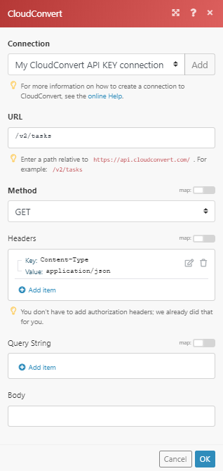

# [!DNL CloudConvert]개 모듈

Adobe Workfront Fusion 시나리오에서는 CloudConvert를 사용하는 워크플로를 자동화하고 여러 타사 애플리케이션 및 서비스에 연결할 수 있습니다. [!DNL CloudConvert] 모듈을 사용하면 [!DNL CloudConvert] 계정에서 작업, 작업을 모니터링하고 관리하며 파일을 가져오고 내보낼 수 있습니다.

<table style="table-layout:auto">
 <col> 
 <col> 
 <tbody> 
  <tr> 
   <td role="rowheader">[!DNL Adobe Workfront] 플랜*</td>
  <td> 
[!UICONTROL Pro] 이상
 </td>
  </tr> 
  <tr data-mc-conditions=""> 
   <td role="rowheader">[!DNL Adobe Workfront] 라이센스*</td>
   <td> 
[!UICONTROL Plan], [!UICONTROL Work]
 </td> 
  </tr> 
  <tr> 
   <td role="rowheader">[!DNL Adobe Workfront Fusion] 라이센스**</td> 
   <td>
   
현재 라이선스 요구 사항: [!DNL Workfront Fusion] 라이선스 요구 사항이 없습니다.

   
또는

   
레거시 라이선스 요구 사항: 작업 자동화 및 통합을 위한 [!UICONTROL [!DNL Workfront Fusion]] 

   </td> 
  </tr> 
  <tr> 
   <td role="rowheader">제품</td> 
   <td>
   
현재 제품 요구 사항: [!UICONTROL Select] 또는 [!UICONTROL Prime] [!DNL Adobe Workfront] 플랜이 있는 경우 조직에서 이 문서에 설명된 기능을 사용하려면 [!DNL Adobe Workfront Fusion]과(와) [!DNL Adobe Workfront]을(를) 구매해야 합니다. [!DNL Workfront Fusion]이(가) [!UICONTROL Ultimate] [!DNL Workfront] 계획에 포함되어 있습니다.

   
또는

   
레거시 제품 요구 사항: 이 문서에 설명된 기능을 사용하려면 조직에서 [!DNL Adobe Workfront Fusion]과(와) [!DNL Adobe Workfront]을(를) 구매해야 합니다.

   </td> 
  </tr> 
 </tbody> 
</table>

## CloudConvert API 정보

CloudConvert 커넥터는 다음을 사용합니다.

<table style="table-layout:auto"> 
 <col> 
 <col> 
 <tbody> 
  <tr> 
   <td role="rowheader">기본 URL</td> 
   <td> https://api.cloudconvert.com/v2/</td> 
  </tr> 
  <tr> 
   <td role="rowheader">API 버전</td> 
   <td> v2 </td> 
  </tr> 
  <tr> 
   <td role="rowheader">API 태그</td> 
   <td>v2.14.22</td> 
  </tr>
 </tbody> 
 </table>

## [!DNL CloudConvert]을(를) [!DNL Workfront Fusion]에 연결 {#connect-cloudconvert-to-workfront-fusion}

[!DNL CloudConvert] 계정을 [!DNL Workfront Fusion]에 연결하려면 [!DNL CloudConvert] 계정에서 API 키를 가져와야 합니다.

1. [!DNL CloudConvert] 계정에 로그인하고 [!UICONTROL 대시보드]를 엽니다.
1. **[!UICONTROL 권한 부여] > [!UICONTROL API 키]** 섹션을 엽니다.
1. **[!UICONTROL 새 API 키 만들기]**&#x200B;를 클릭합니다.
1. API 키의 이름을 입력하고 사용할 범위를 사용하도록 설정한 다음 **[!UICONTROL 만들기]**&#x200B;를 클릭합니다.
1. 제공된 토큰을 복사하여 안전한 장소에 보관합니다.
1. [!DNL Workfront Fusion]에서 시나리오 만들기를 시작하고 [!DNL CloudConvert] 모듈의 **[!UICONTROL 연결 만들기]** 대화 상자를 엽니다.

   지침은 [시나리오 만들기 [!DNL Adobe Workfront Fusion]](../../workfront-fusion/scenarios/create-a-scenario.md)를 참조하십시오.

1. 5단계에서 저장한 토큰을 입력한 다음 **[!UICONTROL 계속]**&#x200B;을 클릭하여 연결을 설정합니다.

## [!DNL CloudConvert]개 모듈 및 해당 필드 {#cloudconvert-modules-and-their-fields}

[!DNL CloudConvert] 모듈을 구성할 때 [!DNL Workfront Fusion]에 아래 나열된 필드가 표시됩니다. 앱 또는 서비스의 액세스 수준과 같은 요소에 따라 이러한 필드와 함께 [!DNL CloudConvert] 필드가 추가로 표시될 수 있습니다. 모듈의 굵은 제목은 필수 필드를 나타냅니다.

필드나 함수 위에 맵 단추가 표시되면 이 단추를 사용하여 해당 필드에 대한 변수와 함수를 설정할 수 있습니다. 자세한 내용은 [한 모듈에서 다른 모듈로 정보를 매핑 [!DNL Adobe Workfront Fusion]](../../workfront-fusion/mapping/map-information-between-modules.md)을 참조하십시오.

* [일반 작업](#common-tasks)
* [작업](#jobs)
* [작업](#tasks)
* [기타](#other)

### 일반 작업

* [웹 사이트 캡처](#capture-a-website)
* [[!UICONTROL 파일 변환]](#convert-a-file)
* [보관 만들기](#create-an-archive)
* [파일 병합](#merge-files)
* [파일 최적화](#optimize-a-file)

#### [!UICONTROL 웹 사이트 캡처]

이 작업 모듈은 지정된 웹 사이트를 캡처하여 PDF, JPG 또는 PNG 형식으로 저장합니다.

웹 사이트의 URL과 정보를 저장할 위치와 같은 기타 정보를 지정합니다.

모듈은 파일의 ID와 연결된 필드, 그리고 연결이 액세스하는 모든 사용자 지정 필드 및 값을 반환합니다. 이 정보는 시나리오의 후속 모듈에 매핑할 수 있습니다.

<table style="table-layout:auto">
 <col> 
 <col> 
 <tbody> 
  <tr> 
   <td role="rowheader">[!UICONTROL Connection]</td> 
   <td> 
[!DNL CloudConvert] 계정을 [!DNL Workfront Fusion]에 연결하는 방법에 대한 지침은 이 문서에서 <a href="#connect-cloudconvert-to-workfront-fusion" class="MCXref xref">[!DNL CloudConvert]을(를) [!DNL Workfront Fusion]</a>에 연결 을 참조하십시오.
 </td> 
  </tr> 
  <tr> 
   <td role="rowheader">[!UICONTROL URL]</td> 
   <td>캡처할 웹 사이트의 URL을 입력합니다. </td> 
  </tr> 
  <tr> 
   <td role="rowheader">[!UICONTROL 출력 형식] </td> 
   <td>캡처된 웹 사이트를 PNG, JPG 또는 PDF 형식으로 저장할지 여부를 선택합니다. </td> 
  </tr> 
  <tr> 
   <td role="rowheader">[!UICONTROL 파일 이름] </td> 
   <td>대상 출력 파일의 파일 이름(확장명 포함)을 입력합니다.</td> 
  </tr> 
  <tr> 
   <td role="rowheader">[!UICONTROL Headers] </td> 
   <td> 
(선택 사항) 요청 헤더를 정의합니다. 
 
이 기능은 예를 들어 지정된 URL에 인증이 필요한 경우 유용합니다. 
 </td> 
  </tr> 
  <tr> 
   <td role="rowheader"> 
[!UICONTROL 변환 및 엔진별 옵션] 
 </td> 
   <td>변환 및 엔진별 옵션을 지정합니다. 사용 가능한 옵션을 보려면 <code>input_format</code> 및 <code>output_format</code>에 대한 <a href="https://cloudconvert.com/api/v2/convert#convert-tasks">[!DNL CloudConvert] API</a> 설명서를 참조하십시오.</td> 
  </tr> 
  <tr> 
   <td role="rowheader">[!UICONTROL 파일 다운로드] </td> 
   <td> 
모듈의 출력에 파일 데이터를 포함하려면 이 옵션을 활성화합니다.
 </td> 
  </tr> 
 </tbody> 
</table>

#### [!UICONTROL 파일 변환]

파일을 선택한 출력 형식으로 변환합니다.

<table style="table-layout:auto">
 <col> 
 <col> 
 <tbody> 
  <tr> 
   <td role="rowheader">[!UICONTROL Connection]</td> 
   <td> 
[!DNL CloudConvert] 계정을 [!DNL Workfront Fusion]에 연결하는 방법에 대한 지침은 이 문서에서 <a href="#connect-cloudconvert-to-workfront-fusion" class="MCXref xref">[!DNL CloudConvert]을(를) [!DNL Workfront Fusion]</a>에 연결 을 참조하십시오.
 </td> 
  </tr> 
  <tr> 
   <td role="rowheader">[!UICONTROL 입력 파일]</td> 
   <td>[!DNL Workfront Fusion]을(를) 사용하여 파일을 업로드할지 또는 파일을 업로드할 URL을 제공할지 선택하십시오.</td> 
  </tr> 
  <tr> 
   <td role="rowheader">[!UICONTROL 파일 업로드]</td> 
   <td> 
이전 모듈에서 소스 파일을 선택하거나 소스 파일의 이름과 데이터를 매핑합니다.
 </td> 
  </tr> 
  <tr> 
   <td role="rowheader">[!UICONTROL URL에서 파일 가져오기]</td> 
   <td> 
    <ul> 
     <li> 
<strong>[!UICONTROL URL]</strong> 
 
변환할 파일의 URL을 입력합니다.
 </li> 
     <li> 
<strong>[!UICONTROL Headers]</strong>
 
요청 헤더를 정의합니다(선택 사항). 이 기능은 예를 들어 지정된 URL에 인증이 필요한 경우 유용합니다.
 </li> 
    </ul> </td> 
  </tr> 
  <tr> 
   <td role="rowheader">[!UICONTROL 형식]</td> 
   <td>변환할 파일의 입력 형식을 지정할지 여부를 선택합니다. 지정하지 않으면 입력 파일의 확장자가 입력 형식으로 사용됩니다.</td> 
  </tr> 
  <tr data-mc-conditions=""> 
   <td role="rowheader">[!DNL Input Format]</td> 
   <td>파일의 현재 형식을 선택합니다.</td> 
  </tr> 
  <tr data-mc-conditions=""> 
   <td role="rowheader">[!UICONTROL 출력 형식]</td> 
   <td>파일을 변환할 대상 파일 형식을 선택합니다.</td> 
  </tr> 
  <tr data-mc-conditions=""> 
   <td role="rowheader">[!UICONTROL 파일 이름]</td> 
   <td>대상 출력 파일의 파일 이름(확장명 포함)을 선택합니다.</td> 
  </tr> 
  <tr data-mc-conditions=""> 
   <td role="rowheader"> 
[!UICONTROL 변환 및 엔진별 옵션] 
 </td> 
   <td>변환 및 엔진별 옵션을 지정합니다. 사용 가능한 옵션을 보려면 <code>input_format</code> 및 <code>output_format</code>에 대한 <a href="https://cloudconvert.com/api/v2/convert#convert-tasks">[!DNL CloudConvert] API</a> 설명서를 참조하십시오.</td> 
  </tr> 
  <tr data-mc-conditions=""> 
   <td role="rowheader">[!UICONTROL 파일 다운로드] </td> 
   <td> 
모듈의 출력에 파일 데이터를 포함하려면 이 옵션을 활성화합니다.
 </td> 
  </tr> 
 </tbody> 
</table>

#### [!UICONTROL 보관 만들기]

ZIP, RAR, 7Z, TAR, TAR.GZ 또는 TAR.BZ2 아카이브에 하나 이상의 파일을 추가할 수 있습니다.

<table style="table-layout:auto"> 
 <col> 
 <col> 
 <tbody> 
  <tr> 
   <td role="rowheader">[!UICONTROL Connection]</td> 
   <td> 
[!DNL CloudConvert] 계정을 [!DNL Workfront Fusion]에 연결하는 방법에 대한 지침은 이 문서에서 <a href="#connect-cloudconvert-to-workfront-fusion" class="MCXref xref">[!DNL CloudConvert]을(를) [!DNL Workfront Fusion]</a>에 연결 을 참조하십시오.
 </td> 
  </tr> 
  <tr> 
   <td role="rowheader"> 
[!UICONTROL 입력 파일]
 </td> 
   <td> 
아카이브에 추가할 파일을 지정합니다.
 </td> 
  </tr> 
  <tr> 
   <td role="rowheader">[!UICONTROL 파일 업로드]</td> 
   <td> 
이전 모듈에서 소스 파일을 선택하거나 소스 파일의 이름과 데이터를 매핑합니다.
 </td> 
  </tr> 
  <tr> 
   <td role="rowheader"> 
[!UICONTROL URL에서 파일 가져오기]
 </td> 
   <td> 
<strong>[!UICONTROL URL]</strong> 
 
보관하려는 파일의 URL을 입력합니다.
 
<strong>[!UICONTROL Headers]</strong> 
 
요청 헤더를 정의합니다(선택 사항). 이 기능은 예를 들어 지정된 URL에 인증이 필요한 경우 유용합니다.
 </td> 
  </tr> 
  <tr> 
   <td role="rowheader">[!UICONTROL 출력 형식]</td> 
   <td> 
 보관된 파일의 대상 형식을 선택합니다.
 </td> 
  </tr> 
  <tr> 
   <td role="rowheader">[!UICONTROL 파일 이름]</td> 
   <td> 
 대상 출력 파일의 파일 이름(확장명 포함)을 입력합니다.
 </td> 
  </tr> 
  <tr> 
   <td role="rowheader">[!UICONTROL 변환 및 엔진별 옵션] </td> 
   <td> 
변환 및 엔진별 옵션을 지정합니다. 사용 가능한 옵션을 보려면 <code>input_format</code> 및 <code>output_format</code>에 대한 <a href="https://cloudconvert.com/api/v2/convert#convert-tasks">[!DNL CloudConvert] API</a> 설명서를 참조하십시오.
 </td> 
  </tr> 
  <tr> 
   <td role="rowheader">[!UICONTROL 파일 다운로드]</td> 
   <td> 
모듈의 출력에 파일 데이터를 포함하려면 이 옵션을 활성화합니다.
 </td> 
  </tr> 
 </tbody> 
</table>

#### [!UICONTROL 파일 병합]

두 개 이상의 파일을 하나의 PDF에 병합합니다. 입력 파일이 PDF이 아닌 경우 자동으로 PDF으로 변환됩니다.

<table style="table-layout:auto">
 <col> 
 <col> 
 <tbody> 
  <tr> 
   <td role="rowheader">[!UICONTROL Connection]</td> 
   <td> 
[!DNL CloudConvert] 계정을 [!DNL Workfront Fusion]에 연결하는 방법에 대한 지침은 이 문서에서 <a href="#connect-cloudconvert-to-workfront-fusion" class="MCXref xref">[!DNL CloudConvert]을(를) [!DNL Workfront Fusion]</a>에 연결 을 참조하십시오.
 </td> 
  </tr> 
  <tr> 
   <td role="rowheader"> 
[!UICONTROL 입력 파일]
 </td> 
   <td> 
병합할 파일을 지정합니다.
 </td> 
  </tr> 
  <tr> 
   <td role="rowheader">[!UICONTROL 파일 업로드]</td> 
   <td> 
이전 모듈에서 소스 파일을 선택하거나 소스 파일의 이름과 데이터를 매핑합니다.
 </td> 
  </tr> 
  <tr> 
   <td role="rowheader"> 
[!UICONTROL URL에서 파일 가져오기]
 </td> 
   <td> 
<strong>[!UICONTROL URL]</strong> 
 
보관하려는 파일의 URL을 입력합니다.
 
<strong>[!UICONTROL Headers]</strong> 
 
요청 헤더를 정의합니다(선택 사항). 이 기능은 예를 들어 지정된 URL에 인증이 필요한 경우 유용합니다.
 </td> 
  </tr> 
  <tr> 
   <td role="rowheader">[!UICONTROL 출력 형식]</td> 
   <td> 
 병합된 파일의 대상 형식을 선택합니다.
 </td> 
  </tr> 
  <tr> 
   <td role="rowheader">[!UICONTROL 파일 이름]</td> 
   <td> 
 대상 출력 파일의 파일 이름(확장명 포함)을 입력합니다.
 </td> 
  </tr> 
  <tr> 
   <td role="rowheader">[!UICONTROL 변환 및 엔진별 옵션] </td> 
   <td> 
변환 및 엔진별 옵션을 지정합니다. 사용 가능한 옵션을 보려면 <code>input_format</code> 및 <code>output_format</code>에 대한 <a href="https://cloudconvert.com/api/v2/convert#convert-tasks">[!DNL CloudConvert] API</a> 설명서를 참조하십시오.
 </td> 
  </tr> 
  <tr> 
   <td role="rowheader">[!UICONTROL 파일 다운로드]</td> 
   <td> 
모듈의 출력에 파일 데이터를 포함하려면 이 옵션을 활성화합니다.
 </td> 
  </tr> 
 </tbody> 
</table>

#### [!UICONTROL 파일 최적화]

이 작업 모듈은 파일을 PDF, PNG 또는 JPG 형식으로 최적화 및 압축합니다.

최적화하고 저장하기 위한 파일 및 매개변수를 지정합니다.

모듈은 파일의 ID와 연결된 필드, 그리고 연결이 액세스하는 모든 사용자 지정 필드 및 값을 반환합니다. 이 정보는 시나리오의 후속 모듈에 매핑할 수 있습니다.

이 모듈을 구성할 때 다음 필드가 표시됩니다.

<table style="table-layout:auto">
 <col> 
 <col> 
 <tbody> 
  <tr> 
   <td role="rowheader">[!UICONTROL Connection]</td> 
   <td> 
[!DNL CloudConvert] 계정을 [!DNL Workfront Fusion]에 연결하는 방법에 대한 지침은 이 문서에서 <a href="#connect-cloudconvert-to-workfront-fusion" class="MCXref xref">[!DNL CloudConvert]을(를) [!DNL Workfront Fusion]</a>에 연결 을 참조하십시오.
 </td> 
  </tr> 
  <tr> 
   <td role="rowheader">[!UICONTROL 입력 파일]</td> 
   <td>Workfront Fusion을 사용하여 파일을 업로드할지 또는 파일을 업로드할 URL을 제공할지 선택합니다.</td> 
  </tr> 
  <tr> 
   <td role="rowheader"> 
[!UICONTROL 파일 업로드]
 </td> 
   <td> 
이전 모듈에서 소스 파일을 선택하거나 소스 파일의 이름과 데이터를 매핑합니다.
 </td> 
  </tr> 
  <tr> 
   <td role="rowheader">[!UICONTROL URL에서 파일 가져오기] </td> 
   <td> 
    <ul> 
     <li><strong>[!UICONTROL URL]</strong>: 변환할 파일의 URL을 입력합니다.</li> 
     <li><strong>[!UICONTROL Headers]</strong>: (선택 사항) 요청 헤더를 정의합니다. 이 기능은 예를 들어 지정된 URL에 인증이 필요한 경우 유용합니다.</li> 
    </ul> </td> 
  </tr> 
  <tr> 
   <td role="rowheader">[!UICONTROL Optimization for] </td> 
   <td> 
특정 대상 요구 사항에 대한 최적화 프로필을 선택합니다.
 
    <ul> 
     <li> 
<strong>[!UICONTROL Web]</strong>: 웹에 대한 최적화(기본값)
 
      <ul> 
       <li>웹에 대한 중복되고 불필요한 데이터 제거</li> 
       <li>이미지를 다운 샘플링, 클립 및 지능적으로 압축</li> 
       <li>글꼴 병합 및 하위 집합</li> 
       <li>색상을 RGB으로 변환</li> 
      </ul> </li> 
    </ul> 
    <ul> 
     <li> 
<strong>[!UICONTROL Print]</strong>: 인쇄를 위한 최적화
 
      <ul> 
       <li> 
인쇄를 위해 중복되고 불필요한 데이터 제거
 </li> 
       <li> 
이미지를 다운 샘플링, 클립 및 지능적으로 압축
 </li> 
       <li> 
글꼴 병합 및 하위 집합
 </li> 
       <li> 
색상을 CMYK로 변환
 </li> 
      </ul> </li> 
     <li> 
<strong>[!UICONTROL Archive]</strong>: 보관 목적으로 최적화
 
      <ul> 
       <li> 
아카이빙을 위해 중복되고 불필요한 데이터 제거
 </li> 
       <li> 
이미지를 지능적으로 압축
 </li> 
       <li> 
글꼴 병합 및 하위 집합
 </li> 
      </ul> </li> 
     <li> 
<strong>[!UICONTROL 스캔한 이미지]</strong>: 스캔한 이미지에 대한 최적화
 
      <ul> 
       <li> 
주로 래스터 이미지로 구성된 PDF에 최적화된 프로필
 </li> 
       <li> 
시각적 품질을 크게 저하시키지 않고 이미지 압축
 </li> 
      </ul> </li> 
     <li> 
<strong>[!UICONTROL 최대 크기 감소]</strong>: 최대 크기 감소를 위한 최적화
 
      <ul> 
       <li> 
가능한 최대 압축 사용
 </li> 
       <li> 
시각적 품질을 저하시킬 수 있음
 </li> 
      </ul> </li> 
    </ul> </td> 
  </tr> 
  <tr> 
   <td role="rowheader">[!UICONTROL 입력 형식] </td> 
   <td>최적화할 입력 파일의 형식을 선택합니다. </td> 
  </tr> 
  <tr> 
   <td role="rowheader">[!UICONTROL 파일 이름]</td> 
   <td> 
대상 출력 파일의 파일 이름(확장명 포함)을 입력합니다.
 </td> 
  </tr> 
  <tr> 
   <td role="rowheader">[!UICONTROL 변환 및 엔진별 옵션]</td> 
   <td> 
변환 및 엔진별 옵션을 지정합니다. 사용 가능한 옵션을 보려면 <code>input_format</code> 및 <code>output_format</code>에 대한 <a href="https://cloudconvert.com/api/v2/convert#convert-tasks">[!DNL CloudConvert] API</a> 설명서를 참조하십시오.
 </td> 
  </tr> 
  <tr> 
   <td role="rowheader">[!UICONTROL 파일 다운로드]</td> 
   <td> 
모듈의 출력에 파일 데이터를 포함하려면 이 옵션을 활성화합니다.
 </td> 
  </tr> 
 </tbody> 
</table>

### 작업

* [[!UICONTROL 작업 만들기(고급)]](#create-a-job-advanced)
* [[!UICONTROL 새 작업 이벤트]](#new-job-event)
* [[!UICONTROL 작업 나열]](#list-jobs)
* [[!UICONTROL 작업 가져오기]](#get-a-job)
* [[!UICONTROL 작업 삭제]](#delete-a-job)

#### [!UICONTROL 작업 만들기(고급)]

이 모듈은 작업을 생성합니다. 작업은 [!UICONTROL 이름] 필드에서 식별되고 [!UICONTROL 입력] 필드를 사용하여 서로 연결되는 하나 이상의 작업일 수 있습니다.

<table style="table-layout:auto">
 <col> 
 <col> 
 <tbody> 
  <tr> 
   <td role="rowheader">[!UICONTROL Connection]</td> 
   <td> 
[!DNL CloudConvert] 계정을 [!DNL Workfront Fusion]에 연결하는 방법에 대한 지침은 이 문서에서 <a href="#connect-cloudconvert-to-workfront-fusion" class="MCXref xref">[!DNL CloudConvert]을(를) [!DNL Workfront Fusion]</a>에 연결 을 참조하십시오.
 </td> 
  </tr> 
  <tr> 
   <td role="rowheader">[!UICONTROL 입력 파일]</td> 
   <td> 
[!DNL Workfront Fusion]을(를) 사용하여 파일을 업로드할지 또는 파일을 업로드할 URL을 제공할지 선택하십시오.
 </td> 
  </tr> 
  <tr> 
   <td role="rowheader">[!UICONTROL 파일 업로드]</td> 
   <td> 
이전 모듈에서 소스 파일을 선택하거나 소스 파일의 이름과 데이터를 매핑합니다.
 </td> 
  </tr> 
  <tr> 
   <td role="rowheader"> 
[!UICONTROL URL에서 파일 가져오기]
 </td> 
   <td> 
    <ul> 
     <li><strong>[!UICONTROL URL]</strong>: 처리할 파일의 URL을 입력하십시오.</li> 
     <li><strong>[!UICONTROL Headers]</strong>: (선택 사항) 요청 헤더를 정의합니다. 이 기능은 예를 들어 지정된 URL에 인증이 필요한 경우 유용합니다.</li> 
    </ul> </td> 
  </tr> 
  <tr> 
   <td role="rowheader"> 
[!UICONTROL 작업]
 </td> 
   <td> 
작업 내에서 수행될 작업을 추가합니다.
 
해당 섹션에서 작업 필드에 대한 설명을 확인하십시오.
 
    <ul> 
     <li><a href="#convert-a-file" class="MCXref xref">[!UICONTROL 파일 변환]</a> </li> 
     <li><a href="#capture-a-website" class="MCXref xref">[!UICONTROL 웹 사이트 캡처]e</a> </li> 
     <li><a href="#optimize-a-file" class="MCXref xref">[!UICONTROL 파일 최적화]</a> </li> 
     <li><a href="#create-an-archive" class="MCXref xref">[!UICONTROL 보관 만들기]</a> </li> 
     <li><a href="#merge-files" class="MCXref xref">[!UICONTROL 파일 병합]</a> </li> 
    </ul> 
    <ul> 
     <li> 
<strong>[!UICONTROL 명령 실행]</strong> 
 
명령 실행에 대한 자세한 내용은 <a href="https://cloudconvert.com/api/v2/command#command-tasks">[!DNL CloudConvert] API 설명서</a>를 참조하십시오.
 </li> 
     <li> 
<strong>[!UICONTROL 임시 URL로 파일 내보내기]</strong> 
 
 작업 이름 및 입력 작업 이름(예: 전환)을 지정합니다.
 </li> 
    </ul> </td> 
  </tr> 
  <tr> 
   <td role="rowheader">[!UICONTROL 태그] </td> 
   <td> 
태그를 입력합니다. 태그는 작업을 식별하는 임의의 문자열입니다. 효과가 없으며 작업을 ID와 연결하는 데 사용할 수 있습니다.
 </td> 
  </tr> 
 </tbody> 
</table>

#### [!UICONTROL 작업 삭제]

이 모듈은 모든 작업 및 데이터를 포함한 작업을 삭제합니다.

>[!NOTE]
>
>작업이 종료된 후 24시간 후에 자동으로 삭제됩니다.

<table style="table-layout:auto">
 <col> 
 <col> 
 <tbody> 
  <tr> 
   <td role="rowheader">[!UICONTROL Connection]</td> 
   <td> 
[!DNL CloudConvert] 계정을 [!DNL Workfront Fusion]에 연결하는 방법에 대한 지침은 이 문서에서 <a href="#connect-cloudconvert-to-workfront-fusion" class="MCXref xref">[!DNL CloudConvert]을(를) [!DNL Workfront Fusion]</a>에 연결 을 참조하십시오.
 </td> 
  </tr> 
  <tr> 
   <td role="rowheader">[!UICONTROL 작업 ID]</td> 
   <td> 
삭제할 작업의 ID를 입력하거나 매핑합니다.
 </td> 
  </tr> 
 </tbody> 
</table>

#### [!UICONTROL 작업 가져오기]

이 모듈은 작업 세부 정보를 검색합니다.

<table style="table-layout:auto">
 <col> 
 <col> 
 <tbody> 
  <tr> 
   <td role="rowheader">[!UICONTROL Connection]</td> 
   <td> 
[!DNL CloudConvert] 계정을 [!DNL Workfront Fusion]에 연결하는 방법에 대한 지침은 이 문서에서 <a href="#connect-cloudconvert-to-workfront-fusion" class="MCXref xref">[!DNL CloudConvert]을(를) [!DNL Workfront Fusion]</a>에 연결 을 참조하십시오.
 </td> 
  </tr> 
  <tr> 
   <td role="rowheader">[!UICONTROL 작업 ID]</td> 
   <td> 
세부 정보를 검색할 작업의 ID를 입력하거나 매핑합니다.
 </td> 
  </tr> 
 </tbody> 
</table>

#### [!UICONTROL 작업 나열]

이 모듈은 계정에서 실행된 모든 작업을 검색합니다.

<table style="table-layout:auto">
 <col> 
 <col> 
 <tbody> 
  <tr> 
   <td role="rowheader">[!UICONTROL Connection]</td> 
   <td> 
[!DNL CloudConvert] 계정을 [!DNL Workfront Fusion]에 연결하는 방법에 대한 지침은 이 문서에서 <a href="#connect-cloudconvert-to-workfront-fusion" class="MCXref xref">[!DNL CloudConvert]을(를) [!DNL Workfront Fusion]</a>에 연결 을 참조하십시오.
 </td> 
  </tr> 
  <tr> 
   <td role="rowheader">[!UICONTROL 상태] </td> 
   <td> 
반환된 작업을 필터링할 작업 상태를 선택합니다.
 </td> 
  </tr> 
  <tr> 
   <td role="rowheader">[!UICONTROL 제한] </td> 
   <td> 
한 실행 주기 동안 Workfront Fusion 2.0이 반환할 작업 수를 설정합니다.
 </td> 
  </tr> 
 </tbody> 
</table>

#### [!UICONTROL 새 작업 이벤트]

계정 또는 작업의 작업이 생성되거나 완료되거나 실패하면 트리거됩니다.

>[!NOTE]
>
>* [!UICONTROL 작업 만들기(고급)] 모듈에서 만든 작업은 *여러*&#x200B;개의 작업으로 구성됩니다.
>* [!UICONTROL 새 작업 이벤트] 트리거는 *개인* 작업이 만들어지거나 완료되거나 실패한 경우에도 트리거됩니다.
>

<table style="table-layout:auto">
 <col> 
 <col> 
 <tbody> 
  <tr> 
   <td role="rowheader">[!UICONTROL Webhook name]</td> 
   <td>웹후크 이름을 입력합니다. </td> 
  </tr> 
  <tr> 
   <td role="rowheader">[!UICONTROL Connection]</td> 
   <td> 
[!DNL CloudConvert] 계정을 [!DNL Workfront Fusion]에 연결하는 방법에 대한 지침은 이 문서에서 <a href="#connect-cloudconvert-to-workfront-fusion" class="MCXref xref">[!DNL CloudConvert]을(를) [!DNL Workfront Fusion]</a>에 연결 을 참조하십시오.
 </td> 
  </tr> 
  <tr> 
   <td role="rowheader">[!UICONTROL 출력 형식] </td> 
   <td>캡처된 웹 사이트를 PNG, JPG 또는 PDF 형식으로 저장할지 여부를 선택합니다. </td> 
  </tr> 
  <tr> 
   <td role="rowheader">[!UICONTROL 이벤트]</td> 
   <td>작업 또는 작업이 생성, 완료 또는 실패할 때 모듈을 트리거할지 여부를 선택합니다.</td> 
  </tr> 
 </tbody> 
</table>

>[!NOTE]
>
>* Array Aggregator를 사용하여 작업하는 경우(예: 변환할 파일이 여러 개 있는 경우) [!UICONTROL 작업 추가] 대화 상자에서 **[!UICONTROL 입력 형식을 모릅니다]** 옵션을 사용하십시오. 그렇지 않으면 오류가 반환됩니다.
>* 작업 내 작업 연결(이름 > 입력, 이름 > 입력 등):
>
>  >

### 작업

* [[!UICONTROL 작업 가져오기]](#get-a-task)
* [[!UICONTROL 파일 다운로드]](#download-a-file)
* [[!UICONTROL 작업 나열]](#list-tasks)
* [[!UICONTROL 작업 다시 시도]](#retry-a-task)
* [[!UICONTROL 작업 취소]](#cancel-a-task)
* [[!UICONTROL 작업 삭제]](#delete-a-task)

#### [!UICONTROL 작업 취소]

이 모듈은 대기 또는 처리 상태의 작업을 취소합니다.

<table style="table-layout:auto">
 <col> 
 <col> 
 <tbody> 
  <tr> 
   <td role="rowheader">[!UICONTROL Connection]</td> 
   <td> 
[!DNL CloudConvert] 계정을 [!DNL Workfront Fusion]에 연결하는 방법에 대한 지침은 이 문서에서 <a href="#connect-cloudconvert-to-workfront-fusion" class="MCXref xref">[!DNL CloudConvert]을(를) [!DNL Workfront Fusion]</a>에 연결 을 참조하십시오.
 </td> 
  </tr> 
  <tr> 
   <td role="rowheader">[!UICONTROL 작업 ID]</td> 
   <td> 
 취소할 작업의 ID를 입력하거나 매핑합니다.
 </td> 
  </tr> 
 </tbody> 
</table>

#### [!UICONTROL 작업 삭제]

모든 데이터를 포함한 작업을 삭제합니다.

>[!NOTE]
>
>작업이 종료된 후 24시간 후에 자동으로 삭제됩니다.

<table style="table-layout:auto"> 
 <col> 
 <col> 
 <tbody> 
  <tr> 
   <td role="rowheader">[!UICONTROL Connection]</td> 
   <td> 
[!DNL CloudConvert] 계정을 [!DNL Workfront Fusion]에 연결하는 방법에 대한 지침은 이 문서에서 <a href="#connect-cloudconvert-to-workfront-fusion" class="MCXref xref">[!DNL CloudConvert]을(를) [!DNL Workfront Fusion]</a>에 연결 을 참조하십시오.
 </td> 
  </tr> 
  <tr> 
   <td role="rowheader">[!UICONTROL 작업 ID]</td> 
   <td> 
 삭제할 작업의 ID를 입력(매핑)합니다.
 </td> 
  </tr> 
 </tbody> 
</table>

#### [!UICONTROL 파일 다운로드]

이 모듈은 지정된 작업에서 파일 이름 및 파일 데이터를 검색합니다.

<table style="table-layout:auto">
 <col> 
 <col> 
 <tbody> 
  <tr> 
   <td role="rowheader">[!UICONTROL Connection]</td> 
   <td> 
[!DNL CloudConvert] 계정을 [!DNL Workfront Fusion]에 연결하는 방법에 대한 지침은 이 문서에서 <a href="#connect-cloudconvert-to-workfront-fusion" class="MCXref xref">[!DNL CloudConvert]을(를) [!DNL Workfront Fusion]</a>에 연결 을 참조하십시오.
 </td> 
  </tr> 
  <tr> 
   <td role="rowheader">[!UICONTROL 작업 ID]</td> 
   <td> 
 파일을 다운로드할 작업의 ID를 입력하거나 매핑합니다.
 </td> 
  </tr> 
 </tbody> 
</table>

#### [!UICONTROL 작업 가져오기]

이 모듈은 작업 세부 정보를 검색합니다.

<table style="table-layout:auto">
 <col> 
 <col> 
 <tbody> 
  <tr> 
   <td role="rowheader">[!UICONTROL Connection]</td> 
   <td> 
[!DNL CloudConvert] 계정을 [!DNL Workfront Fusion]에 연결하는 방법에 대한 지침은 이 문서에서 <a href="#connect-cloudconvert-to-workfront-fusion" class="MCXref xref">[!DNL CloudConvert]을(를) [!DNL Workfront Fusion]</a>에 연결 을 참조하십시오.
 </td> 
  </tr> 
  <tr> 
   <td role="rowheader">[!UICONTROL 작업 ID]</td> 
   <td> 
세부 정보를 검색할 작업의 ID를 입력하거나 매핑합니다.
 </td> 
  </tr> 
 </tbody> 
</table>

#### [!UICONTROL 작업 나열]

이 모듈은 필터 설정을 기반으로 계정의 모든 작업을 검색합니다.

<table style="table-layout:auto">
 <col> 
 <col> 
 <tbody> 
  <tr> 
   <td role="rowheader">[!UICONTROL Connection]</td> 
   <td> 
[!DNL CloudConvert] 계정을 [!DNL Workfront Fusion]에 연결하는 방법에 대한 지침은 이 문서에서 <a href="#connect-cloudconvert-to-workfront-fusion" class="MCXref xref">[!DNL CloudConvert]을(를) [!DNL Workfront Fusion]</a>에 연결 을 참조하십시오.
 </td> 
  </tr> 
  <tr> 
   <td role="rowheader">[!UICONTROL 상태] </td> 
   <td> 
반환된 작업을 필터링할 작업 상태를 선택합니다.
 </td> 
  </tr> 
  <tr> 
   <td role="rowheader">[!UICONTROL 작업 ID] </td> 
   <td> 
작업 ID를 입력하거나 매핑하여 지정된 작업 내의 작업만 반환합니다.
 </td> 
  </tr> 
  <tr> 
   <td role="rowheader">[!UICONTROL 작업] </td> 
   <td> 
작업 유형을 입력하여 지정된 작업이 있는 작업만 반환합니다. 
 
참고: [!UICONTROL List Possible Operations] 모듈을 사용하여 작업을 검색합니다.
 </td> 
  </tr> 
  <tr> 
   <td role="rowheader">[!UICONTROL 제한] </td> 
   <td> 
각 시나리오 실행 주기 동안 모듈이 반환할 최대 레코드 수를 입력하거나 매핑합니다.
 </td> 
  </tr> 
 </tbody> 
</table>

#### [!UICONTROL 작업 다시 시도]

이 모듈은 다른 작업의 설정(페이로드)을 기반으로 새 작업을 만듭니다.

<table style="table-layout:auto">
 <col> 
 <col> 
 <tbody> 
  <tr> 
   <td role="rowheader">[!UICONTROL Connection]</td> 
   <td> 
[!DNL CloudConvert] 계정을 [!DNL Workfront Fusion]에 연결하는 방법에 대한 지침은 이 문서에서 <a href="#connect-cloudconvert-to-workfront-fusion" class="MCXref xref">[!DNL CloudConvert]을(를) [!DNL Workfront Fusion]</a>에 연결 을 참조하십시오.
 </td> 
  </tr> 
  <tr> 
   <td role="rowheader">[!UICONTROL 작업 ID]</td> 
   <td> 
 새 작업을 만들 작업의 ID를 입력하거나 매핑합니다.
 </td> 
  </tr> 
 </tbody> 
</table>

### 기타

* [[!UICONTROL 내 정보 가져오기]](#get-my-info)
* [[!UICONTROL API 호출 만들기]](#make-an-api-call)

#### [!UICONTROL 내 정보 가져오기]

현재 사용자에 대한 인증된 계정 세부 정보를 검색합니다.

<table style="table-layout:auto">
 <col> 
 <col> 
 <tbody> 
  <tr> 
   <td role="rowheader">[!UICONTROL Connection]</td> 
   <td> 
[!DNL CloudConvert] 계정을 [!DNL Workfront Fusion]에 연결하는 방법에 대한 지침은 이 문서에서 <a href="#connect-cloudconvert-to-workfront-fusion" class="MCXref xref">[!DNL CloudConvert]을(를) [!DNL Workfront Fusion]</a>에 연결 을 참조하십시오.
 </td> 
  </tr> 
 </tbody> 
</table>

#### [!UICONTROL API 호출 만들기]

사용자 지정 API 호출을 수행할 수 있습니다.

<table style="table-layout:auto"> 
 <col> 
 <col> 
 <tbody> 
  <tr> 
   <td role="rowheader">[!UICONTROL Connection]</td> 
   <td> 
[Fusion App] 계정을 Workfront Fusion에 연결하는 방법에 대한 지침은 <a href="../../workfront-fusion/connections/connect-to-fusion-general.md" class="MCXref xref" data-mc-variable-override="">Adobe Workfront Fusion에 연결 만들기 - 기본 지침</a>을 참조하십시오.
 </td> 
  </tr> 
  <tr> 
   <td role="rowheader">[!UICONTROL URL]</td> 
   <td> 
<code>https://api.cloudconvert.com/</code>과(와) 관련된 경로를 입력하십시오. For example: <code>/v2/tasks</code>
 
사용 가능한 끝점 목록은 <a href="https://cloudconvert.com/api/v2">[!DNL CloudConvert] API v2 설명서</a>를 참조하십시오.
 </td> 
  </tr> 
  <tr> 
   <td role="rowheader">[!UICONTROL 메서드]</td> 
   td&gt; 
API 호출을 구성하는 데 필요한 HTTP 요청 메서드를 선택합니다. 자세한 내용은 [!DNL Adobe Workfront Fusion]</a>에서 <a href="../../workfront-fusion/modules/http-request-methods.md" class="MCXref xref" data-mc-variable-override="">HTTP 요청 메서드를 참조하십시오.
 </td> 
  </tr> 
  <tr> 
   <td role="rowheader">[!UICONTROL Headers]</td> 
   <td> 
표준 JSON 개체 형태로 요청의 헤더를 추가합니다.
 
For example, <code>{"Content-type":"application/json"}</code>
 
Workfront Fusion 2.0은 사용자에게 권한 부여 헤더를 추가합니다.
 </td> 
  </tr> 
  <tr> 
   <td role="rowheader">[!UICONTROL 쿼리 문자열]</td> 
   <td> 
표준 JSON 개체 형식으로 API 호출에 대한 쿼리를 추가합니다.
 
For example: <code>{"name":"something-urgent"}</code>
 </td> 
  </tr> 
  <tr> 
   <td role="rowheader">[!UICONTROL Body]</td> 
   <td> 
표준 JSON 개체 형식으로 API 호출에 대한 본문 콘텐츠를 추가합니다. JSON에서 <code>if</code>과(와) 같은 조건문을 사용할 때는 따옴표를 조건문 외부에 넣으십시오.
 </td> 
  </tr> 
 </tbody> 
</table>

**예:** 목록 작업

다음 API 호출은 CloudFront 계정의 모든 작업을 반환합니다.

URL: `/v2/tasks`

메서드: `GET`

검색 일치 항목은 [!UICONTROL 번들] > [!UICONTROL 본문] > [!UICONTROL 데이터]의 모듈 출력에서 찾을 수 있습니다.

이 예에서는 6개의 작업이 반환되었습니다.

## 문제 해결 {#troubleshooting}

가능한 오류 및 해결 방법에 대해서는 다음 표를 참조하십시오.

<table style="table-layout:auto">
 <col> 
 <col> 
 <thead> 
  <tr> 
   <th> 
오류
 </th> 
   <th>다음 단계</th> 
  </tr> 
 </thead> 
 <tbody> 
  <tr> 
   <td role="rowheader"> 
[!UICONTROL 출력 파일 크기가 시나리오에 허용된 한도를 초과합니다.] 
 </td> 
   <td> 
파일 크기 제한을 참조하십시오.
 </td> 
  </tr> 
  <tr> 
   <td role="rowheader"> 
[!UICONTROL 최대 전환 시간을 초과했습니다.] 
 </td> 
   <td> 
무료 [!DNL CloudConvert] 플랜은 매일 25분 전환을 제공합니다. 무료 요금제의 한도를 초과하면 (선불) 패키지 또는 구독으로 전환할 수 있습니다.
 </td> 
  </tr> 
  <tr> 
   <td role="rowheader"> 
[!UICONTROL 프레임 크기를 읽지 못했습니다. 1508을 찾을 수 없습니다. /output/JLIADSA00137P0.mp3�: 인수가 잘못되었습니다.] 
 </td> 
   <td> 
이 오류는 MP3에서 WAV로 파일을 변환할 때 발생합니다. 파일에 대한 참조뿐만 아니라 올바른 파일에 대한 참조도 찾을 수 있으므로 올바른 영역을 선택했는지 확인하십시오.
 </td> 
  </tr> 
  <tr> 
   <td role="rowheader"> 
[!UICONTROL RuntimeError:] 
 
[!UICONTROL 최대 반복 횟수를 초과했습니다.] 
 </td> 
   <td> 
[!DNL CloudConvert] 대시보드의 작업 목록에서 해당 [!DNL CloudConvert] 작업을 찾아 작업 기간을 확인합니다.
 
  
 
[!DNL CloudConvert] &gt; [!UICONTROL 파일 변환] 모듈의 시간 제한이 3분으로 설정되어 있습니다. 작업 기간이 3분을 초과하는 경우([!DNL CloudConvert] 서비스의 일시적인 오버로드로 인해 발생 가능) 모듈에서 위에 언급된 오류가 발생합니다.
 
이 경우 다음 옵션 중 하나를 고려하십시오.
 
    <ul> 
     <li>시나리오 설정에서 <strong>[!UICONTROL 미완료 실행 저장 허용]</strong> 옵션을 활성화하여 이후 수동 해결을 위해 미완료 실행을 저장합니다. 필요한 경우 [!UICONTROL Break] 지시문을 사용하여 [!DNL CloudConvert] 모듈에 오류 처리 경로를 연결하여 불완전한 실행을 자동으로 해결할 수 있습니다.</li> 
     <li>[!DNL CloudConvert] &gt; [!UICONTROL 파일 변환] 모듈에서 <strong>[!UICONTROL 파일 다운로드] 옵션</strong>을(를) 비활성화합니다. 이 경우 모듈은 변환 결과를 기다리지 않습니다. 변환 결과를 얻으려면 새 시나리오를 만들고 [!DNL CloudConvert] &gt; [!UICONTROL 새 작업 이벤트] 트리거를 사용하십시오.</li> 
    </ul> </td> 
  </tr> 
 </tbody> 
</table>

## [!DNL CloudConvert] 커넥터에 대한 예제 워크플로

>[!INFO]
>
>**예:** 비디오를 MOV에서 MP4 형식으로 변환
>
>1. [https://cloudconvert.com/video-converter](https://>cloudconvert.com/video-converter) 방문
>1. **[!UICONTROL 파일 선택]**&#x200B;을 클릭하고 샘플 MOV 파일을 선택합니다.
>1. **[!UICONTROL 전환]** 옆의 드롭다운을 클릭하고 **[!UICONTROL MP4]**&#x200B;을(를) 선택합니다.
>
>1. **[!UICONTROL 렌치]** 아이콘을 클릭합니다.
>1. 알맞은 MP4 압축 설정을 구성합니다.
>1. **[!UICONTROL 변환]**&#x200B;을 클릭합니다.
>1. 전환이 완료되면 **[!UICONTROL 다운로드]**&#x200B;를 클릭합니다.
>1. 변환된 비디오를 검토합니다.
>1. 5단계에 대한 최적의 전환 설정을 찾을 때까지 1~8단계를 반복합니다.
>1. [https://cloudconvert.com/api/v2/convert#convert-tasks](https://cloudconvert.com/api/v2/convert#convert-tasks) 방문
>1. **[!UICONTROL input_format]** 필드에 대해 **[!UICONTROL mov]**&#x200B;을(를) 선택하십시오.
>
>1. **[!UICONTROL output_format]** 필드에 대해 **[!UICONTROL mp4]**&#x200B;을(를) 선택하십시오.
>
>1. video_codec, crf 등과 같은 가능한 모든 매개 변수의 목록입니다. 가 표시됩니다.
>1. Workfront Fusion 2.0에서 시나리오에 **[!UICONTROL CloudConvert]** > **[!UICONTROL 파일 변환]** 모듈을 삽입합니다.
>
>1. 모듈의 설정을 엽니다.
>1. 아래와 같이 모듈을 구성합니다.
>
>   
>
>1. 변환 및 엔진 특정 옵션 필드에 모든 설정을 포함해야 합니다. 5단계의 각 설정에 대해 13단계의 해당 매개 변수와 해당 값을 찾습니다.
