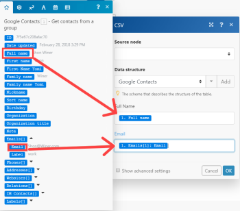

# CSV

>[!IMPORTANT]
>
>Adobe Workfront Fusion 설명서가 새 위치로 이동했습니다.
>
>이 문서의 정보는 이제 문서에서 찾을 수 있습니다.
>
>* [CSV](https://experienceleague.adobe.com/docs/workfront-fusion/using/references/apps-and-their-modules/tools-and-transformers/csv.html)
>
>모든 책갈피를 업데이트하십시오.
>
>이 문서는 더 이상 업데이트되지 않으며 곧 제거될 예정입니다.

[!DNL Adobe Workfront Fusion] [!UICONTROL CSV] 모듈을 사용하면 CSV 파일을 만들고 수신된 텍스트 값 또는 파일에서 CSV 텍스트를 구문 분석할 수 있습니다.

## 액세스 요구 사항

이 문서의 기능을 사용하려면 다음 액세스 권한이 있어야 합니다.

<table style="table-layout:auto">
 <col> 
 <col> 
 <tbody> 
  <tr> 
   <td role="rowheader">[!DNL Adobe Workfront] 플랜*</td>
  <td> 
[!UICONTROL Pro] 이상
 </td>
  </tr> 
  <tr data-mc-conditions=""> 
   <td role="rowheader">[!DNL Adobe Workfront] 라이센스*</td>
   <td> 
[!UICONTROL Plan], [!UICONTROL Work]
 </td> 
  </tr> 
  <tr> 
   <td role="rowheader">[!DNL Adobe Workfront Fusion] 라이센스**</td> 
   <td>
   
현재 라이선스 요구 사항: [!DNL Workfront Fusion] 라이선스 요구 사항이 없습니다.

   
또는

   
레거시 라이선스 요구 사항: 작업 자동화 및 통합의 경우 [!UICONTROL [!DNL Workfront Fusion], 작업 자동화의 경우 [!UICONTROL [!DNL Workfront Fusion]]

   </td> 
  </tr> 
  <tr> 
   <td role="rowheader">제품</td> 
   <td>
   
현재 제품 요구 사항: [!UICONTROL Select] 또는 [!UICONTROL Prime] [!DNL Adobe Workfront] 플랜이 있는 경우 조직에서 이 문서에 설명된 기능을 사용하려면 [!DNL Adobe Workfront Fusion]과(와) [!DNL Adobe Workfront]을(를) 구매해야 합니다. [!DNL Workfront Fusion]이(가) [!UICONTROL Ultimate] [!DNL Workfront] 계획에 포함되어 있습니다.

   
또는

   
레거시 제품 요구 사항: 이 문서에 설명된 기능을 사용하려면 조직에서 [!DNL Adobe Workfront Fusion]과(와) [!DNL Adobe Workfront]을(를) 구매해야 합니다.

   </td> 
  </tr> 
 </tbody> 
</table>

보유 중인 플랜, 라이선스 유형 또는 액세스 권한을 확인하려면 [!DNL Workfront] 관리자에게 문의하세요.

[!DNL Adobe Workfront Fusion] 라이선스에 대한 자세한 내용은 [[!DNL Adobe Workfront Fusion] 라이선스](../../workfront-fusion/get-started/license-automation-vs-integration.md)를 참조하세요.

## [!UICONTROL CSV 만들기]

[!UICONTROL CSV 만들기] 집계를 사용하면 수신된 텍스트 값에서 CSV 텍스트를 만들 수 있습니다.

집계자에 대한 자세한 내용은  [!DNL Adobe Workfront Fusion]](../../workfront-fusion/modules/aggregator-module.md)의 [집계 모듈을 참조하십시오.

<table style="table-layout:auto">
    <tr>
        <td>[!UICONTROL Source Module]</td>
        <td>필요한 필드를 집계하기 위해 사용 중인 모듈을 선택합니다.</td>
    </tr>
    <tr>
        <td>[!UICONTROL 집계된 필드]</td>
        <td>사용 가능한 필드 목록에서 집계할 필드를 선택합니다.</td>
    </tr>
    <tr>
        <td>[!UICONTROL 첫 번째 행에 헤더 포함]</td>
        <td>결과에 헤더를 포함하려면 이 옵션을 선택합니다.</td>
    </tr>
    <tr>
        <td>[!UICONTROL Group by]</td>
        <td>결과를 그룹화할 필터를 입력합니다. 예를 들어 날짜를 입력합니다.</td>
    </tr>
    <tr>
        <td>[!UICONTROL 빈 집계 후 처리 중지]</td>
        <td>결과가 없을 때 시나리오를 중지하려면 이 옵션을 선택합니다.</td>
    </tr>
</table>

## [!UICONTROL CSV 만들기(고급)]

[!UICONTROL CSV 만들기(고급)] 집계를 사용하면 수신된 텍스트 값에서 CSV 텍스트를 만들 수 있습니다. 결과 CSV 파일의 CSV 열을 정의하는 데이터 구조를 사용합니다. 정의된 열은 CSV 모듈 설정에서 필드로 표시되며, 시나리오의 이후 모듈에 매핑될 수 있습니다.

집계자에 대한 자세한 내용은  [!DNL Adobe Workfront Fusion]](../../workfront-fusion/modules/aggregator-module.md)의 [집계 모듈을 참조하십시오.

<table style="table-layout:auto">
 <col> 
 <col> 
 <tbody> 
  <tr> 
   <td role="rowheader">[!UICONTROL Source Module]</td> 
   <td>필요한 필드를 집계하기 위해 사용 중인 앱 모듈을 선택합니다.</td> 
  </tr> 
  <tr> 
   <td role="rowheader">[!UICONTROL 데이터 구조]</td> 
   <td> 
원하는 방식으로 필드를 집계할 데이터 구조를 선택합니다. 데이터 구조를 정의한 후 해당 필드에 항목을 매핑할 수 있습니다.
 
자세한 내용은 [!DNL Adobe Workfront Fusion]</a>의 <a href="../../workfront-fusion/modules/data-structures.md" class="MCXref xref">데이터 구조를 참조하십시오.
 </td> 
  </tr> 
  <tr> 
   <td role="rowheader">[!UICONTROL 첫 번째 행에 헤더 포함] </td> 
   <td>결과에 헤더를 포함하려면 이 옵션을 선택합니다. </td> 
  </tr> 
  <tr> 
   <td role="rowheader">[!UICONTROL Group by] </td> 
   <td>결과를 그룹화할 필터를 입력합니다. 예를 들어 날짜를 입력합니다. </td> 
  </tr> 
  <tr> 
   <td role="rowheader">[!UICONTROL 빈 집계 후 처리 중지] </td> 
   <td>결과가 없을 때 시나리오를 중지하려면 이 옵션을 선택합니다. </td> 
  </tr> 
 </tbody> 
</table>

Google 연락처를 두 개의 열 "전체 이름" 및 "이메일"이 있는 CSV 파일로 내보내려고 한다고 가정합니다. [!UICONTROL Google Contacts] &gt;[!UICONTROL Get contacts from a group] 모듈의 출력 번들은 다음과 같은 구조를 갖습니다. 전자 메일 주소는 컬렉션 배열인 <code>[!UICONTROL Emails[]]</code> 항목 안에 저장되며, 각 컬렉션에는 <code>Label</code> 및 <code>Email</code> 항목이 들어 있습니다.

  

간단한 [!DNL Create CSV] 모듈을 사용하는 경우 번들의 최상위 항목에 해당하는 확인란 목록이 제공됩니다. <code>Full name</code> 및 <code>Emails</code>개 항목을 확인하려고 하면 [!UICONTROL CSV 만들기] 모듈에서 다음 출력을 생성합니다. 이 출력은 사용자가 원하지 않을 수 있습니다.

"emails","fullName"

"[object Object]","Shon Winer"

"[object Object]","Lizeth Fulmore"

"[object Object]","Hilario Gullatt"

"[object Object]","Abby Eisenbarth"

<code>Full Name</code> 항목은 Text의 단순 형식이므로 내보내기가 정상적으로 수행됩니다. 그러나 복잡한 형식의 컬렉션 배열인 <code>Emails</code> 항목은 기본적으로 컬렉션과 배열이 텍스트로 변환되는 방식인 [object Object]로 내보냅니다. 자세한 내용은 <a href="../../workfront-fusion/mapping/item-data-types.md" class="MCXref xref">Adobe Workfront Fusion의 항목 데이터 형식</a>을 참조하십시오.

대신 <code>Emails[]</code> 배열의 첫 번째 컬렉션에 있는 <code>Email </code>항목의 콘텐츠를 내보내려면 [!UICONTROL CSV(고급) 만들기] 모듈을 사용해야 합니다. 모듈을 사용하면 CSV 파일의 개별 열을 정의하고 중첩된 열을 포함하여 항목을 해당 열에 매핑할 수 있습니다.

<ol>
<li value="1">시나리오에 [!UICONTROL CSV 만들기(고급)] 모듈을 삽입하고 구성을 엽니다.</li>
<li value="2">[!UICONTROL 데이터 구조] 필드 옆에 있는 <strong>[!UICONTROL 추가]</strong> 단추를 클릭하여 새 데이터 구조를 만듭니다.</li>
<li value="3"> 
데이터 구조의 이름으로 쓰고 <strong>[!UICONTROL 항목 추가]</strong> 단추를 클릭하여 개별 열을 추가하십시오. "전체 이름"과 "이메일", 이렇게 두 개의 열을 내보내려면 결과 데이터 구조는 다음과 같습니다.
 
  
 </li>
<li value="4"> 
데이터 구조를 정상적으로 정의하면 항목을 매핑할 수 있도록 각 개별 열에 해당하는 필드가 [!UICONTROL CSV(고급) 만들기] 모듈의 구성에 표시됩니다. <code>[!UICONTROL Emails[]]</code> 배열에서 첫 번째 항목을 가져와서 해당 항목 <code>Email </code>을(를) 필드/열 전자 메일에 매핑합니다.
 
  
 </li>
<li value="5"> 
시나리오를 실행합니다. 열 "Email"에 매핑된 <code>Emails[1]: Email</code> 항목이 단순 유형 텍스트이므로 지금 올바르게 내보냅니다.
 
"전체 이름","이메일"
 
"Shon Winer","Shon@Winer.com"
 
"Lizeth Fulmore","Lizeth@Fulmore.com"
 
"Hilario Gullatt","Hilario@Gullatt.com"
 
"Abby Eisenbarth","Abby@Eisenbarth.com"
 </li>
</ol>

## [!UICONTROL CSV 구문 분석]

[!UICONTROL CSV 구문 분석] 변환기를 사용하면 수신된 텍스트 값 또는 파일에서 CSV 텍스트를 구문 분석할 수 있습니다.

<table style="table-layout:auto">
 <col> 
 <col> 
 <tbody> 
  <tr> 
   <td role="rowheader">[!UICONTROL 열 수]</td> 
   <td>CSV 파일의 열 수를 지정합니다.</td> 
  </tr> 
  <tr> 
   <td role="rowheader">[!UICONTROL CSV에 헤더 포함]</td> 
   <td> 
CSV 텍스트의 첫 행에 머리글이 포함된 경우 이 옵션을 선택합니다.
 
참고: 모듈은 이러한 헤더를 사용하여 출력의 열에 레이블을 지정하지 않습니다. 대신 이 필드에서는 헤더가 출력 데이터에 포함되지 않도록 합니다.
 </td> 
  </tr> 
  <tr> 
   <td role="rowheader">[!UICONTROL delimiterType]</td> 
   <td> 
CSV 파일의 구분 기호를 선택합니다. 구분 기호는 별도의 값 또는 필드 사이의 경계를 나타내는 텍스트 문자입니다.
 
    <ul> 
     <li>[!UICONTROL 쉼표]</li> 
     <li>[!UICONTROL Tab]</li> 
     <li> 
[!UICONTROL Other]
 
[!UICONTROL Other]를 선택하는 경우 CSV 파일에서 값을 구분하는 데 사용하는 구분 기호를 입력합니다. 정확히 하나의 문자를 입력해야 합니다. 
 </li> 
    </ul> </td> 
  </tr> 
  <tr> 
   <td role="rowheader">[!UICONTROL 인용되지 않은 필드 내에 따옴표 유지]</td> 
   <td>견적을 유지하려면 이 옵션을 활성화합니다.</td> 
  </tr> 
  <tr> 
   <td role="rowheader">[!UICONTROL CSV]</td> 
   <td>구문 분석할 CSV 파일을 입력하거나 매핑합니다.
참고: 
데이터가 이진 형식(일반적으로 파일에서)으로 제공되는 경우 'toString()' 함수를 사용하여 이진 데이터를 [!UICONTROL String](으)로 변환해야 합니다.

</td> 
  </tr> 
 </tbody> 
</table>
