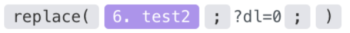

# [!DNL Dropbox] 모듈

에서 [!DNL Adobe Workfront Fusion] 시나리오, [!UICONTROL Dropbox]를 사용하여 여러 타사 응용 프로그램 및 서비스에 연결할 수 있습니다.이렇게 하면 [!UICONTROL Dropbox].

시나리오 만들기에 대한 지침이 필요한 경우 [에서 시나리오 만들기 [!DNL Adobe Workfront Fusion]](../../workfront-fusion/scenarios/create-a-scenario.md).

모듈에 대한 자세한 내용은 [의 모듈 [!DNL Adobe Workfront Fusion]](../../workfront-fusion/modules/modules.md).

## 액세스 요구 사항

이 문서의 기능을 사용하려면 다음 액세스 권한이 있어야 합니다.

<table style="table-layout:auto">
 <col> 
 <col> 
 <tbody> 
  <tr> 
   <td role="rowheader">[!DNL Adobe Workfront] 플랜*</td>
  <td> <p>[!UICONTROL Pro] 이상</p> </td>
  </tr> 
  <tr data-mc-conditions=""> 
   <td role="rowheader">[!DNL Adobe Workfront] 라이센스*</td>
   <td> <p>[!UICONTROL Plan], [!UICONTROL Work]</p> </td> 
  </tr> 
  <tr> 
   <td role="rowheader">[!DNL Adobe Workfront Fusion] license**</td> 
   <td> <p>[!UICONTROL [!DNL Workfront Fusion] 작업 자동화 및 통합을 위한] </p> </td> 
  </tr> 
  <tr> 
   <td role="rowheader">제품</td> 
   <td>조직이 구매해야 합니다 [!DNL Adobe Workfront Fusion] 뿐만 아니라 [!DNL Adobe Workfront] 을 참조하십시오.</td> 
  </tr> 
 </tbody> 
</table>

어떤 계획, 라이센스 유형 또는 액세스 권한을 보유하고 있는지 확인하려면 [!DNL Workfront] 관리자

에 대한 자세한 정보 [!DNL Adobe Workfront Fusion] 라이센스 [[!DNL Adobe Workfront Fusion] 라이선스](../../workfront-fusion/get-started/license-automation-vs-integration.md).

## 전제 조건

를 사용하려면 [!DNL Dropbox] 모듈이면 반드시 [!DNL Dropbox] 계정이 필요합니다.

## [!DNL Dropbox] 모듈 및 해당 필드

구성 시 [!DNL Dropbox] 모듈, [!DNL Workfront Fusion] 아래 나열된 필드를 표시합니다. 이와 함께 추가 [!DNL Dropbox] 앱이나 서비스에서 액세스 수준과 같은 요소에 따라 필드가 표시될 수 있습니다. 모듈에서 굵게 표시된 제목은 필수 필드를 나타냅니다.

필드 또는 함수 위에 맵 단추가 표시되면 이 단추를 사용하여 해당 필드에 대한 변수와 함수를 설정할 수 있습니다. 자세한 내용은 [의 한 모듈에서 다른 모듈로 정보 매핑 [!DNL Adobe Workfront Fusion]](../../workfront-fusion/mapping/map-information-between-modules.md).


* [트리거 모듈](#trigger-modules)
* [가져오기 모듈 [!DNL Dropbox] 파일 및 폴더](#modules-for-getting-dropbox-files-and-folders)
* [만들기 및 편집을 위한 모듈 [!DNL Dropbox] 파일 및 폴더](#modules-for-creating-and-editing-dropbox-files-and-folders)
* [기타 모듈](#other-modules)

### 트리거 모듈

#### [!UICONTROL 감시 파일]

이 트리거 유형 모듈은 지정된 폴더의 파일이 수정되면 파일 세부 사항을 반환합니다.

<table style="table-layout:auto">
 <col> 
 <col> 
 <tbody> 
  <tr> 
   <td>[!UICONTROL Connection] </td> 
   <td> <p>연결 방법에 대한 지침은 [!DNL Dropbox] 계정 대상 [!DNL Workfront Fusion]를 참조하십시오. <a href="../../workfront-fusion/connections/connect-to-fusion-general.md" class="MCXref xref" data-mc-variable-override="">연결 만들기 [!DNL Adobe Workfront Fusion] - 기본 지침</a></p> </td> 
  </tr> 
  <tr> 
   <td>[!UICONTROL Folder] </td> 
   <td> <p>변경 사항을 보려는 폴더를 선택합니다.</p> </td> 
  </tr> 
  <tr> 
   <td>[!UICONTROL Watch도 하위 폴더]</td> 
   <td> <p> 선택한 폴더의 하위 폴더에서도 수정된 파일을 모니터링하려면 이 옵션을 활성화합니다.</p> </td> 
  </tr> 
  <tr> 
   <td>[!UICONTROL 제한] </td> 
   <td> <p>각 시나리오 실행 주기 동안 모듈이 반환할 최대 레코드 수를 입력하거나 매핑합니다.</p> </td> 
  </tr> 
 </tbody> 
</table>

### 가져오기 모듈 [!DNL Dropbox] 파일 및 폴더

* [[!UICONTROL 파일/폴더 검색]](#search-filesfolders)
* [[!UICONTROL 파일 다운로드]](#download-a-file)
* [[!UICONTROL 폴더 메타데이터 가져오기]](#get-a-folder-metadata)
* [[!UICONTROL 폴더에 모든 파일/하위 폴더 나열]](#list-all-filessubfolders-in-a-folder)
* [[!UICONTROL 파일 수정 버전 나열]](#list-file-revisions)

#### [!UICONTROL 파일/폴더 검색]

이 검색 모듈은 [!DNL Dropbox] 지정한 검색 쿼리와 일치합니다.

이 정보는 시나리오의 후속 모듈에 매핑할 수 있습니다.

<table style="table-layout:auto">
 <col> 
 <col> 
 <tbody> 
  <tr> 
   <td>[!UICONTROL Connection] </td> 
   <td> <p>연결 방법에 대한 지침은 [!DNL Dropbox] 계정 대상 [!DNL Workfront Fusion]를 참조하십시오. <a href="../../workfront-fusion/connections/connect-to-fusion-general.md" class="MCXref xref" data-mc-variable-override="">연결 만들기 [!DNL Adobe Workfront Fusion] - 기본 지침</a></p> </td> 
  </tr> 
  <tr> 
   <td>[!UICONTROL Search] </td> 
   <td> <p>검색어를 입력합니다.</p> </td> 
  </tr> 
  <tr> 
   <td>[!UICONTROL Folder] </td> 
   <td> <p>검색할 폴더를 선택합니다. 이 모듈은 전체 [!DNL Dropbox] 폴더를 선택하지 않으면</p> </td> 
  </tr> 
  <tr> 
   <td>파일 상태</td> 
   <td> <p> 파일 상태를 선택하여 검색을 선택한 파일 상태로 제한합니다.</p> </td> 
  </tr> 
  <tr> 
   <td>파일 카테고리</td> 
   <td> <p> 선택한 카테고리로 검색을 제한할 파일 카테고리를 선택합니다.</p> </td> 
  </tr> 
  <tr> 
   <td>파일 확장자</td> 
   <td> <p> 검색할 파일 확장자를 선택합니다.</p> </td> 
  </tr> 
  <tr> 
   <td>제한 </td> 
   <td> <p>각 시나리오 실행 주기 동안 모듈이 반환할 최대 레코드 수를 입력하거나 매핑합니다.</p> </td> 
  </tr> 
 </tbody> 
</table>

#### [!UICONTROL 파일 다운로드]

이 작업 모듈은 폴더에서 파일을 다운로드합니다.

파일과 해당 위치를 지정합니다.

이 모듈은 연결에 액세스하는 사용자 지정 필드 및 값과 함께 파일 및 관련 필드의 ID를 반환합니다. 이 정보는 시나리오의 후속 모듈에 매핑할 수 있습니다.

>[!NOTE]
>
>이 모듈은 후속 모듈에 파일을 제공하는 데 유용합니다.

이 모듈을 구성할 때 다음 필드가 표시됩니다.

<table style="table-layout:auto">
 <col> 
 <col> 
 <tbody> 
  <tr> 
   <td>[!UICONTROL Connection] </td> 
   <td> <p>연결 방법에 대한 지침은 [!DNL Dropbox] 계정 대상 [!DNL Workfront Fusion]를 참조하십시오. <a href="../../workfront-fusion/connections/connect-to-fusion-general.md" class="MCXref xref" data-mc-variable-override="">연결 만들기 [!DNL Adobe Workfront Fusion] - 기본 지침</a></p> </td> 
  </tr> 
  <tr> 
   <td>파일 선택 방법</td> 
   <td> <p> 파일 경로를 매핑할 것인지 아니면 수동으로 파일을 선택할 것인지 선택합니다.</p> </td> 
  </tr> 
  <tr> 
   <td> <p>파일 경로 / 파일</p> </td> 
   <td> <p style="font-weight: bold;">파일 경로</p> <p>대상 경로를 파일에 입력하거나 매핑합니다.</p> <p style="font-weight: bold;">파일</p> <p>메뉴에서 파일을 선택합니다.</p> </td> 
  </tr> 
 </tbody> 
</table>

#### [!UICONTROL 폴더 메타데이터 가져오기]

이 작업 모듈은 공유 폴더 세부 사항을 검색합니다.

폴더의 ID를 지정합니다.

이 모듈은 연결이 액세스하는 사용자 지정 필드 및 값과 함께 폴더 및 관련 필드의 ID를 반환합니다. 이 정보는 시나리오의 후속 모듈에 매핑할 수 있습니다.

이 모듈을 구성할 때 다음 필드가 표시됩니다.

<table style="table-layout:auto">
 <col> 
 <col> 
 <tbody> 
  <tr> 
   <td>[!UICONTROL Connection] </td> 
   <td> <p>연결 방법에 대한 지침은 [!DNL Dropbox] 계정 대상 [!DNL Workfront Fusion]를 참조하십시오. <a href="../../workfront-fusion/connections/connect-to-fusion-general.md" class="MCXref xref" data-mc-variable-override="">연결 만들기 [!DNL Adobe Workfront Fusion] - 기본 지침</a></p> </td> 
  </tr> 
  <tr> 
   <td>공유 폴더 ID</td> 
   <td> <p> 세부 사항을 검색할 폴더의 ID를 입력하거나 매핑합니다.</p> </td> 
  </tr> 
 </tbody> 
</table>

#### [!UICONTROL 폴더에 모든 파일/하위 폴더 나열]

이 작업 모듈은 특정 폴더의 파일 또는 폴더를 나열합니다.

폴더의 ID를 지정합니다.

이 모듈은 연결이 액세스하는 사용자 지정 필드 및 값과 함께 파일 또는 폴더의 ID 및 관련 필드를 반환합니다. 이 정보는 시나리오의 후속 모듈에 매핑할 수 있습니다.

이 모듈을 구성할 때 다음 필드가 표시됩니다.

<table style="table-layout:auto">
 <col> 
 <col> 
 <tbody> 
  <tr> 
   <td>[!UICONTROL Connection] </td> 
   <td> <p>연결 방법에 대한 지침은 [!DNL Dropbox] 계정 대상 [!DNL Workfront Fusion]를 참조하십시오. <a href="../../workfront-fusion/connections/connect-to-fusion-general.md" class="MCXref xref" data-mc-variable-override="">연결 만들기 [!DNL Adobe Workfront Fusion] - 기본 지침</a></p> </td> 
  </tr> 
  <tr> 
   <td>목록 </td> 
   <td> <p>파일 또는 폴더를 검색할지 선택합니다.</p> </td> 
  </tr> 
  <tr> 
   <td>다운로드 가능한 파일만 표시</td> 
   <td> <p> 다운로드 가능한 파일만 반환하려면 이 옵션을 활성화합니다. Google Docs와 같은 일부 유형의 파일은 다운로드할 수 없습니다.</p> </td> 
  </tr> 
  <tr> 
   <td>폴더 </td> 
   <td> <p>파일이나 폴더를 검색할 폴더를 입력하거나 매핑합니다.</p> </td> 
  </tr> 
  <tr> 
   <td>제한 </td> 
   <td> <p>각 시나리오 실행 주기 동안 모듈이 나열할 최대 레코드 수를 입력하거나 매핑합니다.</p> </td> 
  </tr> 
 </tbody> 
</table>

#### [!UICONTROL 파일 수정 버전 나열]

이 작업 모듈은 특정 파일의 모든 파일 수정 버전(버전 기록)을 검색합니다.\
파일의 ID를 지정합니다.

이 모듈은 연결에 액세스하는 사용자 지정 필드 및 값과 함께 레코드와 연결된 표준 필드를 반환합니다. 이 정보는 시나리오의 후속 모듈에 매핑할 수 있습니다.

이 모듈을 구성할 때 다음 필드가 표시됩니다.

<table style="table-layout:auto"> 
 <col> 
 <col> 
 <tbody> 
  <tr> 
   <td>[!UICONTROL Connection] </td> 
   <td> <p>연결 방법에 대한 지침은 [!DNL Dropbox] 계정 대상 [!DNL Workfront Fusion]를 참조하십시오. <a href="../../workfront-fusion/connections/connect-to-fusion-general.md" class="MCXref xref" data-mc-variable-override="">연결 만들기 [!DNL Adobe Workfront Fusion] - 기본 지침</a></p> </td> 
  </tr> 
  <tr> 
   <td>파일 선택 방법</td> 
   <td> <p> 파일 경로를 매핑할 것인지 아니면 수동으로 파일을 선택할 것인지 선택합니다.</p> </td> 
  </tr> 
  <tr> 
   <td> <p>파일 경로 / 파일</p> </td> 
   <td> <p style="font-weight: bold;">파일 경로</p> <p>대상 경로를 파일에 입력하거나 매핑합니다.</p> <p style="font-weight: bold;">파일</p> <p>메뉴에서 파일을 선택합니다.</p> </td> 
  </tr> 
  <tr> 
   <td> <p>제한</p> </td> 
   <td> <p>각 시나리오 실행 주기 동안 모듈이 나열할 최대 레코드 수를 입력하거나 매핑합니다.</p> </td> 
  </tr> 
 </tbody> 
</table>

### 만들기 및 편집을 위한 모듈 [!DNL Dropbox] 파일 및 폴더

* [[!UICONTROL 업로드] 파일](#upload-a-file)
* [[!UICONTROL 폴더 만들기]](#create-a-folder)
* [[!UICONTROL 텍스트 파일 만들기/덮어쓰기]](#createoverwrite-a-text-file)
* [[!UICONTROL 공유 링크 만들기/업데이트]](#createupdate-a-share-link)
* [[!UICONTROL 파일 복원]](#restore-a-file)
* [[!UICONTROL 파일/폴더 이동]](#move-a-filefolder)
* [[!UICONTROL 파일/폴더 이름 바꾸기]](#rename-a-filefolder)
* [[!UICONTROL 파일/폴더 삭제]](#delete-a-filefolder)

#### [!UICONTROL 파일 업로드]

이 작업 모듈은 파일을 폴더에 업로드합니다.

파일의 위치, 업로드할 파일 및 선택적 새 이름과 같은 정보를 지정합니다.

이 모듈은 연결에 액세스하는 사용자 지정 필드 및 값과 함께 파일 및 관련 필드의 ID를 반환합니다. 이 정보는 시나리오의 후속 모듈에 매핑할 수 있습니다.

이 모듈을 구성할 때 다음 필드가 표시됩니다.

<table style="table-layout:auto"> 
 <col> 
 <col> 
 <tbody> 
  <tr> 
   <td>[!UICONTROL Connection] </td> 
   <td> <p>연결 방법에 대한 지침은 [!DNL Dropbox] 계정 대상 [!DNL Workfront Fusion]를 참조하십시오. <a href="../../workfront-fusion/connections/connect-to-fusion-general.md" class="MCXref xref" data-mc-variable-override="">연결 만들기 [!DNL Adobe Workfront Fusion] - 기본 지침</a></p> </td> 
  </tr> 
  <tr> 
   <td>[!UICONTROL Folder]</td> 
   <td> <p> 의 폴더를 선택합니다 [!DNL Dropbox] 파일을 업로드할 대상.</p> </td> 
  </tr> 
  <tr> 
   <td> <p>[!UICONTROL 소스 파일]</p> </td> 
   <td> <p>추가할 파일을 입력하거나 매핑합니다 [!DNL Dropbox] 위에서 선택한 폴더입니다.</p> <p style="font-weight: bold;">[!UICONTROL 파일 이름]</p> <p>파일 확장명을 포함하여 파일 이름을 입력하거나 매핑합니다.</p> <p style="font-weight: bold;">[!UICONTROL 파일 데이터]</p> <p>파일 데이터를 입력하거나 매핑합니다([!UICONTROL Google Drive] &gt;[!UICONTROL 파일 가져오기)].</p> <p>참고: 업로드된 파일의 최대 크기는 150MB입니다.</p> </td> 
  </tr> 
  <tr> 
   <td>[!UICONTROL 기존 파일 덮어쓰기]</td> 
   <td> <p> 기존 파일을 새 파일로 대체하려면 이 옵션을 활성화합니다. 이 옵션을 비활성화한 채로 두면 업로드한 파일의 이름이 바뀝니다.</p> </td> 
  </tr> 
 </tbody> 
</table>

#### [!UICONTROL 폴더 만들기]

이 작업 모듈은 새 폴더를 만듭니다.

폴더 이름과 경로를 지정합니다.

이 모듈은 연결이 액세스하는 사용자 지정 필드 및 값과 함께 폴더 및 관련 필드의 ID를 반환합니다. 이 정보는 시나리오의 후속 모듈에 매핑할 수 있습니다.

이 모듈을 구성할 때 다음 필드가 표시됩니다.

<table style="table-layout:auto"> 
 <col> 
 <col> 
 <tbody> 
  <tr> 
   <td>[!UICONTROL Connection] </td> 
   <td> <p>연결 방법에 대한 지침은 [!DNL Dropbox] 계정 대상 [!DNL Workfront Fusion]를 참조하십시오. <a href="../../workfront-fusion/connections/connect-to-fusion-general.md" class="MCXref xref" data-mc-variable-override="">연결 만들기 [!DNL Adobe Workfront Fusion] - 기본 지침</a></p> </td> 
  </tr> 
  <tr> 
   <td>[!UICONTROL 폴더 이름] </td> 
   <td> <p>새 폴더의 이름을 입력합니다.</p> </td> 
  </tr> 
  <tr> 
   <td> <p>[!UICONTROL Folder]</p> </td> 
   <td> <p>새 폴더를 만들 경로를 입력하거나 매핑합니다.</p> <p>참고:   <p>를 사용 중인 경우 [!DNL Dropbox Business] 계정(팀 공백 포함)에서 슬래시를 제거해야 합니다 <code>/</code>, 또는 클릭하지 않음 <strong>[!UICONTROL 여기를 클릭하여 폴더를 선택합니다.]</strong> 루트에서 팀 폴더를 만들려면</p> <p>슬래시가 제거되지 않으면 오류가 발생합니다 <code>[409] path/malformed_path/..</code> 가 반환됩니다.</p> </p> </td> 
  </tr> 
  <tr> 
   <td>[!UICONTROL 자동 이름 바꾸기]</td> 
   <td> <p> 동일한 이름의 폴더가 대상 위치에 이미 있는 경우 이 옵션을 사용하여 새 폴더의 이름을 변경할 수 있습니다.</p> </td> 
  </tr> 
 </tbody> 
</table>

#### [!UICONTROL 텍스트 파일 만들기/덮어쓰기]

이 작업 모듈은 DOC 파일을 만들거나 기존 파일의 컨텐츠를 덮어씁니다.

소스 파일과 폴더를 지정합니다.

이 모듈은 연결이 액세스하는 사용자 지정 필드 및 값과 함께 폴더 및 관련 필드의 ID를 반환합니다. 이 정보는 시나리오의 후속 모듈에 매핑할 수 있습니다.

이 모듈을 구성할 때 다음 필드가 표시됩니다.

<table style="table-layout:auto"> 
 <col> 
 <col> 
 <tbody> 
  <tr> 
   <td>[!UICONTROL Connection] </td> 
   <td> <p>연결 방법에 대한 지침은 [!DNL Dropbox] 계정 대상 [!DNL Workfront Fusion]를 참조하십시오. <a href="../../workfront-fusion/connections/connect-to-fusion-general.md" class="MCXref xref" data-mc-variable-override="">연결 만들기 [!DNL Adobe Workfront Fusion] - 기본 지침</a></p> </td> 
  </tr> 
  <tr> 
   <td>[!UICONTROL 다음으로 선택]</td> 
   <td> <p> DOC 파일을 생성하거나 덮어쓸지 여부를 선택합니다.</p> </td> 
  </tr> 
  <tr> 
   <td>[!UICONTROL Folder] </td> 
   <td> <p>파일을 만들 대상 위치를 선택합니다.</p> </td> 
  </tr> 
  <tr> 
   <td> <p>[!UICONTROL 소스 파일]</p> </td> 
   <td> <p>추가할 파일을 입력하거나 매핑합니다 [!DNL Dropbox] 폴더를 입력합니다.</p> <p style="font-weight: bold;">파일 이름</p> <p>확장명 없이 새 DOC 파일의 파일 이름을 입력합니다.</p> <p style="font-weight: bold;">파일 컨텐츠</p> <p>DOC 파일의 텍스트 내용을 입력합니다.</p> </td> 
  </tr> 
 </tbody> 
</table>

#### [!UICONTROL 공유 링크 만들기/업데이트]

이 작업 모듈은 파일에 대한 공개 링크를 만듭니다.

링크에 대한 파일 및 정보를 지정합니다.

이 모듈은 연결이 액세스하는 사용자 지정 필드 및 값과 함께 링크의 ID 및 관련 필드를 반환합니다. 이 정보는 시나리오의 후속 모듈에 매핑할 수 있습니다.

이 모듈을 구성할 때 다음 필드가 표시됩니다.

<table style="table-layout:auto"> 
 <col> 
 <col> 
 <tbody> 
  <tr> 
   <td>[!UICONTROL Connection] </td> 
   <td> <p>연결 방법에 대한 지침은 [!DNL Dropbox] 계정 대상 [!DNL Workfront Fusion]를 참조하십시오. <a href="../../workfront-fusion/connections/connect-to-fusion-general.md" class="MCXref xref" data-mc-variable-override="">연결 만들기 [!DNL Adobe Workfront Fusion] - 기본 지침</a></p> </td> 
  </tr> 
  <tr> 
   <td>[!UICONTROL 파일 선택 방법]</td> 
   <td> <p> 파일 경로를 매핑할지 또는 입력할지를 선택하거나 파일을 수동으로 선택합니다.</p> </td> 
  </tr> 
  <tr> 
   <td> <p>[!UICONTROL 파일 경로 / 파일]</p> </td> 
   <td> <p style="font-weight: bold;">[!UICONTROL 파일 경로]</p> <p>대상 경로를 파일에 입력하거나 매핑합니다.</p> <p style="font-weight: bold;">[!UICONTROL File]</p> <p>메뉴에서 파일을 선택합니다.</p> </td> 
  </tr> 
  <tr> 
   <td> <p>[!UICONTROL 요청된 가시성]</p> </td> 
   <td> <p>링크가 공개 링크인지, 팀 링크인지, 암호 제한 링크인지를 선택합니다.</p> <p>참고: [!UICONTROL Team 전용] 및 [!UICONTROL Access with password] 옵션은 [!DNL Dropbox Pro] 또는 그 이상 버전.</p> </td> 
  </tr> 
  <tr> 
   <td>[!UICONTROL 링크의 만료 날짜]</td> 
   <td> <p> 링크가 만료되고 더 이상 액세스할 수 없게 되는 날짜 및 시간을 입력합니다. 이 필드를 비워 두면 링크가 만료되지 않습니다. 지원되는 날짜 및 시간 형식 목록은 다음을 참조하십시오 <a href="../../workfront-fusion/mapping/type-coercion.md" class="MCXref xref" data-mc-variable-override="">형식 강제 적용 [!DNL Adobe Workfront Fusion]</a>.</p> <p>참고: [!UICONTROL Team 전용] 및 [!UICONTROL Access with password] 옵션은 [!UICONTROL Analysis Pro] 이상 버전을 사용하는 사용자만 사용할 수 있습니다.</p> </td> 
  </tr> 
  <tr> 
   <td> <p>[!UICONTROL 링크의 액세스 수준]</p> </td> 
   <td> <p>링크 수신자에 대한 권한을 설정합니다.</p> <p><strong>[!UICONTROL Viewer]</strong> 링크를 사용하는 사용자는 컨텐츠를 보고 주석을 달 수 있습니다.</p> <p><strong>[!UICONTROL Editor]</strong> 링크를 사용하는 사용자는 컨텐츠를 편집, 보기 및 주석 처리할 수 있습니다.</p> <p><strong>[!UICONTROL Max]</strong> 링크를 사용하는 사용자는 링크를 설정할 수 있는 최대 액세스 수준을 받습니다.</p> </td> 
  </tr> 
 </tbody> 
</table>

#### [!UICONTROL 파일 복원]

이 작업 모듈은 이전 버전의 파일을 복원합니다.

파일 및 원하는 개정 번호를 지정합니다.

이 모듈은 연결이 액세스하는 사용자 지정 필드 및 값과 함께 버전 및 관련 필드의 ID를 반환합니다. 이 정보는 시나리오의 후속 모듈에 매핑할 수 있습니다.

이 모듈을 구성할 때 다음 필드가 표시됩니다.

<table style="table-layout:auto"> 
 <col> 
 <col> 
 <tbody> 
  <tr> 
   <td>[!UICONTROL Connection] </td> 
   <td> <p>연결 방법에 대한 지침은 [!DNL Dropbox] 계정 대상 [!DNL Workfront Fusion]를 참조하십시오. <a href="../../workfront-fusion/connections/connect-to-fusion-general.md" class="MCXref xref" data-mc-variable-override="">연결 만들기 [!DNL Adobe Workfront Fusion] - 기본 지침</a></p> </td> 
  </tr> 
  <tr> 
   <td>[!UICONTROL 파일 선택 방법]</td> 
   <td> <p> 파일 경로를 매핑할지 또는 입력할지를 선택하거나 파일을 수동으로 선택합니다.</p> </td> 
  </tr> 
  <tr> 
   <td> <p>[!UICONTROL 파일 경로] / [!UICONTROL 파일]</p> </td> 
   <td> <p><strong>[!UICONTROL 파일 경로]</strong> </p> <p>대상 경로를 파일에 입력하거나 매핑합니다.</p> <p><strong>[!UICONTROL File]</strong> </p> <p>메뉴에서 파일을 선택합니다.</p> </td> 
  </tr> 
  <tr> 
   <td> <p>[!UICONTROL Revision]</p> </td> 
   <td> <p>복원할 개정의 개정 번호를 입력하거나 매핑합니다.</p> </td> 
  </tr> 
 </tbody> 
</table>

#### [!UICONTROL 파일/폴더 이동]

이 작업 모듈은 파일이나 폴더를 다른 위치로 이동합니다.

파일 또는 폴더를 지정하고 이동할 방법과 위치를 지정합니다.

이 모듈은 연결이 액세스하는 사용자 지정 필드 및 값과 함께 파일 또는 폴더의 ID 및 관련 필드를 반환합니다. 이 정보는 시나리오의 후속 모듈에 매핑할 수 있습니다.

이 모듈을 구성할 때 다음 필드가 표시됩니다.

<table style="table-layout:auto"> 
 <col> 
 <col> 
 <tbody> 
  <tr> 
   <td>[!UICONTROL Connection] </td> 
   <td> <p>연결 방법에 대한 지침은 [!DNL Dropbox] 계정 대상 [!DNL Workfront Fusion]를 참조하십시오. <a href="../../workfront-fusion/connections/connect-to-fusion-general.md" class="MCXref xref" data-mc-variable-override="">연결 만들기 [!DNL Adobe Workfront Fusion] - 기본 지침</a></p> </td> 
  </tr> 
  <tr> 
   <td>[!UICONTROL 파일 선택 방법] </td> 
   <td> <p>파일 경로를 매핑할지 또는 입력할지를 선택하거나 파일을 수동으로 선택합니다.</p> </td> 
  </tr> 
  <tr> 
   <td> <p>[!UICONTROL 파일/폴더 경로] / [!UICONTROL 파일/폴더]</p> </td> 
   <td> <p style="font-weight: bold;">[!UICONTROL 파일/폴더 경로]</p> <p>파일 또는 폴더에 대상 경로를 입력하거나 매핑합니다.</p> <p style="font-weight: bold;">[!UICONTROL 파일/폴더]</p> <p>메뉴에서 파일이나 폴더를 선택합니다.</p> </td> 
  </tr> 
  <tr> 
   <td> <p>[!UICONTROL To Folder]</p> </td> 
   <td> <p>파일이나 폴더의 대상 위치를 입력하거나 매핑합니다.</p> </td> 
  </tr> 
  <tr> 
   <td> <p>[!UICONTROL 새 이름]</p> </td> 
   <td> <p>새 위치에 파일 또는 폴더의 새 이름을 입력합니다.</p> </td> 
  </tr> 
  <tr> 
   <td> <p>[!UICONTROL 자동 이름 바꾸기]</p> </td> 
   <td> <p>이 옵션을 활성화하여 이름이 같은 파일 또는 폴더가 있는 경우, 모듈에서는 파일 또는 폴더 이름 뒤에([!UICONTROL NUMBER])를 추가하여 새 파일 또는 폴더의 이름을 바꾸도록 합니다. 그렇지 않으면 대상 위치의 파일 또는 폴더를 덮어씁니다.</p> </td> 
  </tr> 
  <tr> 
   <td> <p>[!UICONTROL 소유권 양도 허용]</p> </td> 
   <td> <p>컨텐츠가 이동하더라도 소유권이 소유자별로 이동되도록 하려면 이 옵션을 활성화합니다.</p> </td> 
  </tr> 
 </tbody> 
</table>

#### [!UICONTROL 파일/폴더 이름 바꾸기]

이 작업 모듈은 파일 또는 폴더의 이름을 변경합니다.

파일 또는 폴더와 새 이름을 지정합니다.

이 모듈은 연결이 액세스하는 사용자 지정 필드 및 값과 함께 파일 또는 폴더의 ID 및 관련 필드를 반환합니다. 이 정보는 시나리오의 후속 모듈에 매핑할 수 있습니다.

이 모듈을 구성할 때 다음 필드가 표시됩니다.

<table style="table-layout:auto"> 
 <col> 
 <col> 
 <tbody> 
  <tr> 
   <td>[!UICONTROL Connection] </td> 
   <td> <p>연결 방법에 대한 지침은 [!DNL Dropbox] 계정 대상 [!DNL Workfront Fusion]를 참조하십시오. <a href="../../workfront-fusion/connections/connect-to-fusion-general.md" class="MCXref xref" data-mc-variable-override="">연결 만들기 [!DNL Adobe Workfront Fusion] - 기본 지침</a></p> </td> 
  </tr> 
  <tr> 
   <td>파일 선택 방법</td> 
   <td> <p> 파일 경로를 매핑할지 또는 입력할지를 선택하거나 파일을 수동으로 선택합니다.</p> </td> 
  </tr> 
  <tr> 
   <td> <p>파일/폴더 경로/파일/폴더</p> </td> 
   <td> <p style="font-weight: bold;">파일/폴더 경로</p> <p>파일 또는 폴더에 대상 경로를 입력하거나 매핑합니다.</p> <p style="font-weight: bold;">파일/폴더</p> <p>메뉴에서 파일이나 폴더를 선택합니다.</p> </td> 
  </tr> 
  <tr> 
   <td>이름 바꾸기 </td> 
   <td> <p>파일 확장명을 포함하여 파일의 [!UICONTROL 대상 이름]을 입력합니다.</p> </td> 
  </tr> 
 </tbody> 
</table>

#### [!UICONTROL 파일/폴더 삭제]

이 작업 모듈은 파일 또는 폴더를 삭제합니다.

파일 또는 폴더를 지정합니다.

이 모듈은 연결이 액세스하는 사용자 지정 필드 및 값과 함께 레코드 및 관련 필드의 ID를 반환합니다. 이 정보는 시나리오의 후속 모듈에 매핑할 수 있습니다.

이 모듈을 구성할 때 다음 필드가 표시됩니다.

<table style="table-layout:auto"> 
 <col> 
 <col> 
 <tbody> 
  <tr> 
   <td>[!UICONTROL Connection] </td> 
   <td> <p>연결 방법에 대한 지침은 [!DNL Dropbox] 계정 대상 [!DNL Workfront Fusion]를 참조하십시오. <a href="../../workfront-fusion/connections/connect-to-fusion-general.md" class="MCXref xref" data-mc-variable-override="">연결 만들기 [!DNL Adobe Workfront Fusion] - 기본 지침</a></p> </td> 
  </tr> 
  <tr> 
   <td>[!UICONTROL 파일 선택 방법]</td> 
   <td> <p> 파일 경로를 매핑할지 또는 입력할지를 선택하거나 파일을 수동으로 선택합니다.</p> </td> 
  </tr> 
  <tr> 
   <td> <p>[!UICONTROL 파일 경로] / [!UICONTROL 파일]</p> </td> 
   <td> <p style="font-weight: bold;">[!UICONTROL 파일 경로]</p> <p>대상 경로를 파일에 입력하거나 매핑합니다.</p> <p style="font-weight: bold;">[!UICONTROL File]</p> <p>메뉴에서 파일을 선택합니다.</p> </td> 
  </tr> 
 </tbody> 
</table>

### 기타 모듈

#### [!UICONTROL API 호출 만들기]

이 작업 모듈을 사용하면 [!DNL Dropbox] API. 이렇게 하면 다른 방식으로 수행할 수 없는 데이터 흐름 자동화를 만들 수 있습니다 [!DNL Dropbox] 모듈.

이 모듈을 구성할 때 다음 필드가 표시됩니다.

<table style="table-layout:auto"> 
 <col> 
 <col> 
 <tbody> 
  <tr> 
   <td>[!UICONTROL Connection] </td> 
   <td> <p>연결 방법에 대한 지침은 [!DNL Dropbox] 계정 대상 [!DNL Workfront Fusion]를 참조하십시오. <a href="../../workfront-fusion/connections/connect-to-fusion-general.md" class="MCXref xref" data-mc-variable-override="">연결 만들기 [!DNL Adobe Workfront Fusion] - 기본 지침</a></p> </td> 
  </tr> 
  <tr> 
   <td> <p>[!UICONTROL URL]</p> </td> 
   <td> <p>상대 경로 입력 <code>https://api.dropboxapi.com</code>. For example, <code>/2/files/list_folder</code></p> <p>참고: 사용 가능한 끝점 목록에 대해서는 <a href="https://www.dropbox.com/developers/documentation/http/documentation">Dropbox API v2 설명서</a>.</p> </td> 
  </tr> 
  <tr> 
   <td> <p>[!UICONTROL 메서드]</p> </td> 
   <td> <p>API 호출을 구성하는 데 필요한 HTTP 요청 메서드를 선택합니다. 자세한 내용은 <a href="../../workfront-fusion/modules/http-request-methods.md" class="MCXref xref" data-mc-variable-override="">의 HTTP 요청 메서드 [!DNL Adobe Workfront Fusion]</a>.</p> </td> 
  </tr> 
  <tr> 
   <td>[!UICONTROL Headers] </td> 
   <td> <p>원하는 요청 헤더를 입력합니다. [!DNL Workfront Fusion] 인증 헤더를 자동으로 추가합니다.</p> </td> 
  </tr> 
  <tr> 
   <td>[!UICONTROL 쿼리 문자열]</td> 
   <td> <p> 요청 쿼리 문자열을 입력합니다.</p> </td> 
  </tr> 
  <tr> 
   <td>[!UICONTROL Body] </td> 
   <td> <p>표준 JSON 개체 형태로 API 호출에 대한 본문 콘텐츠를 추가합니다.</p> <p>참고:   <p>다음과 같은 조건문을 사용하는 경우 <code>if</code> json에서 따옴표를 조건문 외부에 지정합니다.</p> 
     <div class="example" data-mc-autonum="<b>Example: </b>">  
      <p>  </p> 
     </div> </p> </td> 
  </tr> 
 </tbody> 
</table>

>[!INFO]
>
>**예:** 다음 API 호출은 [!DNL /Text files] 폴더의 [!DNL Dropbox] 계정:
>
>URL: `/2/files/list_folder`
>
>본문:
> 
>`{`
>
>`"path": "/Text files",`
>
>`"limit": 10,`
>
>`"recursive": false,`
>
>`"include_deleted": false`
>
>`}`
>
>검색 결과는 아래의 모듈의 출력에 있습니다. [!UICONTROL 번들] > [!UICONTROL 본문] > 항목.
>
>이 예제에서는 10개의 티켓이 반환되었습니다.

## 일반적인 문제

* [파일을 업로드하거나 업데이트할 수 없습니다](#unable-to-upload-or-update-a-file)
* [공유 링크를 통해 참조되는 이미지는 렌더링되지 않습니다](#image-referenced-via-a-shared-link-does-not-render)

### 파일을 업로드하거나 업데이트할 수 없습니다

파일을 업로드하거나 업데이트하지 못하는 경우가 있습니다.

* 업로드된 파일이 너무 커서 허용되는 최대 파일 크기를 초과합니다. [!DNL Dropbox] 계획을 세우거나 [!DNL Dropbox] 계정의 저장소 할당량입니다. 에서 기존 파일을 삭제해야 합니다 [!DNL Dropbox] 계정을 설정하거나 플랜을 업그레이드합니다.
* 파일을 업로드하고 있는 이전에 선택한 폴더가 더 이상 존재하지 않습니다. 시나리오가 중단되고 대상 폴더를 다시 선택해야 합니다.

### 공유 링크를 통해 참조되는 이미지는 렌더링되지 않습니다

에서 반환한 URL입니다. [!UICONTROL Dropbox] >[!UICONTROL 공유 링크 만들기] 는 이미지에 직접 연결되지 않고 [!DNL Dropbox] 페이지. 이미지를 강제로 다운로드하려면 후행 항목을 바꿉니다 `?dl=0` with `?dl=1`. 이미지를 강제로 렌더링하려면(예: 웹 브라우저나 Facebook Messenger에서) 을 추가합니다 `&raw=1` 아래와 같이 변경하는 것을 의미합니다.

웹 사이트나 기타 용도로 이미지의 직접 또는 원시 링크를 가져와야 합니다 [!DNL Workfront Fusion] 모듈에서는 다음과 같은 방식으로 초기 공유 URL을 수정해야 합니다.

원래 URL:

`https://www.dropbox.com/s/ia8qtvs20f3a5ux/Screen%20Shot%202018-10-15%20at%204.21.11%20PM.png?dl=0`

1. 바꾸기 `www` with `dl`.
1. 제거 `?dl=0`.

최종 URL:

`https://dl.dropbox.com/s/ia8qtvs20f3a5ux/Screen%20Shot%202018-10-15%20at%204.21.11%20PM.png`

URL을 자동으로 수정하려면 `replace()` 함수를 두 번 사용합니다.

* www를 dl로 바꾸기

   

* ?dl=0 을 제거하려면

   

한 단계로 수행하려면 다음 함수를 결합하십시오.


복사하여 필드에 붙여넣을 수도 있습니다. 바꾸기 `1.url` 추가 작업이 필요합니다.

```
{{replace(replace(1.url; "?dl=0"; ""); "www"; "dl")}}
```
