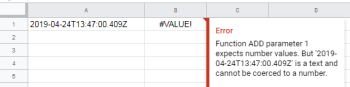

# [!DNL Google Sheets] 모듈

다음에서 [!DNL Adobe Workfront Fusion] 시나리오에서는 다음을 사용하는 워크플로를 자동화할 수 있습니다 [!DNL Google Sheets]을 여러 타사 응용 프로그램 및 서비스에 연결할 수 있습니다.

연결에 대한 자세한 내용 [!DNL Google Sheets] 계정 위치: [!DNL Workfront Fusion], 참조 [에 대한 연결 만들기 [!DNL Adobe Workfront Fusion] - 기본 지침](../../workfront-fusion/connections/connect-to-fusion-general.md)

## 액세스 요구 사항

이 문서의 기능을 사용하려면 다음 액세스 권한이 있어야 합니다.

<table style="table-layout:auto"> 
 <col> 
 <col> 
 <tbody> 
  <tr> 
   <td role="rowheader">[!DNL Adobe Workfront] 플랜*</td>
  <td> 
[!UICONTROL Pro] 이상
 </td>
  </tr> 
  <tr data-mc-conditions=""> 
   <td role="rowheader">[!DNL Adobe Workfront] 라이센스*</td>
   <td> 
[!UICONTROL Plan], [!UICONTROL Work]
 </td> 
  </tr> 
  <tr> 
   <td role="rowheader">[!DNL Adobe Workfront Fusion] 라이센스**</td> 
   <td>
   
현재 라이선스 요구 사항: 아니요 [!DNL Workfront Fusion] 라이센스 요구 사항.

   
또는

   
기존 라이선스 요구 사항: [!UICONTROL [!DNL Workfront Fusion] for Work Automation and Integration] 

   </td> 
  </tr> 
  <tr> 
   <td role="rowheader">제품</td> 
   <td>
   
현재 제품 요구 사항: [!UICONTROL Select] 또는 [!UICONTROL Prime]이 있는 경우 [!DNL Adobe Workfront] 플랜, 조직은 다음을 구매해야 합니다. [!DNL Adobe Workfront Fusion] 뿐만 아니라 [!DNL Adobe Workfront] 이 문서에 설명된 기능을 사용하십시오. [!DNL Workfront Fusion] [!UICONTROL Ultimate]에 포함되어 있습니다. [!DNL Workfront] 계획.

   
또는

   
레거시 제품 요구 사항: 조직에서 구매해야 함 [!DNL Adobe Workfront Fusion] 뿐만 아니라 [!DNL Adobe Workfront] 이 문서에 설명된 기능을 사용하십시오.

   </td> 
  </tr> 
 </tbody> 
</table>

보유 중인 플랜, 라이선스 유형 또는 액세스 권한을 알아보려면 [!DNL Workfront] 관리자.

다음에 대한 정보: [!DNL Adobe Workfront Fusion] 라이센스, 참조 [[!DNL Adobe Workfront Fusion] 라이선스](../../workfront-fusion/get-started/license-automation-vs-integration.md).

## 전제 조건

사용 [!UICONTROL Google Sheets] 모듈, 다음이 있어야 합니다. [!UICONTROL Google] 계정입니다.

## 트리거

### [!UICONTROL 행 보기]

스프레드시트에서 새로 추가된 모든 행의 값을 검색합니다.

모듈은 이전에 채워지지 않은 새 행만 검색합니다. 트리거는 덮어쓴 행을 처리하지 않습니다.

>[!IMPORTANT]
>
>워크시트에 빈 행이 있으면 빈 행 뒤에 있는 행이 처리되지 않습니다.

<table style="table-layout:auto"> 
 <col> 
 <col> 
 <tbody> 
  <tr> 
   <td role="rowheader">[!UICONTROL Connection] </td> 
   <td> 
연결에 대한 자세한 내용 [!DNL Google Sheets] 계정 위치: [!DNL Workfront Fusion], 참조 <a href="../../workfront-fusion/scenarios/create-a-scenario.md#connect" class="MCXref xref">모듈의 앱 또는 웹 서비스 연결 [!DNL Workfront Fusion]</a> 이 문서에서 <a href="../../workfront-fusion/scenarios/create-a-scenario.md" class="MCXref xref">에서 시나리오 만들기 [!DNL Adobe Workfront Fusion]</a>.
 </td> 
  </tr> 
  <tr> 
   <td role="rowheader">[!UICONTROL Spreadsheet] </td> 
   <td> 
보려는 시트가 포함된 스프레드시트를 선택합니다.
 </td> 
  </tr> 
  <tr> 
   <td role="rowheader">[!UICONTROL Sheet] </td> 
   <td> 
새 행에 대해 조사할 시트를 선택합니다.
 </td> 
  </tr> 
  <tr> 
   <td role="rowheader">[!UICONTROL Table contains headers]</td> 
   <td> 
 스프레드시트에 머리글 행이 포함되어 있는지 여부를 선택합니다.
 
    <ul> 
     <li> 
<strong>[!UICONTROL 예]</strong> 
 
모듈은 헤더 행을 출력 데이터로 검색하지 않습니다. 
 
출력에서 변수 이름은 헤더에 의해 호출됩니다.
 </li> 
     <li> 
<strong>[!UICONTROL No]</strong> 
 
모듈은 첫 번째 테이블 행도 검색합니다
 
출력의 변수 이름은 A, B, C, D 등입니다.
 </li> 
    </ul> </td> 
  </tr> 
  <tr> 
   <td role="rowheader">헤더가 있는 [!UICONTROL 행] </td> 
   <td> 
머리글 행의 범위를 입력합니다. For example, <code>A1:F1</code>.
 </td> 
  </tr> 
  <tr> 
   <td role="rowheader">[!UICONTROL 첫 번째 테이블 행]</td> 
   <td> 
테이블의 첫 번째 행 범위를 입력합니다. For example, <code>A1:F1</code>.
 </td> 
  </tr> 
  <tr> 
   <td role="rowheader"> 
[!UICONTROL 값 렌더링 옵션]
 </td> 
   <td> 
[!UICONTROL 형식의 값]
 
셀의 형식에 따라 값이 계산되고 답글에서 서식이 지정됩니다. 서식은 요청한 사용자의 로케일이 아니라 스프레드시트의 로케일을 기반으로 합니다. 예를 들어 다음과 같습니다. <code>A1</code> 은(는) <code>1.23</code> 및 <code>A2</code> 은(는) <code>=A1</code> 및 통화 서식이 지정된 경우 <code>A2</code> 반환 <code>"$1.23"</code>.
 
[!UICONTROL 형식이 지정되지 않은 값]
 
값이 계산되지만 회신에서 형식이 지정되지 않습니다. 예를 들어 다음과 같습니다. <code>A1</code> 은(는) <code>1.23</code> 및 <code>A2</code> 은(는) <code>=A1</code> 및 통화 서식이 지정된 경우 <code>A2</code> 반환 번호 <code>"1.23"</code>.
 
[!UICONTROL 공식]
 
값이 계산되지 않습니다. 답변에는 수식이 포함됩니다. 예를 들어 다음과 같습니다. <code>A1</code> 은(는) <code>1.23</code> 및 <code>A2</code> 은(는) <code>=A1</code> 및 통화 서식이 지정된 경우 <code>A2</code> 반환 <code>"=A1"</code>.
 </td> 
  </tr> 
  <tr> 
   <td role="rowheader"> 
[!UICONTROL 날짜 및 시간 렌더링 옵션]
 </td> 
   <td> 
[!UICONTROL 일련 번호]
 
날짜, 시간, 날짜/시간 및 기간 필드를 Lotus 1-2-3에서 대중화된 "일련 번호" 형식의 double로 출력하도록 지시합니다. 값의 전체 숫자 부분(소수점 왼쪽)은 1899년 12월 30일 이후의 일을 계산합니다. 분수 부분(소수점의 오른쪽)은 시간을 하루의 분수로 계산합니다. 예를 들어, 1900년 1월 1일 정오가 2.5이고, 1899년 12월 30일 이후 2일이므로 2이고, 정오가 반나절이므로 .5입니다. 1900년 2월 1일 오후 3시 는 33.625가 됩니다. 이는 1900년을 윤년이 아닌 해로 올바르게 취급한다.
 
[!UICONTROL 서식 있는 문자열]
 
날짜, 시간, 날짜/시간 및 기간 필드가 지정된 숫자 형식(스프레드시트의 로케일에 따라 다름)으로 문자열로 출력되도록 지시합니다.
 </td> 
  </tr> 
  <tr> 
   <td role="rowheader">[!UICONTROL 제한] </td> 
   <td> 
다음에 대한 최대 결과 수 설정 [!DNL Workfront Fusion] 은 하나의 실행 주기 동안 와 함께 작동합니다.
 </td> 
  </tr> 
 </tbody> 
</table>

## 액션

* [[!UICONTROL 행 추가]](#add-a-row)
* [[!UICONTROL 행 업데이트]](#update-a-row)
* [[!UICONTROL 행 지우기]](#clear-a-row)
* [[!UICONTROL 행 삭제]](#delete-a-row)
* [[!UICONTROL 셀 가져오기]](#get-a-cell)
* [[!UICONTROL 셀 업데이트]](#update-a-cell)
* [[!UICONTROL 셀 지우기]](#clear-a-cell)
* [[!UICONTROL 시트 추가]](#add-a-sheet)
* [[!UICONTROL 스프레드시트 만들기]](#create-a-spreadsheet)
* [[!UICONTROL 시트 삭제]](#delete-a-sheet)
* [[!UICONTROL API 호출 만들기]](#make-an-api-call)

### [!UICONTROL 행 추가]

이 모듈은 시트에 행을 추가합니다.

를 구성할 때 [!DNL Google Sheets] 모듈, [!DNL Workfront Fusion] 아래 나열된 필드를 표시합니다. 이와 함께 추가 [!DNL Google Sheets] 앱이나 서비스의 액세스 수준 등에 따라 필드가 표시될 수 있습니다. 모듈의 굵은 제목은 필수 필드를 나타냅니다.

필드나 함수 위에 맵 단추가 표시되면 이 단추를 사용하여 해당 필드에 대한 변수와 함수를 설정할 수 있습니다. 자세한 내용은 [의 한 모듈에서 다른 모듈로 정보 매핑 [!DNL Adobe Workfront Fusion]](../../workfront-fusion/mapping/map-information-between-modules.md).

<table style="table-layout:auto"> 
 <col> 
 <col> 
 <tbody> 
  <tr> 
   <td>[!UICONTROL Connection] </td> 
   <td> 
연결에 대한 자세한 내용 [!DNL Google Sheets] 계정 위치: [!DNL Workfront Fusion], 참조 <a href="../../workfront-fusion/scenarios/create-a-scenario.md#connect" class="MCXref xref">모듈의 앱 또는 웹 서비스 연결 [!DNL Workfront Fusion]</a> 이 문서에서 <a href="../../workfront-fusion/scenarios/create-a-scenario.md" class="MCXref xref">에서 시나리오 만들기 [!DNL Adobe Workfront Fusion]</a>.
 </td> 
  </tr> 
  <tr> 
   <td>[!UICONTROL 모드]</td> 
   <td> 
스프레드시트와 시트를 수동으로 선택할지 아니면 매핑으로 선택할지를 선택합니다.
 
주: 수동 매핑은 예를 들어 새 스프레드시트가 [!DNL Workfront Fusion] 시나리오와 시나리오에 직접 새로 생성된 스프레드시트에 데이터를 추가하려는 경우
 </td> 
  </tr> 
  <tr> 
   <td>[!UICONTROL Spreadsheet] </td> 
   <td> 
다음 항목 선택 [!DNL Google] 스프레드시트입니다.
 </td> 
  </tr> 
  <tr> 
   <td>[!UICONTROL Sheet] </td> 
   <td> 
행을 추가할 시트를 선택합니다.
 </td> 
  </tr> 
  <tr> 
   <td>[!UICONTROL 열 범위]</td> 
   <td>작업할 열 범위를 선택합니다.</td> 
  </tr> 
  <tr> 
   <td>[!UICONTROL Table contains headers]</td> 
   <td> 
 스프레드시트에 머리글 행이 포함되어 있는지 여부를 선택합니다.
 
    <ul> 
     <li> 
<strong>[!UICONTROL 예]</strong> 
 
모듈은 헤더 행을 출력 데이터로 검색하지 않습니다. 
 
출력에서 변수 이름은 헤더에 의해 호출됩니다.
 </li> 
     <li> 
<strong>[!UICONTROL No]</strong> 
 
모듈은 첫 번째 테이블 행도 검색합니다
 
출력의 변수 이름은 A, B, C, D 등입니다.
 </li> 
    </ul> </td> 
  </tr> 
  <tr> 
   <td>[!UICONTROL 값] </td> 
   <td> 
추가할 행의 원하는 셀을 입력하거나 매핑합니다.
 </td> 
  </tr> 
  <tr> 
   <td>[!UICONTROL 값 입력 옵션]</td> 
   <td> 
    <ul> 
     <li> 
<strong>[!UICONTROL 사용자가 입력됨]</strong>
 
값은 사용자가 UI에 입력한 것처럼 구문 분석됩니다. 숫자는 숫자로 유지되지만 문자열은 를 통해 셀에 텍스트를 입력할 때 적용되는 규칙과 동일한 규칙에 따라 숫자, 날짜 또는 다른 형식으로 변환될 수 있습니다. [!DNL Google Sheets] UI.
 </li> 
     <li> 
<strong>[!UICONTROL Raw]</strong> 
 
 사용자가 입력하는 값은 구문 분석되지 않고 그대로 저장됩니다. 
 </li> 
    </ul> </td> 
  </tr> 
  <tr> 
   <td>[!UICONTROL 데이터 삽입 옵션]</td> 
   <td> 
새 데이터를 입력할 때 기존 데이터가 변경되는 방법을 지정합니다. 
 
    <ul> 
     <li> 
<strong>[!UICONTROL 행 삽입]</strong>
 
새 데이터에 대한 행이 삽입됩니다.
 </li> 
     <li> 
<strong>[!UICONTROL 덮어쓰기]</strong> 
 
새 데이터는 작성된 영역의 기존 데이터를 덮어씁니다. 시트 끝에 데이터를 추가하면 데이터를 쓸 수 있도록 새 행이나 열이 삽입됩니다.
 </li> 
    </ul> </td> 
  </tr> 
 </tbody> 
</table>

### [!UICONTROL 행 업데이트]

이 모듈에서는 선택한 행의 셀 내용을 변경할 수 있습니다.

<table style="table-layout:auto"> 
 <col> 
 <col> 
 <tbody> 
  <tr> 
   <td>[!UICONTROL Connection] </td> 
   <td> 
연결에 대한 자세한 내용 [!DNL Google Sheets] 계정 위치: [!DNL Workfront Fusion], 참조 <a href="../../workfront-fusion/scenarios/create-a-scenario.md#connect" class="MCXref xref">모듈의 앱 또는 웹 서비스 연결 [!DNL Workfront Fusion]</a> 이 문서에서 <a href="../../workfront-fusion/scenarios/create-a-scenario.md" class="MCXref xref">에서 시나리오 만들기 [!DNL Adobe Workfront Fusion]</a>.
 </td> 
  </tr> 
  <tr> 
   <td>[!UICONTROL 모드]</td> 
   <td> 
스프레드시트와 시트를 수동으로 선택할지 아니면 매핑으로 선택할지를 선택합니다.
 
참고: 수동 매핑은 [!UICONTROL Workfront Fusion] 시나리오에서 새 스프레드시트가 생성되고 시나리오에서 직접 새로 생성된 스프레드시트에 데이터를 추가하려는 경우 유용합니다.
 </td> 
  </tr> 
  <tr> 
   <td>[!UICONTROL Spreadsheet] </td> 
   <td> 
다음 항목 선택 [!DNL Google] 스프레드시트입니다.
 </td> 
  </tr> 
  <tr> 
   <td>[!UICONTROL Sheet] </td> 
   <td> 
행을 갱신할 시트를 선택합니다.
 </td> 
  </tr> 
  <tr> 
   <td>[!UICONTROL 행 번호]</td> 
   <td> 
 갱신할 행의 번호를 입력합니다.
 </td> 
  </tr> 
  <tr> 
   <td>[!UICONTROL Table contains headers]</td> 
   <td> 
 스프레드시트에 머리글 행이 포함되어 있는지 여부를 선택합니다.
 
    <ul> 
     <li> 
<strong>[!UICONTROL 예]</strong> 
 
모듈은 헤더 행을 출력 데이터로 검색하지 않습니다. 
 
출력에서 변수 이름은 헤더에 의해 호출됩니다.
 </li> 
     <li> 
<strong>[!UICONTROL No]</strong> 
 
모듈은 첫 번째 테이블 행도 검색합니다
 
출력의 변수 이름은 A, B, C, D 등입니다.
 </li> 
    </ul> </td> 
  </tr> 
  <tr> 
   <td>[!UICONTROL 값] </td> 
   <td> 
변경(업데이트)하려는 행의 원하는 셀에 값을 입력하거나 매핑합니다.
 </td> 
  </tr> 
  <tr> 
   <td>[!UICONTROL 값 입력 옵션]</td> 
   <td> 
    <ul> 
     <li> 
<strong>[!UICONTROL 사용자가 입력됨]</strong>
 
값은 사용자가 UI에 입력한 것처럼 구문 분석됩니다. 숫자는 숫자로 유지되지만 문자열은 를 통해 셀에 텍스트를 입력할 때 적용되는 규칙과 동일한 규칙에 따라 숫자, 날짜 또는 다른 형식으로 변환될 수 있습니다. [!DNL Google Sheets] UI.
 </li> 
     <li> 
<strong>[!UICONTROL Raw]</strong> 
 
 사용자가 입력하는 값은 구문 분석되지 않고 그대로 저장됩니다. 
 </li> 
    </ul> </td> 
  </tr> 
 </tbody> 
</table>

### [!UICONTROL 행 지우기]

지정된 행에서 값을 삭제합니다.

<table style="table-layout:auto"> 
 <col> 
 <col> 
 <tbody> 
  <tr> 
   <td>[!UICONTROL Connection] </td> 
   <td> 
연결에 대한 자세한 내용 [!DNL Google Sheets] 계정 위치: [!DNL Workfront Fusion], 참조 <a href="../../workfront-fusion/scenarios/create-a-scenario.md#connect" class="MCXref xref">모듈의 앱 또는 웹 서비스 연결 [!DNL Workfront Fusion]</a> 이 문서에서 <a href="../../workfront-fusion/scenarios/create-a-scenario.md" class="MCXref xref">에서 시나리오 만들기 [!DNL Adobe Workfront Fusion]</a>.
 </td> 
  </tr> 
  <tr> 
   <td>[!UICONTROL Spreadsheet] </td> 
   <td> 
다음 항목 선택 [!DNL Google] 행을 지우려는 시트가 포함된 스프레드시트입니다.
 </td> 
  </tr> 
  <tr> 
   <td>[!UICONTROL Sheet] </td> 
   <td> 
 데이터를 지우려는 시트를 선택합니다.
 </td> 
  </tr> 
  <tr> 
   <td>[!UICONTROL 행 번호]</td> 
   <td> 
데이터를 지우려는 행의 번호를 입력합니다. For example, <code> 23</code>.
 </td> 
  </tr> 
 </tbody> 
</table>

### [!UICONTROL 행 삭제]

지정된 행을 삭제합니다.

<table style="table-layout:auto"> 
 <col> 
 <col> 
 <tbody> 
  <tr> 
   <td>[!UICONTROL Connection] </td> 
   <td> 
연결에 대한 자세한 내용 [!DNL Google Sheets] 계정 위치: [!DNL Workfront Fusion], 참조 <a href="../../workfront-fusion/scenarios/create-a-scenario.md#connect" class="MCXref xref">모듈의 앱 또는 웹 서비스 연결 [!DNL Workfront Fusion]</a> 이 문서에서 <a href="../../workfront-fusion/scenarios/create-a-scenario.md" class="MCXref xref">에서 시나리오 만들기 [!DNL Adobe Workfront Fusion]</a>.
 </td> 
  </tr> 
  <tr> 
   <td>[!UICONTROL Spreadsheet] </td> 
   <td> 
행을 삭제할 시트가 포함된 Google 스프레드시트를 선택합니다.
 </td> 
  </tr> 
  <tr> 
   <td>시트 </td> 
   <td> 
행을 삭제할 시트를 선택합니다.
 </td> 
  </tr> 
  <tr> 
   <td>행 번호</td> 
   <td> 
삭제할 행의 번호를 입력합니다. 예: <code>23</code>
 </td> 
  </tr> 
 </tbody> 
</table>

### [!UICONTROL 셀 가져오기]

선택한 셀에서 값을 검색합니다.

<table style="table-layout:auto"> 
 <col> 
 <col> 
 <tbody> 
  <tr> 
   <td>[!UICONTROL Connection] </td> 
   <td> 
연결에 대한 자세한 내용 [!DNL Google Sheets] 계정 위치: [!DNL Workfront Fusion], 참조 <a href="../../workfront-fusion/scenarios/create-a-scenario.md#connect" class="MCXref xref">모듈의 앱 또는 웹 서비스 연결 [!DNL Workfront Fusion]</a> 이 문서에서 <a href="../../workfront-fusion/scenarios/create-a-scenario.md" class="MCXref xref">에서 시나리오 만들기 [!DNL Adobe Workfront Fusion]</a>.
 </td> 
  </tr> 
  <tr> 
   <td>[!UICONTROL Spreadsheet] </td> 
   <td> 
다음 항목 선택 [!DNL Google] 스프레드시트입니다.
 </td> 
  </tr> 
  <tr> 
   <td>[!UICONTROL Sheet] </td> 
   <td> 
데이터를 검색할 셀이 포함된 시트를 선택합니다.
 </td> 
  </tr> 
  <tr> 
   <td>[!UICONTROL 셀] </td> 
   <td> 
데이터를 검색할 셀의 ID를 입력합니다. 예: <code>A6</code>
 </td> 
  </tr> 
  <tr> 
   <td>[!UICONTROL 값 렌더링 옵션]</td> 
   <td> 
[!UICONTROL 형식의 값]
 
셀의 형식에 따라 값이 계산되고 답글에서 서식이 지정됩니다. 서식은 요청한 사용자의 로케일이 아니라 스프레드시트의 로케일을 기반으로 합니다. 예를 들어 다음과 같습니다. <code>A1</code> 은(는) <code>1.23</code> 및 <code>A2</code> 은(는) <code>=A1</code> 및 통화 서식이 지정된 경우 <code>A2</code> 반환 <code>"$1.23"</code>.
 
[!DNL Unformatted value]
 
값이 계산되지만 회신에서 형식이 지정되지 않습니다. 예를 들어 다음과 같습니다. <code>A1</code> 은(는) <code>1.23</code> 및 <code>A2</code> 은(는) <code>=A1</code> 및 통화 서식이 지정된 경우 <code>A2</code> 반환 번호 <code>"1.23"</code>.
 
[!DNL Formula]
 
값이 계산되지 않습니다. 답변에는 수식이 포함됩니다. 예를 들어 다음과 같습니다. <code>A1</code> 은(는) <code>1.23</code> 및 <code>A2</code> 은(는) <code>=A1</code> 및 통화 서식이 지정된 경우 <code>A2</code> 반환 <code>"=A1"</code>.
 </td> 
  </tr> 
  <tr> 
   <td>[!DNL Date and time render option]</td> 
   <td> 
[!DNL Serial number]
 
날짜, 시간, 날짜/시간 및 기간 필드를 Lotus 1-2-3에서 대중화된 "일련 번호" 형식의 double로 출력하도록 지시합니다. 값의 전체 숫자 부분(소수점 왼쪽)은 1899년 12월 30일 이후의 일을 계산합니다. 분수 부분(소수점의 오른쪽)은 시간을 하루의 분수로 계산합니다. 예를 들어, 1900년 1월 1일 정오가 2.5이고, 1899년 12월 30일 이후 2일이므로 2이고, 정오가 반나절이므로 .5입니다. 1900년 2월 1일 오후 3시 는 33.625가 됩니다. 이는 1900년을 윤년이 아닌 해로 올바르게 취급한다.
 
[!DNL Formatted string]
 
날짜, 시간, 날짜/시간 및 기간 필드가 지정된 숫자 형식(스프레드시트의 로케일에 따라 다름)으로 문자열로 출력되도록 지시합니다.
 </td> 
  </tr> 
 </tbody> 
</table>

### [!UICONTROL 셀 업데이트]

<table style="table-layout:auto"> 
 <col> 
 <col> 
 <tbody> 
  <tr> 
   <td>[!UICONTROL Connection] </td> 
   <td> 
연결에 대한 자세한 내용 [!DNL Google Sheets] 계정 위치: [!DNL Workfront Fusion], 참조 <a href="../../workfront-fusion/scenarios/create-a-scenario.md#connect" class="MCXref xref">모듈의 앱 또는 웹 서비스 연결 [!DNL Workfront Fusion]</a> 이 문서에서 <a href="../../workfront-fusion/scenarios/create-a-scenario.md" class="MCXref xref">에서 시나리오 만들기 [!DNL Adobe Workfront Fusion]</a>.
 </td> 
  </tr> 
  <tr> 
   <td>[!UICONTROL Spreadsheet] </td> 
   <td> 
다음 항목 선택 [!DNL Google] 스프레드시트입니다.
 </td> 
  </tr> 
  <tr> 
   <td>[!UICONTROL 셀] </td> 
   <td> 
업데이트할 셀의 ID를 입력합니다. 예: <code>A5</code>
 </td> 
  </tr> 
  <tr> 
   <td>[!UICONTROL 값]</td> 
   <td> 
셀의 새 값을 입력합니다.
 </td> 
  </tr> 
  <tr> 
   <td>[!UICONTROL 값 입력 옵션]</td> 
   <td> 
    <ul> 
     <li> 
<strong>[!UICONTROL 사용자가 입력됨]</strong>
 
값은 사용자가 UI에 입력한 것처럼 구문 분석됩니다. 숫자는 숫자로 유지되지만 문자열은 를 통해 셀에 텍스트를 입력할 때 적용되는 규칙과 동일한 규칙에 따라 숫자, 날짜 또는 다른 형식으로 변환될 수 있습니다. [!DNL Google Sheets] UI.
 </li> 
     <li> 
<strong>[!UICONTROL Raw]</strong> 
 
 사용자가 입력하는 값은 구문 분석되지 않고 그대로 저장됩니다. 
 </li> 
    </ul> </td> 
  </tr> 
 </tbody> 
</table>

### [!UICONTROL 셀 지우기]

지정된 셀에서 값을 삭제합니다.

<table style="table-layout:auto"> 
 <col> 
 <col> 
 <tbody> 
  <tr> 
   <td>[!UICONTROL Connection] </td> 
   <td> 
연결에 대한 자세한 내용 [!DNL Google Sheets] 계정 위치: [!DNL Workfront Fusion], 참조 <a href="../../workfront-fusion/scenarios/create-a-scenario.md#connect" class="MCXref xref">모듈의 앱 또는 웹 서비스 연결 [!DNL Workfront Fusion]</a> 이 문서에서 <a href="../../workfront-fusion/scenarios/create-a-scenario.md" class="MCXref xref">에서 시나리오 만들기 [!DNL Adobe Workfront Fusion]</a>.
 </td> 
  </tr> 
  <tr> 
   <td>[!UICONTROL Spreadsheet] </td> 
   <td> 
셀을 지우려는 시트가 포함된 Google 스프레드시트를 선택합니다.
 </td> 
  </tr> 
  <tr> 
   <td>[!UICONTROL Sheet] </td> 
   <td> 
셀을 지울 시트를 선택합니다.
 </td> 
  </tr> 
  <tr> 
   <td>[!UICONTROL 셀] </td> 
   <td> 
지우려는 셀의 ID를 입력합니다. 예: <code>A5</code>.
 </td> 
  </tr> 
 </tbody> 
</table>

### [!UICONTROL 시트 추가]

선택한 스프레드시트에 새 시트를 만듭니다.

<table style="table-layout:auto"> 
 <col> 
 <col> 
 <tbody> 
  <tr> 
   <td>[!UICONTROL Connection] </td> 
   <td> 
연결에 대한 자세한 내용 [!DNL Google Sheets] 계정 위치: [!DNL Workfront Fusion], 참조 <a href="../../workfront-fusion/scenarios/create-a-scenario.md#connect" class="MCXref xref">모듈의 앱 또는 웹 서비스 연결 [!DNL Workfront Fusion]</a> 이 문서에서 <a href="../../workfront-fusion/scenarios/create-a-scenario.md" class="MCXref xref">에서 시나리오 만들기 [!DNL Adobe Workfront Fusion]</a>.
 </td> 
  </tr> 
  <tr> 
   <td>[!UICONTROL Spreadsheet] </td> 
   <td> 
시트를 추가하려는 Google 스프레드시트를 선택합니다.
 </td> 
  </tr> 
  <tr> 
   <td>[!UICONTROL 속성]</td> 
   <td> 
    <ul> 
     <li> 
[!UICONTROL Title]
 
새 시트의 이름을 입력합니다.
 </li> 
     <li> 
[!UICONTROL Index]
 
시트 위치를 입력합니다. 기본값은 0(시트를 첫 번째 위치에 배치함)입니다
 </li> 
    </ul> </td> 
  </tr> 
 </tbody> 
</table>

### [!UICONTROL 스프레드시트 만들기]

<table style="table-layout:auto"> 
 <col> 
 <col> 
 <tbody> 
  <tr> 
   <td>[!UICONTROL Connection] </td> 
   <td> 
연결에 대한 자세한 내용 [!DNL Google Sheets] 계정 위치: [!DNL Workfront Fusion], 참조 <a href="../../workfront-fusion/scenarios/create-a-scenario.md#connect" class="MCXref xref">모듈의 앱 또는 웹 서비스 연결 [!DNL Workfront Fusion]</a> 이 문서에서 <a href="../../workfront-fusion/scenarios/create-a-scenario.md" class="MCXref xref">에서 시나리오 만들기 [!DNL Adobe Workfront Fusion]</a>.
 </td> 
  </tr> 
  <tr> 
   <td>[!UICONTROL Title] </td> 
   <td> 
새 스프레드시트의 이름을 입력합니다.
 </td> 
  </tr> 
  <tr> 
   <td>[!UICONTROL Locale]</td> 
   <td> 
다음 형식 중 하나로 스프레드시트의 로케일을 입력합니다.
 
    <ul> 
     <li>다음과 같은 ISO 639-1 언어 코드 <code>en</code></li> 
     <li>다음과 같은 ISO 639-2 언어 코드 <code>haw</code>, 639-1 코드가 없는 경우</li> 
     <li>다음과 같은 ISO 언어 코드와 국가 코드의 조합 <code>en_US</code></li> 
    </ul> </td> 
  </tr> 
  <tr> 
   <td>[!UICONTROL 재계산 간격]</td> 
   <td> 
휘발성 함수가 다시 계산되기 전까지 대기할 시간:
 
변경 시 [!UICONTROL]
 
변동성 함수는 변경 시마다 업데이트됩니다.
 
변경 시 및 매분 [!UICONTROL]
 
변동성 함수는 변경 시마다 매 분마다 업데이트됩니다.
 
변경 시 및 시간별 [!UICONTROL]
 
변동성 함수는 변경 시마다 업데이트됩니다.
 </td> 
  </tr> 
  <tr> 
   <td>[!UICONTROL 시간대]</td> 
   <td> 
 스프레드시트의 시간대를 선택합니다.
 </td> 
  </tr> 
  <tr> 
   <td>[!UICONTROL Number format]</td> 
   <td> 
스프레드시트에 있는 모든 셀의 기본 형식을 선택합니다.
 
<strong>[!UICONTROL Text]</strong>: 텍스트 서식. 예: <code>1000. 12</code>
 
<strong>[!UICONTROL Number]</strong>: 숫자 서식. 예: <code>1,000.12</code>
 
<strong>[!UICONTROL 백분율]</strong>: 퍼센트 서식. 예: <code>10. 12%</code>
 
<strong>[!UICONTROL Currency]</strong>: 통화 서식. 예: <code>$1,000.12</code>
 
<strong>[!UICONTROL 날짜]</strong>: 날짜 형식 지정. 예: <code>9/26/2008</code>
 
<strong>[!UICONTROL Time]</strong>: 시간 형식 지정. 예: <code>3:59:00 PM</code>
 
<strong>[!UICONTROL Date time]</strong>: 날짜 및 시간 형식 지정. 예: <code>9/26/08 15:59:00</code> 
 
<strong>[!UICONTROL Scientific]</strong>과학 번호 서식. 예: <code>1. 01E+03</code>
 </td> 
  </tr> 
  <tr> 
   <td>[!UICONTROL Sheets] </td> 
   <td> 
클릭 <strong>[!UICONTROL 추가]</strong> 스프레드시트에 시트를 추가합니다. 각 시트에 대해 시트 제목 및 시트 색인을 입력하거나 매핑합니다. 색인 0은 첫 번째 시트를 나타냅니다.
 </td> 
  </tr> 
 </tbody> 
</table>

### [!UICONTROL 시트 삭제]

특정 시트를 삭제합니다.

<table style="table-layout:auto"> 
 <col> 
 <col> 
 <tbody> 
  <tr> 
   <td>[!UICONTROL Connection] </td> 
   <td> 
연결에 대한 자세한 내용 [!DNL Google Sheets] 계정 위치: [!DNL Workfront Fusion], 참조 <a href="../../workfront-fusion/scenarios/create-a-scenario.md#connect" class="MCXref xref">모듈의 앱 또는 웹 서비스 연결 [!DNL Workfront Fusion]</a> 이 문서에서 <a href="../../workfront-fusion/scenarios/create-a-scenario.md" class="MCXref xref">에서 시나리오 만들기 [!DNL Adobe Workfront Fusion]</a>.
 </td> 
  </tr> 
  <tr> 
   <td>[!UICONTROL Spreadsheet] </td> 
   <td> 
다음 항목 선택 [!DNL Google] 스프레드시트입니다.
 </td> 
  </tr> 
  <tr> 
   <td>[!UICONTROL Sheet] </td> 
   <td> 
삭제할 시트를 선택합니다.
 </td> 
  </tr> 
 </tbody> 
</table>

### [!UICONTROL API 호출 만들기]

이 작업 모듈을 사용하면 사용자 지정 API 호출을 수행할 수 있습니다.

<table style="table-layout:auto"> 
 <col> 
 <col> 
 <tbody> 
  <tr> 
   <td role="rowheader">[!UICONTROL Connection]</td> 
   <td> 
[Fusion App] 계정 연결에 대한 지침이 필요하면 [!DNL Workfront Fusion], 참조 <a href="../../workfront-fusion/connections/connect-to-fusion-general.md" class="MCXref xref">에 대한 연결 만들기 [!DNL Adobe Workfront Fusion] - 기본 지침</a>
 </td> 
  </tr> 
  <tr> 
   <td role="rowheader"> 
[!UICONTROL URL]
 </td> 
   <td>상대 경로 입력 <code>https://sheets.googleapis.com/v4/</code>.</td> 
  </tr> 
  <tr> 
   <td role="rowheader"> 
[!UICONTROL 메서드]
 </td> 
   <td> 
API 호출을 구성하는 데 필요한 HTTP 요청 메서드를 선택합니다. 자세한 내용은 <a href="../../workfront-fusion/modules/http-request-methods.md" class="MCXref xref">의 HTTP 요청 메서드 [!DNL Adobe Workfront Fusion]</a>.
 </td> 
  </tr> 
  <tr> 
   <td role="rowheader">[!UICONTROL Headers]</td> 
   <td> 
표준 JSON 개체 형식으로 요청의 헤더를 추가합니다.예: <code>{"Content-type":"application/json"}</code>. [!DNL Workfront Fusion] 인증 헤더를 추가합니다.
 </td> 
  </tr> 
  <tr> 
   <td role="rowheader">[!UICONTROL 쿼리 문자열]</td> 
   <td> 
 표준 JSON 개체 형식으로 API 호출에 대한 쿼리를 추가합니다.
 </td> 
  </tr> 
  <tr> 
   <td role="rowheader">[!UICONTROL Body]</td> 
   <td> 
표준 JSON 개체의 형태로 API 호출에 대한 본문 콘텐츠를 추가합니다.
 
참고:   
다음과 같은 조건문을 사용할 때 <code>if</code> json에서 따옴표를 조건문 외부에 넣습니다.
 
     
Example: </b>">  
      
  
 
     
 
 </td> 
  </tr> 
 </tbody> 
</table>

## 검색 결과

* [[!UICONTROL 행 검색]](#search-rows)
* [[!UICONTROL 행 검색(고급)]](#search-rows-advanced)
* [[!UICONTROL 범위 값 가져오기]](#get-range-values)
* [[!UICONTROL 목록 시트]](#list-sheets)

### [!UICONTROL 행 검색]

필터 옵션을 사용하여 행을 검색합니다.

<table style="table-layout:auto"> 
 <col data-mc-conditions=""> 
 <col data-mc-conditions=""> 
 <tbody> 
  <tr> 
   <td>[!UICONTROL Connection] </td> 
   <td> 
[Fusion App] 계정 연결에 대한 지침이 필요하면 [!DNL Workfront Fusion], 참조 <a href="../../workfront-fusion/connections/connect-to-fusion-general.md" class="MCXref xref">에 대한 연결 만들기 [!DNL Adobe Workfront Fusion] - 기본 지침</a>
 </td> 
  </tr> 
  <tr> 
   <td>[!UICONTROL Spreadsheet] </td> 
   <td> 
다음 항목 선택 [!DNL Google] 스프레드시트입니다.
 </td> 
  </tr> 
  <tr> 
   <td>[!UICONTROL Sheet] </td> 
   <td> 
행을 검색할 시트를 선택합니다.
 </td> 
  </tr> 
  <tr> 
   <td>[!UICONTROL Table contains headers]</td> 
   <td> 
 스프레드시트에 머리글 행이 포함되어 있는지 여부를 선택합니다. [!UICONTROL Yes] 옵션을 선택하면 출력 데이터와 출력의 변수 이름이 헤더에 의해 호출되므로 모듈은 헤더 행을 검색하지 않습니다. [!UICONTROL No] 옵션이 선택된 경우 모듈은 또한 첫 번째 테이블 행을 검색하고 출력의 변수 이름을 A, B, C, D 등으로만 호출합니다.
 </td> 
  </tr> 
  <tr> 
   <td>[!UICONTROL 열 범위]</td> 
   <td>작업할 열 범위를 선택하십시오. 예: <code>A-F</code></td> 
  </tr> 
  <tr> 
   <td>[!UICONTROL Filter]</td> 
   <td> 
검색할 행의 필터를 설정합니다.
 
필터에 대한 자세한 내용은 <a href="../../workfront-fusion/scenarios/add-a-filter-to-a-scenario.md" class="MCXref xref">[!UICONTROL Adobe Workfront Fusion]에서 시나리오에 필터 추가</a>.
 </td> 
  </tr> 
  <tr> 
   <td>[!UICONTROL 정렬 순서]</td> 
   <td>오름차순 또는 내림차순 정렬 여부를 선택합니다.</td> 
  </tr> 
  <tr> 
   <td>[!UICONTROL Order by]</td> 
   <td>정렬 기준으로 사용할 열을 선택합니다.</td> 
  </tr> 
  <tr> 
   <td>[!UICONTROL 값 렌더링 옵션]</td> 
   <td> 
[!UICONTROL 형식의 값]
 
셀의 형식에 따라 값이 계산되고 답글에서 서식이 지정됩니다. 서식은 요청한 사용자의 로케일이 아니라 스프레드시트의 로케일을 기반으로 합니다. 예를 들어 다음과 같습니다. <code>A1</code> 은(는) <code>1.23</code> 및 <code>A2</code> 은(는) <code>=A1</code> 및 통화 서식이 지정된 경우 <code>A2</code> 반환 <code>"$1.23"</code>.
 
[!UICONTROL 형식이 지정되지 않은 값]
 
값이 계산되지만 회신에서 형식이 지정되지 않습니다. 예를 들어 다음과 같습니다. <code>A1</code> 은(는) <code>1.23</code> 및 <code>A2</code> 은(는) <code>=A1</code> 및 통화 서식이 지정된 경우 <code>A2</code> 반환 번호 <code>"1.23"</code>.
 
[!UICONTROL 공식]
 
값이 계산되지 않습니다. 답변에는 수식이 포함됩니다. 예를 들어 다음과 같습니다. <code>A1</code> 은(는) <code>1.23</code> 및 <code>A2</code> 은(는) <code>=A1</code> 및 통화 서식이 지정된 경우 <code>A2</code> 반환 <code>"=A1"</code>.
 </td> 
  </tr> 
  <tr> 
   <td>[!UICONTROL 날짜 및 시간 렌더링 옵션]</td> 
   <td> 
[!UICONTROL 일련 번호]
 
날짜, 시간, 날짜/시간 및 기간 필드를 Lotus 1-2-3에서 대중화된 "일련 번호" 형식의 double로 출력하도록 지시합니다. 값의 전체 숫자 부분(소수점 왼쪽)은 1899년 12월 30일 이후의 일을 계산합니다. 분수 부분(소수점의 오른쪽)은 시간을 하루의 분수로 계산합니다. 예를 들어, 1900년 1월 1일 정오가 2.5이고, 1899년 12월 30일 이후 2일이므로 2이고, 정오가 반나절이므로 .5입니다. 1900년 2월 1일 오후 3시 는 33.625가 됩니다. 이는 1900년을 윤년이 아닌 해로 올바르게 취급한다.
 
[!UICONTROL 서식 있는 문자열]
 
날짜, 시간, 날짜/시간 및 기간 필드가 지정된 숫자 형식(스프레드시트의 로케일에 따라 다름)으로 문자열로 출력되도록 지시합니다.
 </td> 
  </tr> 
  <tr> 
   <td>[!UICONTROL 반환되는 최대 행 수]</td> 
   <td>최대 행 수 설정 [!DNL Workfront Fusion] 는 한 실행 주기 동안 를 반환합니다.</td> 
  </tr> 
 </tbody> 
</table>

### [!UICONTROL 행 검색(고급)]

지정된 기준과 일치하는 결과를 반환합니다.

<table style="table-layout:auto"> 
 <col> 
 <col> 
 <tbody> 
  <tr> 
   <td>[!UICONTROL Connection] </td> 
   <td> 
연결에 대한 자세한 내용 [!DNL Google Sheets] 계정 위치: [!DNL Workfront Fusion], 참조 <a href="../../workfront-fusion/scenarios/create-a-scenario.md#connect" class="MCXref xref">모듈의 앱 또는 웹 서비스 연결 [!DNL Workfront Fusion]</a> 이 문서에서 <a href="../../workfront-fusion/scenarios/create-a-scenario.md" class="MCXref xref">에서 시나리오 만들기 [!DNL Adobe Workfront Fusion]</a>.
 </td> 
  </tr> 
  <tr> 
   <td>[!UICONTROL Spreadsheet] </td> 
   <td> 
검색할 시트가 포함된 Google 스프레드시트를 선택합니다.
 </td> 
  </tr> 
  <tr> 
   <td>[!UICONTROL Sheet] </td> 
   <td> 
검색할 행이 포함된 시트를 선택합니다.
 </td> 
  </tr> 
  <tr> 
   <td>[!UICONTROL Query]</td> 
   <td> 
사용 [!DNL Google Charts Query Language]. 예: <code>select * where B = "John"</code>
 
에 대한 자세한 내용 [!DNL Google Charts Query Language], 참조 <a href="https://developers.google.com/chart/interactive/docs/querylanguage">쿼리 언어 참조</a> 다음에서 [!DNL Google] 설명서를 참조하십시오.
 </td> 
  </tr> 
 </tbody> 
</table>

### [!UICONTROL 범위 값 가져오기]

<table style="table-layout:auto"> 
 <col> 
 <col> 
 <tbody> 
  <tr> 
   <td>[!UICONTROL Connection] </td> 
   <td> 
연결에 대한 자세한 내용 [!DNL Google Sheets] 계정 위치: [!DNL Workfront Fusion], 참조 <a href="../../workfront-fusion/scenarios/create-a-scenario.md#connect" class="MCXref xref">모듈의 앱 또는 웹 서비스 연결 [!DNL Workfront Fusion]</a> 이 문서에서 <a href="../../workfront-fusion/scenarios/create-a-scenario.md" class="MCXref xref">에서 시나리오 만들기 [!DNL Adobe Workfront Fusion]</a>.
 </td> 
  </tr> 
  <tr> 
   <td>[!UICONTROL Spreadsheet] </td> 
   <td> 
다음 항목 선택 [!DNL Google] 스프레드시트입니다.
 </td> 
  </tr> 
  <tr> 
   <td>[!UICONTROL Sheet] </td> 
   <td> 
범위 컨텐츠를 가져올 시트를 선택합니다.
 </td> 
  </tr> 
  <tr> 
   <td>[!UICONTROL 범위] </td> 
   <td> 
가져올 범위를 입력하십시오. 예: <code>A1:D25</code>.
 </td> 
  </tr> 
  <tr> 
   <td>[!UICONTROL Table contains headers]</td> 
   <td> 
시트에 머리글 행이 있는 경우 이 상자를 선택합니다.
 </td> 
  </tr> 
  <tr> 
   <td>헤더가 있는 [!UICONTROL 행]</td> 
   <td>테이블 머리글의 범위를 입력합니다. 예 <code>A1:F1</code>. 필드를 비워 두면, [!DNL Workfront Fusion] 는 헤더가 지정된 범위의 첫 번째 행에 있다고 가정합니다.</td> 
  </tr> 
  <tr> 
   <td>[!UICONTROL 값 렌더링 옵션]</td> 
   <td> 
[!UICONTROL 형식의 값]
 
셀의 형식에 따라 값이 계산되고 답글에서 서식이 지정됩니다. 서식은 요청한 사용자의 로케일이 아니라 스프레드시트의 로케일을 기반으로 합니다. 예를 들어 다음과 같습니다. <code>A1</code> 은(는) <code>1.23</code> 및 <code>A2</code> 은(는) <code>=A1</code> 및 통화 서식이 지정된 경우 <code>A2</code> 반환 <code>"$1.23"</code>.
 
[!UICONTROL 형식이 지정되지 않은 값]
 
값이 계산되지만 회신에서 형식이 지정되지 않습니다. 예를 들어 다음과 같습니다. <code>A1</code> 은(는) <code>1.23</code> 및 <code>A2</code> 은(는) <code>=A1</code> 및 통화 서식이 지정된 경우 <code>A2</code> 반환 번호 <code>"1.23"</code>.
 
[!UICONTROL 공식]
 
값이 계산되지 않습니다. 답변에는 수식이 포함됩니다. 예를 들어 다음과 같습니다. <code>A1</code> 은(는) <code>1.23</code> 및 <code>A2</code> 은(는) <code>=A1</code> 및 통화 서식이 지정된 경우 <code>A2</code> 반환 <code>"=A1"</code>.
 </td> 
  </tr> 
  <tr> 
   <td>[!UICONTROL 날짜 및 시간 렌더링 옵션]</td> 
   <td> 
[!UICONTROL 일련 번호]
 
날짜, 시간, 날짜/시간 및 기간 필드를 Lotus 1-2-3에서 대중화된 "일련 번호" 형식의 double로 출력하도록 지시합니다. 값의 전체 숫자 부분(소수점 왼쪽)은 1899년 12월 30일 이후의 일을 계산합니다. 분수 부분(소수점의 오른쪽)은 시간을 하루의 분수로 계산합니다. 예를 들어, 1900년 1월 1일 정오가 2.5이고, 1899년 12월 30일 이후 2일이므로 2이고, 정오가 반나절이므로 .5입니다. 1900년 2월 1일 오후 3시 는 33.625가 됩니다. 이는 1900년을 윤년이 아닌 해로 올바르게 취급한다.
 
[!UICONTROL 서식 있는 문자열]
 
날짜, 시간, 날짜/시간 및 기간 필드가 지정된 숫자 형식(스프레드시트의 로케일에 따라 다름)으로 문자열로 출력되도록 지시합니다.
 </td> 
  </tr> 
 </tbody> 
</table>

### [!UICONTROL 목록 시트]

이 모듈은 스프레드시트에 있는 모든 시트 목록을 반환합니다.

<table style="table-layout:auto"> 
 <col> 
 <col> 
 <tbody> 
  <tr> 
   <td>[!UICONTROL Connection] </td> 
   <td> 
연결에 대한 자세한 내용 [!DNL Google Sheets] 계정 위치: [!DNL Workfront Fusion], 참조 <a href="../../workfront-fusion/scenarios/create-a-scenario.md#connect" class="MCXref xref">모듈의 앱 또는 웹 서비스 연결 [!DNL Workfront Fusion]</a> 이 문서에서 <a href="../../workfront-fusion/scenarios/create-a-scenario.md" class="MCXref xref">에서 시나리오 만들기 [!DNL Adobe Workfront Fusion]</a>.
 </td> 
  </tr> 
  <tr> 
   <td>[!UICONTROL Spreadsheet] </td> 
   <td> 
다음 항목 선택 [!DNL Google] 나열할 시트가 포함된 스프레드시트입니다.
 </td> 
  </tr> 
 </tbody> 
</table>

## 사용 제한

오류인 경우 `429: RESOURCE_EXHAUSTED` 발생합니다. API 속도 제한을 초과했습니다.

다음 [!DNL Google Sheets] API의 제한은 프로젝트당 100초당 500개 요청, 사용자당 100초당 100개 요청입니다. 읽기 및 쓰기 제한은 별도로 추적됩니다. 일일 사용 제한은 없습니다.

자세한 내용은 다음 위치에서 확인하십시오. [developers.google.com/sheets/api/limits](https://developers.google.com/sheets/api/limits).

## 팁 및 요령

* [에서 빈 셀을 가져오는 방법 [!DNL Google] 시트](#how-to-get-empty-cells-from-a-google-sheet)
* [시트에 단추를 추가하여 시나리오 실행](#add-a-button-in-a-sheet-to-run-a-scenario)

### 에서 빈 셀을 가져오는 방법 [!DNL Google Sheet]

사용 [!UICONTROL 행 검색(고급)] 모듈 및 이 수식을 사용하여 빈 열을 가져옵니다.
<pre>select * 여기서 E는 null</pre>여기서 "E"는 열이고 "is null"은 조건입니다. [Google Query Lang](https://developers.google.com/chart/interactive/docs/querylanguage)을 사용하여 고급 쿼리를 만들 수 있습니다.

### 시트에 단추를 추가하여 시나리오 실행

1. 위치 [!DNL Workfront Fusion], 를 삽입합니다 **[!UICONTROL Webhook]** > **[!UICONTROL 사용자 지정 웹 후크]** 시나리오의 모듈/트리거 및 구성(참조) [웹훅](../../workfront-fusion/apps-and-their-modules/webhooks-updated.md)).

1. 웹후크의 URL을 복사합니다.
1. 시나리오를 실행합니다.
1. Google 시트에서 **[!UICONTROL 삽입]** > **[!UICONTROL 그리기]**...기본 메뉴 막대에서.

1. 다음에서 [!UICONTROL 그리기] 창에서 **[!UICONTROL 텍스트 상자]** 아이콘  창 상단 근처에 있습니다.
1. 단추를 디자인하고 **[!UICONTROL 저장 및 닫기]** 오른쪽 상단 모서리의 단추:
1. 단추가 워크시트에 배치됩니다. 단추의 오른쪽 위 모서리에 있는 세 개의 세로 점을 클릭합니다.
1. 선택 **[!UICONTROL 스크립트 할당..].** 메뉴에서 삭제할 수 있습니다.
1. 스크립트(함수)의 이름을 입력합니다(예: ). `runScenario` 및 클릭 **[!UICONTROL 확인]**:
1. 선택 **[!UICONTROL 도구]** > **[!UICONTROL 스크립트 편집기]** 기본 메뉴 표시줄에서

1. 다음 코드를 삽입합니다.

   * 함수 이름은 9단계에서 지정한 이름과 일치해야 합니다.
   * URL을 2단계에서 복사한 웹후크의 URL로 바꿉니다.

     <pre>함수 runScenario() {</pre><pre>UrlFetchApp.fetch("<webhook you copied>");</pre><pre>}</pre>

1. 누르기 **[!UICONTROL Ctrl+S]** 스크립트 파일을 저장하려면 프로젝트 이름을 입력하고 **[!UICONTROL 확인]**.

1. 다음으로 다시 전환 [!DNL Google Sheets] 새 버튼을 클릭합니다.
1. 스크립트에 필요한 권한 부여:
1. 위치 [!DNL Workfront Fusion]를 클릭하여 시나리오가 성공적으로 실행되었는지 확인합니다.

## 스프레드시트에 날짜 저장

날짜 값을 포맷하지 않고 스프레드시트에 저장하면 스프레드시트에 ISO 8601 형식의 텍스트로 표시됩니다. 그러나 [!DNL Google Sheets] 이 텍스트를 이해하지 못하는 날짜에 작동하는 공식 또는 함수(예: 공식 `=A1+10`)에 다음 오류가 표시됩니다.

허용 [!DNL Google Sheets] 날짜를 이해하려면 [[!UICONTROL formatDate] (날짜; 형식; [시간대])](../../workfront-fusion/functions/date-and-time-functions.md#formatda) 함수. 두 번째 인수로 함수에 전달되는 올바른 형식은 스프레드시트의 로케일 설정에 따라 다릅니다.

올바른 형식을 확인하려면 다음을 수행하십시오.

1. 선택 **[!UICONTROL 파일]** > **[!UICONTROL 스프레드시트]** 기본 메뉴에서 로케일을 확인/설정하는 설정.

1. 적절한 로케일을 확인/설정한 후에는 를 선택하여 해당 날짜 및 시간 형식을 결정합니다 **[!UICONTROL 형식]** > **[!UICONTROL 숫자]** 기본 메뉴에서. 형식은 날짜 시간 메뉴 항목 옆에 표시됩니다.

1. 에 전달해야 하는 올바른 형식을 작성하려면 [!UICONTROL formatDate()] 함수, 다음 목록을 참조하십시오 [의 날짜 및 시간 서식에 대한 토큰 [!DNL Adobe Workfront Fusion]](../../workfront-fusion/functions/tokens-for-date-and-time-formatting.md).

**예:** 사용 `MM/DD/YYYY HH:mm:ss` 미국 로케일의 형식:

## 활용 [!DNL Google Sheets] 함수

기본 제공 기능을 놓쳤지만 다음과 같은 기능이 있는 경우: [!DNL Google Sheets]를 악용할 수 있습니다. 자세한 내용은 [사용 [!DNL Google Sheets] 함수](../../workfront-fusion/functions/map-using-functions.md#exploiti) 위치: [에서 함수를 사용하여 항목 매핑 [!DNL Adobe Workfront Fusion]](../../workfront-fusion/functions/map-using-functions.md) .

## 유지 [!DNL Google Sheets] 숫자를 날짜로 변경

텍스트로 사용하는 숫자 문자열이 의 날짜로 해석되고 있음을 알 수 있습니다. [!DNL Google] 워크시트입니다. 예를 들어 1-2019를 텍스트로 나타내지만 Google에서는 날짜로 해석합니다. 이 문제를 방지하기 위해 숫자를 일반 텍스트로 미리 서식을 지정할 수 있습니다.

1. 위치 [!DNL Google Sheets]숫자를 포함하는 열 또는 셀을 강조 표시합니다.
1. 클릭 **[!UICONTROL 형식]** > **[!UICONTROL 숫자]** > **[!UICONTROL 일반 텍스트]**.

의 또 다른 해결 방법 [!DNL Workfront Fusion] 는 숫자 앞에 아포스트로피(&#39;)를 입력합니다(예: &#39;1-2019 또는 &#39;1/47). 데이터를 보낸 후에는 아포스트로피가 셀에 표시되지 않습니다 [!DNL Workfront Fusion].
